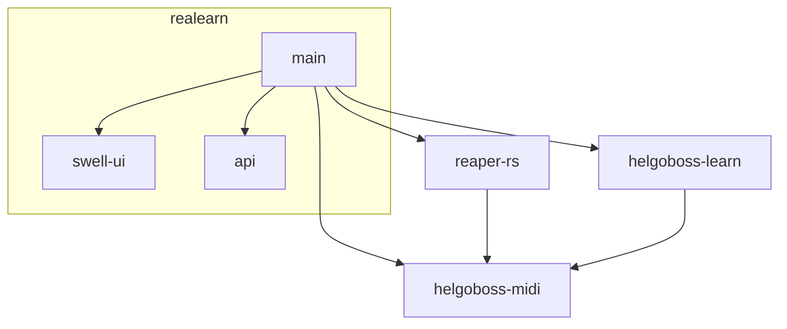
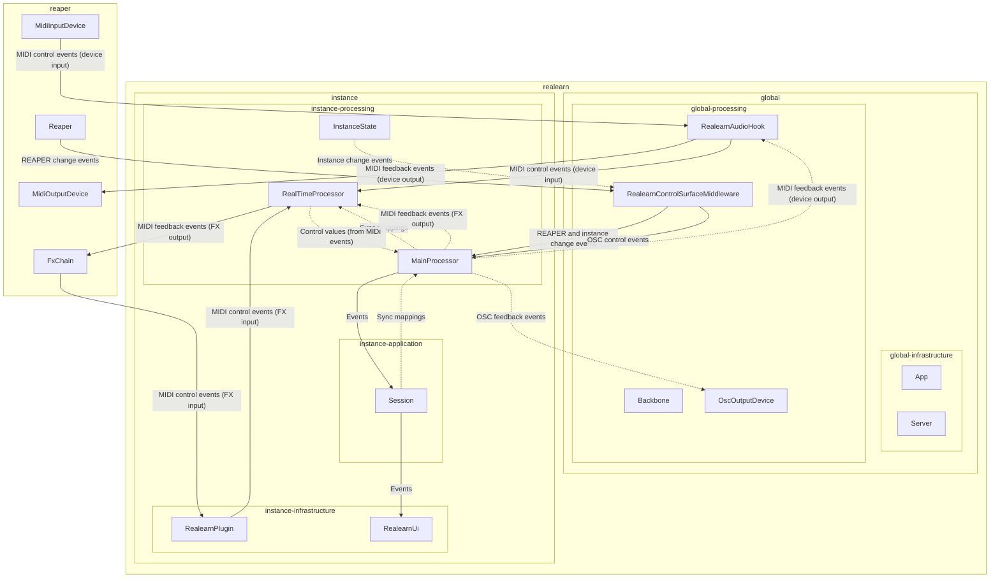

# Architecture

This document describes the software architecture of ReaLearn and is a work in progress.

## Basics

Technically, ReaLearn is a **third-party native VST plug-in for REAPER that makes heavy use of the REAPER extension API**. Woah, that is a lot to take in! Let’s see what this means in detail:

- It‘s a **plug-in for REAPER**. That means ReaLearn is a software module which gets dynamically loaded by REAPER. Communication goes both ways: ReaLearn calls REAPER functions and REAPER calls ReaLearn functions ("callbacks").
- It makes heavy use of the **REAPER extension API**. That means ReaLearn uses functions and data structures of REAPER that are defined as part of an API that is *specific to REAPER* (not as part of a DAW-agnostic plug-in standard). In theory, other DAWs could implement this API as well, but in practice only REAPER itself does it. The reason is that this API is huge and that many parts of it only make sense for REAPER. As a consequence, ReaLearn runs in REAPER only!
- At the same time, it is a **VST plug-in**. That means ...
    - ... it‘s not loaded immediately at REAPER startup. It gets loaded as soon as the user adds the first ReaLearn plug-in instance (in the form of a REAPER FX) or loads a project or FX chain containing a ReaLearn instance.
    - ... once loaded, there can be arbitrary many instances of ReaLearn (a big difference to REAPER extensions, which can „exist“ only once). Adding more instances is rather cheap because the dynamic library is already loaded at that time.
    - ... plug-in data is saved per instance (as a VST chunk). As a consequence, plug-in data is typically saved along with a specific project (but it doesn‘t have to because you can put ReaLearn on the monitoring FX chain as well).
    - ... it can receive MIDI and audio from the FX input (using functions and data structures defined by the VST plug-in standard).
    - ... it can send MIDI and audio to the FX output (using functions and data structures defined by the VST plug-in standard).
- It‘s a **native plug-in**. That means ReaLearn **is not a script**! It‘s full-blown native machine code that operates on eye level with REAPER. Once ReaLearn is loaded, it essentially becomes a part of REAPER itself. It runs in the same process, can open its own threads and is not sandboxed or restrained by a virtual machine (unlike Lua/EEL-based ReaScript or JSFX). That’s great because it means ReaLearn is a "first-class citizen" and doesn’t have any inherent disadvantage in terms of speed and possibilities. Also, it’s written in a language that can leverage all of the power and performance potential that comes with running on „bare metal“: Rust. It‘s a non-garbage-collected system programming language, just like C or C++ but more modern.
- It‘s a **third-party product**. That mean‘s it‘s not made by Cockos, the developer of REAPER. It‘s made by Helgoboss and must be installed separately.

## Modules

ReaLearn is built in a modular fashion. The following diagram shows the most important modules (excuding 3rd-party modules):

- **main:** The main module of ReaLearn which contains most of its code. We will learn more about it in the following sections.
- **api:** This contains the data structures for ReaLearn presets. Its main use case is "ReaLearn Script", a way to build mappings with the Lua scripting language.
- **swell-ui:** A tiny custom-written GUI framework based on the Win32 API (Windows) respectively Cockos SWELL (macOS, Linux). SWELL makes it possible to write the GUI code only once, using a subset of the Windows-specific Win32 API, but making it work on macOS and Linux as well. Basically by translating the Win32 API calls to OS-native GUI framework calls (Cocoa on macOS, GTK on Linux).
- **reaper-rs:** Rust bindings to the REAPER API (which itself is based on C and partially C++).
- **helgoboss-learn:** A library which contains reusable and DAW-agnostic code related to MIDI/OSC-learn. Some of ReaLearn's basic notions such as *Source*, *Glue* (still called *Mode* in most parts of the codebase) and *Target* are defined in this DAW-neutral module.
- **helgoboss-midi:** A general-purpose and carefully designed library for dealing with MIDI messages according to the MIDI 1.0 specification.

## Layers

The *main* module of ReaLearn is roughly built around an architectural pattern called *Onion Architecture* or *Clean Architecture*. This means it's divided into multiple "onion" layers:

These layers follow a simple and strict rule:

> Outer layers use code of inner layers, **but inner layers are not allowed to use code of outer layers!**

This rule prevents "Spaghetti code" between the different layers and makes sure there's a clean separation between different responsibilities. 

**Important:** This rule doesn't restrict control and data flow! Both control and data can still flow in both directions (and in practice they also do because e.g. data from the processing layer needs to be "sent up" to the user interface in order to be displayed)! The rule is concerned only with the visibility of code symbols.

The contents and responsibilities of each layer are described in the following.

### Core layer

- Contains very generic and reusable utility code that is not ReaLearn-specific but at the same time not cohesive enough to put it into a dedicated library module.
- Also, this layer can be considered as the layer that contains the Rust standard library and other Rust crates that provide utility code (although those are obviously not part of ReaLearn's own codebase).
- In addition, it makes very much sense to think of the core layer as the layer that contains REAPER itself. ReaLearn is built *around* REAPER, it's not designed to be usable without it.
    - As a direct consequence, all layers within ReaLearn are allowed to use the REAPER API!
    - This doesn't mean that ReaLearn couldn't be ported to other DAWs. Some effort in this direction has already been done: As mentioned before, the module *helgoboss-learn* is designed to contain those parts of ReaLearn's logic that are DAW-independent.

### Processing (Domain) layer

- This layer contains the essence of ReaLearn: Its processing logic. This includes the complete control and feedback logic.
- If you would take away ReaLearn's graphical user interface, its projection feature, its plug-in nature, its capability to memorize its settings (= persistence) ... in short, all the stuff that is more "facade" than "central", then what's left is the processing layer. The processing layer alone would still be capable of doing ReaLearn's main job: Routing incoming MIDI or OSC messages through the mapping list and controlling the targets accordingly as well as handling feedback.
- Because the processing layer is very independent and doesn't dictate things like user interface and persistence, It would be quite easy to factor it out into a separate module and use it in other ways, e.g. in order to build a totally different user interface on top of it!
- All the data structures in this layer are custom-tailored and optimized with one primary goal in mind: Performance. ReaLearn should do its main job very fast and efficiently!

### Application layer

- This layer contains everything related to *managing* ReaLearn's objects: Mappings, groups, parameters and all that stuff.
- All the data structures in this layer (usually called *models*) are tailored to this purpose. If you think that there's a lot of duplication between this layer and the processing layer, look twice. Yes, the data structures look similar at times, but often they are also completely different. That's because they are designed for different purposes. This strict separation of concerns ensures that no compromises need to be made between performance (processing layer) and managing/GUI (application/infrastructure layers).
- Even though this layer *still* doesn't dictate a particular user interface, it is user-interface-aware and provides functions and data structures that are typically used by user interfaces. It also allows user interfaces to register hooks to be informed whenever the state of ReaLearn's objects change. The application layer is built with a *reactive* GUI in mind that reflects all changes immediately. 

### Infrastructure layer

- This layer is basically responsible for connecting ReaLearn to the outside world: The user (*user interface*), the storage (*data*), the DAW (*plug-in*), the scripting feature (*api*) and the Projection server (*server*).

#### Plug-in

- Contains the VST plug-in implementation of ReaLearn.
- This is the main entry point, the place where ReaLearn's global initialization happens as well as the initialization per instance.

#### User interface (UI)

- Contains the implementation of ReaLearn's main graphical user interface.
- It's based on the *swell-ui* module. That means it uses platform-native user interface widgets - which gives ReaLearn the somewhat old-school but extremely professional look ;)

#### Data

- Contains data structures for the serialization/deserialization of all ReaLearn objects (mappings, groups, etc.).
- The data structures in this layer are similar to the corresponding data structures in the application layer but they serve a quite different purpose: Serialization and deserialization of ReaLearn's state. This is necessary for persistence and features such as copy&paste.
- One could wonder about the code duplication here, but again: The data structures in this layer serve different purposes than the ones in the application layer. Serialization/deserialization for persistence purposes absolutely needs to be concerned with backward compatibility, which makes the corresponding data structures very hard to change. Keeping things separate ensures that the management data structures can develop freely, without being constrained by backward compatibility considerations. Again: No compromises.

#### API

- Contains the data structures that make up ReaLearn Script.
- The focus of these data structures is to provide an expressive API with a wording that's straight to the point.
- These data structures are complete in that they can represent and express all valid ReaLearn object states, much like the structures in *data*.
- They were written much later (end of 2021) than the data structures in *data* (2016) and therefore reflect ReaLearn's current wording and structure much better.
- In future, the API data structures might actually be used for persistence and copy&paste as well, replacing the somewhat confusing data structures in *data*.

#### Server

- Contains HTTP/WebSocket server code for enabling ReaLearn's Projection feature.
- Will also soon contain gRPC server code for enabling full-blown apps built on top of ReaLearn, such as Playtime 2.

## Components

- ReaLearn is made up by a plethora of data structures that resemble components, which can be considered as ReaLearn's "main pillars".
- Some of these components are part of each instance, others exist globally only once.

TODO-high Build very basic diagram in Graphviz (using SVG classes and - if necessary - absolutely positioned nodes)then post-process it with SVG.js and style it with CSS.

