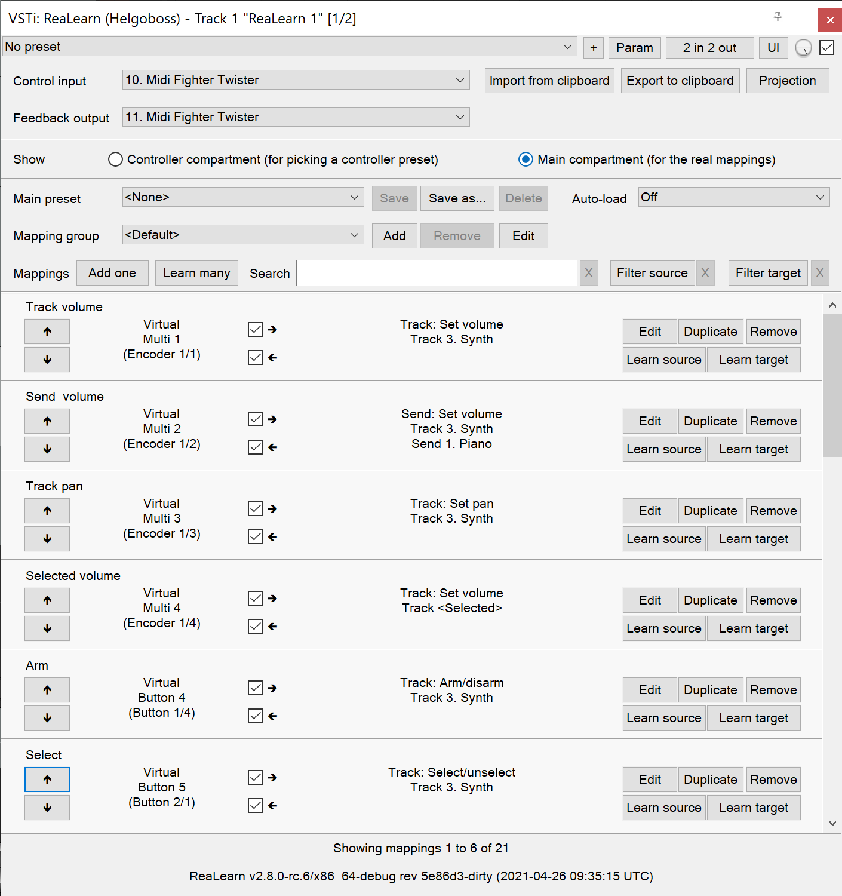

# ReaLearn

[](https://github.com/helgoboss/realearn/actions)
[](https://github.com/helgoboss/realearn/actions)
[](https://github.com/helgoboss/realearn/actions)
[](https://raw.githubusercontent.com/helgoboss/realearn/master/LICENSE)
[](https://www.paypal.com/cgi-bin/webscr?cmd=_s-xclick&hosted_button_id=9CTAK2KKA8Z2S&source=url)

[REAPER](https://www.reaper.fm/) VSTi plug-in that provides REAPER users with improved MIDI learn functionality.

## Table of Contents

- [Installation](#installation)
- [Usage](#usage)
- [Contribution](#contribution)
- [Links](#links)

## Installation

Since ReaLearn v1.10.0, the preferred and easiest way of installing ReaLearn is via [ReaPack](https://reapack.com/), a
sort of "app store" for REAPER. It allows you to keep your installation of ReaLearn up-to-date very easily.

1. If you previously installed an old version of ReaLearn (< 1.10.0) via installer, please uninstall it first!
2. Install [ReaPack](https://reapack.com/) if not done so already
3. Extensions → ReaPack → Import repositories...
4. Copy and paste the following repository URL:
   https://github.com/helgoboss/reaper-packages/raw/master/index.xml
5. Extensions → ReaPack → Browse packages...
6. Search for `realearn`
7. Right mouse click on the ReaLearn entry → Install...
8. OK or Apply
9. Restart REAPER

If you are more the download type of person, you can find the latest `dll`s, `dylib`s and `so`s here at
GitHub on the [releases page](https://github.com/helgoboss/realearn/releases) for manual installation.
You also must install ReaLearn manually if you plan to use ReaLearn in both REAPER for Windows 32-bit
and REAPER for Windows 64-bit because then it's important to use two separate VST plug-in directories.

**Please note that it's impossible to run ReaLearn as a bridged plug-in.** If you have
"Preferences → Plug-ins → Compatibility → VST bridging/firewalling" set to "In separate plug-in process" or
"In dedicated process per plug-in", you will need to add an exception for ReaLearn by setting "Run as" to
"Native only"!

## Usage

A complete user guide for the latest release is available as 
[PDF](https://github.com/helgoboss/realearn/releases/latest/download/realearn-user-guide.pdf) and
[HTML (website)](https://www.helgoboss.org/projects/realearn/user-guide). The user guide of the latest not-yet-released version is available as 
[HTML (GitHub)](https://github.com/helgoboss/realearn/blob/master/doc/user-guide.md).  

### Quick start

ReaLearn is fired up just like any other VST instrument in REAPER: By adding it to an FX chain.

**Main panel (containing the list of mappings):**



**Mapping panel (for editing one particular mapping):**


## Contribution

Contributions are very welcome!

### Basics

ReaLearn is written in the programming language [Rust](https://www.rust-lang.org/). It makes heavy use of
[reaper-rs](https://github.com/helgoboss/reaper-rs), which provides Rust bindings for the
[REAPER C++ API](https://www.reaper.fm/sdk/plugin/plugin.php). _reaper-rs_ was developed together with ReaLearn
but is designed as independent library that can be used for REAPER plug-ins of all sorts.

Another noteworthy dependency and byproduct of ReaLearn is [helgoboss-learn](https://github.com/helgoboss/helgoboss-learn), a crate which
provides DAW-agnostic MIDI learn logic (basically the _source_ and _mode_ parts of ReaLearn). Like _reaper-rs_, it's
designed as independent library and could be used to provide similar MIDI-learn functionality in other DAWs.

### Directory structure

| Directory entry | Content                                                                              |
| --------------- | ------------------------------------------------------------------------------------ |
| `/`             | Workspace root                                                                       |
| `/doc`          | Documentation                                                                        |
| `/main`         | Main crate (`realearn`)                                                              |
| `/rx-util`      | Utility crate providing primitives for reactive programming (`rx-util`)              |
| `/swell-ui`     | Minimalistic UI framework based on [SWELL](https://www.cockos.com/wdl/) (`swell-ui`) |
| `/test/manual`  | Various REAPER test projects for manual testing                                      |

### Build

#### Windows

In the following you will find the complete instructions for Windows 10, including Rust setup. Points where you have to consider the target
architecture (REAPER 32-bit vs. 64-bit) are marked with :star:.

1. Setup "Build tools for Visual Studio 2019"
   - Rust uses native build toolchains. On Windows, it's necessary to use the MSVC (Microsoft Visual Studio
     C++) toolchain because REAPER plug-ins only work with that.
   - [Visual Studio downloads](https://visualstudio.microsoft.com/downloads/) → All downloads → Tools for Visual Studio 2019
     → Build Tools for Visual Studio 2019
   - Start it and follow the installer instructions
   - Required components
     - Workloads tab
       - "C++ build tools" (large box on the left)
       - Make sure "Windows 10 SDK" is checked on the right side (usually it is)
     - Language packs
       - English
2. Setup Rust
   - [Download](https://www.rust-lang.org/tools/install) and execute `rustup-init.exe`
   - Accept the defaults
   - Set the correct toolchain default :star:
     ```batch
     rustup default nightly-2020-05-15-x86_64-pc-windows-msvc
     ```
3. Download and install [Git for Windows](https://git-scm.com/download/win)
4. Clone the ReaLearn Git repository
   ```batch
   git clone --recurse-submodules https://github.com/helgoboss/realearn.git`
   cd realearn
   ```
5. Build ReaLearn (after that you should have a `realearn.dll` in `target\debug`)
   ```batch
   cargo build
   ```

#### Linux

Complete instructions to build ReaLearn from a _fresh_ Ubuntu 18.04.3 LTS installation,
including Rust setup:

```sh
# Install native dependencies
sudo apt update
sudo apt install curl git build-essential pkg-config php nasm llvm-dev libclang-dev clang xorg-dev libxcb-shape0-dev libxcb-render0-dev libxcb-xfixes0-dev -y

# Install Rust (copied from the official Linux installation instructions)
curl --proto '=https' --tlsv1.2 -sSf https://sh.rustup.rs | sh # choose 1 (default)
source $HOME/.cargo/env

# Set the correct toolchain default
rustup default nightly-2020-05-15-x86_64-unknown-linux-gnu

# Clone ReaLearn repository (the "--recurse-submodules" is important!)
git clone --recurse-submodules https://github.com/helgoboss/realearn.git
cd realearn

# Build (after that you should have a "librealearn.so" in "target/debug")
cargo build
```

Some words about the native dependencies:

- `curl`, `git`, `build-essential` and `pkg-config` are bare essentials.
- `php` is needed to translate the ReaLearn dialog resource file to C++ so it can be processed by the SWELL
  dialog generator. It's also necessary for generating the 64-bit EEL assembler code. All of this is the
  typical WDL C++ way of doing things, no Rust specifics here.
- `nasm` is needed for assembling the 64-bit EEL assembler code to produce `asm-nseel-x64.o`, which is
  necessary to make the custom [EEL](https://www.cockos.com/EEL2/) control and feedback transformations in ReaLearn's
  absolute mode work.
- `llvm-dev`, `libclang-dev` and `clang` are necessary for building with feature `generate` (to generate
  bindings to C).
- `xorg-dev` and `libxcb-*` are necessary for clipboard access via
  [clipboard](https://crates.io/crates/clipboard) crate (previously ReaLearn
  [implemented](https://github.com/helgoboss/realearn/commit/c3e28e92b758a42339ebd5997be9a1368decacf4) its own
  clipboard code via SWELL but that had character encoding issues)

#### macOS

The following instructions include Rust setup. However, it's very well possible that some native toolchain setup
instructions are missing, because I don't have a bare macOS installation at my disposal. The Rust installation script
should provide you with the necessary instructions if something is missing.

```sh
# Install Rust
curl --proto '=https' --tlsv1.2 -sSf https://sh.rustup.rs | sh # choose 1 (default)
source $HOME/.cargo/env
# Using nightly is not necessary if you want to build just the low-level or medium-level API!
rustup default nightly-2020-05-15-x86_64-apple-darwin

# Clone ReaLearn
cd Downloads
git clone --recurse-submodules https://github.com/helgoboss/realearn.git
cd realearn

# Build ReaLearn
cargo build
```

#### All operating systems

Regenerate bindings (for dialog resource IDs and EEL functions):

```sh
cargo build --features generate
cargo fmt
```

### Test

Yes, there are some tests. No, not enough 😳 While ReaLearn's basic building blocks [helgoboss-learn](https://github.com/helgoboss/helgoboss-learn) 
and [reaper-rs](https://github.com/helgoboss/reaper-rs) are tested pretty thouroughly, ReaLearn itself needs improvement in that aspect. In future, it 
would be nice to have an integration test running directly in REAPER, similar to the one of *reaper-rs*.

### Logging

It's possible to make ReaLearn output log messages to the console by setting the `REALEARN_LOG` environment variable,
e.g. to `debug,vst=info`. It follows [this](https://docs.rs/env_logger/0.8.2/env_logger/index.html) format.

### Debugging

#### Obtain debug symbols

Debug symbols are stripped from release builds but stored as build artifact of the GitHub Actions "Create release"
workflow. If you want the symbols for a specific build, proceed as follows:

1. Open the [list of ReaLearn "Create release" workflows](https://github.com/helgoboss/realearn/actions?query=workflow%3A%22Create+release%22).
2. Use the branch filter to show all releases builds made for a specific version, e.g. "v1.11.0".
3. Click the desired workflow.
    - GitHub seems to do a fuzzy search, so if there are pre-releases (e.g. "v1.11.0-pre2"), you will see them, too.
    - In that case, just choose the latest one.
4. You will see a list of artifacts, one for each OS-architecture combination.
5. Download the one you need and unzip it.
    - You will find both the library file and the symbol file (e.g. `realearn.pdb` for a Windows build).
    
#### Turn on complete backtraces

As soon as you have the debug symbols, you can make ReaLearn print full backtraces (including line number etc.)
in the REAPER ReaScript console. Here's how you do it.

##### Windows

1. Set the environment variable `_NT_ALT_SYMBOL_PATH` to some directory of your choice.
2. Copy the PDB file in there.
3. Fire up REAPER with ReaLearn an make it panic. You should see a complete backtrace now.

#### Lookup symbols for symbol-less backtraces

The problem with release builds is that they don't contain debug symbols and therefore backtraces usually contain not
much more than memory addresses. Especially backtraces generated by Windows release builds leave a lot to be desired.

ReaLearn has a built-in REAPER action which attempts to look up symbol information for a given error report:
"ReaLearn: Resolve symbols from clipboard". Works on Windows only. To be used like this:

1. Make sure the PDB for the release build in question is on the search path (see section above).
1. Fire up an ReaLearn using exactly that release build.
3. Copy the error report to the clipboard.
4. Execute the action.

### Roadmap

Some short-term goals:

- Provide a documentation of ReaLearn's internal design (contributors should know about that)

## Links

- [Website](https://www.helgoboss.org/projects/realearn/)
- [Forum](http://forum.cockos.com/showthread.php?t=178015) (dedicated thread in REAPER forum)
- [Issue tracker](https://github.com/helgoboss/realearn/issues)
- [Old issue tracker](https://bitbucket.org/helgoboss/realearn/issues) (for ReaLearn < v1.10.0)
