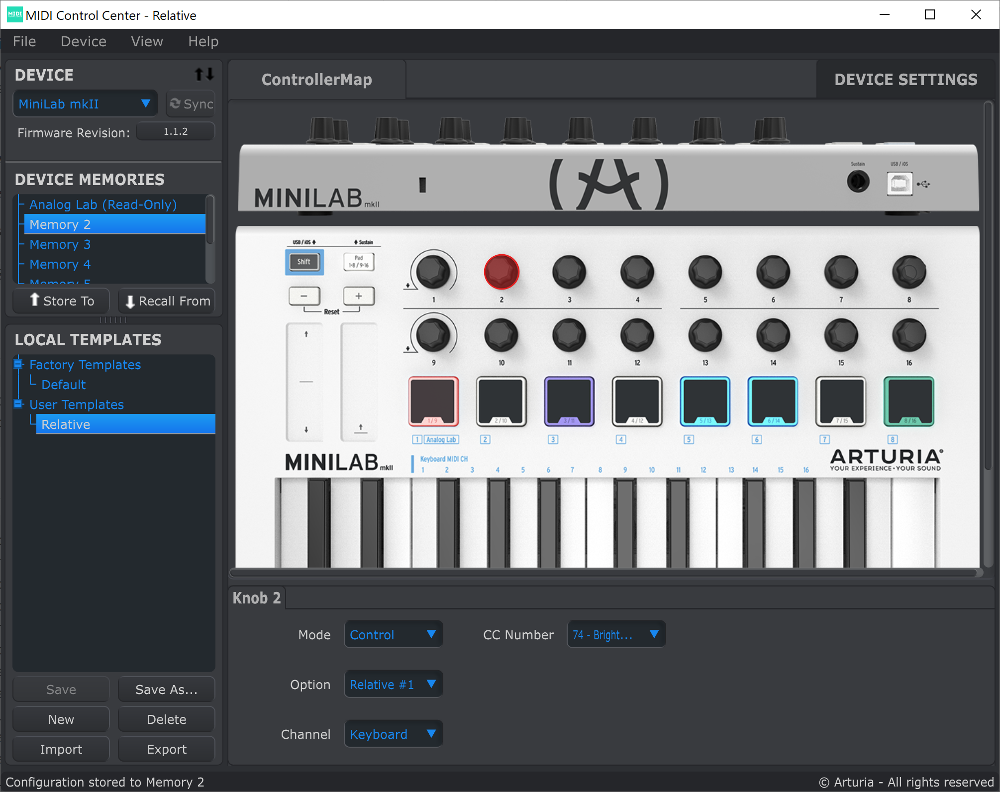
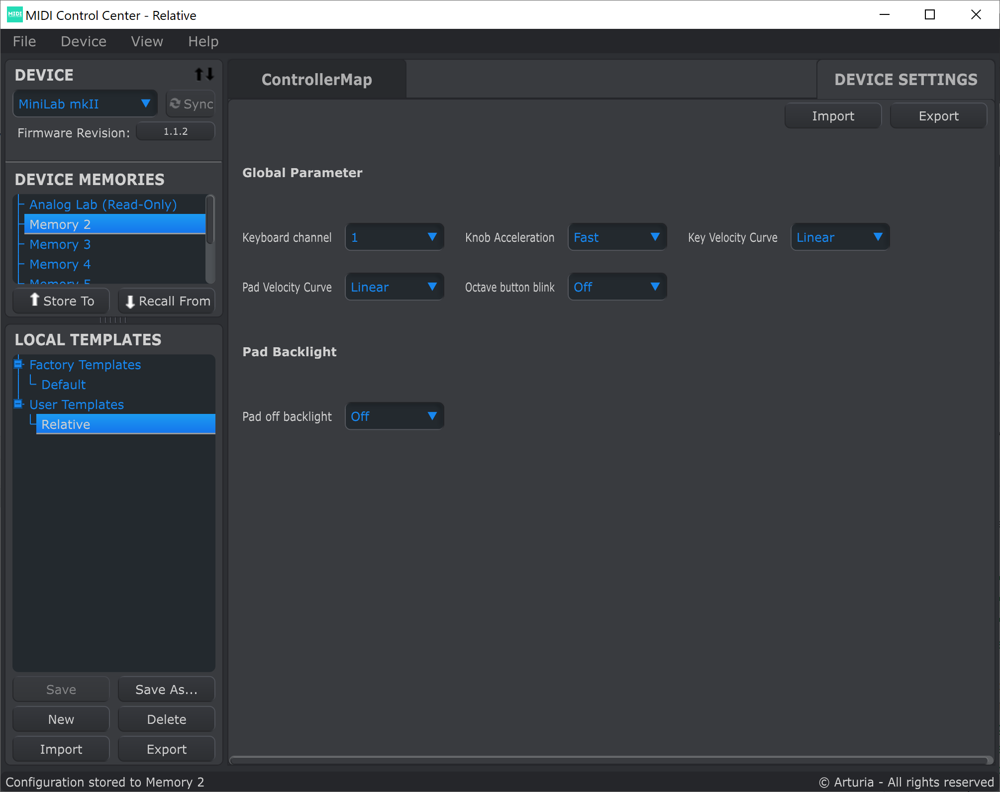
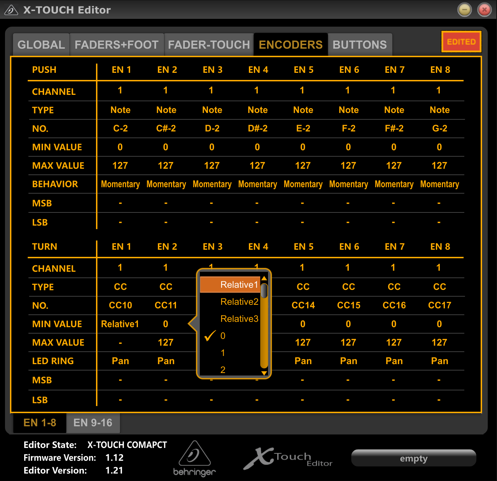

= ReaLearn - Controllers
:toc:
:toclevels: 5
:sectnums:
:sectnumlevels: 2

== Introduction

IMPORTANT: ReaLearn is designed to support any controller, so even if your controller is not on the list, you probably can make it work with ReaLearn!

The purpose of this document is to write about experiences with specific controllers that have been tested in
combination with ReaLearn.

There's a broad variety of general-purpose MIDI controllers out there and there will be
even more in future. Of course I don't have the resources to test them all, there are way too many. That's why
this section very much depends on user contributions. Feel free to write an email to link:mailto:&#x69;&#x6e;&#x66;&#x6f;&#64;&#x68;&#101;&#108;g&#111;&#x62;&#x6f;s&#x73;&#46;&#111;&#114;&#x67;[&#x69;&#x6e;&#x66;&#x6f;&#64;&#x68;&#101;&#108;g&#111;&#x62;&#x6f;s&#x73;&#46;&#111;&#114;&#x67;],
https://github.com/helgoboss/realearn/issues[raise an issue] at GitHub or open a pull request
if you have tested a controller and would like to add something to this section.

Disclaimer: The information in this document is given to the best of my knowledge. It could be wrong or outdated.

== List of control standards

=== Mackie Control

*Covered domains:* DAW

Although the term "Mackie Control" refers to a real controller device, it's nowadays most famous as a protocol standard for DAW controllers. This particular ReaLearn controller preset supports large parts of this standard. You can think of this standard as …

. an agreement which buttons/faders/encoders/LCDs/etc. a proper DAW controller should have,
. which MIDI messages they send and receive
. and which _effect_ the control elements should have on the DAW.

It's not magic, it's mostly just an agreement on which MIDI messages to use - which is very useful because this agreement is what makes it possible that different DAW controllers of all kinds of manufacturers can instantly work with any DAW that supports the Mackie Control protocol.

If you have a (DAW) controller device which supports the _Mackie Control_ standard, you don't necessarily need to find a specific preset for your controller or craft your own one, you can just use the "Mackie Control" preset.

[NOTE]
====
Because this is a _controller preset_, this preset is only about:

1. Virtual control element naming and
2. mapping of MIDI messages to those virtual control elements!

It's not about the effect, e.g. letting the fader control your track volume! In order to get an effect, you need to choose a suitable main preset or build some main custom mappings yourself (it's very easy because that's what ReaLearn is all about!).

There's one main preset called _DAW control_ in the Helgoboss ReaPack repository which makes extensive usage of the capabilities of the Mackie Control preset. If you need inspiration or help how to build main presets for the Mackie Control preset, have a look at it!
====

In addition to getting descriptive control element naming (e.g. `play` or `stop`), using this preset should give you instant
compatibility with some main presets available on the Helgoboss ReaPack repository.

When you create _main_ mappings using this controller preset, you can - as always - use the "Learn" function. However, Mackie-compatible controllers often have displays, which you can of course not learn because they are not control elements. They can only display things, so they only support the _feedback_ direction. You can make use of them by choosing the corresponding virtual source (Multi):

[cols="m,1,1"]
|===
| Virtual control element ID | Display | Description

| lcd/assignment
| 7-segment assignment display
|
Allows you to display a number between `00` and `99`.

Use an arbitrary feedback-enabled target to make it display the value as percentage. As with all kind of numeric feedback (also motorized faders and LEDs), you can use e.g. the mapping's _Source/Target Min/Max_ settings to adjust the displayed value range.

This display also supports text feedback but that's not very useful with only 2 letters.

| lcd/timecode
| 7-segment timecode display
|
Allows you to display digits but also rudimentary text.

It's typically used to display a time, e.g. the time of the current play position. For this use case, simply combine it with the target _Project: Seek_ target, choose _Textual feedback_ in the _Glue_ section and enter one of the `*.mcu` placeholders in the text expression field, for example `{{target.position.project_default.mcu}}`.

You can project arbitrary text on this display but because it's just a 7-segment display, some letters are not very readable.

| ch*/lcd/line1
| First line of a channel display
|
This display supports all latin characters. You can use it with all kinds of targets with both numeric and textual feedback.

You need to replace the asterisk with the desired channel number (a number between 1 and 8), e.g. `ch1/lcd/line1`.

| ch*/lcd/line2
| Second line of a channel display
|
Same as above, just the second line.

If you want to target both lines at once because your text is quite long, you can do that by using the MIDI Display source and setting _Line_ to `<Multiline>`. But keep in mind that this will tie your main preset to Mackie Displays. The advantage of making it work with a virtual control element is that it will be compatible with non-Mackie controllers that use the same virtual control element naming.

|===

[#presets-for-specific-controllers]
== List of controllers

TIP: The philosophy of most official _controller_ presets is to model the controller as faithfully as
possible by providing a 1:1 mapping of real control elements to virtual control elements. Depending on the type of
controller, the virtual control elements are sometimes numeric, sometimes named and sometimes both. Some controller
presets offer a controller layout (and thus can be instantly used with the _Projection_ feature), others not (yet).

=== Akai "APC Key 25"

This controller works with ReaLearn out of the box, including feedback. It doesn't have encoders though, so the full
potential of ReaLearn can't be used.

[discrete]
==== Presets

* *Akai APC Key 25*

=== Arturia KeyLab MkII

Instructions and preset for this device have been contributed by dissofiddle.

[discrete]
==== Preparation

The device itself:

* Change the relative mode to mode 1 (in the midi editor or with on-board preset editor). It corresponds to relative mode 2 of ReaLearn.
* Change all the buttons and pads to gate (which is momentary).
* Change the options "global > pad led" to "on trig" (otherwise it has conflicts with pad light feedback). I don't know how to do this with the software preset editor, but you can do this with the onboard/embedded preset editor in the global settings of the KeyLab.

REAPER and ReaLearn:

* KeyLab has 3 modes of operation : Analog Lab, DAW and User.
** To make it work, you should use 2 ReaLearn instances:
*** One for DAW mode:
**** Control input : KeyLab Mk2
**** Feedback output: MIDIOUT2 (KeyLab Mk2)
**** Controller preset: Mackie Control
*** One for User mode (with user preset set as above):
**** Control input: MIDIIN (KeyLab Mk2)
**** Feedback output: MIDIOUT2 (KeyLab Mk2)
**** Controller preset: KeyLab Mk2

The reason is that transport buttons only works with MCU and that you can't use both the Reaper native MCU  with MIDIOUT2 port and set the feedback in ReaLearn to MIDIOUT2 (KeyLab Mk2) port at the same time ... but you can with ReaLearn MCU.

About the name of the preset:

- DAW buttons are the 10 buttons above transport buttons.
- Fader buttons are the buttons below the faders.
- Bank A/B defines the bank when switching with part1/next; part2/previous and live/bank button in User mode.

[discrete]
==== Presets

* *Arturia KeyLab MkII*

=== Arturia MiniLab mkII

This keyboard works, including its relative encoders and since ReaLearn v2.6.0 also feedback via
pad LEDs with different colors.

[discrete]
==== Preparation

By default, all encoders except the leftmost ones are configured to transmit absolute values (Option "Absolute").
I strongly recommend changing this to transmit relative values (Option = "Relative #1"). Use
Arturia's https://www.arturia.com/support/downloads&manuals[MIDI Control Center] to apply this change to each encoder:

Furthermore I recommend to set the colors of all the pads to "None". This way ReaLearn has best control over them.
One more thing that can help is to switch off "Pad off backlight" to "Off" (you might need to update the firmware to
get this option):

[discrete]
==== Presets

All MiniLab mkII controller presets assume relative values.

* *Arturia MiniLab mkII*

[discrete]
==== Hints

* Visual feedback for the pad LEDs works thanks to ReaLearn's _Raw MIDI / SysEx_ which uses
system-exclusive MIDI messages to control the LEDs.
* LED color depends on the target value and is adjustable via "Source Min/Max".
* This is one of the devices which needs the "Send feedback after control" workaround for the "Toggle button" mode,
so the pad LEDs might flicker a bit when using it.

=== https://www.behringer.com/product.html?modelCode=P0246[Behringer BCF2000]

There's an link:https://github.com/helgoboss/realearn/tree/master/resources/controller-presets/unofficial/behringer-bcf2000[unofficial preset] contributed by http://github.com/tanders/[Torsten Anders].

=== https://www.behringer.com/product.html?modelCode=P0089[Behringer FCB1010]

There are https://github.com/helgoboss/realearn/tree/master/resources/controller-presets/unofficial/behringer-fcb1010[unofficial presets] contributed by faldurn.

=== https://www.behringer.com/product.html?modelCode=P0AYR[Behringer MOTÖR 61/49]

There are https://github.com/helgoboss/realearn/tree/master/resources/controller-presets/unofficial/behringer-motoer[unofficial presets] contributed by faldurn.

=== Behringer X32

I haven't tried this device myself but a user was so kind to provide the following basic setup instructions:

1. Make the x32 use a static IP address (x32 "Setup" → Tab "Network").
2. Create a new OSC device in ReaLearn:
    - Use port 10023 (!!!) and uncheck "Can deal with OSC bundles".
3. Add a mapping that periodically sends OSC message `/xremote` to the x32 (otherwise it will not respond to commands sent by ReaLearn):
* *Source*
** *Source Category:* REAPER
** *Type:* Timer
** *Millis:* 6000
* *Target*
** *Type:* OSC: Send message
** *Output:* Feedback output
** *Address:* `/xremote`
** *Argument:* Float
** *Range:* 0.0000 - 1.0000

=== Behringer XR18

See Behringer X32.

=== Behringer X-Touch Compact

Everything works, including feedback for motorized faders and LEDs.

ReaLearn can use this device in two modes, each of which has different (dis)advantages:

* _Standard mode_
** All controls work, including feedback.
** Button LED feedback looks a bit confusing in toggle mode (but works correctly if you switch on
"Send feedback after control" in the mappings).
** Needs some preparation via X-TOUCH Editor.
* _MC mode:_
** No preparation necessary.
** Button LED feedback works nicely.
** Some controls can't be used:
*** Push 15 and 16
*** Encoders 9 - 14
** LEDs for encoders 9 - 16 can't be used.

I recommend the "Standard mode" because all controls are supported.

No matter the mode of operation, the effective fader resolution is 7-bit only. This seems to be an inherent restriction
of this device.

==== Standard mode

[discrete]
===== Preparation

By default, the encoders are configured to transmit absolute values (MIN VALUE = "0"). It's important to make them
transmit relative values (MIN VALUE = "Relative 1"), not just because relative control is superior but also because
this device tries to be clever in combination with encoder feedback but doesn't really get it right. Absolute control
will lead to some kind of flickering when controlling parameters and using feedback. Use the
https://www.behringer.com/downloads[X-TOUCH Editor] to apply this change to each encoder (EN 1-8 and EN 9-16) in each
layer:

[discrete]
===== Presets

The following controller presets assume relative values.

* *Behringer X-Touch Compact:* Layer A.
* *Behringer X-Touch Compact - Layer B:* Layer B.

[discrete]
===== Hints

In standard mode, this device tries to be clever with the button LED feedback but doesn't get it right. It can lead to
wrong LED states when using "Toggle button" mode. This can be fixed by enabling "Send feedback after control" for the
corresponding mappings, which is already taken care of in the controller presets available on ReaPack.

==== MC mode

Works out of the box with above mentioned restrictions.

[discrete]
===== Presets

* *Mackie Control*: This is a generic preset, so it doesn't contain a controller layout. It also misses some of the
X-Touch's extra buttons. However, nothing prevents you from mapping those directly.

=== https://www.behringer.com/product.html?modelCode=P0B3M[Behringer X-Touch Mini]

From what I've heard, configuration is similar to the X-Touch Compact.

There's also an https://github.com/helgoboss/realearn/tree/master/resources/controller-presets/unofficial/behringer-x-touch-mini[unofficial preset] contributed by Thomas.

=== Behringer X-Touch One

Works!

This one provides many modes. The most important ones are:

* _MC Std:_ This is the default mode, covers all buttons and works great with the "Mackie
Control" preset. A potential downside is that the device itself controls the "Master" button so you can't use that
button in ReaLearn to customize its logic.
* _MidiRel:_ This has the advantage of having a freely assignable "Master" button. The downside is that the fader
resolution is only 7 bit! Moreover, I've not yet created a controller preset for the MIDI mode.

[discrete]
==== Presets

* *Mackie Control*: This works great.

=== DJ TechTools Midi Fighter Twister

This controller works very well with ReaLearn, including feedback and LED color selection. Special feedback features
such as the indicator type are currently not configurable from the ReaLearn user interface.

[discrete]
==== Preparation

The following instructions relate to firmware 02 Oct 2019.

* *Encoders:* By default, the Twister's encoders are configured to transmit absolute values (Encoder MIDI Type = "CC").
I strongly recommend changing this to transmit relative values (Encoder MIDI Type = "ENC 3FH/41H") in order to unlock
the full potential of this awesome device.
** Use the https://djtechtools.com/midi-fighter-setup/[Midi Fighter Utility]
to apply this change to each encoder:
+
image:images/midi-fighter-twister-setup.png[Midi Fighter Twister Setup]
+
You can also do this using the "MULTIPLE" button:
. Press the "MULTIPLE" button.
. Select all controls via mouse clicks.
. Change the Encoder MIDI Type.
. Press "CANCEL"
** If you want to make use of the Twister's built-in encoder acceleration, you should set the _encoder_ sensitivity to
"Velocity sensitive". In order to make use of it, make sure that ReaLearn's _Step size Max_ or _Speed Max_ is set high
enough, both in the controller mappings (already done in the latest Twister controller presets) and your
specific main mapping.
* *Colors*: For most usage scenarios, I suggest switching the OFF COLOR to black instead of the default of blue. The ON COLOR doesn't matter as it can be controlled by ReaLearn.
* *Side key functions:* In order to make all side keys available in ReaLearn, make sure to set all Side Key Functions (in Global Settings pane) to "CC Hold" and disable "Bank Side Buttons".

[discrete]
==== Presets

All Midi Fighter Twister controller presets available on the Helgoboss ReaPack repository assume relative values.

* *DJ TechTools Midi Fighter Twister:* First virtual bank.
* *DJ TechTools Midi Fighter Twister - Bank 2:* Second virtual bank.

[discrete]
==== Hints

* Even though the Twister has its own bank/paging feature, I would recommend to use ReaLearn's built-in conditional
activation feature instead. This provides advantages, for example when using the Controller Projection feature.
* LED color depends on the target value and is adjustable via "Source Min/Max".
* If you want to set the LEDs of the Twister to a fixed color layout instead of letting the LED color change dynamically
in response to target parameter values changes, I can recommend Stereokai's Midi Fighter Twister Color Designer, a
small web app running in your browser. It lets you configure the LED colors in a playful way and export them to
ReaLearn.
.. Quit REAPER (to give the web app exclusive access to the Twister MIDI device).
.. https://www.stereokai.com/midi-fighter-twister-color-designer/[Open the web app].
.. Configure the LED colors by turning the encoders.
.. Press "Copy colors to clipboard".
.. Close the Browser tab.
.. Start REAPER.
.. Add a main mapping with only feedback enabled.
.. Open the "Advanced settings"

=== Evolution UC-33

[discrete]
==== Presets

* *Evolution UC-33* (contributed by Roger Green)
** Made for device preset 1 and channel 16.

=== Hexler TouchOSC Mk1 (the older version)

This is the main OSC app which I use to test ReaLearn's OSC capabilities. It works for both control and feedback.

Feedback for control elements that transmit messages with multiple arguments might not work as desired at the moment.
E.g. TouchOSC expects values for both axes in case of X/Y controls instead of being satisfied with just one value
and leaving the other axis untouched. Currently, ReaLearn can only send feedback messages that contain one real value
and sets the other unchanged values to `Nil`.

[discrete]
==== Setup

TouchOSC:

* Settings → OSC
** *Host:* {osc_host_instruction}
** *Port (outgoing):* {osc_port_instruction}
** *Port (incoming):* {osc_port_instruction} Preferably the same number as _Port (outgoing)_.

IMPORTANT: In general, you need to set it up using OSC, *not* the TouchOSC MIDI Bridge.

ReaLearn:

* *Local port:* This needs to be the same as configured for "Port (outgoing)" in TouchOSC.
* *Device host:* This needs to be the same as displayed next to "Local IP Address" in TouchOSC.
* *Device port:* This needs to be the same as configured for "Port (incoming)" in TouchOSC.
* Read about _OSC devices_ in the user guide if you are unsure where to enter this data.

[discrete]
==== Presets

{osc_preset_content}

=== Hexler TouchOSC (the recent version)

Works for both control and feedback.

This recent version of TouchOSC fixes the issue with X/Y controls. It's able to receive the feedback values for X and Y on different OSC addresses, which is perfect for the way ReaLearn works (one mapping per axis).

NOTE: If you want to send a color value to TouchOSC, use the feedback argument `style.color.rrggbb`. This sends a string instead of a native OSC _Color_ value (latter is not supported by TouchOSC). The string can be directly mapped to a color property in the TouchOSC editor.

[discrete]
==== Setup

TouchOSC:

. Press the button with the chain link icon on the editor toolbar → OSC
** *Connection 1:* `UDP`
** *Host:* {osc_host_instruction}
** *Send port:* {osc_port_instruction}
** *Receive port:* {osc_port_instruction} Preferably the same number as _Send port_.
** *Zeroconf:* Disabled

IMPORTANT: In general, you need to set it up using OSC, *not* the TouchOSC MIDI Bridge.

ReaLearn:

* *Local port:* This needs to be the same as configured for "Send port" in TouchOSC.
* *Device host:* This needs to be the same as displayed in TouchOSC when you click the ⓘ icon next to "Receive port". It should be starting with `192.168.`
* *Device port:* This needs to be the same as configured for "Receive port" in TouchOSC.
* Read about _OSC devices_ in the user guide if you are unsure where to enter this data.

[discrete]
==== Presets

{osc_preset_content}

=== iCON Platform M+

Works very nicely, including 10-bit fader resolution and feedback for motorized faders and LEDs.

Tested with firmware v2.12.

[discrete]
==== Preparation

Please start the device in "Mackie" control mode (channel 1 since firmware version 2).

*Important:* "Mackie" mode is preferred over "User defined" mode, even if "User defined" by default transmits
the same messages and therefore also just works. The significant difference is that "Mackie" mode supports the complete
10-bit fader resolution (1024 different values) whereas "User defined" mode uses only 7 bits (128 different values).
It's a complete mystery to me why they don't use the full resolution in "User defined" mode. But that's no problem,
just make sure you use "Mackie" mode. It provides the best settings out of the box. Leave the customization to ReaLearn!

[discrete]
==== Presets

* *iCON Platform M+*: Preferred because also provides a controller layout.
* *Mackie Control*: Also works but doesn't offer a controller layout.

=== iCON Platform X+

Works just like iCON Platform M+. Can be used stand-alone or as extender.

=== https://www.korg.com/products/computergear/nanokontrol2/[Korg nanoKONTROL2]

There are https://github.com/helgoboss/realearn/tree/master/resources/controller-presets/unofficial/korg-nanokontrol2[unofficial presets] contributed by ketstert.

=== Korg padKONTROL

[discrete]
==== Presets

* *Korg padKONTROL* (contributed by Roger Green)
** Made for scene 1 and channel 15.

=== https://nektartech.com/panorama-p4-p6/[Nektar Panorama P6]

There's an https://github.com/helgoboss/realearn/tree/master/resources/controller-presets/unofficial/nektar-panorama-p6[unofficial preset] contributed by Torsten Anders.

=== Novation Launchpad Pro

This controller works well with ReaLearn, including feedback and LED color selection. There's a multitude of very
Launchpad-specific features that's not directly supported though.

[discrete]
==== Preparation

I always press "Setup" + the upper left pad to put this device into "Live" mode.

[discrete]
==== Presets

All presets assume "Live" mode.

* *Novation Launchpad Pro*

=== Nord Stage 3

[discrete]
==== Presets

* *Nord Stage 3* (contributed by Roger Green)

=== OSC/PILOT

Works both for control and feedback.

[discrete]
==== Setup

* *Local port:* Set this to the same value as "Send to port" in OSC/PILOT (by default 8001).
* *Device host:* Set this to `127.0.0.1` if OSC/PILOT runs on the same computer as REAPER, otherwise to the IP address
of the machine on which OSC/PILOT runs.
* *Device port:* Set this to the same value as "Listen on port" in OSC/PILOT (by default 8000).

=== PreSonus FaderPort Classic

This works well, including 10-bit fader resolution, feedback for the motorized fader and turning LEDs on/off.

NOTE: If you turn on the *Off* button LED, the fader will be disabled. This seems to be a behavior built right into the hardware.

[discrete]
==== Preparation

This device needs to be initialized with some custom MIDI messages to enter a particular mode. However, ReaLearn does
this for you automatically if you use the *FaderPort Classic* controller preset.

[discrete]
==== Presets

* *PreSonus FaderPort Classic*

=== PreSonus FaderPort 8

Works well, including 10-bit fader resolution and feedback for motorized faders and turning LEDs on/off.

There's no specific support for the built-in displays yet. However, the owner's manual nicely describes what
system-exclusive MIDI messages need to be sent to the device in order to change what's displayed. ReaLearn v2.5.0+
supports sending system-exclusive MIDI messages whenever mappings get activated or deactivated, so in theory the
displays could be operated. Future ReaLearn versions might make that easier. Same story with setting LED colors.

[discrete]
==== Preparation

Please start the device in "Studio One" operation mode. This mode should be the default. If not, press the first two
Select buttons while powering the device on and then press the first Select button.

MCU mode also works, but just partially and it doesn't offer complete customization of each control element.

[discrete]
==== Presets

* *PreSonus FaderPort 8*

