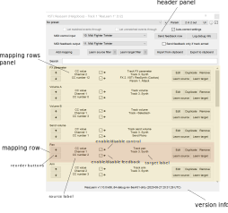
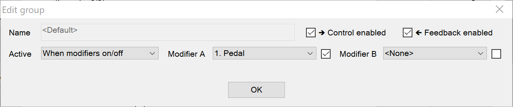
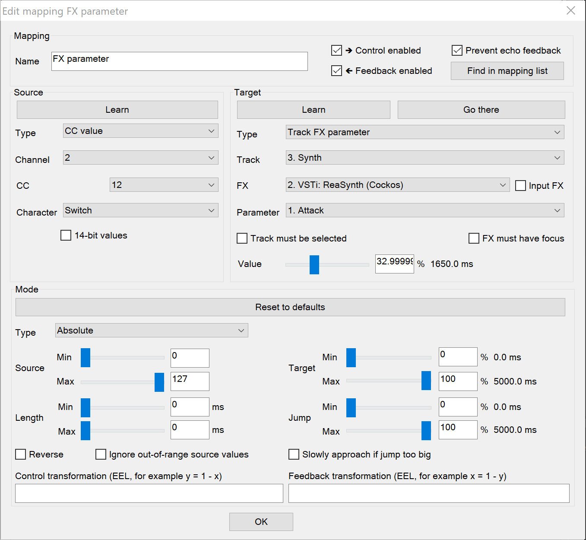

= ReaLearn Reference
:experimental:
:toc: preamble
:toclevels: 5
:sectnums:
:sectnumlevels: 2

ifdef::env-github[]
:tip-caption: :bulb:
:note-caption: :information_source:
:important-caption: :heavy_exclamation_mark:
:caution-caption: :fire:
:warning-caption: :warning:
endif::[]

|===
|Last update of text: |`2024-09-27 (v2.16.9)`
|Last update of relevant screenshots: |`2021-04-27 (v2.8.0)`
|===

[IMPORTANT]
.This document is the technical reference of ReaLearn.
====
It is targeted at users who are already familiar with the ReaLearn basics and want to look up specific information.

**If you are a beginner, please use the link:https://github.com/helgoboss/helgobox/wiki/ReaLearn-Home[Wiki] instead!**
====

== User interface

This section describes all user interface elements.

=== Main panel

The main panel provides the following user interface elements.

[#control-input]
==== Button btn:[Input]

Allows you to select the input to which this ReaLearn unit listens.
ReaLearn works with MIDI or OSC input.
In addition, it can listen to keyboard input.

MIDI: <FX input>::
When selected, ReaLearn captures all MIDI events that flow into this ReaLearn VSTi FX instance (= track MIDI path).
This is the default selection.

MIDI: _Some input device_::
When selected, ReaLearn captures events from the given MIDI device directly, before it reaches REAPER's tracks.
+
This will only work if _Enable input from this device_ is checked for the selected MIDI input device in REAPER's MIDI preferences.
The device name is prefixed with the device ID, which also shows up in the REAPER preferences.

Unavailable MIDI input devices::
This submenu contains MIDI input devices which are currently disconnected or not enabled in the MIDI preferences.

OSC: _Some device_::
When selected, ReaLearn captures events from the given OSC device.
Before any device shows up here, you need to add it via _Manage OSC devices_.

Unavailable OSC devices::
This submenu contains OSC devices for which control is currently disabled.

[[manage-osc-devices]] Manage OSC devices::
Allows one to display and modify the list of OSC devices (globally).

<New>:::
Opens a window for adding a new OSC devices.
See <<osc-device-dialog>>.

_Some OSC device_:::
Edit:::: Lets you edit an existing device.
See <<osc-device-dialog>>.
Remove:::: Removes the device.
This is a global action.
As a consequence, all existing ReaLearn instances which use this device will point to a device that doesn't exist anymore.
Enabled for control:::: If you disable this, ReaLearn will stop listening to this device.
This can save resources, so you should do this with each device that is not in use (as an alternative for removing it forever).
Enabled for feedback:::: If you disable this, ReaLearn won't connect to this device.
Can deal with bundles:::: By default, ReaLearn aggregates multiple OSC messages into so-called OSC bundles.
Some devices (e.g. from Behringer) can't deal with OSC bundles.
Untick the checkbox in this case and ReaLearn will send single OSC messages.

Computer keyboard::
This is a checkbox.
If enabled, this ReaLearn instance will additionally listen to key press and release events.

[#feedback-output]
==== btn:[Output]

Here you can choose to which output ReaLearn should send MIDI/OSC feedback. _Feedback_ is what makes it possible to control LEDs, motor faders or displays on your device.

<None>::
This means, no feedback will be sent at all.
This is the default.

MIDI: <FX output>::
This makes feedback MIDI events stream down to the next FX in the chain or to the track's hardware MIDI output.

MIDI: _Some output device_::
If selected, ReaLearn will send feedback to the given MIDI output device.
This only works if _Enable output to this device_ is checked in REAPER's MIDI preferences.

OSC: _Some device_::
When selected, ReaLearn will send feedback to the given OSC device.
Before any device shows up here, you need to add it via _Manage OSC devices_.

Unavailable OSC devices::
This submenu contains OSC devices for which feedback is currently disabled.

Manage OSC devices::
See <<manage-osc-devices>> in the input section of the menu.

==== Output tips

[qanda]
Prefer output to a specific device over <FX output>!::
It's usually better to select a specific output device is recommended because sending MIDI feedback to the FX output has drawbacks.
+
First, it doesn't participate in ReaLearn's multi-unit feedback orchestration.
That means you might experience misbehaving LEDs/faders/displays when using multiple units.
+
Second, it doesn't work if ReaLearn FX is suspended, e.g. in the following cases:

* ReaLearn FX is disabled.
* Project is paused and ReaLearn track is not armed.
* ReaLearn FX is on input FX chain and track is not armed.

[#osc-device-dialog]
==== OSC device dialog

The OSC device dialog lets you edit the settings of a ReaLearn OSC device and can be opened via <<manage-osc-devices>>.

Name:: A descriptive name of the device, e.g. "TouchOSC on my Android phone".

Local port:: Required for control.
The UDP port on which ReaLearn should listen for OSC control messages.
+
This port must be reserved exclusively for ReaLearn!
If you already use this port in another application (e.g. in REAPER's own OSC control surface) it won't work and ReaLearn will bless you with an "unable to connect" message in the "Input" dropdown.

Device host:: Required for feedback only.
It's the IP address of the OSC device to which ReaLearn should send feedback messages.
This address is usually displayed on your OSC device (e.g. as "Local IP address").
When targeting an OSC software that runs on the same computer as REAPER and ReaLearn, enter the special IP address `127.0.0.1` (or `localhost`).
+
When you configure your OSC connection on the device side, you must provide a _host_ as well.
There you should enter the IP address of the computer which runs REAPER and ReaLearn.
You can easily find it by pressing the <<Projection>> button in ReaLearn, choosing the old browser-based projection and scrolling down a bit.
It's the value next to *Host* and should start with `192.168.`.

Device port:: Required for feedback only.
The UDP port on which the OSC device listens for OSC feedback messages.

All OSC device configurations will be saved in the REAPER resource directory (REAPER → Options → Show REAPER resource path in explorer/finder) in the JSON file
`Helgoboss/ReaLearn/osc.json`.

==== Button btn:[Menu]

This opens the main menu of Helgobox/ReaLearn.
The same menu opens when you right-click an empty area.

It provides the following entries.

[[copy-listed-mappings]] Copy listed mappings::
Copies all mappings that are visible in the current mapping list (respecting group, search field and filters) to the clipboard.
You can insert them by opening the context menu in the row panel.

[[paste-mappings-replace-all-in-group]] Paste mappings (replace all in group)::
Replaces all mappings in the current group with the mappings in the clipboard.

Modify multiple mappings::

Auto-name listed mappings:::
Clears the names of all listed mappings.
As a result, ReaLearn will display dynamically auto-generated mapping names instead.

Name listed mappings after source:::
Sets the names of each listed mapping to the first line of its source label.

Make sources of all main mappings virtual:::
Attempts to make the sources in the main compartment virtual by matching them with the sources in the controller compartment.
This is useful if you already learned a bunch of MIDI/OSC/keyboard sources in the main compartment, just to find out later that you would like to use a controller preset that exposes virtual sources.

Make targets of listed mappings sticky:::
Changes the targets of all currently listed mappings so they use _sticky_ object selectors by attempting to resolve the objects from non-sticky selectors.
+
We call object selectors _sticky_ if they refer to a particular object (e.g. a track).
+
Sticky selectors:::: `<Master>`, `<This>`, `Particular`
Non-sticky selectors:::: `<Dynamic>`, `<Focused>`, `<Selected>`, `<Unit>`, `<All selected>`, `Named`, `All named`, `At position`, `From Playtime column`

Make targets of listed mappings non-sticky:::
Changes the targets of all currently listed mappings so that they use the desired non-sticky object selectors.
You can see this in action in link:https://www.youtube.com/watch?v=kebF_NKAweA&list=PL0bFMT0iEtAgKY2BUSyjEO1I4s20lZa5G&index=9[tutorial video 9].
+
The general procedure is:
+
1. Choose the desired track selector
2. Choose the desired FX selector
3. ReaLearn will change the selectors for all targets where this is applicable

Move listed mappings to group::
Moves all currently listed mappings to the specified group.
Useful in combination with text search.

Advanced::
Provides access to expert features.

Copy listed mappings as Lua:::
Like <<copy-listed-mappings>> but generates Lua/Luau code instead.

Copy listed mappings as Lua (include default values):::
Generates Lua/Luau code that contains even those properties that correspond to ReaLearn's defaults.

Paste from Lua (replace all in group):::
Like <<paste-mappings-replace-all-in-group>> but treats the clipboard content as Luau code.

[[dry-run-lua-script]] Dry-run Lua script from clipboard:::
Executes the Luau code in the clipboard and opens the returned data structure in a text editor.
See <<import-from-clipboard>> to learn in which situations this can be useful.

Freeze Playtime matrix:::
Don't use this, this feature is not ready yet!

[[compartment-parameters-menu,Compartment parameters menu]] Compartment parameters::
This shows all parameters of the current compartment and makes it possible to customize them.
See <<compartment-parameters>> to learn what those parameters are good for.
+
Parameter customizations are saved together with the compartment preset.
Parameter values will be reset whenever you load a preset (just the ones in that compartment).
+
Each parameter provides the following customization customization options:

Name:::
Changes the name of this parameter.

Value count:::
By default, ReaLearn parameter values are _continuous_ in nature: They are arbitrary decimal numbers between 0.0 and 1.0, often displayed as percentage between 0% and 100%.
Although that's very flexible, it's often easier to work with a _discrete_ value range.
+
Entering a value count turns the parameter into a discrete parameter with the given number of integer values.
For example, a value count of 10 means that the parameter can represent exactly 10 values (0 to 9).
+
*Choose the value count wisely and think twice before changing it to a different value at a later point in time!* You probably want to refer to values of this parameter in certain parts of ReaLearn, e.g. in <<target-min-max>>.
If you do that and later change the value count, these value references will not be valid anymore.
They will point to other integers than you intended to.
So if you are not sure, better pick a large value count and stick to it!

Compartment presets::

Create compartment preset workspace:::
Exports the Luau SDK files of this ReaLearn version into a new compartment preset workspace directory with a random name.
See section <<writing-presets-with-luau>> for details.

Create compartment preset workspace (including factory presets):::
Exports the Luau SDK files of this ReaLearn version and all factory presets for this compartment into a new compartment preset workspace directory with a random name.
See section <<writing-presets-with-luau>> for details.

Open compartment preset folder:::
Opens the ReaLearn preset folder for this compartment in a file manager.

[[reload-all-presets]] Reload all compartment presets from disk:::
If you made direct changes to preset files, you should press this to reflect these changes in the compartment preset lists of all open ReaLearn instances (reloads all preset files in this compartment).
+
This *will not* apply an adjusted preset to the current compartment, it will just reload the list.
If you want to apply a preset that has been changed on disk, you need to reload it by selecting it in the preset dropdown once again!

Edit compartment-wide Lua code:::
Allows you to edit the compartment-wide Lua code.
See section <<compartment-wide-lua-code>>.

[[unit-options]] Unit options::

[[auto-correct-settings]] Auto-correct settings:::
By default, whenever you change something in ReaLearn, it tries to figure out if your combination of settings makes sense.
If not, it makes an adjustment.
This autocorrection is usually helpful.
You can disable this checkbox if you don't like this behavior.

Send feedback only if track armed:::
Here you can tell ReaLearn to only send feedback when the track is armed.
+
Normally, you don't have to touch this because <<auto-correct-settings>> automatically chooses a reasonable default, depending on which input is selected:
+
* If input is set to _<FX input>_, it enables this option so that ReaLearn only sends feedback if the track is armed.
Rationale: Unarming will naturally disable control, so disabling feedback is just consequent.
* If input is set to a specific MIDI or OSC device, it disables this option in order to allow feedback even when unarmed.
+
At the moment, it can only be unchecked if ReaLearn is on the normal FX chain.
If it's on the input FX chain, unarming naturally disables feedback because REAPER generally excludes input FX from audio/MIDI processing while a track is unarmed (this is subject to change in the future).

Reset feedback when releasing source:::
When using ReaLearn the normal way, it's usually desired that feedback is reset when the corresponding sources are not in use anymore (e.g. lights are switched off, displays are cleared, motor faders are pulled down).
+
You can prevent this unit from doing that by disabling this option.
This can be useful e.g. when using REAPER/ReaLearn just in feedback direction, in order to take control of a hardware device (= using ReaLearn the other way around, "controlling from target to source").

[[make-unit-superior]] Make unit superior:::
Makes this unit superior.
See <<superior-units>> to learn more about this feature.

Use unit-wide FX-to-preset links only:::
By default, unit-wide links are applied _in addition_ to the global links and take precedence over the global ones.
This checkbox makes sure that only unit-wide links are used.

Stay active when project in background:::
Determines if and under which conditions this ReaLearn unit should stay active when the containing project tab is not the active one.
Applies to in-project ReaLearn instances only, not to monitoring FX instances!

Never::::
Will only be active when its project tab is active.
Only if background project is running::::
Follows REAPER's project tab settings ("Run background projects" and "Run stopped background projects").
Always (more or less)::::
Attempts to stay active no matter what.
Please note that this is technically not always possible when input is set to _<FX input>_ or output to _<FX output>_, when the background project is not running.

[[unit-fx-to-preset-links]] Unit-wide FX-to-preset links::
Manage a unit-wide list of links from FX (plug-ins or JS effects) to ReaLearn main compartment presets.
Covered in link:https://www.youtube.com/watch?v=HtmWO7QNpgE&list=PL0bFMT0iEtAgKY2BUSyjEO1I4s20lZa5G&index=10[video tutorial 10].

Add link from last focused FX to preset:::
This lets you link whatever FX window was focused before focusing ReaLearn, to an arbitrary main compartment preset.
This only works if an FX has been focused before.

_Arbitrary FX ID_:::
If you have added a link already, you will see it here in the list.
What you see, is the so-called _FX ID_, which by default simply corresponds to the plug-in's original name (e.g. `Name: VSTi: ReaSynth (Cockos) | File: - | Preset: -`).

[[edit-fx-id]] <Edit FX ID…>::::
With this, you can edit the FX ID manually.
See <<fx-id-dialog>> for details.

<Remove link>::::
(Globally) removes this FX-to-preset link.

_Arbitrary main preset_::::
The rest of the submenu tells you to which main preset the FX ID is linked.
You can change the linked preset by clicking another one.

[[logging]] Logging::

Log debug info (now)::: Logs some information about ReaLearn's internal state.
Can be interesting for investigating bugs or understanding how this plug-in works.
Log real control messages::: When enabled, all incoming MIDI messages, OSC messages or key pressed will be logged to the console.
+
Each log entry contains the following information:

* Timestamp in seconds
* ReaLearn instance ID (a randomly assigned ID that uniquely identifies a particular instance, will change after restart)
* Message purpose
** *Real control:* A message used for controlling targets.
** *Real learn:* A message used for learning a source.
* Actual message (MIDI messages will be shown as hexadecimal byte sequence, short MIDI messages also as decimal byte sequence and decoded)
* Match result
** *unmatched:* The message didn't match any mappings.
** *matched:* The message matched at least one of the mappings.
** *consumed:* Only for short MIDI messages.
This short message is part of a (N)RPN or 14-bit CC message and there's at least one active mapping that has a (N)RPN or 14-bit CC source.
That means it will not be processed.
The complete (N)RPN or 14-bit CC message will be.

Log virtual control messages::: When enabled, all triggered virtual control elements and their values will be logged (see <<controller-compartment>>).
Log target control::: When enabled, all target invocations (parameter changes etc.) will be logged.
Log virtual feedback messages::: When enabled, all feedback events to virtual control elements will be logged (see <<controller-compartment>>).
Log real feedback messages::: When enabled, all outgoing MIDI or OSC messages will be logged to the console.
+
The log entries look similar to the ones described above, with the following notable differences.

* Message purpose
** *Feedback output:* A message sent to your controller as response to target value changes.
** *Lifecycle output:* A message sent to your controller as response to mapping activation/deactivation (see <<mapping-lifecycle-actions,Mapping lifecycle actions>>).
** *Target output:* A message sent because of either the <<midi-send-message,MIDI: Send message>> or <<osc-send-message,OSC: Send message>> target.

Send feedback now::
Usually ReaLearn sends feedback whenever something changed to keep the LEDs or motorized faders of your controller in sync with REAPER at all times.
There might be situations where it doesn't work though.
In this case you can send feedback manually using this button.

Instance options::

Enable global control ("auto units"):::
ReaLearn supports the automatic addition of a unit with a user-defined main preset if a certain type of controller is connected and automatic removal if it is disconnected.
If you enable this option, this Helgobox instance will start to automatically add/remove units based on connected controllers.
+
The general procedure is:
+
. Globally define once what controllers you have at your disposal and choose which main preset you want to use for which controller (in the Helgobox App)
. Enable global control for one Helgobox instance
+
It's a good idea to enable global control for a Helgobox instance on the monitoring FX chain.
Such an instance will be around permanently as long as REAPER is running, even if you open and close different projects.
Perfect for project-spanning control scenarios!
+
And now the nice part: If you decide to use a specific device for something else in a certain project, all you need to do is to set use the device as input and/or output in a project-specific ReaLearn unit!
If you do that, the project-specific instance "wins" over the monitoring FX instance.
You got a project-specific override.
If you close the project, the monitoring FX instance takes over again.

[[open-pot-browser]] Open Pot Browser::
This will open Pot Browser.
See <<pot-browser>> for details.

Show App::
Shows the Helgobox App associated with this Helgobox instance.

Close App::
Closes the Helgobox App associated with this Helgobox instance.

User interface::

Background colors:::
Enables/disables the usage of background colors in the ReaLearn user interface (enabled by default).

Server::
ReaLearn features a built-in server which allows the Companion App (and in future also the Helgobox App) to connect to ReaLearn.
The server runs globally, not per instance!

Enable and start!::: This starts the server and makes sure it will automatically be started next time you use ReaLearn.
Disable and stop!::: This stops the server and makes sure it will not be started next time you use ReaLearn.
Add firewall rule::: Attempts to add a firewall rule for making the server accessible from other devices or displays instructions how to do it.

[[global-fx-to-preset-links]] Global FX-to-preset links::
This is like <<unit-fx-to-preset-links>> but saves the links globally for all ReaLearn units.
This is useful if you have only one controller or if you have x controllers (= and therefore x ReaLearn units) and want both of them to always auto-load the same preset if the unit FX points to the same plug-in.

* All links will be saved _globally_, not just within this project!
* Location: REAPER resource directory (REAPER → Actions → Show action list… → Show REAPER resource path in explorer/finder) at `Data/helgoboss/realearn/auto-load-configs/fx.json`.

[#compartment-parameters]
==== Compartment parameters

Each ReaLearn compartment contains 100 freely assignable parameters.
Compartment parameters can be used in the following ways:

* For <<conditional-activation>> (lets the parameter value influence which mappings are active)
* For <<dynamic-selector>> (lets the parameter value influence which object (track, FX etc.) is targeted for a specific mapping)
* As source <<parameter-source>> (lets the parameter value control any ReaLearn target)

They can be customized as described in <<compartment-parameters-menu>>.

[[compartment-wide-lua-code]]
==== Compartment-wide Lua code

Each compartment may contain arbitrary Luau code to be reused by multiple mapping MIDI source and feedback scripts.
This avoids code duplication and decreases memory usage.
It even allows the usage of shared state.

The code that you provide here is treated as a module that MIDI source and feedback scripts can import using `require("compartment")`.
That means you need to export everything that you want the MIDI source and feedback scripts to see, simply by returning it.

.Compartment-wide Lua code
====
The following compartment-wide Lua code exports 2 functions named `get_text` and `get_number`:

[source,lua]
----
local module = {}

local function private_function()
    return "i'm private"
end

function module.get_text()
    return "hello world"
end

function module.get_number()
    return 5
end

return module
----

These functions can then be reused in MIDI source and feedback scripts:

[source,lua]
----
local compartment = require("compartment")
local text = compartment.get_text()
local number = compartment.get_number()
----
====

Compartment-wide Lua code is part of the compartment, that means it's also saved as part of a compartment preset!

[[superior-units]]
==== Superior units

When a unit is made superior via menu entry <<make-unit-superior>>, this unit is allowed to suspend other units which share the same input and/or output device (hardware devices only, not FX input or output!).

[TIP]
====
Making units superior is **rarely needed**!

This option was initially introduced in order to add more flexibility to the <<auto-load>> feature.
The idea was to let a controller _fall back_ to some default behavior if the currently focused FX is closed.
Multiple instances were necessary to make this work with one of them (the auto-load instance) being superior.

However, since ReaLearn 2.14.0, falling back to initial mappings when the FX loses focus in auto-load mode became much easier and doesn't require multiple units anymore!
Your initial mappings or initial preset will be memorized and reloaded once the FX loses focus.
See <<auto-load>> for more information.
====

Behavior:

* By default, ReaLearn units are not superior, just normal.
This is most of the time okay, even if you have multiple units that share the same input and output ... as long as you don't have any conflicting mappings active at the same time.
* For example, if 2 units use the same input or output device and they use different control elements, they can peacefully coexist.
And even if they share a control element for the _control direction_, they are still fine with it.
The same control element will control 2 mappings, why not!
* Things start to get hairy as soon as 2 units want to send _feedback_ to the same control elements at the same time.
You should avoid this.
You should not even do this within one ReaLearn unit.
This can't work.
* Sometimes you want one unit to suspend/cover/cancel/mute another one!
You can do this by making this unit _superior_.
Then, whenever this unit has at least one active mapping, all non-superior units with the same control and/or feedback device will be disabled for control and/or feedback.
* You can have multiple superior units.
Make sure they get along with each other :)

[[fx-id-dialog]]
==== FX ID dialog

The FX ID dialog is used to edit which properties of a FX trigger a preset change.
It is opened via menu action <<edit-fx-id>>.

FX name::
Allows you to adjust the (original) plug-in name that triggers the preset change.

FX file name::
Allows you to adjust the plug-in file name that triggers the preset change.

FX preset name::
Maybe the FX name or file name is not enough for you to decide which preset you want to load.
Good news: You can add a preset name as additional criteria!

.Samplers
====
If you have a sampler, you can load different ReaLearn presets depending on which sample library is loaded into your sampler.
Just add two links with the same FX file name (e.g. `Kontakt 5.dll`) but different preset names.
====

[TIP]
.Wildcards
====
All the fields that are part of the FX ID support wildcards.
You can use `*` for matching zero or arbitrary many characters and `?` for matching exactly one arbitrary character.

Example: Instead of relying on the original plug-in name you could match plug-ins with similar file names (e.g. VST2 and VST3 at once): `Pianoteq 7 STAGE.*` would match both `Pianoteq 7 STAGE.dll` (VST2) and `Pianoteq 7 STAGE.vst3` (VST3).
====

[[pot-browser]]
==== Pot Browser

Pot Browser is an experimental modern preset browser.
It's just a prototype so far.
It will probably look quite different in the future.
You can open it via menu action <<open-pot-browser>>.

It's recommended to use Pot Browser from a ReaLearn instance on the monitoring FX chain, that way you have the browser accessible from any project.

TIP: Add a toolbar button which triggers the REAPER action "ReaLearn: Open first Pot Browser" to get quick and convenient access to the browser.

Remarks:

- Pot Browser is in an experimental stage, it doesn't save any of your settings!
- Each ReaLearn instance has its own so-called _Pot Unit_.
Each Pot Unit has its own filter and preset state.
When you open the Pot Browser from an instance, it connects to the Pot Unit of that instance.
- ReaLearn's "Pot" targets such as <<pot-browse-presets>> can be used to control the Pot Unit from any controller.

==== Button btn:[Export to clipboard]

Pressing the export button allows you to copy ReaLearn's settings to the clipboard so you can import them in another instance/unit or edit them in a text editor.

* *Export session as JSON:* Copies a _complete_ dump of ReaLearn's current settings (including all mappings, even controller mappings) to the clipboard.
The dump's data format is
https://www.json.org/json-en.html[JSON], a wide-spread data exchange format.
It's a text format, so if you are familiar with the search & replace feature of your favorite text editor, this is one way to do batch editing.
However, recent versions of ReaLearn provide a much better way of doing that: _ReaLearn Script_.
Read about the other export options for learning more about it.
+
[TIP]
====

You can also use the export for some very basic A/B testing:

1. Choose _Export session as JSON_
2. Change some settings and test them
3. Restore the old settings by pressing _Import from clipboard_.

====
+
[TIP]
====

For the programmers and script junkies out there: It's perfectly possible to program ReaLearn from outside by passing it a snippet of JSON via https://www.reaper.fm/sdk/reascript/reascripthelp.html#TrackFX_SetNamedConfigParm[`TrackFX_SetNamedConfigParm()`].
Parameter name is `set-state`.
This mechanism is implemented on ReaLearn side using https://www.reaper.fm/sdk/vst/vst_ext.php[REAPER's named parameter mechanism] (search for `named_parameter_name`).

Example that assumes that the first FX of the first track is a ReaLearn instance:

[source,lua]
----
local track = reaper.GetTrack(0, 0)
local state = [[
{
  "controlDeviceId": "62",
  "feedbackDeviceId": "fx-output",
  "mappings": [
    {
      "name": "1",
      "source": {
        "type": 1,
        "channel": 0,
        "number": 64
      },
      "mode": {},
      "target": {
        "type": 2
      }
    }
  ]
}
]]
reaper.TrackFX_SetNamedConfigParm(track, 0, "set-state", state)
----

====
* *Export main/controller compartment as JSON:* Copies a dump of the currently visible compartment to the clipboard.
It contains about the same data that a compartment preset would contain.
* *Export main/controller compartment as Lua:* Copies a dump of the currently visible compartment to the clipboard as Lua/Luau code (ReaLearn Script).
This form of Lua/Luau export skips properties that correspond to ReaLearn's default values, resulting in a minimal result.
Perfect for pasting in a forum or programming ReaLearn with focus on only those properties that matter to you.
* *Export main/controller compartment as Lua (include default values):*  This Lua/Luau export includes even those properties that correspond to ReaLearn's default values, resulting in more text.
This gives you the perfect starting point if you want to extensively modify the current compartment (using the Luau programming language) or build a compartment from scratch, using even properties that you haven't touched yet in the user interface!

[[import-from-clipboard]]
==== Button btn:[Import from clipboard]

Pressing the import button does the opposite: It restores whatever ReaLearn dump is currently in the clipboard.
It supports JSON or Luau.

The way Luau import works in ReaLearn is:

. ReaLearn attempts to execute the Luau script in the clipboard.
. ReaLearn attempts to interpret the returned value as ReaLearn API object.
. ReaLearn loads the API object

If step 1 fails, ReaLearn displays an error messages that hopefully contains a line number.
If step 2 fails, ReaLearn shows a validation error message.

If importing Luau code fails and the displayed error message is not helpful, you can try <<dry-run-lua-script>>.
This action enables you to just execute step 1 and see the "expanded" result.
This can help to make sense of a possible validation error message in step 2.

[#projection]
==== Button btn:[Projection]

Projection is a quite unique feature that allows you to project a schematic representation of your currently active controller to a mobile device (e.g. a tablet computer).
You can put this device close to your controller in order to see immediately which control element is mapped to which parameter.
This is an attempt to solve an inherent problem with generic controllers: That it's easy to forget which control element is mapped to which target parameter.

If you want to use this feature, click the button.
You can choose between the old browser-based projection (which is going to disappear soon) and the new projection that is part of the Helgobox App (but not yet fully functional).
Hopefully, the transition to the Helgobox App, including mobile versions of that App, will soon be finished.

==== Button btn:[?] (Help)

Provides helpful links to the user guide and other stuff.

==== Button btn:[Let through]

ReaLearn by default "eats" incoming MIDI events for which there's at least one active mapping with that source.
In other words, it doesn't forward MIDI events which are used to control a target parameter.
However, unmatched MIDI events are forwarded!

You can change this using these checkboxes.
E.g. you can tick *Matched events* if you want to forward even matched events.
The exact behavior differs depending on what you choose as <<control-input>>:

* If input is set to <FX input>
** MIDI events arrive from ReaLearn's FX input.
If they get forwarded, they get forwarded to the FX output, usually to the plug-in which is located right below ReaLearn FX.
The default setting often makes much sense here, especially if you put ReaLearn right above another instrument plug-in.
* If input is set to a MIDI hardware device
** MIDI events arrive directly from the MIDI hardware device.
If they get forwarded, they get forwarded to REAPER's tracks as they would usually do without ReaLearn.
If they don't get forwarded, it means they get filtered and will never make it to the tracks.
ReaLearn completely eats them, globally!
That means, ReaLearn can act as global MIDI filter.
** Please note, with input set to a real MIDI device, MIDI events coming from _FX input_ are _always_ forwarded to the FX output.
** Also, MIDI events captured from a real MIDI device input are *never* forwarded to ReaLearn's FX output.
+
TIP: This global MIDI filter feature is only available in REAPER v6.36+.
* If input is set to a OSC device
** You won't see the checkboxes because they don't make sense for OSC.
* The checkboxes don't have any effect on computer keyboard input.
Keys are always passed through when doing text entry and never passed through if a mapping matches.

==== Button btn:[Show]

This lets you choose which mapping compartment is displayed.

==== Controller compartment / Main compartment

A compartment is a list of mappings that can be saved as independent preset.
Initially, ReaLearn shows the so-called "Main compartment" which contains the so-called "Main mappings" - the bread and butter of ReaLearn.
However, there's another interesting compartment, the "Controller compartment".
In a nutshell, this compartment lets you define which hardware controllers you have at your disposal and which control elements they have.
Learn more about that feature in section
<<controller-compartment,Controller compartment>>.

==== Controller preset / Main preset

==== Preset menu

This menu makes it possible to load compartment presets for the currently shown compartment.
If you select a preset in this list, its corresponding mappings will be loaded and immediately get active.

The following menu entries are available:

====== <None>

This entry is selected by default.
It means that no particular preset is active.

Selecting <None> when a preset is active will clear the complete compartment.

====== Factory

This submenu contains built-in compartment presets.
You can't change them yourself.
But you can "make them your own" by making a copy of them.
See <<writing-presets-with-luau>>.

====== User (...)

Multiple of such submenus may exist.
Each one represents a preset namespace (or workspace) containing presets made by users, for example by you.
The workspace named after you (macOS/Linux/Windows username) is your personal user workspace.

For more information about preset workspaces/namespaces, see
<<writing-presets-with-luau>>.

====== User (Unsorted)

This submenu contains top-level presets which are not part of a particular preset namespace (or workspace).
This was common in older versions of ReaLearn, when workspaces were not yet available.

===== Save

If you made changes to a preset, you can save them by pressing this button.
This works for built-in presets as well but I would strongly recommend against changing them directly.
Better use _Save as…_ and choose a custom name.

===== Save as…

This allows you to save all currently visible mappings as a new preset.
Please choose a descriptive name.

** Saving your mappings as a preset is optional.
All controller mappings are saved together with your current ReaLearn unit anyway, no worries.
But as soon as you want to reuse these mappings in other ReaLearn unit or for <<auto-load>>, it makes of course sense to save them as a preset!
** All of your presets end up in the REAPER resource directory (REAPER → Options → Show REAPER resource path in explorer/finder) at
`Data/helgoboss/realearn/presets` followed by `main` (for main compartment presets) or `controller` (for controller compartment presets).
They are JSON files and very similar to what you get when you press
_Export to clipboard_.
** They can even be in a subdirectory.
Please note that the subdirectory name becomes a part of the preset ID, so better don't move existing presets around if you want preset references of existing ReaLearn units to stay intact.
** JSON files can also contain custom data sections.
For example, the ReaLearn Companion app adds a custom data section to controller presets in order to memorize the positions and shapes of all control elements.

===== Delete

This permanently deletes the currently chosen preset.
You can also delete built-in presets.
However, if you use ReaPack for installation, it should restore them on next sync.

[#writing-presets-with-luau]
==== Writing presets with Luau

It is possible to write compartment presets with the link:https://luau.org/[Luau language] instead of building them via the user interface.
Many of the more complex ReaLearn factory presets are written in Lua, e.g. the "DAW control" preset.

A good way to get started writing Luau presets is to create your personal compartment preset user workspace.

A preset workspace is a subdirectory within the compartment preset parent directory that may contain a bunch of presets and other files.

Important facts about preset workspaces/namespaces:

* It may contain both Luau presets (`.preset.luau`) and conventional JSON presets (`.json`)!
* The name of the workspace (subdirectory) is at the same time the first part of the preset ID.
For example, if the subdirectory name is `helgoboss` and it contains a preset file `my-preset.json`, the final ID of that preset will be `helgoboss/my-preset`.
* That also means that presets from different workspaces never conflict with each other.
* Therefore, a preset "workspace" is at the same time a preset "namespace".
Those terms are sometimes used interchangeably.
* It's important that the ID of a preset doesn't change, especially if you want to use that preset with <<auto-load>>.
If you change the ID, it's another preset from ReaLearn's perspective!
* Conversely, the name of the workspace directory and the name/path of the preset file within the workspace directory should not change!
* The only thing that is allowed to change is the file extension.
This makes it possible to convert a preset from JSON to Luau and vice versa.
* Preset workspaces are self-contained.
What does that mean?
Luau presets can use the `require` statement to share common Luau code.
However, this is only possible within one preset workspace.
* As a result, it is safe to have multiple completely different preset workspace, and it's guaranteed that they don't conflict with each other.
This makes preset sharing easy (it's just a matter of copying the preset workspace directory).
* There's one special preset workspace: The _user workspace_.
It's the workspace whose directory has the same name as your macOS/Windows/Linux user.
Special features:
** The user workspace is where ReaLearn puts your presets when you save them via the user interface (as `.json` files).
** All `require` statements in Luau code imported via *Import from clipboard* are resolved against this user workspace.

You can create a preset workspace by pressing *Menu → Compartment presets → Create compartment preset workspace (including factory presets)* (done for each compartment type separately).
This will create a randomly-named preset workspace directory within the compartment preset parent directory.
If this is your first preset workspace, it is best practice to turn it into your personal _user workspace_ by renaming the generated directory to your macOS/Windows/Linux username (name must match exactly!).

Maybe the user workspace directory exists already.
Most likely because you have saved presets from the user interface, in which case it should contain only JSON files.
In that case you can safely move all files and directories from the generated preset workspace directory into that existing directory.

The generated workspace contains:

* A README file with some general information and tips.
* A copy of all ReaLearn factory presets for that compartment.
** Mainly Luau presets (ending with `.preset.luau`).
** You can use them as inspiration for your own ones.
** Most of the factory presets in the main compartment are quite advanced.
One of the easier ones is
`generic/numbered/fx-paraameters.preset.luau`.
* A bunch of Luau SDK files in the first directory level of the workspace.
** They contain Luau types and utility functions.
** You can require them within your own Luau files in that workspace and use them to build presets.
** However, the usage of the SDK files is completely optional!
The only important thing about building ReaLearn presets is that the returned table conforms to the ReaLearn compartment API (= has the structure that you get when you do *Export from clipboard → Export ... compartment as Lua*).
It doesn't matter if you use Luau's type system to build that table or the provided utility functions or your own or none.
** The SDK files can change in incompatible ways in newer ReaLearn versions.
Only ReaLearn's built-in compartment API is guaranteed to stay backward-compatible!

Luau presets have a YAML frontmatter comment section right at the top of the file that contain meta information about the preset.
The following properties are possible:

[cols="m,1,3"]
|===

|
name
|
required
|
Preset display name

|
realearn_version
|
required
|
The ReaLearn version for which this preset was built.

This can effect the way the preset is loaded, e.g. it can lead to different interpretation
or migration of properties. So care should be taken to set this correctly!

|
author
|
|
Preset author

|
description
|
|
Preset description.

Preferably in link:https://en.wikipedia.org/wiki/Markdown[Markdown] format, but can also be plain text.

|
setup_instructions
|
|
Setup instructions.

Preferably in link:https://en.wikipedia.org/wiki/Markdown[Markdown] format, but can also be plain text.

|
device_manufacturer
|
controller compartment only
|
Manufacturer of the device represented by the controller preset.

|
device_name
|
controller compartment only
|
Name of the device represented by the controller preset.

|
midi_identity_pattern
|
controller compartment only
|
MIDI identity compatibility pattern.

Will be used for auto-adding controllers and for finding the correct controller preset when calculating auto-units.

|
midi_output_port_patterns
|
controller compartment only
|
Possible MIDI identity compatibility patterns.

Will be used for auto-adding controllers and for finding the correct controller preset when calculating auto-units.

It should only be provided if the device in question doesn't reply to device queries or if it exposes
multiple ports which all respond with the same device identity and only one of the ports is the correct one.
Example: APC Key 25 mk2, which exposes a "Control" and a "Keys" port.

ReaLearn will match any in the list. OS-prefixes are alowed, e.g. `macos:` will only match on macOS.

|
provided_schemes
|
controller compartment only
|
Provided virtual control schemes.

Will be used for finding the correct controller preset when calculating auto units.

The order matters! It directly influences the choice of the best-suited main presets. In particular, schemes that are more specific to this particular controller (e.g. "novation/launchpad-mk3") should come first. Generic schemes (e.g. "grid") should come last. When auto-picking a main preset, matches of more specific schemes will be favored over less specific ones.

|
used_schemes
|
main compartment only
|
Used virtual control schemes.

Will be used for finding the correct controller preset when calculating auto units.

|
required_features
|
main compartment only
|
A set of features that a Helgobox instance needs to provide for the preset to make sense.

Will be used for determining whether an auto unit should be created for a specific instance or not. Example: If the required feature is "playtime" and a controller is configured with
this main preset but the instance doesn't contain a Playtime Clip Matrix, this instance will not load the main preset.

Currently, only feature `playtime` is supported, which matches if the Helgobox instance contains a Playtime Matrix.

|===

==== Mapping group

Mapping groups are part of the currently shown compartment and enable you to divide the list of mappings into multiple groups.

Groups can be useful …

** To apply an activation condition to multiple mappings at once.
** To enable/disable control/feedback for multiple mappings at once.
** To keep track of mappings if there are many of them.

The group menu contains the following options:

* *<All>:* Displays all mappings in the compartment, no matter to which group they belong.
In this view, you will see the name of the group on the right side of a mapping row.
* *<Default>:* Displays mappings that belong to the _default_ group.
This is where mappings end up if you don't care about grouping.
This is a special group that can't be removed.
* *_Custom group_:* Displays all mappings in your custom group.

You can move existing mappings between groups by opening the context menu (accessible via right-click on Windows and Linux, control-click on macOS) of the corresponding mapping row and choosing "Move to group".

Groups are saved as part of the project, VST plug-in preset and compartment preset.

===== Add

Allows you to add a group and give it a specific name.

===== Remove

Removes the currently displayed group.
It will ask you if you want to remove all the mappings in that group as well.
Alternatively they will automatically be moved to the default group.

===== Edit

Opens the group panel.
This allows you to change the group name and change things that affect all mappings in this groups: Assigning tags, enabling/disabling control and/or feedback, setting an activation condition.
The activation condition that you provide here is combined with the one that you provide in the mapping.
Only if both, the group activation conditions and the mapping activation condition are satisfied, the corresponding mapping will be active.
Read more about
<<conditional-activation,conditional activation>> below in the section about the <<mapping-panel,Mapping panel>>.

==== Notes

Allows you to save custom notes/comments for the current compartment.
These notes are also included in compartment presets.

==== Add one

Adds a new mapping at the end of the current mapping list.

==== Learn many

Allows you to add and learn many new mappings in a convenient batch mode.
Click this button and follow the on-screen instructions.
Click _Stop_ when you are finished with your bulk learning strike.

[#search]
==== Search

Enter some text here in order to display just mappings whose name matches the text.
The search expression also supports wildcards `*` and `?` for doing blurry searches. `*` stands for zero or more arbitrary characters and `?` stands for one arbitrary character.

==== Filter source

If you work with many mappings and you have problems memorizing them, you will love this feature.
When you press this button, ReaLearn will start listening to incoming MIDI/OSC events and temporarily disable all target control.
You can play around freely on your controller without having to worry about messing up target parameters.
Whenever ReaLearn detects a valid source, it will filter the mapping list by showing only mappings which have that source.
This is a great way to find out what a specific knob/fader/button etc. is mapped to.
Please note that the list can end up empty (if no mapping has that source).
As soon as you press _Stop_, the current filter setting will get locked.
This in turn is useful for temporarily focusing on mappings with a particular source.
When you are done and you want to see all mappings again, press the *X*
button to the right. _Tip:_ Before you freak out thinking that ReaLearn doesn't work anymore because it won't let you control targets, have a quick look at this button.
ReaLearn might still be in "filter source" mode.
Then just calm down and press _Stop_.
It's easy to forget.

==== Filter target

If you want to find out what mappings exist for a particular target, press this button and touch something in REAPER.
As soon as you have touched a valid target, the list will show all mappings with that target.
Unlike _Filter source_, ReaLearn will automatically stop learning as soon as a target was touched.
Press the *X* button to remove the filter and show all mappings again.

==== Bottom: Center text

At bottom center you can see:

* Row 1
** The current scroll position.
** The instance ID of this ReaLearn instance.
** The unit key of the currently visible ReaLearn unit.
** Tags assigned to this ReaLearn unit.
* Row 2
** Information about the current unit track and unit FX.
** Information whether control and/or feedback is currently inactive unit-wide.
* Row 3
** Information about what version of Helgobox you is running.

==== Unit

Units are like "mini instances" within one "big" ReaLearn instance.
Each unit has its own input, output, controller compartment, main compartment, controller preset, main preset etc.

Each ReaLearn instance may contain multiple ReaLearn units.
It has at least one unit, the so-called "main unit".

Press the button will reveal a menu with the following actions:

* *Remove current unit:* Removes the current unit.
This can't be undone!
* _List of units_: Switch to an arbitrary unit by clicking on it.
* *Add unit:* Adds a new unit within this instance.
The new unit will automatically be named after the randomly-generated unit key.
You can change the name by pressing the *Unit data...* button.

==== Unit data...

Press this button to change various key-value data of this ReaLearn unit as a whole.

* *Unit key…:* This lets you customize the key used to address this particular ReaLearn unit when using the <<projection>> feature.
** By default, the unit key is a random cryptic string which ensures that every unit is uniquely addressable.
The result is that scanning the QR code of this ReaLearn unit will let your mobile device connect for sure with this unique unit, not with another one - remember, you can use many units of ReaLearn in parallel.
This is usually what you want.
** But a side effect is that with every new ReaLearn unit that you create, you first have to point your mobile device to it in order to see its
<<projection>> (by scanning the QR code).
Let's assume you have in many of your projects exactly one ReaLearn unit that lets your favorite MIDI controller control track volumes.
By customizing the unit key, you basically can tell your mobile device that it should always show the <<projection>> of this very ReaLearn unit - no matter in which REAPER project you are and even if they control the volumes of totally different tracks.
** You can achieve this by setting the unit key of each volume-controlling ReaLearn unit to exactly the same value, in each project.
Ideally it's a descriptive name without spaces, such as "track-volumes".
You have to do the pairing only once et voilà, you have a dedicated device for monitoring your volume control ReaLearn units in each project.
+
[CAUTION]
====

Make sure to not have more than one ReaLearn unit with the same unit key active at the same time because then it's not clear to which your mobile device will connect!
====
** *At the moment, the unit key is part of the ReaLearn preset!* That means, opening a preset, copying/cutting a ReaLearn FX, importing from clipboard - all of that will overwrite the unit key.
This might change in future in favor of a more nuanced approach!
* *Unit name:* The display name of this unit.
* *Tags:* Lets you assign tags to this unit (a comma-separated list).
They are important if you want to dynamically enable or disable instances using the <<realearn-enable-disable-instances>> target.

[#unit-track]
==== Unit track

The second line of the bottom panel shows the current track chosen as **Unit track** for this unit of ReaLearn.
This can be something like "Track 3" or "The currently selected track".
Mappings in this ReaLearn unit can refer to this track by choosing the track selector <<unit-selector>>.

The unit track can be changed via target <<track-target>>.

[#unit-fx]
==== Unit FX

The second line of the bottom panel also shows the current FX chosen as **Unit FX** for this unit of ReaLearn.
This can be something like "FX 5 on track 3" or "The currently focused track".
Mappings in this ReaLearn unit can refer to this FX by choosing the FX selector <<unit-selector>>.

The unit FX can be changed via target <<fx-target>>.

[#controller-compartment]
==== Controller compartment

By default, ReaLearn shows the list of main mappings.
If you switch to the _controller_ compartment, you will see the list of controller mappings instead.
Each controller mapping represents a control element on your hardware controller, e.g. a button or fader.
This view lets you describe your controller by - well - by adding mappings.
Almost everything in ReaLearn is a mapping :)

Defining your own controllers can have a bunch of benefits:

* You can use the awesome <<projection>> feature to project your controller mapping to a smartphone or tablet (link:https://www.youtube.com/watch?v=omuYBznEShk&feature=youtu.be[watch video]).
* You can use controller presets made by other users and thereby save precious setup time.
Or you can contribute them yourself!
* You can make your main mappings independent of the actual controller that you use.
This is done using so-called
_virtual_ sources and targets.
* It allows you to give your knobs, buttons etc. descriptive and friendly names instead of just e.g. "CC 15".
* You don't need to learn your control elements again and again.
Although the process of learning an element is easy in ReaLearn, it can take some time in case the source character is not guessed correctly (e.g. absolute range element or relative encoder).
Just do it once and be done with it!

If you want to make ReaLearn "learn" about your nice controller device, all you need to do is to create a suitable controller mapping for each of its control elements.

Let's first look at the "slow" way to do this - adding and editing each controller mapping one by one:

. Press the "Add one" button.
. Learn the source by pressing the "Learn source" button and touching the control element.
. Press the "Edit" button.
. Enter a descriptive name for the control element.
** _Hint:_ This name will appear in many places so you want it to be short, clear and unique!
. Assign a unique virtual target.
** At this point we don't want to assign a _concrete_ target yet.
The point of controller presets is to make them as reusable as possible, that's why we choose a so-called _virtual_ target.
** In the _Category_ dropdown, choose _Virtual_.
** As _Type_, choose _Button_ if your control element is a sort of button (something which you can press) and _Multi_ in all other cases.
** Use for each control element a unique combination of _Type_ and _ID_, starting with number _1_ and counting.
*** Example: It's okay and desired to have one control element mapped to "Multi 1" and one to "Button 1".
** Just imagine the "8 generic knobs + 8 generic buttons" layout which is typical for lots of popular controllers.
You can easily model that by assigning 8 multis and 8 buttons.
** Maybe you have realized that the _Glue_ section is available for controller mappings as well!
That opens up all kinds of possibilities.
You could for example restrict the target range for a certain control element.
Or make an encoder generally slower or faster.
Or you could simulate a rotary encoder by making two buttons on your controller act as -/+ buttons emitting relative values.
This is possible by mapping them to the same "Multi" in "Incremental button" mode.

Before you go ahead and do that for each control element, you might want to check out what this is good for: Navigate back to the _main_ compartment, learn the source of some main mapping and touch the control element that you have just mapped: Take note how ReaLearn will assign a _virtual_ source this time, not a MIDI source!
It will also display the name of the control element as source label.
Now, let's say at some point you swap your controller device with another one that has a similar layout, all you need to do is switch the controller preset and you are golden!
You have decoupled your main mappings from the actual controller.
Plus, as soon as you have saved your controller mappings as a preset, you can take full advantage of the <<projection>> feature.

All of this might be a bit of an effort but it's well worth it!
Plus, there's a way to do this _a lot_ faster by using _batch learning_:

. Press the "Learn many" button.
. Choose whether you want to learn all the "Multis" on your controller or all the "Buttons".
. Simply touch all control elements in the desired order.
** ReaLearn will take care of automatically incrementing the virtual control element numbers.
. Press "Stop".
. Done!
** At this point it's recommended to recheck the learned mappings.
** ReaLearn's source character detection for MIDI CCs is naturally just a guess, so it can be wrong.
If so, just adjust the character in the corresponding mapping panel.

You can share your preset with other users by sending them to link:mailto:&#105;&#110;&#102;&#x6f;&#x40;&#104;&#101;&#108;&#103;&#x6f;&#98;&#111;&#115;&#x73;&#46;&#111;&#x72;&#103;[&#105;&#110;&#102;&#x6f;&#x40;&#104;&#101;&#108;&#103;&#x6f;&#98;&#111;&#115;&#x73;&#46;&#111;&#x72;&#103;].
I will add it to https://github.com/helgoboss/helgobox/tree/master/resources/controller-presets[this
list].

==== Main compartment

The header panel for main mappings consists of a few more user interface elements:

[#auto-load]
==== Auto-load

If you switch this to _Based on unit FX_, ReaLearn will start to observe the <<unit-fx>> of this ReaLearn unit.
By default, the unit FX is set to `<Focused>`, which means, it will reflect whatever FX is currently focused.
Whenever the unit FX changes, it will check if you have linked a compartment preset to it and will automatically load it.
Whenever the unit FX switches to an unlinked FX or the FX loses focus, ReaLearn falls back to the mapping list or preset that was active before activating auto-load.

Of course this makes sense only if you actually have linked some presets.
Section <<unit-fx-to-preset-links>> describes how to do that.

==== Order in which mappings are processed

Since ReaLearn 2.10.0, mappings are processed from top to button, exactly in the order in which they are defined within the corresponding compartment.
This matters if you want to map multiple targets to one button and the order of execution matters.

*Important:* There's an exception.
ReaLearn's processing of its own VST parameters is always deferred.

- That means changing a ReaLearn parameter in one mapping and relying on it in the next one (in terms of conditional activation or in a `<Dynamic>` expression), will not work!
- You can work around that by delaying execution of the next mapping via <<fire-mode,fire mode>> but that's a dirty hack.
ReaLearn's parameters are not supposed to be used that way!
- Imagine a railway: ReaLearn's targets can be considered as trains.
Triggering a target means moving the train forward.
ReaLearn's parameters can be considered as railway switches.
Changing a parameter means setting a course.
The course needs to be set in advance, at least one step before!
Not at the same time as moving the train over the switch.

==== Mapping row

The mapping, source and target labels of a mapping row should be greyed out whenever the mapping is _off_.
A mapping is considered as _on_ only if the following is true:

. The mapping is complete, that is, both source and target are completely specified.
. The mapping is enabled as a whole.
. The mapping has control and/or feedback enabled.
. The mapping is active (see _conditional activation_).

If a mapping is _off_, it doesn't have any effect.

* *✓:* This checkbox at the top left of the mapping row enables or disables the mapping as a whole.
* *●:* This indicator at the very left of the mapping row lights on incoming control messages whenever they match the mapping source.
Attention: This doesn't necessarily mean that the message will reach the target (although it often does).
There are certain settings in the <<glue>> section which allow you to filter messages even they matched the source (e.g. the _Source Min/Max_).
* *Up / Down:* Use these buttons to move this mapping up or down the list.
* *→ / ←:* Use these checkboxes to enable/disable control and/or feedback for this mapping.
Disabling both has the same effect as disabling the mapping as a whole.
* *Edit:* Opens the mapping panel for this mapping.
* *Duplicate:* Creates a new mapping just like this one right below.
* *Remove:* Removes this mapping from the list.
* *Learn source:* Starts or stops learning the source of this mapping.
* *Learn target:* Starts or stops learning the target of this mapping.
** _Tip:_ Learning a target that is currently being automated is not possible at the moment because ReaLearn can't know if the value change notification is coming from the automation or your touch interaction.

Each mapping row provides a context menu (accessible via right-click on Windows and Linux, control-click on macOS), which allows you access to the following functionality:

* *Copy:* Copies this mapping to the clipboard.
* *Paste (replace):* Replaces this mapping with the mapping in the clipboard.
If the clipboard contains just a part of a mapping (source, mode or target), then just this part gets replaced.
* *Paste (insert below):* Creates a new mapping that's like the mapping in the clipboard and places it below this mapping.
* *Copy part:* Copies just a part of the mapping (activation condition, source, mode or target).
* *Move to group:* Lets you move this mapping to another mapping group.
* *Advanced:* Provides access to expert features.
** *Copy as Lua:* Copies this mapping as Lua/Luau code.
This is an indispensable tool if you want to build your mappings in Luau because it gives you a readily executable code snippet that you can adjust as desired.
** *Copy as Lua (include default values):* Includes even default values.
** *Paste from Lua (replaces):* Like _Paste (replace)_ but treats the clipboard content as Luau code.
** *Paste from Lua (insert below):* Like _Paste (insert below)_ but treats the clipboard content as Luau code.
** *Log debug info (now):* Logs debug information about this particular mapping.

[#mapping-panel]
=== Mapping panel

When you press the _Edit_ button of a mapping row, a so-called _mapping panel_ appears, which lets you look at the corresponding mapping in detail and modify it:

At this point it's important to understand some basics about how ReaLearn processes incoming control events.
When there's an incoming control event that matches a particular source, one of the first things ReaLearn does is to normalize it to a so-called _control value_.

A control value can be either absolute or relative, depending on the source character:

* *Source emits absolute values (e.g. faders)*: The control value will be absolute, which means it's a 64-bit decimal number between 0.0 and 1.0. You can also think of it in terms of percentages: Something between 0% and 100%. 0% means the minimum possible value of the source has been emitted whereas 100% means the maximum.
* *Source emits relative values (e.g. rotary encoders)*: The control value will be relative, which means it's a positive or negative integer that reflects the amount of the increment or decrement.
E.g. -2 means a decrement of 2.

After having translated the incoming event to a control value, ReaLearn feeds it to the mapping's glue section.
The glue section is responsible for transforming control values before they reach the _target_.
This transformation can change the type of the control value, e.g. from relative to absolute - it depends on the mapping's target character.
The glue section can even "eat" control values so that they don't arrive at the target at all.

Finally, ReaLearn converts the transformed control value into some target instruction (e.g. "set volume to -6.0 dB") and executes it.

Feedback (from REAPER to controller) works in a similar fashion but is restricted to absolute control values.
Even if the source is relative (e.g. an encoder), ReaLearn will always emit absolute feedback, because relative feedback doesn't make sense.

[#mapping]
==== General mapping properties

This section provides the following mapping-related settings and functions:

* *Name:* Here you can enter a descriptive name for the mapping.
This is especially useful in combination with the search function if there are many mappings to keep track of.
If you clear the name, ReaLearn will name the mapping automatically based on its target.
* *Tags:* Use this to assign arbitrary tags to this mapping (comma-separated).
These tags can be used to organize mappings in a way that is much more flexible than groups.
** Mapping tags are also displayed in mapping rows, including the ones inherited by groups.
** In the header panel <<search,search field>>, you can search for mappings that have a certain tag by entering the tag name prefixed with the hash character `#`.
For example, you can search for all mappings tagged with the tag `mixing` by entering `#mixing`.
** Tags are not just something for people that love to keep things tidy!
They also get meaning in combination with certain ReaLearn targets such as <<realearn-enable-disable-mappings>>.
* *Control enabled / Feedback enabled:* Use these checkboxes to enable/disable control and/or feedback for this mapping.
* *Active:* This dropdown controls so-called conditional activation of mappings.
See the
<<conditional-activation,Conditional activation>> section below.
* *Feedback:*
** *Normal:* Makes ReaLearn send feedback whenever the target value changes.
This is the recommended option in most cases.
** *Prevent echo feedback:* This option mainly exists for motorized faders that don't like getting feedback while being moved.
If checked, ReaLearn won't send feedback if the target value change was caused by incoming source events of this mapping.
However, it will still send feedback if the target value change was caused by something else, e.g. a mouse action within REAPER itself.
** *Send feedback after control:* This checkbox mainly exists for "fixing" controllers which allow their LEDs to be controlled via incoming MIDI/OSC _but at the same time_ insist on controlling these LEDs themselves.
For example, some Behringer X-Touch Compact buttons exhibit this behavior in MIDI mode.
This can lead to wrong LED states which don't reflect the actual state in REAPER.
If this option is not selected (the normal case and recommended for most controllers), ReaLearn will send feedback to the controller _only_ if the target value has changed.
For example, if you use a button to toggle a target value on and off, the target value will change only when pressing the button, not when releasing it.
As a consequence, feedback will be sent only when pressing the button, not when releasing it.
However, if this option is selected, ReaLearn will send feedback even after releasing the button - although the target value has not been changed by it.
Another case where this option comes in handy is if you use a target which doesn't support proper feedback because REAPER doesn't notify ReaLearn about value changes (e.g. "Track FX all enable") and you have "Poll for feedback" disabled.
By choosing this option, ReaLearn will send feedback whenever the target value change was caused by ReaLearn itself, which improves the situation at least a bit.
* *Show in projection:* When unticked, this mapping will not show up in the Projection.
Useful e.g. for feedback-only mappings or buttons with multiple assignments.
* *Advanced settings:* This button is for experts.
There are some advanced mapping-related settings in ReaLearn that are not adjustable via its graphical user interface but only by writing text-based configuration.
Pressing this button should open a small window in which you can write the configuration for this mapping.
If the button label ends with a number, that number denotes the number of top-level configuration properties set for that mapping.
That way you can immediately see if a mapping has advanced settings or not.
You can learn more about the available properties in the section
<<advanced-settings,Advanced settings>>.
** *Open in text editor (Windows and Linux only):* Opens the settings in the system text editor or whatever program is associated with YAML files.
It depends on your system setup if this works or not.
If it does and if your text editor is good, this can make editing larger YAML snippets more convenient (e.g. by providing syntax highlighting).
As soon as you save the file and close the editor, the text will automatically appear in the "Advanced settings" text area.
** *Help:* Will open an online version of the user guide section that describes the available configuration properties.
* *Find in mapping list:* Scrolls the mapping rows panel so that the corresponding mapping row for this mapping gets visible.
* *Beep on success (checkbox on the bottom-left):* Makes the mapping play a sound whenever the target has been invoked successfully.
Nice for trigger-like targets such as <<realearn-take-mapping-snapshot>> for which there's no other good way to know if it worked.
* *Previous/next buttons:* Allows you to jump to the previous or next mapping.
Considers only mappings that are currently visible in the mapping rows panel.
* *Enabled (checkbox on the bottom-right):* Enables or disables the mapping as a whole.

[#conditional-activation]
==== Conditional activation

Conditional activation allows you to dynamically enable or disable this mapping based on the state of ReaLearn's own plug-in parameters and since recently even on the state of arbitrary targets.
This is a powerful feature.
It is especially practical if your controller has a limited amount of control elements and you want to give control elements several responsibilities.
It let's you easily implement use cases such as:

* "This knob should control the track pan, but only when my sustain pedal is pressed, otherwise it should control track volume!" (modifier use cases)
* "I want to have two buttons for switching between different banks where each bank represents a group of mappings." (bank use cases)
* "I want to control the volume of this track only if it's not muted." (target-state based use cases)

TIP: Since ReaLearn 2.11.0, <<realearn-enable-disable-mappings>> provides a slightly less powerful but more straightforward way to implement use cases that were before only achievable with parameter-based conditional activation.

There are 6 different activation modes:

* *Always:* Mapping is always active (the default)
* *When modifiers on/off:* Mapping becomes active only if something is pressed / not pressed
* *When bank selected:* Allows you to step through different groups of mappings (sometimes also called "pages")
* *When EEL met* Let an EEL formula decide (total freedom)
* *When expression met:* Let an expression decide (total freedom)
* *When target value met:* Let the current value of the target of another mapping decide

[NOTE]
====
At this occasion, some words about ReaLearn's own freely assignable FX parameters.

ReaLearn itself isn't just able to control parameters of other FX, it also offers FX parameters itself.
At the moment it offers 200 FX parameters, 100 for the main compartment and 100 for the controller compartment.
You can control them just like parameters in other FX:

- Via automation envelopes,
- via track controls,
- via REAPER's own MIDI/OSC learn
- … and of course via ReaLearn itself.

Initially, they don't do anything at all.
First, you need to give meaning to them by referring to them in activation conditions or `<Dynamic>` selector expressions.
====

[discrete]
===== When modifiers on/off

This mode is comparable to modifier keys on a computer keyboard.
For example, when you press `Ctrl+V`
for pasting text, `Ctrl` is a modifier because it modifies the meaning of the `V` key.
When this modifier is "on" (= pressed), it activates the "paste text" and deactivates the "write the letter V" functionality of the `V` key.

In ReaLearn, the modifier is one of the FX parameters.
It's considered to be "on" if the parameter has a value greater than 0 and "off" if the value is 0.

You can choose up to 2 modifier parameters, "Modifier A" and "Modifier B".
If you select "<None>", the modifier gets disabled (it won't have any effect on activation).
The checkbox to the right of the dropdown lets you decide if the modifier must be "on" for the mapping to become active or "off".

Example: The following setting means that this mapping becomes active _only_ if both "Parameter 1" and "Parameter 2" are "on".

* *Modifier A:* "Parameter 1"
* *Checkbox A:* Checked
* *Modifier B:* "Parameter 2"
* *Checkbox B:* Checked

Now you just have to map 2 controller buttons to "Parameter 1" and "Parameter 2" via ReaLearn (by creating 2 additional mappings - in the same ReaLearn instance or another one, up to you) et voilà, it works.
The beauty of this solution lies in how you can compose different ReaLearn features to obtain exactly the result you want.
For example, the _absolute mode_ of the mapping that controls the modifier parameter decides if the modifier button is momentary (has to be pressed all the time) or toggled (switches between on and off everytime you press it).
You can also be more adventurous and let the modifier on/off state change over time, using REAPER's automation envelopes.

[discrete]
===== When bank selected

This is the correct activation mode if you want control surface "bank-style" mapping.

TIP: For this kind of use cases you should consider the new <<realearn-enable-disable-mappings>> target, which is available since ReaLearn 2.11.0 as an alternative.
It's slightly less powerful than conditional activation but probably easier to use, partly because you can dictate which mappings should be active "from outside", not from the perspective of the mapping itself.

You can tell ReaLearn to only activate your mapping if a certain parameter has a particular value.
The particular value is called "Bank".
Why?
Let's assume you mapped 2 buttons "Previous" and "Next" to increase/decrease the value of the parameter (by using "Incremental button" mode, you will learn how to do that further below).
And you have multiple mappings where each one uses "When bank selected" with the same parameter but a different "Bank".
Then the result is that you can press "Previous" and "Next" and it will switch between different mappings within that parameter.
If you assign the same "Bank" to multiple mappings, it's like putting those mappings into one group which can be activated/deactivated as a whole.

Switching between different programs via "Previous" and "Next" buttons is just one possibility.
Here are some other ones:

* *Browse banks using a rotary encoder:* Just map the rotary encoder to the "Bank" parameter and restrict the target range as desired.
* *Activate each bank with a separate button:* Map each button to the "Bank" parameter (with absolute mode "Normal") and set "Target Min/Max" to a distinct value.
E.g. set button 1 min/max both to 0% and button 2 min/max both to 1%.
Then pressing button 1 will activate bank 0 and pressing button 2 will activate bank 1.

In previous versions of ReaLearn you could use other methods to achieve a similar behavior, but it always involved using multiple ReaLearn instances:

* *By enabling/disabling other ReaLearn instances:* You can use one main ReaLearn instance containing a bunch of mappings with <<fx-enabledisable,FX: Enable/disable>> target in order to enable/disable other ReaLearn FX instances.
Then each of the other ReaLearn instances acts as one mapping bank/group.
* *By switching between presets of another ReaLearn instance:* You can use one main ReaLearn instance containing a mapping with <<fx-browse-presets>> target in order to browse presets of another ReaLearn FX instance.
Then each preset in the other ReaLearn instance acts as one mapping bank/group.
However, that method is pretty limited and hard to maintain because presets are something global (not saved together with your REAPER project).

With _Conditional activation_ you can do the same (and more) within just one ReaLearn unit.

TIP: If you want to adjust the number of banks and improve bank handling in general, set a discrete value count for the corresponding bank parameter (see <<compartment-parameters>>).

[discrete]
===== When EEL met

This is for experts.
It allows you to write a formula in https://www.cockos.com/EEL2/[EEL2] language that determines if the mapping becomes active or not, based on potentially all parameter values.
This is the most flexible of all parameter-based activation modes.
The other modes can be easily simulated.
The example modifier condition scenario mentioned above written as formula would be:

----
y = p1 > 0 && p2 > 0
----

`y` represents the result.
If `y` is greater than zero, the mapping will become active, otherwise it will become inactive. `p1` to `p100` contain the current parameter values.
Each of them has a value between 0.0 (= 0%) and 1.0 (= 100%).

This activation mode accounts for ReaLearn's philosophy to allow for great flexibility instead of just implementing one particular use case.
If you feel limited by the other activation modes, just use EEL.

TIP: For most activation conditions which need this amount of freedom, the newer activation mode <<expression-based-activation-condition>> is a slightly better choice because it's easier to use and generally performs a bit better.

[#expression-based-activation-condition]
[discrete]
===== When expression met

This is very similar to the previous EEL activation mode.
But instead of EEL, it lets you use the same expression language as used in <<dynamic-selector,dynamic selectors>> to express the activation condition.

The equivalent expression to above EEL example is:

`p[0] > 0 && p[1] > 0`

[#target-based-activation-condition]
[discrete]
===== When target value met

This is different from all the other activation condition types in that it doesn't look at ReaLearn's internal parameter values.
Instead, it looks at the target of another mapping (the so-called "lead mapping") and switches our mapping (the so-called "follow mapping") on or off depending on the target value of the lead mapping.

It works like this:

. Create the lead mapping and give it a target, e.g. <<track-selectunselect>>.
* This lead mapping doesn't need to have a source.
It can even be completely disabled!
. In the **Mapping** dropdown, pick this newly created mapping.
. In the **Expression** text field to the right, enter `y > 0`.
* This means you want the follow mapping to be active whenever the target value of the lead mapping is greater than 0.0. Or in other words, when it's "switched on".

You can detect an inactive target by using `y == none`.

[discrete]
===== Custom parameter names

Because ReaLearn's parameters are freely assignable, they have very generic names by default.
However, as soon as you give them meaning by using them in a specific way, it can be helpful to give them a meaningful name.
You can do that:

. Switch to the compartment whose parameter names you want to change.
. Open the header panel context menu (accessible via right-click on Windows and Linux, control-click on macOS) and open the _Compartment parameters_ submenu.
. Here you will find each of the 100 compartment parameters with their current names.
Simply click the name to change it.

Parameter names are not global, they are always saved together with the REAPER project / FX preset / track template etc.
They will also be saved/restored as part of the compartment preset.

[discrete]
===== Use case: Control A when a button is not pressed, control B when it is

Here's how you would implement a typical use case.
You want your rotary encoder to control target A when the button is not pressed and control target B when it's pressed.

. Create a mapping for the button
** As "Target", you need to choose ReaLearn itself (Type: <<fx-set-parameter-value>>, Track: `<This>`, FX: "… VSTi: ReaLearn (Helgoboss)").
As "Parameter", choose an arbitrary ReaLearn parameter, e.g. "Parameter 1".
** As "Mode", choose either "Absolute" (if you want to switch the encoder function just momentarily) or "Toggle" (if you want the button to toggle between the two encoder functions).
. Create a mapping with target A
** Set "Active" to "When modifiers on/off", "Modifier A" to "Parameter 1" and disable the checkbox beside it.
Set "Modifier B" to `<None>`.
** This basically means "Hey, ReaLearn!
Please activate this mapping only if ReaLearn Parameter 1 is *off*!" (remember, we control ReaLearn Parameter 1 using the button).
** At this point, turning your encoder should control target A, but only if you don't press the button!
. Create a mapping with target B
** Just as in step 2, set "Active" to "When modifiers on/off" and "Modifier A" to "Parameter 1". *But*: Now *enable* the checkbox beside it.
Set "Modifier B" to `<None>`.
** This basically means "Hey, ReaLearn!
Please activate this mapping only if ReaLearn Parameter 1 is *on*!"
** At this point, turning your encoder should control target A if you don't press the button and control target B if you press the button.

==== Source

As mentioned before, a source usually represents a single control element on your controller.
Sources share the following common settings and functions:

* *Learn:* Starts or stops learning the source of this mapping.
* *Category:* Lets you choose the source category.
** *None:* A special kind of source that will never emit any events.
It's intended to be used on mappings which are not supposed to be controlled directly but only via <<group-interaction>>.
** *MIDI:* Incoming MIDI events.
** *OSC:* Incoming OSC events.
** *REAPER:* Events that can occur within REAPER.
** *Virtual:* Invocations of virtual control elements (coming from virtual controller mappings).
This source category is available for main mappings only.
* *Type:* Let's you choose the source type.
Available types depend on the selected category.

All other UI elements in this section depend on the chosen category.

===== Category "MIDI"

All types in the MIDI category have the following UI elements in common:

* *Channel:* Optionally restricts this source to messages from a certain MIDI channel.
Only available for sources that emit MIDI channel messages.

The remaining UI elements in this section depend on the chosen source type.

[#cc-value-source]
====== CC value

This source reacts to incoming MIDI control-change messages.

* *CC:* Optionally restricts this source to messages with a certain MIDI control-change controller number.
* *Character:* MIDI control-change messages serve a very wide spectrum of MIDI control use cases.
Even though some control-change controller numbers have a special purpose according to the MIDI specification (e.g. CC 7 = channel volume), nothing prevents one from using them for totally different purposes.
In practice that happens quite often, especially when using general-purpose controllers.
Also, there's no strict standard whatsoever that specifies how relative values (increments/decrements) shall be emitted and which controller numbers emit them.
Therefore you explicitly need to tell ReaLearn about it by setting the _source character_.
The good news is: If you use "Learn source", ReaLearn will try to guess the source character for you by looking at the emitted values.
Naturally, the result is not always correct.
The best guessing result can be achieved by turning the knob or encoder quickly and "passionately" into clockwise direction.
Please note that guessing doesn't support encoder type 3. The possible values are:
* *Range element (knob, fader, etc.):* A control element that emits continuous absolute values.
Examples: Fader, knob, modulation wheel, pitch bend, ribbon controller.
Would also include a endless rotary encoder which is (maybe unknowingly) configured to transmit absolute values.
* *Button (momentary):* A control element that can be pressed and emits absolute values.
It emits a > 0% value when pressing it and optionally a 0% value when releasing it.
Examples: Damper pedal.
* *Encoder (relative type _x_):* A control element that emits relative values, usually an endless rotary encoder.
The _x_ specifies _how_ the relative values are sent.
This 1:1 corresponds to the relative modes in REAPER's built-in MIDI learn:
** *Type 1*:
** 127 = decrement; 0 = none; 1 = increment
** 127 > value > 63 results in higher decrements (64 possible decrement amounts)
** 1 < value <= 63 results in higher increments (63 possible increment amounts)
** *Type 2*:
** 63 = decrement; 64 = none; 65 = increment
** 63 > value >= 0 results in higher decrements (64 possible decrement amounts)
** 65 < value <= 127 results in higher increments (63 possible increment amounts)
** *Type 3*:
** 65 = decrement; 0 = none; 1 = increment
** 65 < value <= 127 results in higher decrements (63 possible decrement amounts)
** 1 < value <= 64 results in higher increments (64 possible increment amounts)
* *Toggle-only button (avoid!):* A control element that can be pressed and emits absolute values.
It emits a > 0% value when pressing it, no value when releasing it and a 0% value when pressing it again.
** Hint: This is a workaround for controllers that don't have momentary buttons!
You should only use this character if there's absolutely no way to configure this control element as a momentary button.
** Background: ReaLearn can make a momentary hardware button work like a full-blown toggle button (ReaLearn's toggle mode is inherently more powerful than your controller's built-in toggle mode!).
However, the opposite is not true.
It can't make a toggle hardware button act like a momentary button.
** The way this character works: ReaLearn will simply emit 100%, no matter what the hardware sends.
** *Attention:* If you use the toggle-only source character in combination with mode "Incremental button", you must leave source max at the (default) theoretical maximum value for that source (e.g. 127 for MIDI CC).
Even if your controller device only sends 0 and 1 and in all other mappings you would enter the controller's concrete (instead of theoretically possible) maximum value.
Otherwise, for this special case, a fixed out-of-range-behavior will set in that will just ignore all button presses.
* *14-bit values:* If unchecked, this source reacts to MIDI control-change messages with 7-bit resolution (usually the case).
If checked, it reacts to MIDI control-change messages with 14-bit resolution.
This is not so common but sometimes used by controllers with high-precision faders.

====== Note velocity

This source reacts to incoming MIDI note-on and note-off messages.
The higher the velocity of the incoming note-on message, the higher the absolute control value.
Note-off messages are always translated to 0%, even if there's a note-off velocity.

* *Note:* Optionally restricts this source to messages with a certain note number (note numbers represent keys on the MIDI keyboard, e.g. 60 corresponds to C4).

====== Note number

This source reacts to incoming MIDI note-on messages.
The higher the note number (= key on a MIDI keyboard), the higher the absolute control value.

This essentially turns your MIDI keyboard into a "huge fader" with the advantage that you can jump to any value at any time.

====== Pitch wheel

This source reacts to incoming MIDI pitch-bend change messages.
The higher the pitch-wheel position, the higher the absolute control value.
The center position corresponds to an absolute control value of 50%.

====== Channel after touch

This source reacts to incoming MIDI channel-pressure messages.
The higher the pressure, the higher the absolute control value.

====== Program change

This source reacts to a range of incoming MIDI program-change messages.
The higher the program number, the higher the absolute control value.

====== (N)RPN value

This source reacts to incoming non-registered (NRPN) or registered (RPN) MIDI parameter-number messages.
The higher the emitted value, the higher the absolute control value.

(N)RPN messages are not widely used.
If they are, then mostly to take advantage of their ability to transmit 14-bit values (up to 16384 different values instead of only 128), resulting in a higher resolution.

* *Number:* The number of the registered or unregistered parameter-number message.
This is a value between 0 and 16383.
* *RPN:* If unchecked, this source reacts to unregistered parameter-number messages (NRPN).
If checked, it reacts to registered ones (RPN).
* *14-bit values:* If unchecked, this source reacts to (N)RPN messages with 7-bit resolution, including increment/decrement messages.
If checked, it reacts to those with 14-bit resolution.
In practice, this if often checked.
* *Character:* See <<cc-value-source,CC value source>>.

====== Polyphonic after touch

This source reacts to incoming MIDI polyphonic-key-pressure messages.
The higher the pressure, the higher the absolute control value.

* *Note:* Optionally restricts this source to messages with a certain note number.

====== MIDI clock tempo

This source reacts to incoming MIDI clock (MTC) tempo messages.
These are metronome-beat-like messages which can be regularly transmitted by some DAWs and MIDI devices.
The frequency with which this message is sent dictates the tempo.

The higher the calculated tempo, the higher the absolute control value.
A tempo of 1 bpm will be translated to a control value of 0%, a tempo of 960 bpm to 100% (this corresponds to REAPER's supported tempo range).

This source can be used in combination with the <<project-set-tempo,Project: Set tempo>> target to obtain a "poor man's" tempo synchronization.
Be aware: MIDI clock naturally suffers from certain inaccuracies and latencies - that's an issue inherent to the nature of the MIDI clock protocol itself.
E.g. it's not really suitable if you need super accurate and instant tempo synchronization.
Additionally, ReaLearn's algorithm for calculating the tempo could probably be improved (that's why this source is marked as experimental).

====== MIDI clock transport

This source reacts to incoming MIDI clock (MTC) transport messages.
These are simple start, continue and stop messages which can be sent by some DAWs and MIDI devices.

* *Message:* The specific transport message to which this source should react.

[#raw-midi-source]
====== Raw MIDI / SysEx

This source primarily deals with system-exclusive MIDI messages.
Since ReaLearn v2.11.0, it supports both control and feedback direction!

* *Pattern:* Pattern describing the raw MIDI message.

*Pattern basics*

In its most basic form, the pattern is a sequence of bytes notated as hexadecimal numbers.
This is typical notation, especially for system-exclusive MIDI messages.

Example:

----
F0 00 20 6B 7F 42 02 00 10 77 00 F7
----

If you enter this and ReaLearn receives this system-exclusive message from the input, it will fire a 100% value.
If feedback is set up correctly, this message will be sent to the device whenever the target value changes.

Remarks:

- You can check if the correct feedback messages are sent to the device by <<logging,logging feedback messages>>.
- Each byte is written using 2 hexadecimal digits.
- Spaces between the bytes can be omitted.
- You can express all types of MIDI messages using this raw notation (e.g. pitch wheel), not just system-exclusive ones.
If you do this, it will work as expected for the _feedback_ direction.
Please note that it will not work for the _control_ direction at the moment (I don't think this is needed).
- If you want a system-exclusive MIDI message, you _must_ include its start (`F0`) and end status byte (`F7`)!

*Binary notation*

ReaLearn also supports binary notation of a byte.
You need to enclose the binary digits of one byte in brackets.

Example:

----
F0 00 20 [0110 1011] 7F 42 02 00 10 77 00 F7
----

This is equivalent to the first example (`6B` in hexadecimal notation is the same as `0110 1011` in binary notation).

Remarks:

- Between the brackets, each digit represents one bit.
The left bit is the most significant one.
- Spaces between the two nibbles (4 bits) can be omitted.

*Extracting and encoding a value*

For the _feedback_ direction, the examples I've shown you so far aren't real-world examples, because there's no point in sending the same MIDI message to the device over and over again!
If you really would want to send a constant MIDI message to the device, you would be much better off using a <<mapping-lifecycle-actions,Mapping lifecycle action>>, which allow you to send raw MIDI messages once when a mapping is initialized, not on every target value change.

But even for the _control_ direction, you might want to react to a whole _range_ of system-exclusive messages, not just a fixed one.
One part of your message might represent a variable value.
You might want to extract it and control the target with it.

Fortunately, ReaLearn offers a uniform way to extract a variable value from the raw MIDI message (control) or encode the current target value as part of it (feedback).
Bytes which contain a variable value (or a part of it) _must_ be expressed using binary notation.

Example:

----
F0 00 20 6B 7F 42 02 00 10 77 [0000 dcba] F7
----

The second nibble of the second last byte contains the lowercase letters `dcba`.
This is the portion of the byte that denotes the variable value.

Each letter represents one bit of the variable value:

* `a` - Bit 1 (least significant bit of the variable value)
* `b` - Bit 2
* `c` - Bit 3
* `d` - Bit 4
* …
* `m` - Bit 13
* `n` - Bit 14
* `o` - Bit 15
* `p` - Bit 16 (most significant bit of the variable value)

The resolution of the variable value always corresponds to the letter in the whole pattern which represents the highest bit number.
In the example above, the resolution is 4 bit because there's no letter greater than `d`
in the pattern.

In the following example, the resolution is 7 bit because `n` is the greatest letter in the whole pattern.

----
F0 00 20 6B 7F 42 02 00 10 [00nm lkji] [hgfe dcba] F7
----

Remarks:

- The highest resolution currently supported is 16 bit (= 65536 different values).
- You can put these letter bits anywhere in the pattern (but only within bytes that use binary notation).

*Byte order*

This form of notation is slightly unconventional but I think it's very flexible because it gives you much control over the resulting MIDI message.
This amount of control seems appropriate considering the many different ways hardware manufacturers used and still use to encode their MIDI data.
When a number is expressed within more than one byte, manufacturers sometimes put the most significant byte first and sometimes the least significant one, there's no rule.
This notation supports both because you decide where the bits end up:

Example for "most significant byte first":

----
F0 00 20 6B 7F 42 02 00 10 [ponm lkji] [hgfe dcba] F7
----

Example for "least significant byte first":

----
F0 00 20 6B 7F 42 02 00 10 [hgfe dcba] [ponm lkji] F7
----

*More examples*

"Romeo and Juliet" bits (separated by 2 bytes):

----
F0 [1111 000b] [a101 0100] F7
----

Simple on/off value (1 bit only):

----
F0 A0 [1111 010a] F7
----

This behaves like pitch wheel (because the pattern describes exactly the way how pitch wheel messages are encoded):

----
E0 [0gfe dcba] [0nml kjih]
----

[#script-source]
====== MIDI Script

This source is feedback-only and exists for enabling more complex feedback use cases such as controlling LCDs that are not yet supported by the <<display-source>> source.
It lets you write an EEL or Luau script that will be executed whenever ReaLearn "feels" like it needs to send some feedback to the MIDI device.

* *Kind:* Whether to use the EEL or Luau language.
* *Script:* The script.
Is disabled if the script contains more than one line.
* *…:* Opens the script in a separate window (for multi-line scripts).

TIP: Prefer the <<display-source>> source over this one whenever possible.
It's easier to use.

======= General mechanics

* The script receives an input and must produce an output.
* *Script input*
** The main input is the current feedback value, which the script can access as a variable.
* *Script output*
** The main output that the script is supposed to return is the MIDI message to be sent to the MIDI device.
** Additionally, the script can provide a so-called _feedback address_, which is supposed to uniquely identify the LED, motor fader or display.
It's important to provide an address if you want ReaLearn to handle feedback relay correctly, e.g. that it switches off the LED when not in use anymore and doesn't switch it off if another mapping "takes over" the same LED.
By convention, the constant (non-variable) bytes of the MIDI message should be used as address.
The examples below might help to understand.

======= EEL script specifics

* *Script input*
** EEL scripts can access numeric feedback values only.
The current numeric feedback value is available as variable `y`, a floating point number between 0.0 and 1.0. This is essentially the current normalized target value after being processed by the "Glue" section of the mapping.
* *Script output*
** In order to provide the output MIDI message, you must assign the raw bytes of that message to subsequent slots of the EEL script's virtual local address space (by indexing via brackets) *and*
set the variable `msg_size` to the number of bytes to be sent.
If you forget the latter step, nothing will be sent because that variable defaults to zero!
** In order to provide the address, simply assign an appropriate number to the `address` variable.
* *Examples*
** The following example creates a 3-byte MIDI message.
+
[source,eel]
----
address = 0x4bb0;
msg_size = 3;
0[] = 0xb0;
1[] = 0x4b;
2[] = y * 64;
----

======= Luau script specifics

* *Script input*
** Luau scripts can access numeric, text and dynamic feedback values.
** Here's the list of input variables:
*** `y`: The feedback value, either numeric (`type(y) == "number"`) or text (`type(y) == "string")`.
*** `context.feedback_event.color`: The color as set in the <<glue>> section.
Either the default color (`== nil`) or an RGB color (table with properties `r`, `g` and `b`).
*** `context.feedback_event.background_color`: The background color.
* *Script output*
** A Luau script can even generate multiple output messages.
** You need to return a table which contains the following keys:
*** `address`: The feedback address.
*** `messages`: An array containing all the messages, where each message itself is an array contaning the message bytes.
* *Examples*
** Creates a 3-byte MIDI message, assuming that `y` is a numeric normalized value.
+
[source,lua]
----
return {
    address = 0x4bb0,
    messages = {
        { 0xb0, 0x4b, math.floor(y * 10) }
    }
}
----
+
** Creates a MIDI sys-ex message that changes the color of some fictional device LED/display:
+
[source,lua]
----
local color = context.feedback_event.color
if color == nil then
    -- This means no specific color is set. Choose whatever you need.
    color = { r = 0, g = 0, b = 0 }
end
return {
    address = 0x4b,
    -- Whatever messages your device needs to set that color.
    messages = {
        { 0xf0, 0x02, 0x4b, color.r, color.g, color.b, 0xf7 }
    }
}
----
** Creates a 3-byte MIDI message, assuming that `y` is a text value.
+
[source,lua]
----
local lookup_table = {
    playing = 5,
    stopped = 6,
    paused = 7,
}
return {
    messages = {
        { 0xb0, 0x4b, lookup_table[y] or 0 }
    }
}
----
+
[TIP]
====
Please note that this kind of simple mapping from text values to integer numbers doesn't need a script.
You can use the `feedback_value_table` <<glue>> property instead, which can only be set via API though.
Do a full-text search for `feedback_value_table` in directory `resources/controller-presets`  of the link:https://github.com/helgoboss/realearn[ReaLearn source code] to find usage examples.
====

You can share code between multiple MIDI scripts by using <<compartment-wide-lua-code>>, with the following limitations (which hopefully will be lifted over time):

- The shared code is not yet available to the Lua code editor window.
That means writing `require("compartment")` will evaluate to `nil` in the editor.
You might see a corresponding error message when the editor tries to compile your code.

[#display-source]
====== Display

This is a feedback-only source used to display text on MIDI-controllable hardware displays (LCDs, OLED displays, 7-segment displays, etc.).

* *Protocol:* Lets you choose the display protocol, which tells ReaLearn how it should communicate with the hardware display and which options it supports.
** *Mackie LCD:* Use this for MCU-compatible LCDs.
Depending on your particular control surface, there can be up to 8 LCDs, each of which has up to 2 lines.
** *Mackie XT LCD:* Use this to control the displays of MCU XT devices (= control surface extenders, which provide additional faders and displays).
** *X-Touch Mackie LCD:* Like _Mackie LCD_ but also supports colors on certain X-Touch devices.
** *X-Touch Mackie XT LCD:* Like _Mackie LCD XT_ but also supports colors on certain X-Touch devices.
** *Mackie 7-segment display:* Use this for MCU-compatible 7-segment displays (you know, the ones which only show digits).
There's usually one small assignment display and a larger one for showing the time code.
** *SiniCon E24:* Use this with the https://www.sinicon.io/[SiniCon E24 controller].
** *Launchpad Pro - Scrolling text:* Displays looped scrolling text on a Novation Launchpad Pro.
Only seems to work if you set _Output_ to `MIDIOUT2 (Launchpad Pro)`.
** *Studiologic SL Keyboard display:* Displays text on the display of Studiologic SL keyboards (tested with SL88).
* *Display:* Choose the particular display or display portion to which you want to send text.
* *Line:* Choose the line number.

CAUTION: For controllers with multiple displays and lines, ReaLearn allows you to spread your text over all available displays and lines.
This is great if you need to display a lot of text but one display doesn't provide enough space.
But be aware: Replacing feedback with other feedback ("feedback relay") doesn't work so nicely anymore if you make use of this feature.

If you want to know how to define which text shall be sent to the displays, please see <<textual-feedback,textual feedback>> in the *Glue* section.

====== Specific program change

This source reacts to MIDI program-change messages with a specific program.
This is a trigger-only source, that means it always fires 100% (whenever the program number corresponds to the configured one).

[#category-osc]
===== Category "OSC"

OSC sources allow configuration of the following aspects:

====== Address

This needs to correspond exactly to the address of the corresponding control element on your OSC device.
Example: `/1/fader1`.
You don't need to figure that out yourself, just use the _Learn_ function.

====== Argument

Each OSC message consists of an arbitrary number of arguments.
In most cases, e.g. with faders, knobs or buttons, it's just one argument.
X/Y controls often send 2 arguments, one for each axis.
There are rare cases in which messages have even more arguments.

The first dropdown menu allows you to choose the number of the argument that ReaLearn should look at and process. `1` denotes the first argument, `2` the second one, and so on.

The second dropdown menu lets you choose the argument type which ReaLearn should use to construct a proper feedback message.

* This is usually the same type as the one used for control direction.
For control direction, choosing an explicit type is irrelevant because ReaLearn handles whatever type arrives automatically in the best possible way.
* If you use _Learn_, the type is filled automatically.
* The value to be sent will be derived from the type (see <<feedback-arguments>>):
+
[cols="m,m"]
|===
| Type | Property

| Float | value.float
| Double | value.double
| Int | value.int
| Long | value.long
| Bool | value.bool
| Nil | nil
| Inf | inf
| String | value.string
| Color | style.color
|===
* If you want more control over what feedback values are sent, use the <<feedback-arguments>> field.

====== Range

Values of argument types _Float_ and _Double_ are by default interpreted as decimal values between 0.0 and 1.0. You can change that by entering a different value range here.
Even negative numbers are allowed.

Customizing the value range is especially important for argument types _Int_ and _Long_ because they don't have a standard value range.

====== Is relative

Some messages transmitted by OSC devices are meant to be interpreted as relative increments/decrements instead of absolute values, e.g. jog wheels.
When you enable this checkbox, ReaLearn will treat each received _1_ value as an increment and _0_ value a decrement.

[#feedback-arguments]
====== Feedback arguments

Allows you to define exactly which feedback value is sent at which argument position.
If this field is non-empty, the _Type_ dropdown will be ignored.

The format of this field is very simple: You enter feedback value property keys separated by spaces.
Each entered property key corresponds to one argument position.
E.g. if you want ReaLearn to send the current feedback value in text form at argument 1 and the color (see <<feedback-style>>) as RRGGBB string at argument 2, you would enter:

----
value.string style.color.rrggbb
----

The following properties are available:

[cols="m,m,1"]
|===
| Property | Type | Description

|
value.float
|
Float
|
Numeric feedback value interpreted as float

|
value.double
|
Double
|
Numeric feedback value interpreted as double

|
value.bool
|
Bool
|
Numeric feedback interpreted as bool (on/off only)

|
value.string
|
String
|
Numeric or textual feedback value formatted as string

|
style.color.rrggbb
|
String
|
Feedback value color formatted as RRGGBB string

|
style.background_color.rrggbb
|
String
|
Feedback value background color formatted as RRGGBB string

|
style.color
|
Color
|
Feedback value color as native OSC color

|
style.background_color
|
Color
|
Feedback value background color as native OSC color

|
nil
|
Nil
|
Nil value

|
inf
|
Infinity
|
Infinity value
|===

===== Category "Keyboard"

This source reacts to pressing or releasing a key on your computer keyboard.
It emits a value of 100% when the key is pressed and 0% when released.

Usage:

* In order to set the key, simply click the *Learn* button and press the key of your choice.
* In addition to the key label, ReaLearn might show some warnings regarding the portability of your keystroke.
** This helps you to avoid keyboard shortcuts that don't reliably work cross-platform (in other operating systems) or on other keyboard layouts.
** You can ignore portability warnings if you use just this operating system and don't plan to share your keyboard presets with other users.

Tips:

* This only works if <<control-input>> is set to *Computer keyboard*.
* If you hold a key, it will not keep firing.
This is by design!
Use <<fire-after-timeout-keep-firing>> instead.
* Key combinations are not supported.
This is by design!
Use <<conditional-activation>> instead.

====== MIDI device changes

===== Category "REAPER"

====== MIDI device changes

This source emits a value of 100% whenever any MIDI device is connected and 0% whenever any MIDI device is disconnected.
You can map this to the REAPER action "Reset all MIDI devices" to achieve true plug and play of MIDI devices (provided the corresponding device has been enabled at least once in REAPER's MIDI device preferences).

====== ReaLearn unit start

This source fires (emits a value of 100%) when ReaLearn starts.
It can be used to execute an actions or restore certain states on REAPER startup or project load.

====== Timer

This source fires (emits a value of 100%) repeatedly every _n_ milliseconds.

[#parameter-source]
====== ReaLearn parameter

This source fires whenever one of ReaLearn's <<compartment-parameters>> is changed.

One of many ways to use this is to create macro parameters which control multiple parameters of multiple other plug-ins.

WARNING: At the moment, mappings with this source can't participate in rendering.
So it's important to write down automation *before* rendering.

====== Speech

This source works for feedback only.
It uses the native Windows or macOS text-to-speech engine to speak out any feedback value.

[#virtual-source]
===== Category "Virtual"

As pointed out before, _virtual_ sources exist in order to decouple your mappings from the actual MIDI/OSC source.

====== Type

If you want to define a virtual source, you should first decide which type the virtual control element has: "Multi" or "Button".
"Buttons" are stupidly simple on/off controls whereas "Multis" are control elements that potentially support more than 2 values.
You will find a more accurate description of those 2 types below, along with examples.

====== ID

A number or name that uniquely identifies the control element on the device.

Numbers are especially suited for the 8-knobs/8-buttons layouts.
In a row of 8 knobs one would typically assign number 1 to the leftmost and number 8 to the rightmost one.
It's your choice.

For more advanced virtual control scenarios it can be useful to think in names instead of numbers.
You can use up to 32 alphanumeric and punctuation characters (no exotic characters, e.g. no umlauts).

====== Pick

Lets you conveniently pick out of predefined numbers and names.

If you want your main preset to be compatible with as many controller presets as possible, try to use predefined names instead of inventing your own virtual control naming scheme.

The picker provides names for the following standardized virtual control schemes:

* *DAW control (`daw`):* The names you see here are heavily inspired by the wording used on Mackie Control devices.
* *Grid (`grid`):* For controls divided into rows and column, as for example found on the Novation Launchpad.
* *Numbered (`numbered`):* Simply lets you pick among any number between 1 and 100.

====== More about "Multi" and "Button"

The distinction between "Multi" and "Button" is used by ReaLearn to optimize its user interface.

IMPORTANT: For numbered control elements, the type is even part of the control element ID.
For example, "Multi 1" is considered a different virtual control element than "Button 1".
For named control elements, this is not the case. "col1/row1/pad" defined as Multi is considered the same like "col1/row1/pad" defined as Button.

======= Type "Multi"

Represents a control element that you can "move", that is, something that allows you to choose between more than 2 values.
Usually everything which is _not_ a simple on/off button :) Here's a list of typical _multis_:

* Fader
* Knob
* Pitch wheel
* Mod wheel
* Endless encoder
* XY pad (1 axis)
* Touch strip
* (Endless) rotary encoder
* Velocity-sensitive pads or keys

======= Type "Button"

Represents a control element that distinguishes between two possible states only (e.g. on/off), or even just one ("trigger").
Usually it has the form factor of a button that you can "press".
Here's a list of typical _buttons_:

* Play button
* Switch
* Sustain pedal (a simple on/off one, not a half-pedaling one!)

Please note that velocity-sensitive keys should be exposed as "Multi", not as "Button" - unless you know for sure that you are not interested in the velocity sensitivity.

[#target]
==== Target

A target is a thing that is supposed to be controlled.

===== Common target elements

====== Learn

Starts or stops learning the target of this mapping.

====== Menu

Opens a small menu related to the target section:

- *Pick recently touched target (by type):* Gives you a list of recently touched parameters or executed actions in REAPER.
When you click one of it, the target will be populated accordingly.
It's an alternative to "Learn".
Please note that not all targets can be picked that way, some have to be configured manually.
- *Go there (if supported):* If applicable, this makes the target of this mapping visible in REAPER.
E.g. if the target is a track FX parameter, the corresponding track FX window will be displayed.

====== Type

* *Left dropdown:* Lets you choose the target category.
** *Real:* Targets that are about actually changing something "real", e.g. in REAPER or ReaLearn itself.
** *Virtual:* Targets that invoke virtual control elements.
This source category is available for controller mappings only.
* *Right dropdown:* Lets you choose a target type within that category.

====== Value

Reflects the current value of this mapping target and lets you change it (either via slider and text field or via buttons, depending on the target character).

* If the target can't be resolved at the moment, it will show "Target currently inactive!".

====== Unit button

On the right side of the current value you will see a button with a label such as `1. dB (%)`.
This button displays the currently selected unit which is used for displaying and entering target values.
The number in the parentheses denotes the unit which is used for displaying and entering target step sizes.
Clicking the button switches between the units.
Currently there are two options:

* *1. Use native target units*: Uses the target-specific unit, e.g. dB for volume targets.
If the target doesn't have any specific units, it will displayed as `1. - (-)`.
* *2. Use percentages*: Uses percentages for everything, which can be nice to get a uniform way of displaying/entering values instead of having to deal with the sometimes clunky target-specific units.

===== Common selectors

Targets that need a track, FX, FX parameter or send/receive have dropdowns that let you choose how you want to _address_ these objects.
Let's call them _object selectors_.
Here's an explanation of commonly available object selectors.

NOTE: The descriptions below are sometimes a bit tailored to _track_ objects but the same applies to all other objects that support it.

[#unit-selector]
====== Selector "Unit"

This selector makes the target work on the current <<unit-track>> or current <<unit-fx>> of this particular ReaLearn unit.

[#by-id]
====== Selector "Particular"

Lets you pick a specific object (e.g. track) and refer to it by its unique ID.
This is the default and in most cases what you want.
Choose this if you want ReaLearn to always control that very particular track even in case you move it somewhere else or rename it.

Please note that it's
_not possible_ with this setting to create a ReaLearn preset that is reusable among different projects.
Because a track ID is globally unique, even across projects.
That also means it doesn't make sense to use this setting in a ReaLearn monitoring FX unit.

[#by-position]
====== Selector "At position"

This is the most straightforward selector.
It lets you refer to a track by its position in the track list.
This is great if you want to build a preset that you are going to reuse among multiple projects.

However, this selector has the disadvantage that things fall apart if you reorder, insert or delete tracks.
This is why it's not the default.

Next to the dropdown you will find a text field.
Here you should enter the position as number, starting with number `1`.

[#by-name]
====== Selector "Named"

Allows you to choose a track depending on its name.
In case there are multiple tracks with the same name, it will always prefer the first one.
This will allow you to use one ReaLearn preset across multiple projects that have similar naming schemes, e.g. as monitoring FX.

In the name field next to the dropdown, you can enter a name.
If you don't want exact matching, you can use wildcards:

* `*` for matching zero or arbitrary many characters
* `?` for matching exactly one arbitrary character.
* Example: `Violin *` would match `Violin 1` or `Violin 12` but not `12th Violin`.

[#dynamic-selector]
====== Selector "Dynamic"

This selector allows you to _calculate_ which object (e.g. track) you want to use.

When you choose this option, a text field will appear next to it.
This lets you enter a mathematical expression whose result should be the object's _index_.
E.g. the first track in the project has index 0, the master track -1. For your convenience, you will find a small text label next to the expression text field that always shows the current result of your formula (clamped to the target value range).

NOTE: Please note that the expression language is _not EEL_ - this is a notable difference to ReaLearn's control/feedback transformation text fields!
The expression language used here just provides very basic mathematical operations like addition (`+/-`), multiplication (`*`) etc. and it also doesn't allow or need any assignment to an output variable.

The dynamic selector is a very powerful tool because you can use some special variables:

[cols="m,1,1,3"]
|===
| Variable | Type | Applicable to | Description

| none | - | All selectors |
Special value that represents a "not set" value. See below for examples.

| p | Array of floating-point numbers | All selectors |
Allows you to access the values of ReaLearn's internal parameters. E.g. you can get the number of the first parameter by writing `p[0]`.

By default, parameter values are normalized floating point values, that means they are decimal numbers between 0.0 and 1.0. This can be changed by customizing the parameter with a specific integer value count (see <<compartment-parameters>>).

| p1 ... p100 | Floating-point numbers | All selectors |
Values of ReaLearn's internal parameters as single variables.

_Deprecated_: Recent ReaLearn versions offer the `p` array instead. Better use that one.

| selected_track_index | Integer >= -1 | Track selectors |
Resolves to the zero-based index of the first currently selected track within the containing project.
If no track is selected, this resolves to `none`. If the master track is selected, `-1`.

| selected_track_tcp_index | Integer >= -1 | Track selectors |
Like `selected_track_index` but counts only tracks that are visible in the track control panel.

| selected_track_mcp_index | Integer >= -1 | Track selectors |
Like `selected_track_index` but counts only tracks that are visible in the mixer control panel.

| selected_track_indexes | Array of integers >= -1 | Track selectors |
Lets you access the indexes of multiple selected tracks.

E.g. if 2 tracks are selected, `selected_track_indexes[0]` gives you the index of the first selected track whereas `selected_track_indexes[1]` gives you the index of the second selected track. `selected_track_indexes[2]` would resolve to `none`.

| this_track_index | Integer >= -1 | Track selectors |

Resolves to the zero-based index of the track on which this ReaLearn instance is located.

| instance_track_index | Integer >= -1 | Track selectors |

Resolves to the zero-based index of the instance track of this ReaLearn instance.

| instance_track_tcp_index | Integer >= -1 | Track selectors |

Like `instance_track_index` but counts only tracks that are visible in the track control panel.

| instance_track_mcp_index | Integer >= -1 | Track selectors |

Like `instance_track_index` but counts only tracks that are visible in the mixer control panel.

| this_fx_index | Integer >= 0 | FX selectors |

Resolves to the zero-based index of this ReaLearn FX instance.

| instance_fx_index | Integer >= 0 | FX selectors |

Resolves to the zero-based index of the instance FX of this ReaLearn instance.

| tcp_fx_indexes | Array of integers >= 0 | FX selectors |

Lets you access the indexes of FXs in a track control panel.

E.g. `tcp_fx_indexes[2]` will resolve to the index of the third FX displayed in the track control panel.

| tcp_fx_parameter_indexes | Array of integers >= 0 | FX parameter selectors |

Lets you access the indexes of FX parameters in a track control panel.

E.g. `selected_fx_parameter_indexes[2]` will resolve to the index of the third FX parameter displayed in the track control panel.

This only makes sense if used in conjunction with `tcp_fx_indexes`.

|===

Examples of dynamic track expressions:

* `p1 * 99`
** Will point to track with index 0 (first track) if "Parameter 1" is set to the minimum and to track with index 99 (= track number 100) if it's set to the maximum.
** If you use a formula like that, you should make sure that "Parameter 1" is controlled with a step size that allows for exactly 100 different values.
This conforms to ReaLearn's default step size 0.01 = 1%.
** Since ReaLearn 2.13, this is easier because it adds support for integer parameters:
*** Set the value count of "Parameter 1" to 100 (see <<compartment-parameters>>)
*** You can now treat the parameter in the formula as an integer (just `p1` instead of `p1 * 99`).
*** Most importantly, ReaLearn will take care of using the correct step size automatically when setting up a mapping for controlling that parameter.
* `p1 * 3 * 100 + p2 * 99`
** This will treat "Parameter 1" as a kind of bank selector that allows you to choose between exactly 4 banks (0, 1, 2, 3) of 100 tracks each.
"Parameter 2" will select the track number within the bank.
You see, this is very flexible.

===== Common elements and selectors for track targets

When choosing a track, the following additional elements and selectors are available:

====== Track must be selected

If checked, this mapping will be active only if the track set in _Track_ is currently selected.

====== Selection ganging

If checked and if the track in question is selected, all other selected tracks will be adjusted as well.
This uses REAPER's built-in selection-ganging feature and therefore should behave exactly like it.

====== Respect grouping

If checked, track grouping will be taken into account when adjusting the value.
This uses REAPER's built-in track grouping feature and therefore should behave exactly like it.

NOTE: In older REAPER versions (< 6.69+dev1102), this can only be enabled together with selection ganging when using it on volume, pan or width targets.

====== Selector "<This>"

Track which hosts this ReaLearn instance.
If ReaLearn is on the monitoring FX chain, this resolves to the master track of the current project.

[#selected-selector]
====== Selector "<Selected>"

Currently selected track.
If multiple tracks are selected, refers only to the first one.

====== Selector "<All selected>"

All currently selected tracks.
This makes track targets (not FX target and not send targets) do their job on _all_ selected tracks.
The feedback value always corresponds to the highest value among all selected tracks.

CAUTION: If you select many tracks, things can become quite slow!

====== Selector "<Master>"

Master track of the project which hosts this ReaLearn instance.

* If ReaLearn is on the monitoring FX chain, this resolves to the master track of the current project.
* If you don't have ReaLearn on the monitoring FX chain but you want to control an FX on the monitoring FX chain, this option is the right choice as well.
Make sure to enable the "Monitoring FX" checkbox.

====== Selector "All named"

Allows you to use wildcards (see <<by-name>>) to make track targets do their thing on all matching tracks instead of only the first one.

====== Selector "At TCP position"

Like <<by-position>> but just considers tracks that are visible in the track control panel.

====== Selector "At MCP position"

Like <<by-position>> but just considers tracks that are visible in the mixer control panel.

====== Selector "Dynamic (TCP)"

Like <<dynamic-selector>> but the result should be an index counting only tracks visible in the track control panel.

====== Selector "Dynamic (MCP)"

Like <<dynamic-selector>> but the result should be an index counting only tracks visible in the mixer control panel.

====== Selector "By ID or name (legacy)"

This lets you refer to a track by its unique ID and name as fallback.
This was the default behavior for ReaLearn versions up to 1.11.0 and is just kept for compatibility reasons.

_Deprecated_: You shouldn't use this selector anymore.

===== Common elements for on/off targets

Targets which control an on/off-style property of tracks (e.g. <<track-solounsolo,Track: Solo/unsolo>>) additionally provide the following elements.

====== Exclusive

By default, this option is set to "No".

* *No:* Makes the track target affect just this track.
* *Within project:* Switches the property on (off) for this track and off (on) for all other tracks in the project.
* *Within folder:* Switches the property on (off) for this track and off (on) for all other tracks in the same folder and same level.
* *Within project (on only):* Variation of _Within project_ that applies exclusivity only when switching the property on for this track.
In other words, it never switches the property on for other tracks.
* *Within folder (on only):* Variation of _Within folder_ that applies exclusivity only when switching the property on for this track.
In other words, it never switches the property on for other tracks.

===== Common elements for send targets

Only available for targets that work on a send/receive:

====== Kind

The kind of send/receive that you want to control.

* *Send:* Send from the track above to another track of your choice.
If you choose <<by-id>>, ReaLearn will memorize the ID of the destination track.
That way you will still control the correct send even if you delete another send in that track.
* *Receive:* Receive from another track of your choice to the track above (opposite direction of send).
If you choose the <<by-id>> selector, ReaLearn will memorize the ID of the source track.
* *Output:* Send from the track above to a hardware output.
Please note that with hardware outputs, <<by-id>> is the same as <<by-position>> because hardware outputs don't have unique IDs.

====== Send/Receive/Output

This lets you choose the actual send/receive/output.

===== Common elements and selectors for FX targets

The following elements and selectors are available for targets associated with a particular FX instance.

====== FX

The FX instance associated with this target.
ReaLearn will search for the FX in the output or input FX chain of the above selected track.

====== Selector "<This>"

Always points to the own ReaLearn instance.
Perfect for changing own parameters, e.g. for usage of the conditional activation or `<Dynamic>` features (especially important if you want to create reusable presets that make use of these features).

====== Selector "<Focused>"

Currently focused FX. _Track_ and _Input FX_ settings are ignored.

[#fx-by-id]
====== Selector "Particular"

Lets you pick a specific FX in the FX chain.
Renaming the FX or moving it within the FX chain is fine - ReaLearn will still keep controlling exactly this FX.
Please note that this only makes sense if you address the containing track using <<by-id>> as well.

[#fx-by-name]
====== Selector "Named"

Lets you address the FX by its name in the FX chain.
Just as with tracks, you can use wildcards to have a blurry search.

====== Selector "All named"

Allows you to use wildcards (see <<fx-by-name>>) to make FX targets do their thing on all matching FX instances instead of only the first one.

====== Selector "By ID or position (legacy)"

This refers to the FX by its unique ID with its position as fallback.
This was the default behavior for ReaLearn versions up to 1.11.0 and is just kept for compatibility reasons.

_Deprecated_: Don't use this selector anymore.

====== Input FX

If unchecked, the _FX_ dropdown will show FX instances in the track's normal FX chain.
If checked, it will show FX instances in the track's input FX chain.

====== Monitoring FX

This appears instead of the input FX checkbox if you select track `<Master>`.
If you check this, you can target FX instances on REAPER's global monitoring FX chain.

WARNING: Because of a limitation in the REAPER API, learning and feedback for monitoring FX doesn't work at the moment!

====== FX must have focus

If checked, this mapping will be active only if the FX instance set in
_FX_ is currently focused.

If the FX instance is displayed in a floating window, _focused_ means that the floating window is active.
If it's displayed within the FX chain window, _focused_ means that the FX chain window is currently open and the FX instance is the currently selected FX in that FX chain.

Of course, this flag doesn't have any effect if you chose _<Focused>_ FX.

===== Common elements for pollable targets

The following elements are available only for the few targets that might need polling (= regular value querying) in order to support automatic feedback in all cases.

====== Poll for feedback

This makes ReaLearn query the current target value every few milliseconds in order to send up-to-date feedback to your controller at all times.

This is not necessary for most targets because usually ReaLearn takes advantage of REAPER's internal notification system to get notified about target value changes (which is great for performance).
For the few targets for which it is, this option is enabled by default in order to give you the best feedback experience out-of-the-box.

In the probably rare case that the polling causes performance issues, you can untick this checkbox.

* For most targets, if you untick this checkbox, automatic feedback for that target will simply stop working.
This means you will not receive up-to-date feedback anymore whenever you change the target value within REAPER itself (not using ReaLearn).
* The <<fx-set-parameter-value>> target is an exception.
Automatic feedback will still work, even without _Poll for feedback_ enabled.
But in the following corner cases it might not:
** If the FX is on the monitoring FX chain.
** If you change a preset from within the FX GUI.

===== Category "Real"

[#global-last-touched]
====== Global: Last touched

This will control whatever target has been last touched in REAPER.
It's similar to the built-in REAPER action "Adjust last touched FX parameter" but provides the following benefits:

. It's applicable to all ReaLearn targets that are learnable, not just FX parameters.
. It offers feedback.
. It can distinguish between parameter modifications caused by ReaLearn (i.e. hardware control) and those caused in other ways (e.g. via mouse).

- *Targets → Pick!:* This opens a window that lets you pick all considered target types and types of invocations (only macOS and Windows so far).
Last-touched targets not checked in this window will be ignored.

====== Global: Mouse

This will control the mouse.

* *Action*
** *Move cursor to:* Moves the mouse cursor on the given axis in an absolute manner.
This is a good choice for absolute mouse movement, that is, if you want to position the mouse cursor to a specific screen position.
Although it's also possible to move the mouse cursor relatively with this action by controlling the target with relative messages, it's usually better to use _Move cursor by_ instead.
** *Move cursor by:* Moves the mouse cursor on the given axis in a relative manner.
This is a good choice if you want to move the cursor e.g. up a bit, starting from its current position.
This only works with relative control elements such as encoders or features such as <<make-relative>>.
** *Press or release button:* Presses or releases a certain mouse button, depending on the incoming control value (0% = release, anything else = press).
** *Turn scroll wheel:* Simulates the scroll wheel.
* *Axis:* Determines the direction of movement or scrolling.
* *Button:* Determines which mouse button to use.

TIP: One popular use of this target is to adjust the FX parameter under the mouse cursor.
For this, it's usually best to set _Action_ to "Turn scroll wheel" and _Axis_ to "Y (vertical)".

TIP: You can unfold the magic of this target by combining multiple mappings.
E.g. one can simulate mouse dragging by using one mapping to press/release the left button and another mapping to move the cursor. link:https://raw.githubusercontent.com/helgoboss/realearn/master/resources/test-projects/issue-686-mouse-target.RPP[This example project] contains multiple examples (one per group).

WARNING: Feedback for this target is not fully implemented.

====== Global: Set automation mode override

Sets the global automation mode override to the desired value if the incoming control value is greater than 0%, otherwise removes the override.

* *Behavior:* Lets you decide between not overriding anything, bypassing all envelopes or overriding with a specific automation mode.
* *Mode:* Here you can pick the desired automation mode if _Behavior_ is _Override_.

====== Project: Any on (solo/mute/...)

This target is most useful in feedback direction.
Map it to some LED on your controller and the LED will light up if at least one of the tracks in your project is e.g. mute (depending on the track parameter in question).

If the control element is also a button, pressing the button will e.g. unmute all tracks in your project.

* *Parameter:* The track parameter in question.

[#project-invoke-reaper-action]
====== Project: Invoke REAPER action

Triggers or sets the value of a particular REAPER action in the main section.

======= Invoke: Section

Specifies in which context the action is going to be invoked.

* *Main:* Invokes a main action.
* *Active MIDI editor:* Invokes a MIDI editor action, applied to the currently active MIDI editor.
* *Active MIDI event list editor:* Invokes a MIDI event list action, applied to the currently active MIDI editor.
* *Media explorer:* Invokes a media explorer action.

======= Invoke: Invocation type

Specifies _how_ the picked action is going to be controlled.

* *Trigger:* Invokes the action with the incoming absolute control value, but only if it's greater than 0%.
Most suitable for simple trigger-like actions that neither have an on/off state nor are annotated with "(MIDI CC/OSC only)" or similar.
* *Absolute 14-bit:* Invokes the action with the incoming absolute control value, even if it's 0%.
Most suitable for actions which either have an on/off state or are annotated with "(MIDI CC/OSC only)" or similar.
The resolution of the invocation is 14-bit, no matter what's the resolution of your control element).
* *Absolute 7-bit:* Just like the previous invocation mode but uses 7-bit resolution.
Might be necessary for actions provided by 3rd-party extensions which don't interpret 14-bit control values correctly.
In all other circumstances, 14-bit is probably the better default choice.
* *Relative:* Invokes the action with the incoming relative control value (absolute ones are ignored).
Only works for actions that are annotated with ("MIDI CC relative only") or similar.

======= Pick!

Opens REAPER's action dialog so you can select the desired action.

======= With track

Allows you to choose a track which ReaLearn will select before executing the action.
This makes it possible to combine ReaLearn's flexible track selection capabilities with the plethora of REAPER actions that work on the currently selected track.

======= Limitations

The particular action decides if toggling/feedback works completely, has limitations or is not possible at all.
There are multiple types of actions so it's not possible to settle with one invocation type and be done with it.
The types of actions can roughly be divided into:

. Actions that take care of toggling themselves _and_ report on/off state.
** Example: "25. Track: Toggle record arm for track 01"
** If you want toggle behavior, you have 2 options:
*** a) Set Invoke to "Absolute" and Mode to "Toggle button" (preferred).
*** b) Set Invoke to "Trigger" and Mode to "Normal".
** Feedback is completely supported.
. Actions that take care of toggling themselves but _don't_ report on/off state.
** Example: "40175. Item properties: Toggle mute"
** Toggle behavior is achieved as described in (1) but support for toggling and feedback has limitations (explained in (4)).
. Actions that don't take care of toggling themselves ("trigger only").
** Example: "1007. Transport: Play"
** There's no way to make such an action toggle because the action is not designed to do so.
** If the action reports an on/off state, feedback is completely supported though, otherwise not at all!
. Actions that have a complete range of values as state.
** Example: "994. View: Adjust vertical zoom (MIDI CC/OSC only)"
** Since ReaLearn 2 and REAPER 6.20, there's special support for this type of actions.
Starting from the first time this action is triggered, ReaLearn will track its current value.
** That's why toggling is supported.
Because ReaLearn itself takes care of toggling, you need to set _Invoke_ to "Absolute" and Mode to "Toggle button".
** Feedback is also supported.
** Toggling/feedback for this type of actions comes with some inherent limitations that are related to the fact that a) REAPER itself doesn't necessarily use actions to invoke its own functions and b) MIDI CC/OSC actions don't have the concept of a "current value" (unlike e.g. toggle actions or FX parameters).
** The bottom line of these limitations is that toggling/feedback will only work if the action itself is used to trigger the change and if the action is an absolute action (not relative).
** Limitations in detail:
... In most cases, feedback will not work when changing the value in REAPER directly (e.g. when adjusting vertical zoom directly via the REAPER user interface).
... It will only work for actions that support some kind of absolute value range (usually the case for all non-relative MIDI CC/OSC actions).
... When the action is invoked via ReaLearn, the feedback will only work if "Invoke" is "Trigger" or "Absolute".
It won't work with "Relative".
... When the action is invoked from ReaScript or other extensions, it will only work if the invocation was done via `KBD_OnMainActionEx()` and an absolute value change.
... When the action is invoked via a native REAPER action mapping, it will only work if the invocation is done using absolute MIDI CC/OSC (not relative).

====== Project: Invoke transport action

Invokes a transport-related action.

* *Action:* Specifies which transport action should be invoked.
** *Play/stop:* Starts playing the containing project if the incoming absolute control value is greater than 0%, otherwise invokes stop.
** *Play/pause:* Starts playing the containing project if the incoming absolute control value is greater than 0%, otherwise invokes pause.
** *Stop:* Stops the containing project if the incoming absolute control value is greater than 0%.
Useful for distinguishing feedback between _paused_ and _stopped_ state.
** *Pause:* Pauses the containing project if the incoming absolute control value is greater than 0%.
Useful for distinguishing feedback between _paused_ and _stopped_ state.
** *Record:* Starts/enables recording for the current project if the incoming absolute control value is greater than 0%, otherwise disables recording.
** *Repeat:* Enables repeat for the containing project if the incoming absolute control value is greater than 0%, otherwise disables it.

[#browse_tracks_target]
====== Project: Browse tracks

Steps through tracks.
To be used with endless rotary encoders or previous/next-style "Incremental buttons".

* *Scroll TCP* and *Scroll mixer*: See <<track-selectunselect,Track: Select/unselect>> target.
* *Scope:* Decides which tracks are considered and how.
** *All tracks:* Considers all tracks even those which are hidden.
** *Only tracks visible in TCP:* Considers only those tracks which are visible in the track control panel.
** *Only tracks visible in TCP (allow 2 selections):* Like "Only tracks visible in TCP" but makes it possible to have 2 selections.
One for the MCP and one for the TCP.
These selections can be moved independently.
This can make sense if you have a bunch of tracks that you only show in the TCP and another separate bunch of tracks that you only show in the MCP.
** *Only tracks visible in MCP:* Considers only those tracks which are visible in the mixer control panel.
** *Only tracks visible in MCP (allow 2 selections):* See above.

[#seek-target]
====== Project: Seek

Allows you to use faders, knobs, encoders or incremental buttons to seek within portions of your project … with feedback that indicates the current position!

* *Feedback:* Determines how frequently ReaLearn captures feedback and sends it to your feedback output.
** *Beat:* Every beat.
** *Fast:* As fast as possible, thereby giving the satisfying feeling of continuity.
This obviously uses some more resources.
No idea how far you can go with that.
Try yourself.
* *Behavior:* Determines whether to use immediate or smooth seeking.
* *Seek play:* Doesn't just change the edit cursor but also changes the play position when the project is currently being played.
* *Move view:* Allow to scroll / change viewport when seeking.

The following options determine which time ranges will be taken into consideration as reference for seeking (control) and feedback.

. *Use time selection:* Can use the currently set time selection as reference.
. *Use loop points:* Can use the currently set loop points as reference.
. *Use regions:* Can use the current region as reference.
. *Use project:* Can use the complete project as reference, from start to end.

If you don't tick any "Use" checkbox, ReaLearn will seek within the currently visible viewport.

If you tick multiple options, this is the order of fallbacks:

* If there's no time selection, the loop points will be used.
* If there are no loop points, the current region is used.
* If there's no current region, the project will be used.
* If the project is empty, the viewport will be used.

This target supports the following additional placeholders in textual feedback expressions:

[cols="m,1"]
|===
|target.position.project_default | Position in the current transport time unit
|target.position.time | _minute:second.milli_
|target.position.measures_beats_time | _measure.beat.milli_
|target.position.measures_beats | _measure.beat.milli_
|target.position.seconds | _second.milli_
|target.position.samples | _sample_
|target.position.hmsf | _hour:minute:second:milli_
|target.position.absolute_frames | _frames_
|target.position.project_default.mcu | Like `target.position.project_default` but tailored to Mackie Control timecode displays
|target.position.time.mcu | Like `target.position.time` but tailored to Mackie Control timecode displays
|target.position.measures_beats_time.mcu | Like `target.position.measures_beats_time` but tailored to Mackie Control timecode displays
|target.position.measures_beats.mcu | Like `target.position.measures_beats` but tailored to Mackie Control timecode displays
|target.position.seconds.mcu | Like `target.position.seconds` but tailored to Mackie Control timecode displays
|target.position.samples.mcu | Like `target.position.samples` but tailored to Mackie Control timecode displays
|target.position.hmsf.mcu | Like `target.position.hmsf` but tailored to Mackie Control timecode displays
|target.position.absolute_frames.mcu | Like `target.position.absolute_frames` but tailored to Mackie Control timecode displays
|===

====== Project: Set playrate

Sets REAPER's master playrate.

*Attention:* This target doesn't currently work if the project containing ReaLearn is not the active project tab.

[#project-set-tempo]
====== Project: Set tempo

Sets REAPER's master tempo.

This target is not learnable anymore via the "Learn target" button and also not eligible for the <<global-last-touched,Last touched>> target because it caused too many "false positives".

[#marker-region-go-to]
====== Marker/region: Go to

Navigates to a specific marker or region.
Here's the behavior in detail:

* Regions
** If the project is stopped, the editor cursor immediately jumps to the start position of the given region.
** If the project is playing, playback will continue with the given region as soon as the currently playing region (or measure if not within a region) has finished playing.
This is called "smooth seek".
** *Attention:* This currently doesn't work if the project containing ReaLearn is not the active project tab.
* Markers
** If the project is stopped, the editor cursor immediately jumps to the given marker.
** If the project is playing, playback will immediately be continued at the given marker.

The cool thing about this target compared to REAPER's built-in actions is that it allows to target arbitrarily many markers/regions (either by position or by ID) … and that it supports visual feedback!
If you assign this target to a button which has an LED, you will see which marker/region is currently playing just by looking at your controller.

Please note that this doesn't work when recording!

User interface elements specific to this target:

* *Marker/region:*
** *Left dropdown:* This dropdown lets you choose if you want to refer to a marker/region by its user-assigned ID or by its position on the timeline.
** *Right dropdown:* This dropdown displays the markers or regions (depending on the _Regions_ checkbox state).
* *Now!:* This sets the target to the currently playing (or currently focused, if stopped) marker/region.
* *Behavior:* Determines whether to use immediate or smooth seeking.
* *Regions:* Switches between markers and regions.
* *Set loop points:* For regions, this will additionally set the loop points to the region start and end position.
* *Set time selection:* For regions, this will additionally set the time selection to the region start and end position.

This target supports the following additional placeholders in textual feedback expressions:

[cols="m,1"]
|===
|target.bookmark.id | (Numeric) ID of the bookmark
|target.bookmark.index | Index of the bookmark (counting both markers and regions)
|target.bookmark.index_within_type | Index of the bookmark (counting only markers or regions, respectively)
|target.bookmark.name | Name of the bookmark
|===

[#track-target]
====== Track

A target that allows you to define a track.

The setting **Act/Tags** stands for "Action / Unit tags" and decides what happens when a control messages arrives, e.g. a button press:

- **None (feedback only):** With this setting, nothing will happen.
It's suited very well as neutral target for textual feedback with an expression that contains a track property, e.g. `{{ target.track.name }}`.
- **Set (as unit track):** The button press will set the track defined in this target as <<unit-track>> _without resolving it before_.
For example, if this target defines to use the currently selected track (<<selected-selector>>), pressing the button will make the unit track dynamically reflect whatever track is selected.
- **Pin (as unit track):** The button press will resolve the track defined in this target and set the result as <<unit-track>>.
For example, if this target defines to use the currently selected track, pressing the button will check which track is currently selected and set the unit track to exactly this track.
It will stay that way even if the user selects another track.

The text field to the right defines contains **Unit tags** of the ReaLearn units whose unit track should be changed.
If it's empty, the current unit will be affected.

====== Track: Arm/disarm

Arms the track for recording if the incoming absolute control value is greater than 0%, otherwise disarms the track.
This disables "Automatic record-arm when track selected".
If you don't want that, use the _Track: Select/unselect_ target instead.

====== Track: Enable/disable all FX

Enables all the track's FX instances if the incoming absolute control value is greater than 0%, otherwise disables them.

====== Track: Enable/disable parent send

Enables the parent send routing of the track if the incoming absolute control value is greater than 0%, otherwise disables it.

====== Track: Mute/unmute

Mutes the track if the incoming absolute control value is greater than 0%, otherwise unmutes the track.

====== Track: Peak

This is a feedback-only target!
It turns your feedback-capable controller into a VU meter by constantly reporting the current volume of the configured track to it.

In addition to connecting it with a LED ring or motor fader source (which should be obvious), it can also be used with a single LED to build a clipping indicator:

. Set _Target Min_ to the minimum dB value that should make your clipping LED turn on.
Leave _Target Max_ at 12.00 dB.
. Make sure the _Out-of-range_ behavior is set to "Min or max".
. If you have an LED that supports multiple colors, you will probably see a rainbow of colors flashing up which can be quite confusing.
Use the feedback transformation formula `x = ceil(y)` to restrict the feedback to just two values:
Min (0%) or Max (100%).
You can then use _Source Min_ and _Max_ to adjust the off/on LED colors.

At the moment this target only reports peak volume, not RMS.

====== Track: Phase invert/normal

Inverts the track phase if the incoming absolute control value is greater than 0%, otherwise switches the track phase back to normal.

[#track-selectunselect]
====== Track: Select/unselect

Selects the track if the incoming absolute control value is greater than 0%, otherwise unselects the track.

This target stops being learnable if you activate the REAPER preference "Mouse click on volume/pan faders and track buttons changes track selection" (because this preference would generate too many false positives).
If you change the preference, ReaLearn will take it into consideration the next time you restart REAPER.

* *Scroll TCP:* Also scrolls the track control panel to the desired track.
* *Scroll mixer:* Also scrolls the mixer control panel to the desired track.

====== Track: Set automation mode

Sets the track to a specific automation mode if the incoming control value is greater than 0%, otherwise sets it back to REAPER's default track automation mode "Trim/Read".

* *Mode:* Here you can pick the desired automation mode.

====== Track: Set monitoring mode

Sets the track to a specific input monitoring mode if the incoming control value is greater than 0%, otherwise sets it back to "Off".

* *Mode:* Here you can pick the desired monitoring mode.

[#track-set-automation-touch-state]
====== Track: Set automation touch state

When you use REAPER's "Touch" automation mode, REAPER needs a way to know if you are currently touching the control element which is bound to the automation envelope or not.
As long as you keep touching it, it will overwrite existing automation.
As soon as you release it, REAPER will leave the envelope untouched.

Classical control surfaces implement this very intuitively by providing touch-sensitive faders.
With this target, you can easily reproduce exactly this behavior via ReaLearn.
You do this by mapping the touch event (which is usually nothing else than a MIDI note on/off message) to this target.
The touch state is scoped to a particular track and parameter type which you can choose in the **Type* dropdown.

However, ReaLearn wouldn't be ReaLearn if it wouldn't allow you to let totally different sources take control of the touch state.
For example, if you have a push encoder, you could map the "push" event to the touch state, allowing you to write automation only while you are touching the encoder.
Or if you don't have a push encoder, you could just use some spare button.

====== Track: Set pan

Sets the track's pan value.

This target supports the following additional placeholders in textual feedback expressions:

[cols="m,1"]
|===
|target.pan.mcu | Pan value tailored to one line on a Mackie Control LCD
|===

====== Track: Set stereo pan width

Sets the track's width value (applicable if the track is in stereo pan mode).

This target supports the following additional placeholders in textual feedback expressions:

[cols="m,1"]
|===
|target.width.mcu | Width value tailored to one line on a Mackie Control LCD
|===

====== Track: Set volume

Sets the track's volume.

====== Track: Show/hide

Shows the track if the incoming absolute control value is greater than 0%, otherwise hides it.

* *Area:* Lets you decide if you want it to show/hide in the track control panel or the mixer.

[#track-solounsolo]
====== Track: Solo/unsolo

Soloes the track if the incoming absolute control value is greater than 0%, otherwise unsoloes the track.

Provides the following additional settings:

* *Behavior:* See the REAPER user guide for details.
** *Solo in place:* Soloes the track while respecting REAPER's routing.
This is REAPER's default and since ReaLearn v2.4.0 also ReaLearn's default.
** *Solo (ignore routing):* Soloes the track muting everything else, no matter the routing.
** *Use REAPER preference:* Follows whatever is set in the REAPER preferences.

Learning this target by pressing the "Solo" button of the _master_ track is currently not possible but of course you can just select it manually in the dropdown menu.

====== FX chain: Browse FXs

Steps through the FX instances in the FX chain by always having exactly one FX instance visible.
To be used with endless rotary encoders or previous/next-style "Incremental buttons".

* *Display:* Here you can decide if you want to display the FX as part of the FX chain or in a dedicated floating window.

[#fx-target]
====== FX

A target that allows you to define an FX, in its basic variant perfect for acquiring feedback for a specific FX.

The setting **Act/Tags** allows you to optionally set/pin the declared FX as <<unit-fx>>.
This works pretty much the same as described in target <<track-target>>.

[#fx-enabledisable]
====== FX: Enable/disable

Enables the FX instance if the incoming absolute control value is greater than 0%, otherwise disables it.

====== FX: Set online/offline

Sets the FX instance online if the incoming absolute control value is greater than 0%, otherwise sets it offline.

[#fx-load-snapshot]
====== FX: Load snapshot

Restores a certain state of a particular FX.
Before using this target, you need to take a snapshot of the desired FX state using the _Take!_ button.
This snapshot will be saved as part of ReaLearn's state itself and as a direct consequence as a part of your project.
This makes your project nicely self-contained.
It's perfect for activating particular FX presets because it will always restore the desired state, even if the preset list has changed.

This target supports feedback, but only if the snapshot is loaded via ReaLearn itself.

Please note that some plug-ins have _very large_ states.
Therefore you should keep an eye on the snapshot size, which will be displayed once you take the snapshot.
ReaLearn's own state will grow with every new snapshot mapping, so this can quickly add up and make REAPER/ReaLearn slow!

[#fx-browse-presets]
====== FX: Browse presets

Steps through FX presets.

This target is suited for use with knobs, encoders and incremental buttons (previous/next) because it allows you to step through the complete preset list.
The minimum value always represents _No preset_ whereas the maximum value always represents the last available preset.

It's _not_ suited for activating a particular preset (e.g. by setting _Target Min_ and _Max_ to the same value), because the preset list of an FX is usually not constant.
As soon as you modify the preset list, this value will might suddenly point to a completely different preset.
Even worse, the actual preset might have been deleted.

If you want to activate a particular preset, please use the <<fx-load-snapshot,FX: Load snapshot>> target instead.

====== FX: Open/close

Makes the FX instance visible if the incoming control value is greater than 0%, otherwise hides it.

* *Display:* Here you can decide if you want to display the FX as part of the FX chain or in a dedicated floating window.

====== FX parameter: Set automation touch state

This does the same as <<track-set-automation-touch-state>> but for FX parameter value changes.

[#fx-set-parameter-value]
====== FX parameter: Set value

Sets the value of a particular track FX parameter.

* *Parameter:* The parameter to be controlled.
Please note that both <<fx-by-id>> and <<by-position>> address the FX by its position in the FX chain.
The difference between the two is that <<by-id>> shows a dropdown containing the available parameters and <<by-position>> lets you enter the position as a number in a text field.
Latter is useful if at the time of choosing the position, the FX is not available.

This target supports the following additional placeholders in textual feedback expressions:

[cols="m,1"]
|===
|
target.fx_parameter.index
|
Zero-based index of the resolved FX parameter.

|
target.fx_parameter.name
|
Name of the resolved FX parameter.

|
target.fx_parameter.macro.name
|
Name of the corresponding Pot macro parameter. Only works if this parameter is part of a preset loaded via Pot.

|
target.fx_parameter.macro.section.name
|
Name of the corresponding Pot macro parameter section. Only works if this parameter is part of a preset loaded via Pot.

|
target.fx_parameter.macro.section.index
|
Zero-based index of the corresponding Pot macro parameter section (within the current bank). Only works if this parameter is part of a preset loaded via Pot.

|
target.fx_parameter.macro.new_section.name
|
Name of the corresponding Pot macro parameter section, but only if this parameter marks the start of a new section. Only works if this parameter is part of a preset loaded via Pot.

|
target.fx_parameter.macro.bank.name
|
Name of the corresponding Pot macro parameter bank. Only works if this parameter is part of a preset loaded via Pot.
|===

[#pot-browse-filter-items]
====== Pot: Browse filter items

This target can be used to filter the potentially very large collection of presets in  <<pot-browse-presets>>.
The idea is to map this target to an endless rotary encoder or previous/next buttons (using <<incremental-button>> mode) and then navigate within the available filter items, e.g. instruments or banks.

* *Kind:* Choose the kind of filter items that you want to browse.
They correspond to the filters available in <<pot-browser>>.

This target supports the following additional placeholders in textual feedback expressions:

[cols="m,1"]
|===
|
target.item.name
|
Name of the filter item.

|
target.item.parent.name
|
Name of the parent filter item if there's any. E.g. the instrument to which a bank belongs or the type to which a sub type belongs.
|===

[#pot-browse-presets]
====== Pot: Browse presets

Use this target to browse a collection of presets.
By default, this is the complete collection of presets available in all supported databases, so potentially thousands of presets.
If you want to browse just a subset, see <<pot-browse-filter-items>>.

The idea is to map this target to an endless rotary encoder or previous/next buttons (using <<incremental-button>> mode) and then navigate within the available presets.
Once you have selected a preset, you can audition it via <<pot-preview-preset>> (if it's a sound preset) and load it via <<pot-load-preset>>.

This target supports the following additional placeholders in textual feedback expressions:

[cols="m,1"]
|===
|
target.preset.name
|
Name of the preset.

|
target.preset.product.name
|
Name of the product to which this preset belongs, if available.

|
target.preset.file_ext
|
File extension of the preset, in case it's a file-based preset.

|
target.preset.author
|
Name of the preset author, if available.

|
target.preset.vendor
|
Name of the preset vendor, if available.

|
target.preset.comment
|
Preset comment, if available.

|===

[#pot-preview-preset]
====== Pot: Preview preset

Auditions a preset selected via <<pot-browse-presets>>.
Only works if it's a sound preset and a sound preview file is available.

[#pot-load-preset]
====== Pot: Load preset

Loads a preset selected via <<pot-browse-presets>>.

NOTE: This needs at least REAPER version 6.69+dev1030! Also, it only works if you have the VST2/VST2i version of the corresponding plug-in installed.
- *NKS audio file presets:* Loading supported via ReaSamplOmatic5000

Settings:

* *Track/FX:* You must tell the target at which FX slot to load the corresponding plug-in.
The best idea is to use FX selector <<by-position>>.
Selectors such as <<fx-by-id>> or <<fx-by-name>> are not suited because the target might replace the plug-in with another one, in which the unique FX ID and the FX name can change.
Then the target would turn inactive and stop working.

This target supports the same additional placeholders for textual feedback expressions as <<pot-browse-presets>>.
The only difference is that the ones in <<pot-load-preset>> relate to the currently loaded preset, not the one that's selected in the preset browser.

====== Send: Automation mode

Sets the track send to a specific automation mode if the incoming control value is greater than 0%, otherwise sets it back to REAPER's default automation mode "Trim/Read".

====== Send: Mono/stereo

Sets the track send to mono or back to stereo.

====== Send: Mute/unmute

Mutes/unmutes the track send.

====== Send: Phase invert/normal

Inverts the track send phase or switches it back to normal.

====== Send: Set automation touch state

This does the same as <<track-set-automation-touch-state>> but for send volume or pan adjustments.

====== Send: Set pan

Sets the track send's pan value.

====== Send: Set volume

Sets the track send's volume.

====== Playtime: Slot management action

_Under construction_

====== Playtime: Slot transport action

_Under construction_

====== Playtime: Slot seek

_Under construction_

====== Playtime: Slot volume

_Under construction_

====== Playtime: Column action

_Under construction_

====== Playtime: Row action

_Under construction_

====== Playtime: Matrix action

_Under construction_

====== Playtime: Control unit scroll

_Under construction_

====== Playtime: Browse cells

_Under construction_

[#midi-send-message]
====== MIDI: Send message

Sends arbitrary MIDI messages (also sys-ex!) in response to incoming messages.
This target turns ReaLearn into a capable and convenient MIDI/OSC/Keyboard-to-MIDI converter.

======= Output

Where to send the MIDI message.

* *FX output:* Sends the MIDI message to the output of this ReaLearn instance - which usually means it flows into the FX below ReaLearn, e.g. a VST instrument.
+
* *Feedback output:* Sends the MIDI message to the device which is set as _output_.
* *Input device:* Injects the MIDI message into the current MIDI input device buffer.
Enables a unique feature called "Global MIDI transformation", as shown in link:https://www.youtube.com/watch?v=WJiwmlJSsi8&list=PL0bFMT0iEtAgKY2BUSyjEO1I4s20lZa5G&index=11[tutorial video 11].

======= Device

When choosing output _Input device_, you can choose into which MIDI input device buffer the message will be injected.

* *<Same as input device>:* Injects the message into the same buffer of the MIDI input device chosen as <<control-input>>.
* *_Specific input device_:* Injects the message into another specific MIDI input device.
This can be useful for doing global MIDI transformation with controllers that expose multiple MIDI input ports.
An practical example is shown in link:https://www.youtube.com/watch?v=WJiwmlJSsi8&list=PL0bFMT0iEtAgKY2BUSyjEO1I4s20lZa5G&index=11[tutorial video 11].

======= Pattern

Defines the MIDI message to be sent as a sequence of bytes in hexadecimal notation.
It also allows you to encode the incoming _absolute_ control value as part of the message (after it has been processed by the Glue section).
The syntax for doing this takes some getting used to, but it's very flexible.
It's exactly the same syntax as used in the <<raw-midi-source,Raw MIDI source>>.
Please read about it there!

======= ...

Provides predefined patterns.

[NOTE]
====
This target is a bit special in that it carries out its processing logic exclusively in the audio thread if it's controlled by a MIDI source.
This has the big advantage that receiving and producing MIDI messages happens in one go (without inter-thread-communication latency), which is often important when using MIDI message conversion.

However, this also means that the following things won't work when controlling this target using MIDI:

* It can't take the lead in <<group-interaction>>.
* It won't work with timed <<fire-mode, fire modes>>.
* If _output_ is set to `<FX output>`, additional limitations apply:
** It can't act as a follower in <<group-interaction>>, either.
** It can't participate in <<realearn-load-mapping-snapshot>>.
====

[#osc-send-message]
====== OSC: Send message

Sends OSC messages with up to one argument in response to incoming messages.
This target turns ReaLearn into a capable and convenient MIDI → OSC and OSC → OSC converter.
If an argument number is entered (e.g. `1`), it will encode the incoming absolute control value as that argument (after it has been processed by the glue section).

* *Output:* Where to send the OSC message.
** *<Feedback output>:* Sends the OSC message to the device which is set as _Output_.
Of course this only works if it's an OSC device.
** *_Specific device:_* Sends the OSC message to a specific device.
* *Address*,  *Argument* and *Range*: These correspond to the identically named settings of <<category-osc,OSC sources>>.
Check that section for details.

[#realearn-enable-disable-instances]
====== ReaLearn: Enable/disable instances

This target allows you to flexibly enable or disable other ReaLearn instances based on the unit tags of their units:

* *Exclusivity*
** *Non-exclusive:* If the incoming control value is greater than 0%, all matching ReaLearn instances will be enabled (on top of the already enabled instances).
If the value is 0%, all matching ReaLearn instances will be disabled.
** *Exclusive:* If the incoming control value is greater than 0%, all matching ReaLearn instances will be enabled and all non-matching ones will be disabled.
If the value is 0%, it's exactly the opposite (react to button <<press-only,press only>> if you don't want this to happen).
** *Exclusive (on only):* Variation of _Exclusive_ that applies exclusivity only if the incoming control value is greater than 0%.
* *Tags:* A ReaLearn instance matches when at least one of its units is tagged with any of the tags entered in this field (comma-separated).

TIP: Use the main panel to assign tags to a ReaLearn unit.

Please note:

* This affects other ReaLearn units only.
It doesn't match against this unit.
* ReaLearn instances which don't contain units with tags won't be affected at all.
* Only affects instances in the same project.
If _this_ ReaLearn instance is on the monitoring FX chain, it only affects other instances in the monitoring FX chain.

TIP: This target is great for switching between completely different controller setups!

[#realearn-dummy-target]
====== ReaLearn: Dummy target

This target simply does nothing when invoked and also doesn't provide any meaningful feedback on its own.

It's sometimes useful to have such a dummy target, e.g. combined with <<group-interaction>>.
Or if you want to use ReaLearn as a MIDI filter which just "eats" an incoming MIDI message.
Or if you want to send some text feedback to a hardware display, if the text is just a constant string or uses a placeholder that doesn't need target context.

[#realearn-enable-disable-mappings]
====== ReaLearn: Enable/disable mappings

This target allows you to flexibly enable or disable other mappings in this unit based on their tags:

* *Exclusivity*
** *Non-exclusive:* If the incoming control value is greater than 0%, all matching mappings will be enabled (on top of the already enabled mappings).
If the value is 0%, all matching mappings will be disabled.
** *Exclusive:* If the incoming control value is greater than 0%, all matching mappings will be enabled and all non-matching ones will be disabled.
If the value is 0%, it's exactly the opposite (react to button <<press-only,press only>> if you don't want this to happen).
** *Exclusive (on only):* Variation of _Exclusive_ that applies exclusivity only if the incoming control value is greater than 0%.
* *Tags:* A mapping matches when it is tagged with any of the tags entered in this field (comma-separated).

TIP: Use the text field on the top of the mapping panel to assign tags to a mapping.

Please note:

* This really affects other mappings only, not _this_ mapping.
* Mappings without tags won't be affected at all.

TIP: This target is a straightforward alternative to <<conditional-activation>>, especially when it comes to bank switching!

[#realearn-load-mapping-snapshot]
====== ReaLearn: Load mapping snapshot

Restores target values for all or certain mappings in this ReaLearn unit.

* *Snapshot:* Choose the snapshot that you want to load.
** *<Initial>:* Restores the initial target values for the mappings.
** *By ID:* Restores target values contained in a snapshot that was taken via <<realearn-take-mapping-snapshot>>.
Simply enter the corresponding ID here.
* *Default:* Allows you to define a default target value to restore for each participating mapping whenever the snapshot either doesn't exist or doesn't contain a value for that mapping.
If that participating mapping has <<Reverse>> checked, the inverse of the default value will be loaded.
* *Tags:* Allows you to restrict the set of mappings whose target values will be restored.
** If this field is empty, target values of all mappings will be restored.
** If this field contains tags (comma-separated), target values will be restored only for mappings that are tagged with any of these.
* *Active mappings only:* By default, even target values for inactive (but control-enabled) mappings are restored!
If you don't like that, tick this checkbox.

Please note:

* Mappings for which control is not enabled, never participate in snapshotting.
* Some targets don't report values and therefore don't participate in snapshotting.
* Feedback of this target indicates whether the desired snapshot is the one which has last been loaded (for the given tags).

====== ReaLearn: Modify mapping

Triggers a modification of another ReaLearn mapping.

* *Kind:* The kind of modification.
** *Learn target:* Switches "Learn target" on or off for the destination mapping.
Use button kbd:[...] to pick the considered target types and invocations to be included in the learning process.
** *Set target to last touched:* Sets the target of the destination mapping to the last-touched target.
Use button kbd:[...] to pick the considered target types and invocations.
* *Unit:* Allows you to pick another ReaLearn unit.
* *Mapping:* Allows you to pick the destination mapping.

TIP: This target is great to "pin" targets to certain control elements on demand.

[#realearn-take-mapping-snapshot]
====== ReaLearn: Take mapping snapshot

Memorizes target values for all or certain mappings in this ReaLearn units and saves them in a snapshot of your choice.

* *Snapshot*: Choose the snapshot to which you want to save the mapping values.
** *<Last loaded>:* Always chooses the snapshot which is currently active (was last loaded) for the given tags.
+
TIP: Only works if tags are not empty and if all tags have the same last-loaded snapshot.
So the best is if you always enter exactly one tag.
** *By ID:* Enter the unique ID of the snapshot, e.g. `scene_1`.
* *Tags:* Allows you to restrict the set of mappings whose target values will be memorized.
** If this field is empty, target values of all mappings will be memorized.
** If this field contains tags (comma-separated), target values will be memorized only for mappings that are tagged with any of these.
* *Active mappings only:* By default, even target values of inactive (but control-enabled) mappings end up in the snapshot!
If you don't like that, tick this checkbox.

[#realearn-browse-group-mappings]
====== ReaLearn: Browse group mappings

This target lets you choose an arbitrary mapping group in this compartment and cycle through it with an encoder/fader/knob or incremental (previous/next) buttons.

"Cycling through" means that you move from one mapping in the group to the next one by hitting the next mapping's target with the _Target Max_ value in its glue section (by default 100%).

* *Group:* The group that you want to browse.
* *Exclusivity*
** *Non-exclusive:* Really just hits the target of the mapping which is next in the line and doesn't do anything with the other mappings.
In many cases this is enough, e.g. if the targets of the mappings in the cycled group are the same and just "Target Max" is different.
Or if the target itself already takes care of exclusivity.
** *Exclusive:* Doesn't just hit the target of the mapping which is next in the line but also hits the targets of all other mappings in the cycled group with their respective _Target Min_ value (by default 0%).
Be careful with this, you often won't need it.

Please note:

- Inactive mappings are skipped.

[TIP]
====
Mapping lend themselves perfectly for defining things that should happen _in sequence_.
This target allows you to take advantage of that!

- Combine it with <<realearn-enable-disable-mappings>> to browse different banks.
- Combine it with <<realearn-enable-disable-instances>> to browse completely different controller setups (or banks).
- Combine it with targets that don't provide a "Browse ..." variant themselves.
- Use it as an alternative to <<target-value-sequence,target value sequences>> that allows you to have completely different targets within one sequence.
====

[#virtual-target]
===== Category "Virtual"

This is exactly the counterpart of the possible <<virtual-source,virtual sources>>.
Choosing a virtual target here is like placing cables between a control element and all corresponding main mappings that use this virtual control element as source.

====== Learnable

If you disable this checkbox, this virtual source will not be learnable via "Learn source" in the main compartment.
This can be useful for rather unimportant sources such as "Fader touch" that would otherwise make it very hard to learn more important sources such as "Fader movement".

[#glue]
==== Glue

As mentioned before, the glue section defines the glue between a source and a target.
It's divided into several sub sections some of which make sense for all kinds of sources and others only for some.

*At first something important to understand:* Since ReaLearn 2, a mapping can deal with both _absolute_
and _relative_ values, no matter what's set as _Mode_!
ReaLearn checks the type of each emitted source value and interprets it correctly.
The _Mode_ dropdown has been sort of "degraded" because now it only applies to incoming _absolute_ values and determines how to handle them (see further below).
This change has been made to support virtual sources - because virtual sources can be either absolute or relative depending on the current controller mappings.
ReaLearn allows you to prepare your mapping for both cases by showing all possible settings.

_Relative_ means that the current target value is relevant and the change of the target value is calculated in terms of increments or decrements.
Control elements that can emit relative values are rotary encoders and virtual multis.

Having so many settings available at the same time can be a bit daunting.
ReaLearn helps you by hiding settings that don't make sense in the current context.
It shows or hides them based on the following criteria:

* Is control and/or feedback enabled for the mapping?
* What are the characteristics of the source and target?
* What's the current setting of _Absolute mode_ and _Make absolute_?

===== Reset to defaults

Resets the settings to some sensible defaults.

===== Reverse

If checked, this inverses the direction of the change.
E.g. the target value will decrease when moving the fader upward and increase when moving it downward.

[#target-min-max]
===== Target Min/Max

The controlled range of absolute target values.
This enables you to "squeeze" target values into a specific value range.

Example: If you set this to "-6 dB to 0 dB" for a _Track volume_ target, the volume will always stay within that dB range if controlled via this mapping.
It wouldn't prevent the volume from exceeding that range if changed e.g. in REAPER itself.

This setting applies to targets which are controlled via absolute control values (= all targets with the exception of the <<project-invoke-reaper-action,Project: Invoke REAPER action>> if invocation type is _Relative_).

These are relevant for the control direction only:

[#target-value-sequence]
===== Value sequence

Allows you to define a specific sequence of target values.
This is a very powerful feature because you not only can enter single values but also ranges with customizable step sizes!
Plus, it has support for true relative control.
All values are entered comma-separated and using the unit chosen in the <<target,target section>>.
Just click the unit button to switch between the native target unit and percentages.

Examples:

* `-20, -14, -12, -6, -3.5, 0`: Enter this sequence for a volume target with target unit switched to dB.
When you move your knob or rotary encoder or press a button using _Incremental button_ mode, ReaLearn will step through the entered dB values for you.
* `10 - 30, 50 - 70 (5), 80 - 90 (2)`: Enter this sequence for a target with a continuous value range and target unit switched to %.
It will first step in 1% steps from 10% to 30%, then in 2% steps from 50% to 70% and finally from 80% to 90% in 2% steps.
At the moment it's important that the numbers and the range dash are separated by spaces!
* `20, 10, 10, -5, 8`: When using absolute control, even duplicate values and direction changes are respected, as seen in this value sequence.
However, true relative control naturally supports continuous sequences only.
So if you have a rotary encoder that sends relative messages (hopefully!) or use incremental buttons, the sequence will be stepped through in a continuous manner (-5, 8, 10, 20).
The benefit as always: No parameter jumps!
If you want to use non-continuous sequences with encoders or incremental buttons, you can always use _Make absolute_!

[#group-interaction]
===== Group interaction

Lets you control not just _this_ mapping but also _all other mappings in the same mapping group_.
Very powerful feature!

TIP: If you want to control _other_ mappings only and not _this_ mapping, just pick a target that doesn't have any effect, for example the <<realearn-dummy-target>> or an unused internal ReaLearn compartment parameter (target <<fx-set-parameter-value>> with FX set to `<This>`).

* *None:* Switches group interaction off.
This is the default.
Incoming control events will just affect _this_
mapping, not others.
* *Same control:* This will broadcast any incoming control value to all other mappings in the same group.
The glue section of this mapping will be ignored when controlling the other mappings.
The glue sections of the other mappings will be respected, including the source min/max setting.
* *Same target value:* This will set the target value of each other mapping in the same group to the target value of this mapping.
Nice: It will respect the target min/max setting of both this mapping and the other mappings.
All other settings of the glue section will not be processed.
Needless to say, this kind of control is always absolute, which means it can lead to parameter jumps.
Therefore, it's most suited for on/off targets.
If you don't like this, choose _Same control_ instead.
* *Inverse control:* This is like _Same control_ but broadcasts the _inverse_ of the incoming control value.
* *Inverse target value:* This is like _Same target value_ but sets the target values of the other mappings to the
_inverse_ value.
This is very useful in practice with buttons because it essentially gives you exclusivity within one group.
It's a great alternative to the _Exclusive_ setting which is available for some targets.
Unlike the latter, _Inverse target value_ allows for exclusivity between completely different target types and completely custom groupings - independent of e.g. organization of tracks into folders.
* *Inverse target value (on only):* Variation of _Inverse target value_ that applies the inverse only when the target value is > 0%.
* *Inverse target value (off only):* Variation of _Inverse target value_ that applies the inverse only when the target value is 0%.

===== Feedback type

Determines whether to send numeric, textual or dynamic feedback to the source.

====== Numeric feedback: EEL transformation

Sends numeric feedback to the source.
This is the default.

The text field below allows you to specify an optional feedback transformation formula, which is much like <<control-transformation>> but used for translating a target value back to a source value for feedback purposes.
Be aware: Here `x` is the desired source value (= output value) and `y` is the current target value (= input value), so you must assign the desired source value to `x`.

Example: `x = y * 2`.

ReaLearn's feedback processing order is like this since version 2:
.. Apply target interval.
.. Apply reverse.
.. Apply transformation.
.. Apply source interval.

[#textual-feedback]
====== Textual feedback: Text expression

With this option, ReaLearn will send textual feedback values to the source.
This only works with sources that are capable of displaying text: That is any <<category-osc,OSC source>> with argument type _String_, <<display-source, MIDI Display>> and <<script-source>>.

The field below contains the _textual feedback expression_.
Here you define which text is going to be sent to the source _whenever the target value changes_ and also - for your convenience - immediately at the moment of entering the text.
Whatever text you enter here, will be sent verbatim to the source.

Of course, entering a fixed text here is not very exciting.
Most likely you want to display dynamic text such as the name of the currently selected track or the current target value, nicely formatted!
You can do that by using placeholders, delimited by double braces.
Example: `{{target.text_value}}`.

Which placeholders are available, depends very much on the type of the mapping target.
However, there are some which are available for (almost) any target:

[cols="m,1"]
|===
|
global.realearn.time
|
Time in milliseconds since ReaLearn has been loaded (the first instance).

|
mapping.name
|
Name of the mapping. Contains the explicitly assigned mapping name, never an automatically generated one.

|
target.text_value
|
Short text representing the current target value, including a possible unit.

If the target value can be represented using some kind of name, this name is preferred over a possibly alternative numeric representation. Example: Let's assume the 4th track in our project is called "Guitar" and the mapping target is <<browse_tracks_target>>. Then `target.text_value` contains the text _Guitar_, not the text _4_.

This is the default value shown if textual feedback is enabled and the textual feedback
expression is empty.

|
target.available
|
A boolean value indicating whether the target is currently available or not.

Most targets that are _active_ are also _available_. But some targets can be _active_ and _unavailable_. Example: <<pot-preview-preset>> is not _available_ if no preview is available for the preset currently selected in Pot browser. But the target is still considered _active_ in this case!

Usually used together with <<dynamic-feedback>>, for example in order to display different things on displays depending on the target's availability.

|
target.discrete_value
|
The current target value as zero-based integer. This only works for discrete targets.

|
target.discrete_value_count
|
The number of possible values in the current target. This only works for discrete targets.

|
target.numeric_value
|
The current target value as a "human-friendly" number without its unit.

The purpose of this placeholder is to allow for more freedom in formatting numerical target values than
when using `target.text_value`. Future versions of ReaLearn might extend textual feedback
expressions in a way so the user can define how exactly the numerical value is formatted
(e.g. the number of digits after the decimal point).

|
target.numeric_value.unit
|
Contains the unit of `target.numeric_value` (e.g. _dB_).

|
target.normalized_value
|
The current target value as normalized number, that is, a value between 0.0 and 1.0 (the so-called unit interval). You can think of this number as a percentage, and indeed, it's currently always formatted as percentage.

This value is available for most targets and good if you need a totally uniform and predictable representation of the target value that doesn't differ between target types.

By default, this number is formatted as percentage _without_ the percent sign. Future versions of ReaLearn might offer user-defined
formatting. This will also be the preferred form to format on/off states in a
custom way (where 0% represents _off_).

|
target.type.name
|
Short name representing the type of the mapping target.

|
target.type.long_name
|
Long name representing the type of the mapping target.

|
target.track.index
|
Zero-based index of the first resolved target track (if supported).

|
target.track.name
|
Name of the first resolved target track (if supported).

|
target.fx.index
|
Zero-based index of the first resolved target FX (if supported).

|
target.fx.name
|
Name of the first resolved target FX (if supported).

|
target.route.index
|
Zero-based index of the first resolved target send/receive/output (if supported).

|
target.route.name
|
Name of the first resolved target send/receive/output (if supported).
|===

For target-specific placeholders, please look up the corresponding <<target>> section.

[#dynamic-feedback]
====== Dynamic feedback: Lua script

This feedback type puts you fully in charge about which feedback to send to the source.
It does so by letting you define a Luau script that builds numeric, textual or even arbitrarily structured feedback.

*General mechanics*

* ReaLearn executes your script whenever one of the ReaLearn-provided properties used in your script might have changed its value.
* The script receives an input and must produce an output.
* *Script input*
** The input is a function `context.prop` which you can use to query arbitrary properties, e.g. target or mapping properties.
Those properties are the very same properties that you can use in <<textual-feedback,textual feedback>>.
** Here's an example how to use this function:
+
[source,lua]
----
local preset_name = context.prop("target.preset.name")
local param_name = context.prop("target.fx_parameter.name")
----
+
** Values returned by this function can be `nil`!
E.g. target-related properties return a `nil` value whenever the mapping or target turns inactive, which is a very common situation.
So it's important to prepare your Luau code for that, otherwise script execution fails and no feedback will be sent.
One way to deal with a `nil` value returned by `context.prop` is to also return `nil` as `value` (see below).
* *Script output*
** The output that the script is supposed to return is a table which looks as in the following example:
+
[source,lua]
----
return {
    feedback_event = {
        -- The feedback value <1>
        value = "Arbitrary text",
        -- An optional color <2>
        color = { r = 0, g = 255, b = 0 },
        -- An optional background color <3>
        background_color = nil,
    }
}
----

<1> In this example it's a text value, but it can be anything!
<2> Has the same effect as color in <<feedback-style>>
<3> Has the same effect as background color in <<feedback-style>>
+
** The most important thing here is `value`.
It can either be ...
*** ... a string (ideal for display sources)
*** ... a number (ideal for LEDs and motor faders)
*** ... `nil` (which means "turn the source off", e.g. turn off the LED, turn down the motorfader, clear the display text)
*** ... or anything else (`true`, `false` or an arbitrary table ... at the moment, this is only useful for the <<script-source>> source because other sources don't know how to deal with it)
* *Examples*
** Displays the number of milliseconds passed since ReaLearn was loaded:
+
[source,lua]
----
local millis = context.prop("global.realearn.time")
return {
    feedback_event = {
        value = "" .. millis .. "ms"
    },
}
----
+
** Creates an animation to make a long FX name visible on a tiny screen.
+
[source,lua]
----
function create_left_right_animation(global_millis, max_char_count, frame_length, text)
    if text == nil then
        return nil
    end
    if #text > max_char_count then
        local frame_count = #text - max_char_count
        local frame_index = math.floor(global_millis / frame_length) % (frame_count * 2)
        local text_offset
        if frame_index < frame_count then
            text_offset = frame_index
        else
            local distance = frame_index - frame_count
            text_offset = frame_count - distance
        end
        return text:sub(text_offset + 1, text_offset + max_char_count)
    else
        return text
    end
end

-- The maximum number of characters we want to display at once
local max_char_count = 10
-- How many milliseconds to remain in one position
local frame_length = 150
local millis = context.prop("global.realearn.time")
local fx_name = context.prop("target.fx.name")
local animation = create_left_right_animation(millis, 10, frame_length, fx_name)
return {
    feedback_event = {
        value = animation
    },
}
----
+
** Returns a structured feedback value ...
+
[source,lua]
----
return {
    feedback_event = {
        value = {
            available = context.prop("target.available"),
            more_info = {
                index = context.prop("target.discrete_value"),
                count = context.prop("target.discrete_value_count"),
            },
        }
    },
}
----
** ... which can then be processed by a <<script-source>> source (this example is not realistic, it just shows how you can access the value table returned by the glue section feedback script):
+
[source,lua]
----
return {
    address = 0x4bb0,
    messages = {
        { 0xb0, 0x4b, y.more_info.index, y.more_info.count }
    }
}
----

You can share code between multiple feedback scripts by using <<compartment-wide-lua-code>>, with the following limitations (which hopefully will be lifted over time):

- The shared code is not yet available to the Lua code editor window.
That means writing `require("compartment")` will evaluate to `nil` in the editor.
You might see a corresponding error message when the editor tries to compile your code.
- When ReaLearn queries the script in advance to know which target properties it needs, the shared code is also not available yet.
Currently, you need to make sure that the target properties are queried even if `require("compartment")` evaluates to `nil`.

[#feedback-style]
===== Feedback style

The ... button provides options to change the _feedback style_.
At the moment, it's all about setting colors.

TIP: If you use <<dynamic-feedback>>, changes made here don't have any effect because you are supposed to provide style properties as part of the Luau script result (which is much more flexible).

* *Color / Background color:* With this you can define the color and background color of the displayed text.
Of course this will only work if the display source supports it!
** *<Default color>:* Chooses the default color, that is the one which is preferred for the corresponding controller and display type.
** *<Pick color...>:* Opens a color picker so you can choose the color of your choice.
** *_Property name_:* Maybe you don't want a fixed color but a dynamic one that changes whenever your target changes.
Choose one of the following properties to make that happen:
+
[cols="m,1"]
|===
|
target.track.color
|
Custom color of the first resolved target track (if supported).

|
target.bookmark.color
|
Custom color of the resolved marker or region.

Only works with the <<marker-region-go-to>> target.
|===

===== Source Min/Max

The observed range of absolute source control values.
By restricting that range, you basically tell ReaLearn to react only to a sub range of a control element, e.g. only the upper half of a fader or only the lower velocity layer of a key press.
In relative mode, this only has an effect on absolute source control values, not on relative ones.
This range also determines the minimum and maximum feedback value.

===== Out-of-range behavior

This determines ReaLearn's behavior if the source value is not within "Source Min/Max" or the target value not within "Target Min/Max".
There are these variants:

|===
| | *Control direction (absolute mode only)* | *Feedback direction*
| *Min or max* | If the source value is < _Source Min_, ReaLearn will behave as if _Source Min_ was received (or 0% if _Source Min_ = _Source Max_).

If the source value is > _Source Max_, ReaLearn will behave as if _Source Max_ was received (or 100% if _Source Min_ = _Source Max_). | If the target value is < _Target Min_, ReaLearn will behave as if _Target Min_ was detected (or 0% if _Target Min_ = _Target Max_).

If the target value is > _Target Max_, ReaLearn will behave as if _Target Max_ was detected (or 100% if _Target Min_ = _Target Max_).

 | *Min* | ReaLearn will behave as if _Source Min_ was received (or 0% if _Source Min_ = _Source Max_). | ReaLearn will behave as if _Target Min_ was detected (or 0% if _Target Min_ = _Target Max_). Useful for getting radio-button-like feedback.

 | *Ignore* | Target value won't be touched. | No feedback will be sent.
|===

===== Mode ("Absolute mode")

Let's you choose an _absolute mode_, that is, the way incoming absolute source values are handled.

TIP: Not all modes make sense at all times!
It mostly depends on the character of the source.
If a mode doesn't make sense given the current source, it will be marked as `NOT APPLICABLE`.
In this case, you should choose another mode or change the source.

====== Normal

Takes and optionally transforms absolute source control values _the normal way_. _Normal_ means that the current target value is irrelevant and the target will just be set to whatever absolute control value is coming in (potentially transformed).

[#incremental-button]
====== Incremental button

With this you can "go relative" without having encoders, provided your control elements are buttons.
Let's assume you use the _MIDI Note velocity_ and select _Incremental button_ mode.
Then it works like this: Each time you press the key, the target value will increase, according to the mode's settings.
You can even make the amount of change velocity-sensitive!
If you want the target value to decrease, just check the _Reverse_ checkbox.

====== Toggle button

Toggle button mode is used to toggle a target between on and off states.
It only makes sense for momentary buttons (which fire a value > 0 on each press).

Here's how it works in detail:

* If the current target value is within the first half of the target min/max range, it's considered as _off_ and will therefore be switched _on_ (set to _target max_).
If it's within the second half, it's considered as _on_ and will therefore be switched _off_ (set to _target min_).
* It works a bit differently if _target min_ and _target max_ have the same value (which is a common technique to set the target to a specific value on the press of a button).
Instead of toggling between _target min_ and _target max_, this mode now toggles between this specific value (= _target min_ = _target max_) and 0%.
This is useful whenever you have a set of buttons each of which sets the same target to a different value, and you want them to toggle between the specified value and an initial value (0%).

This mode is not supported for controller mappings that have a virtual target.

[TIP]
====
Sometimes the controller itself provides a toggle mode for buttons. *Don't use it!*

Always set up your controller buttons to work in momentary mode!
It's impossible for the controller to know which state (on/off) a target currently has.
Therefore, if you use the controller's built-in toggle function, it's quite likely that it gets out of sync with the actual target state at some point.

ReaLearn's own toggle mode has a clear advantage here.
====

[#make-relative]
====== Make relative

This converts incoming absolute fader/knob movements into relative adjustments of the target value.
It somewhat resembles takeover mode <<takeover-mode-parallel>> but has important differences:

- It's guaranteed that a full fader/knob swipe from 0% to 100% always results in a swipe over the full target range (assuming the target was at 0% initially).
- It doesn't need to know the current target value.
Which means it also works for mappings with <<virtual-target,virtual targets>>.

[#performance-control]
====== Performance control

This mode emulates the behavior of a typical soft synth modulation matrix mapping: It uses the target value that has been set in REAPER (not via this ReaLearn mapping) as an offset and starts changing it from there.

[#takeover-mode]
===== Takeover mode

If you are not using motorized faders, absolute mode is inherently prone to parameter jumps.
A parameter jump occurs if you touch a control element (e.g. fader) whose position in no way reflects the current target value.
This can result in audible jumps because the value is changed abruptly instead of continuously.
You can deal with this by setting the right takeover mode.

ReaLearn provides multiple takeover modes that decide how to deal with situations when a target parameter jump would occur.

====== Off

The default settings: Jumps allowed.

[#pick-up]
====== Pick up

This is the same as "Soft takeover" in REAPER's built-in MIDI learn.
It prevents jumps by not changing the target value until your control element reaches it.

In certain cases, this mode can cause the target value to get stuck.
This happens with faders/knobs that cause jumps themselves when moved very rapidly.
If you don't like that, you might want to try <<pick-up-tolerant>>.

[#pick-up-tolerant]
====== Pick up (tolerant)

This is like <<pick-up>> but makes extra sure that the target value doesn't get stuck.

However, unlike <<pick-up>>, this mode will jump if you cause a jump on your controller!
Imagine using a touch strip.
This kind of control element allows you to jump to arbitrary values at any time.
Tolerant mode will not prevent this kind of jumps!

====== Long time no see

This is similar to <<pick-up>> with the difference that the current target value will gradually "come your way".
This results in seamless and fast reunification of control and target value but it can feel weird because the target value can temporarily move in the opposite direction of the fader movement.
In older ReaLearn versions this was called "Slowly approach if jump too big".

[#takeover-mode-parallel]
====== Parallel

With this mode, the target will simply follow your fader moves, in exactly the same tempo - without any scaling.
Reunification only happens when both control and target value meet at the "borders".

====== Catch up

This mode is sometimes called "Proportional" or "Value scaling" mode.
It's like "Parallel" mode but the target value is allowed to move slower than the control value - hence the control can catch up (converge) faster.

[#control-transformation]
===== Control transformation (EEL)

This feature allows you to write a formula that transforms incoming control values.

While very powerful because it allows for arbitrary transformations (velocity curves, random values - you name it), it's not everybody's cup of tea to write something like that.
The formula must be written in the language https://www.cockos.com/EEL2/[EEL2].
Some REAPER power users might be familiar with it because REAPER's JSFX uses the same language.

Luckily, ReaLearn has a fancy editor which visualizes the formula and has some predefined templates built-in (available on Windows and macOS only at the moment).
Press the "*...*" button to open the editor.
Code changes are applied immediately.

The most simple formula is `y = x`, which means there will be no transformation at all. `y = x / 2` means that incoming control values will be halved.
You get the idea: `y` represents the desired target control value (= output value) and `x` the incoming source control value (= input value).
Both are 64-bit floating point numbers between 0.0 (0%) and 1.0 (100%).

The script can be much more complicated than the mentioned examples and make use of all built-in EEL2 language features.
The important thing is to assign the desired value to `y` at some point.

The following variables/functions are available in the formula:

[cols="m,1"]
|===

| Variable | Description

| y |
`y` initially contains the _current_ target value.
You can use that value in order to calculate the new value.
With this, you can essentially craft your own relative mode!

| y_last | This contains the last value of the target before it was affected by this particular mapping.

Allows you to come up with a performance control mode typical for synth parameter mappings, just like the built-in <<performance-control>> mode but more customizable.
Try this for example: `y = y_last + x * (1 - y_last)`

| rel_time a| This contains the number of milliseconds since this mapping has last been triggered with a control message coming from the source.

As soon as you use this and a control message comes in, ReaLearn will start invoking your formula _repeatedly_!
That means, this variable is your entrance ticket to smooth transitions and continuous parameter modulation.

A few examples:

* Smooth transition from current value to control value: `rel_time; y = abs(x - y) < 0.05 ? stop : y + 0.1 * (x - y)`
* Sinus LFO: `y = (sin(rel_time / 500) + 1) / 2`
* Linear transition to control value (1 second): `y = abs(x - y) < 0.05 ? stop : x * min(rel_time / 500, 1)`
* 2 seconds chaos: `y = rel_time < 2000 ? rand(1) : stop`
* Setting a value with delay: `y = rel_time < 2000 ? none : stop(0.5)`

| stop and stop(...) |

In combination with `rel_time`, this stops repeated invocation of the formula until the mapping is triggered again.

Good for building transitions with a defined end.

Stopping the invocation at some point is also important if the same parameter should be controlled by other mappings as well.
Otherwise, if multiple mappings continuously change the target parameter, only the last one wins.

This also exists as a function, which lets you do both, returning a target value *and* stopping the transition.
Pass the desired value in the parentheses, e.g. `stop(0.5)`.

| none | Usually, each repeated (see `rel_time`) invocation always results in a target invocation (unless the target is not retriggerable and already has the desired value).
Sometimes this is not desired.
In this case, one can return `none`, in which case the target will not be touched.

Good for transitions that are not continuous, especially if other mappings want to control the parameter as well from time to time.

|===

ReaLearn's control processing order is like this:

. Apply source interval
. Apply transformation
. Apply reverse
. Apply target interval
. Apply rounding

===== Step size Min/Max

When you deal with relative adjustments of target values in terms of increments/decrements, then you have great flexibility because you can influence the _amount_ of those increments/decrements.
This is done via the _Step size_ setting, which is available for all
_continuous_ targets.

* _Step size Min_ specifies how much to increase/decrease the target value when an increment/decrement is received.
* _Step size Max_ is used to limit the effect of acceleration (for rotary encoders which support acceleration and virtual control elements that are mapped as &quot;Incremental button" and have a &quot;Speed&quot; > 1x) and changes in velocity (for velocity-sensitive buttons/keys that are used as "Incremental button").
If you set this to the same value as _Step size Min_, encoder acceleration or changes in velocity will have absolutely no effect on the incrementation/decrementation amount.
If you set it to 100%, the effect is maximized.

===== Speed Min/Max

When you choose a discrete target, the _Step size_ label will change into
_Speed_. _Discrete_ means there's a concrete number of possible values - it's the opposite of
_continuous_.
If a target is discrete, it cannot have arbitrarily small step sizes.
It rather has one predefined atomic step size which never should be deceeded.
Allowing arbitrary step size adjustment wouldn't make sense.
That's why _Speed_ allows you to _multiply_ (positive numbers) or _"divide"_ (negative numbers) value increments with a factor instead.
Negative numbers are most useful for rotary encoders because they will essentially lower their sensitivity.
Virtual targets are always discrete.

Example:

* Let's assume you selected the discrete target <<fx-browse-presets>>, which is considered discrete because an FX with for example 5 presets has 6 well-defined possible values (including the <no preset> option), there's nothing inbetween.
And let's also assume that you have a controller like Midi Fighter Twister whose rotary encoders don't support built-in acceleration.
Now you slightly move an encoder clock-wise and your controller sends an increment +1. If the _Speed Min_ slider was at 1 (default), this will just navigate to the next preset (+1).
If the _Speed Min_ slider was at 2, this will jump to the 2nd-next preset (+2).
And so on.
* There are FX plug-ins out there which report their parameter as discrete with an insanely small step size (e.g. some Native Instrument plug-ins).
This kind of defeats the purpose of discrete parameters and one can argue that those parameters should actually be continuous.
In such a case, moving your rotary encoder might need _a lot_ of turning even if you set _Speed_ to the apparent maximum of 100! In this case you will be happy to know that the text field next to the slider allows you to enter values higher than 100.
* You can set the "Speed" slider to a negative value, e.g. -2. This is the opposite.
It means you need to make your encoder send 2 increments in order to move to the next preset.
Or -5: You need to make your encoder send 5 increments to move to the next preset.
This is like slowing down the encoder movement.

===== Encoder filter (dropdown)

Allows you to react to clockwise or counter-clockwise encoder movements only, e.g. if you want to invoke one action on clockwise movement and another one on counter-clockwise movement.
Or if you want to use different step sizes for different movements.

* *Increment &amp; decrement:* ReaLearn will process both increments and decrements.
* *Increment only:* ReaLearn will ignore decrements.
* *Decrement only:* ReaLearn will ignore increments.

===== Wrap

If unchecked, the target value will not change anymore if there's an incoming decrement but the target already reached its minimum value.
If checked, the target value will jump to its maximum value instead.
It works analogously if there's an incoming increment and the target already reached its maximum value.

If this flag is enabled for controller mappings which have a virtual target, every main mapping controlled by that virtual control element will _rotate_ - even if the main mapping itself doesn't have _rotate_ enabled.

===== Make absolute

Check this box if you want to emulate an absolute control element with a relative encoder or with -/+ (incremental) buttons.

This is useful if you have configured your controller to be relative all the way (which is good!) but you want to use a control transformation EEL formula - which is not possible if you change the target with relative increments.
It works by keeping an internal absolute value, incrementing or decrementing it accordingly and then processing it just like normal absolute control values.

By checking this box:

* You lose the possibility to be perfectly free of parameter jumps (but you can try to mitigate that loss by using the jump settings).
* You gain support for control-direction EEL transformation, non-continuous target value sequences and source range.
* You can still use some of the relative-only features: Step size and rotate!

[#fire-mode]
===== Fire mode

Normally, when a button gets pressed, it controls the target immediately.
However, by using this dropdown and by changing the values below it, you can change this behavior.
This dropdown provides different fire modes that decide how exactly ReaLearn should cope with button presses.

====== Fire on press (or release if > 0 ms)

This mode is essential in order to be able to distinguish between different press durations.

* *Min* and *Max* decide how long a button needs to be pressed to have an effect.
* By default, both min and max will be at 0 ms, which means that the duration doesn't matter and both press (> 0%) and release (0%) will be instantly forwarded.
If you change _Min_ to e.g. 1000 ms and _Max_ to 5000 ms, it will behave as follows:
* If you press the control element and instantly release it, nothing will happen.
* If you press the control element, wait for a maximum of 5 seconds and then release it, the control value of the press (> 0%) will be forwarded.
* It will never forward the control value of a release (0%), so this is probably only useful for targets with trigger character.
* The main use case of this setting is to assign multiple functions to one control element, depending on how long it has been pressed.
For this, use settings like the following:
* Short press: 0 ms - 250 ms
* Long press: 250 ms - 5000 ms

====== Fire after timeout

This mode is more "satisfying" because it will let ReaLearn "fire" immediately once a certain time has passed since the press of the button.
However, obviously it doesn't have the concept of a "Maximum" press duration, so it can't be used to execute different things depending on different press durations (or only as the last part in the press duration chain, so to say).

* *Timeout:* Sets the timeout in milliseconds.
If this is zero, everything will behave as usual.

[#fire-after-timeout-keep-firing]
====== Fire after timeout, keep firing (turbo)

Welcome to turbo mode.
It will keep hitting your target (always with the initial button press velocity) at a specific rate.
Optionally with an initial delay.
Epic!

* *Timeout:* This is the initial delay before anything happens.
Can be zero, then turbo stage is entered instantly on press.
* *Rate:* This is how frequently the target will be hit once the timeout has passed.
In practice, it won't happen more frequently than once every 30 ms (REAPER's main thread loop frequency).

====== Fire on double press

This reacts to double presses of a button (analog to double clicks with the mouse).

====== Fire after single press (if hold < Max ms)

If you want to do something in response to a double press, chances are that you want to do something _else_ in response to just a single press.
The _Normal_ fire mode will fire no matter what!
That's why there's an additional _Single press_ mode that will not respond to double clicks.
Needless to say, the response happens _slightly_ delayed - because ReaLearn needs to wait a bit to see if it's going to be a double press or not.

* *Max:* It's even possible to distinguish between single, double _and_ long press.
In order to do that, you must set the _Max_ value of the _Single press_ mapping to a value that is lower than the _Timeout_ value of your _After timeout_ mapping.
That way you can use one button for 3 different actions!
Example:
** Mapping 1 "Single press" with Max = 499ms
** Mapping 2 "Double press"
** Mapping 3 "After timeout" with Timeout = 500ms

===== Button filter (right dropdown)

This allows you to easily ignore button presses or releases.

* *Press &amp; release:* ReaLearn will process both button presses (control value = 0%) and button releases (control value > 0%).
This is the default.
* [[press-only,press-only]] *Press only:* Makes ReaLearn ignore the release of the button.
The same thing can be achieved by setting
_Source Min_ to 1. However, doing so would also affect the feedback direction, which is often undesirable because it will mess with the button LED color or on/off state.
* *Release only:* Makes ReaLearn ignore the press of the button (just processing its release).
Rare, but possible.

==== Bottom section

This section has two functions:

- **Help*Providing context-sensitive help for the glue section
- Providing control information, feedback information and error reporting

===== Help

Context-sensitive help for the glue section.
Whenever you touch a setting in the glue section, some text will appear which explains what this element does, both for the _control_ and for the
_feedback_ direction (if applicable).

===== If source is a

It often depends on the kind of source what effect a setting has.
Therefore, this dropdown always contains a list of sources.
It only displays relevant kinds of sources.
If a source kind is impossible according to the current source settings or if it's not supported by the setting, it won't appear in the list.

===== Activity info

The left text area shows information about how an incoming control value was handled and possible target control errors.

NOTE: If the target supports MIDI real-time control and the source is a MIDI source, this currently only works if "Log target control" is enabled (see <<logging>>).

The right text area shows information about which feedback values are sent from the glue section to the source.

== Provided REAPER actions

ReaLearn provides some REAPER actions which become available as soon as at least one instance of ReaLearn is loaded.
It can be useful to put a ReaLearn instance on REAPER's monitoring FX chain in order to have access to those actions at all times.

In order to find these actions, open REAPER's _Actions_ menu, choose _Show action list…_ and simply search for
`realearn`.
The most important actions:

* *ReaLearn: Find first mapping by source:* This action will ask you to touch some control element.
As soon as you touch a control element which is mapped, it will open the mapping panel for the corresponding mapping.
It will search within all ReaLearn instances/units loaded in your current project as well as the ones on the monitoring FX chain.
* *ReaLearn: Find first mapping by target:* This action is similar to _Find first mapping by source_.
It asks you to touch some (learnable) REAPER parameter.
As soon as you touch one that is mapped, it will open its mapping panel.
* *ReaLearn: Learn single mapping (reassigning source):* Asks you to touch a control element and target and adds a new mapping in the first ReaLearn unit that it encounters.
It prefers units in the current project over monitoring FX.
It automatically chooses the unit with the correct MIDI/OSC input.
If there's an unit which already has that source assigned, it will be reassigned to the new target that you touched.
* *ReaLearn: Learn single mapping (reassigning source) and open it:* Like _Learn single mapping_ but additionally opens the mapping panel after having learned the mapping.
This is great for subsequent fine tuning.
* *ReaLearn: Learn source for last touched target (reassigning target):* This behaves similar to REAPER's built-in MIDI learn in that it always relates to the target that has been touched last.
* *ReaLearn: Send feedback for all instances:* Makes each ReaLearn instance/unit in all project tabs send feedback for all mappings.
That shouldn't be necessary most of the time because ReaLearn usually sends feedback automatically, but there are situations when it might come in handy.

[#advanced-settings]
== Advanced settings

This section describes the _Advanced settings_ feature of the mapping panel (see section <<mapping,Mapping>>) in more detail.

=== The YAML language

This feature allows you enter text that conforms to the so-called https://en.wikipedia.org/wiki/YAML[YAML] format.
This is not a programming language, so you can't write loops, conditions or anything like that.
Instead, think of it as a language for writing configuration.
Do you know INI files?
REAPER uses INI files to save configuration.
YAML is a bit like that, just much more expressive because it allows you to not only express flat key-value pairs (e.g. `edit_fontsize=29`) but also deeply nested configuration data and lists.

*Important thing 1:* YAML is indentation-sensitive, so indentation matters!
The bright side of this is that it always looks clean and nice.
The dark side is that ReaLearn will refuse to save your settings if you messed up the indentation.
Therefore: Be consistent with your indentation (e.g. use always an indentation of 2 spaces for nesting) and have an utmost attention to detail when doing copy and paste from the examples in this section!

*Important thing 2:* When you close the text editor and ReaLearn saves your advanced settings as part of the mapping, it will not save the text that you have entered _verbatim_.
It will save a structural representation of what you entered (and it will strip comments!).
That means if you open the advanced settings again, your could text could look a bit different, in particular it can have a different formatting.
But don't worry, it _means_ exactly the same to ReaLearn.

[discrete]
==== Why the hell did you come up with something like that?

Deciding for textual configuration and YAML in particular was a conscious decision with the goal to provide a developer-friendly framework for rapidly extending ReaLearn with advanced features that don't urgently need a graphical user interface.

* *Why ask the user to enter text instead of providing a convenient graphical user interface?*
** That's mostly a tradeoff due to the fact that my time available for developing ReaLearn is limited.
** It's much work to develop a graphical user interface for every feature.
In fact, programming the user interface often takes most of the time whereas implementing the actual logic is not that much effort.
** It's true that some sorts of functionality really benefit from having a fancy graphical user interface.
But there's also functionality for which having it is not too important, e.g. functionality that is of configurational nature and not used that often.
** Also, one of ReaLearn's goals is to give power users and programmers extra powers.
Textual configuration can be more powerful in many situations once the user knows how to go about it.
* *Why YAML?*
** YAML has the advantage of being popular among programmers, widely supported, highly structured and relatively well readable/writable by both humans and machines.
** Many text editors offer built-in support for editing YAML.
** Makes it easy to provide data for even very complex features.
* *Why not a scripting language?*
** Using a scripting language would spoil any future possibility to add a graphical user interface on top of some of the functionality.
** It wouldn't allow ReaLearn to apply future optimizations and improvements.
ReaLearn is rather declarative in nature and a scripting language would destroy this quality.
** It's hard to come up with a stable and good API.
** It's harder to use than a configuration language.
* *Why don't you save the text, just the structure?*
** Mostly because saving just the structure makes the entered data become a natural part of ReaLearn's main preset format (JSON).
** However, this is something that might change in future, depending on how it proves itself in practice.
** Once we would start saving the actual text, it would be hard to go back.

=== Supported configuration properties

In this section you will find examples that cover all currently supported configuration properties.
You can copy and paste the stuff you need to the text editor, remove the parts that you don't need and adjust the rest.
Comments (lines starting with `#`) will be removed automatically.

[#mapping-lifecycle-actions]
==== Mapping lifecycle actions

ReaLearn allows you to define MIDI messages to be sent to the output whenever a mapping turns active or inactive.

Example use cases:

* Accessing very device-specific features via system-exclusive MIDI messages.
* Choosing a different LED color/style depending on the active mapping.
* Initializing a sys-ex-controllable display with some mapping-specific text (more difficult).

A mapping can change its active/inactive state based on the following factors:

* *Preset loading/unloading:* A mapping can turn active when a ReaLearn unit or preset is loaded and turn inactive when it's changed or unloaded.
* *<<conditional-activation,Conditional activation>>:* A mapping can turn inactive when an activation condition is not satisfied anymore and can change back to active as soon as it's satisfied again.
* *Target condition:* Targets can also have conditions (e.g. "Track must be selected").
They affect activation state changes in the same way.
* *Target validity:* A mapping can turn inactive when the target is not valid anymore, e.g. when it's a target that's based on the currently selected track but no track is currently selected.
Analogously, it can turn active again once a valid target can be resolved.
* *Feedback enabled checkbox (or mapping-enabled checkbox):* A mapping can turn inactive as soon as this checkbox is unticked and turn active again when ticking it.
This is also the best way to test your configuration.

(Controller) mappings with virtual targets are always considered active as long as the feedback checkbox is ticked.
That's why they are perfectly suited for holding a bunch of controller initialization messages!
This feature is for example used in the "PreSonus FaderPort Classic" controller preset, which needs to be put in a specific mode before being usable.
ReaLearn does this automatically simply by sending some mapping on-activate MIDI messages.

These are the available configuration properties:

[source,yaml]
----
# Contains stuff to be done whenever this mapping becomes active.
on_activate:
  # A list of MIDI messages to be sent to the output when this mapping becomes active.
  #
  # At the moment, only messages of type "raw" are supported. Although this covers all possible types
  # of MIDI messages, it's a bit hard to express e.g. simple NOTE ON or CC messages with this notation.
  # In particular, you would need to know how MIDI messages are presented as byte sequences. Future ReaLearn
  # versions will provide more convenient ways to describe simple MIDI messages.
  send_midi_feedback:
    # This is an example of a system-exclusive message ("SysEx"). It's usually expressed in hexadecimal string
    # notation. Make sure to include the leading F0 and trailing F7, which is the begin and end marker of all
    # system-exclusive messages!
    - raw: F0 00 20 6B 7F 42 02 00 10 77 01 F7
    # Instead of above hexadecimal string notation, you could also use an array of decimal numbers to describe a raw
    # message. The following is a NOTE ON of note 74 on channel 1 with velocity 100.
    - raw:
        # NOTE ON on channel 1
        - 144
        # Note number 74
        - 74
        # Note velocity 100
        - 100

# Contains stuff to be done whenever this mapping becomes inactive.
on_deactivate:
  # A list of MIDI messages to be sent to the output when this mapping becomes inactive.
  send_midi_feedback:
    # Supports exactly the same kinds of messages as described above in "on_activate".
    - raw: F0 00 20 6B 7F 42 02 00 10 77 14 F7
----

Please remember that YAML comments (e.g. `# The following line does this and that`) _will not be saved_!
In case you want to explain something, you need to write it as YAML property, such as in the following example:

[source,yaml]
----
comment: "The following configuration makes the rightmost pad of the MiniLab mkII light up in red color."
on_activate:
  send_midi_feedback:
    - raw: F0 00 20 6B 7F 42 02 00 10 77 01 F7
----

ReaLearn will ignore any unknown properties.

TIP: If you use input `<FX input>` and find that MIDI lifecycle messages aren't sent, no matter what, make sure "Send feedback only if track armed" is disabled (see <<unit-options>>)!

WARNING: Disabling the complete ReaLearn instance will cause all mappings in all units of that instance to deactivate.
However, sending MIDI messages on deactivation in this case will only work if the output is a device!
If it is `<FX output>`, it will not send anything because REAPER will not give that ReaLearn instance any chance to output MIDI messages once it's disabled.
Instead, the MIDI message will queue up and be sent once you enable that instance again ... which is probably not what you want.

== Configuration files

ReaLearn creates and/or reads a few files in REAPER's resource directory.

[cols="m,1"]
|===

| File | Description

| Data/helgoboss | Directory which contains data such as presets or resources that need to be distributed via ReaPack

| Data/helgoboss/auto-load-configs/fx.json | Contains global FX-to-preset links, see <<auto-load>>

| Data/helgoboss/archives | Directory which contains archives e.g. the compressed app, distributed via ReaPack

| Data/helgoboss/doc | Contains offline documentation, e.g. this guide as PDF

| Data/helgoboss/presets/controller | Contains preset for the controller compartment

| Data/helgoboss/presets/main | Contains preset for the main compartment

| Helgoboss | Directory which contains rather personal or device-specific data, not touched via ReaPack

| licensing.json | Contains license keys

| Helgoboss/App | Contains the uncompressed App, if installed

| Helgoboss/Pot/previews | Directory which contains previews recorded by <<pot-browser,Pot Browser>>

| Helgoboss/ReaLearn/osc.json | Global OSC device configurations, see <<manage-osc-devices>>

| Helgoboss/ReaLearn/realearn.ini | Very basic global configuration, currently mainly regarding ReaLearn's built-in server.

Currently supported properties (subject to change): `server_enabled`, `server_http_port`, `server_https_port`, `server_grpc_port`, `companion_web_app_url`

| Helgoboss/Server/certificates | Contains a list of certificates and corresponding private keys in order to allow encrypted communication with ReaLearn Companion and App.

|===

== Sandbox

=== Keyboard macros

|===
|Shortcut |Purpose

|kbd:[F11]
|Toggle fullscreen

|kbd:[Ctrl+T]
|Open a new tab

|kbd:[Ctrl+Shift+N]
|New incognito window

|kbd:[\ ]
|Used to escape characters

|kbd:[Ctrl+\]]
|Jump to keyword

|kbd:[Ctrl + +]
|Increase zoom
|===

=== Button macros

Press the btn:[OK] button when you are finished.

Select a file in the file navigator and click btn:[Open].

=== Menu macros

menu:View[Zoom > Reset]

This menu allows you to manage files, including creating, opening, and saving.

=== Menu descriptions

[horizontal]
New:: Allows you to create a new file.
Allows you to create a new file.Allows you to create a new file.Allows you to create a new file.Allows you to create a new file.Allows you to create a new file.

Open::
Allows you to open an existing file.

Save::
Allows you to save the current file.
