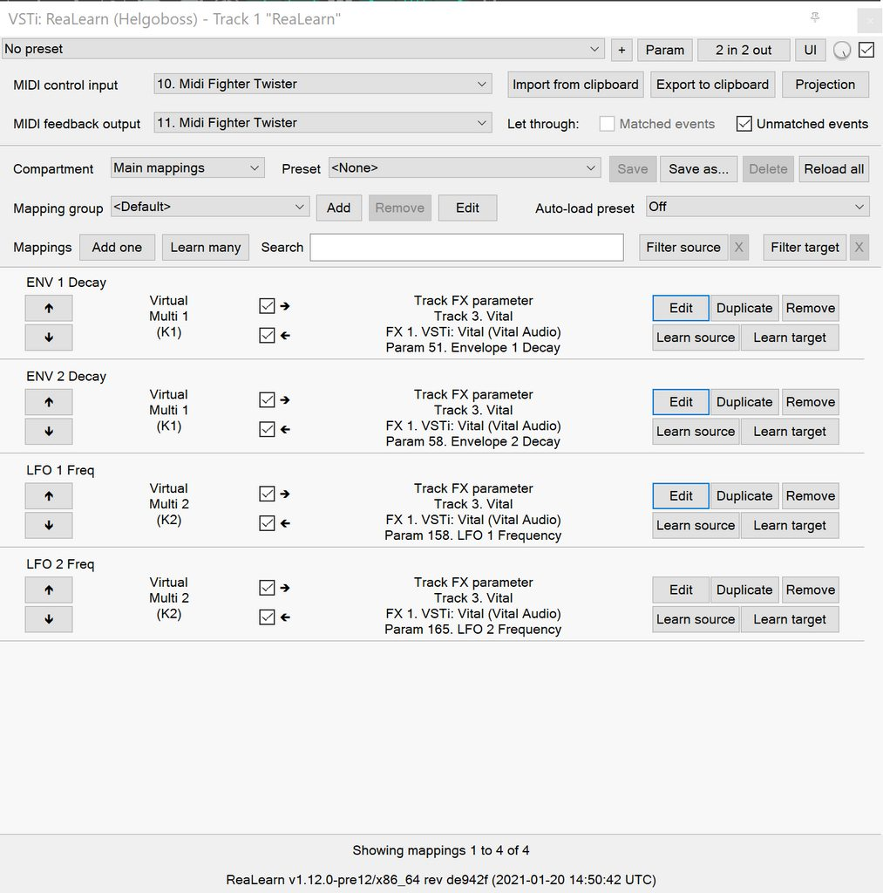
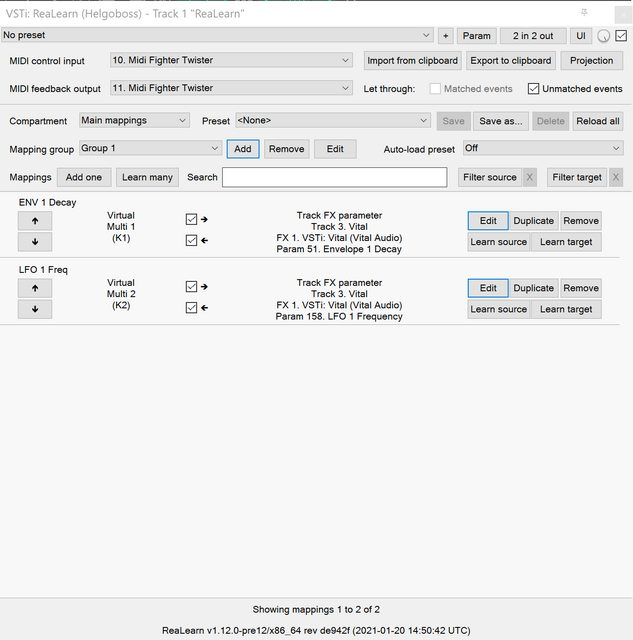
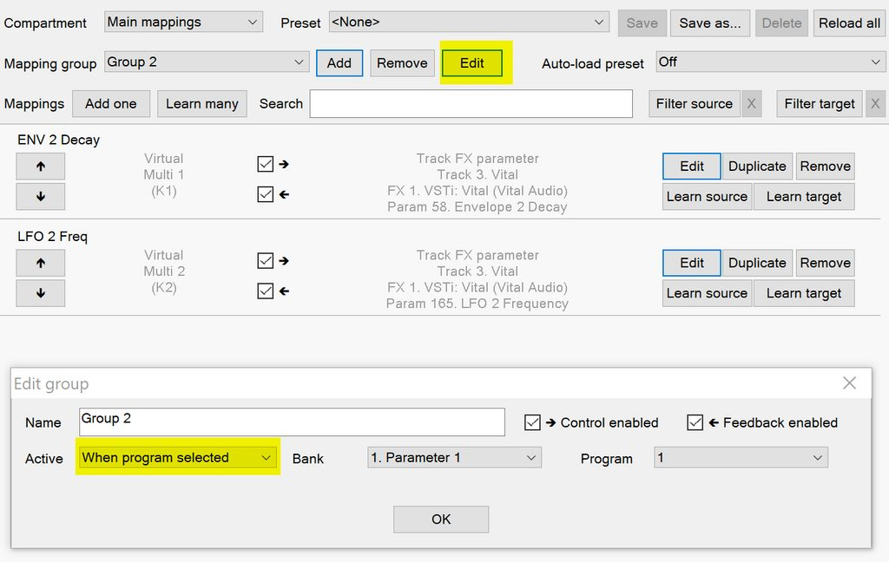
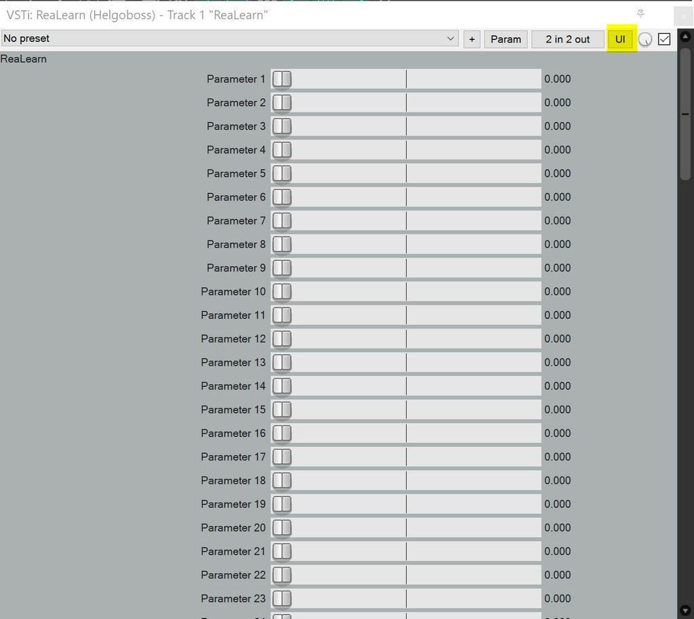
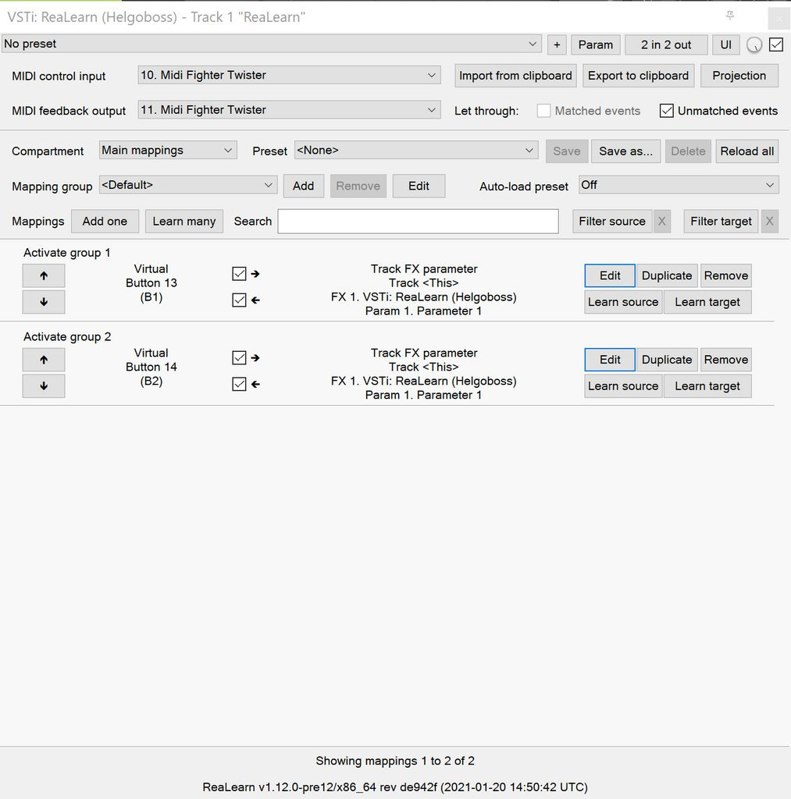
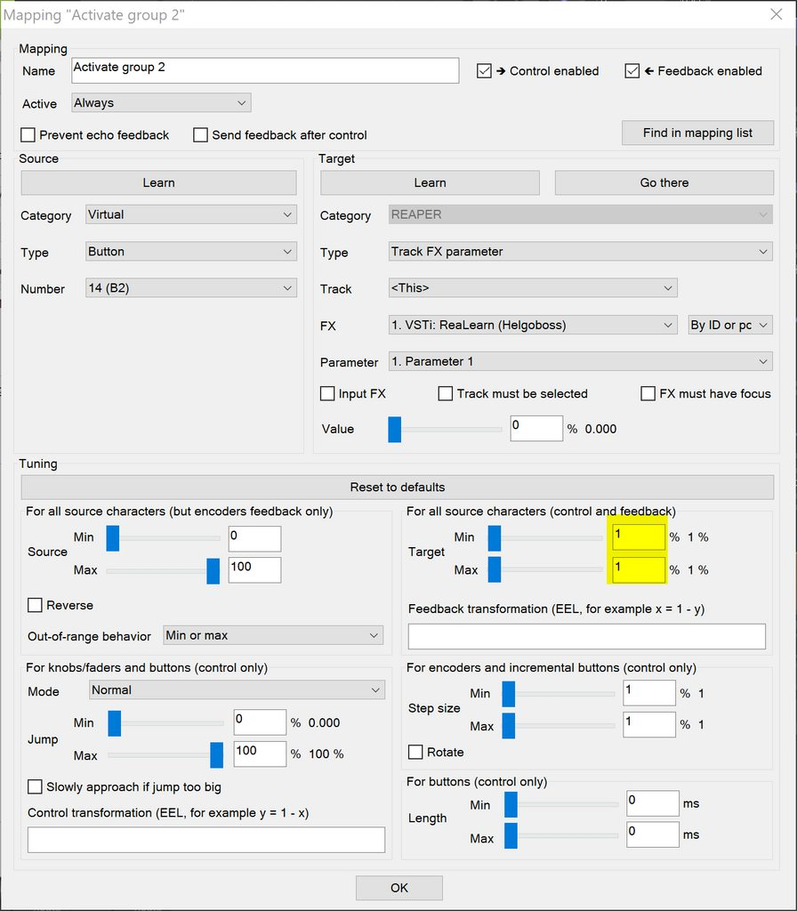
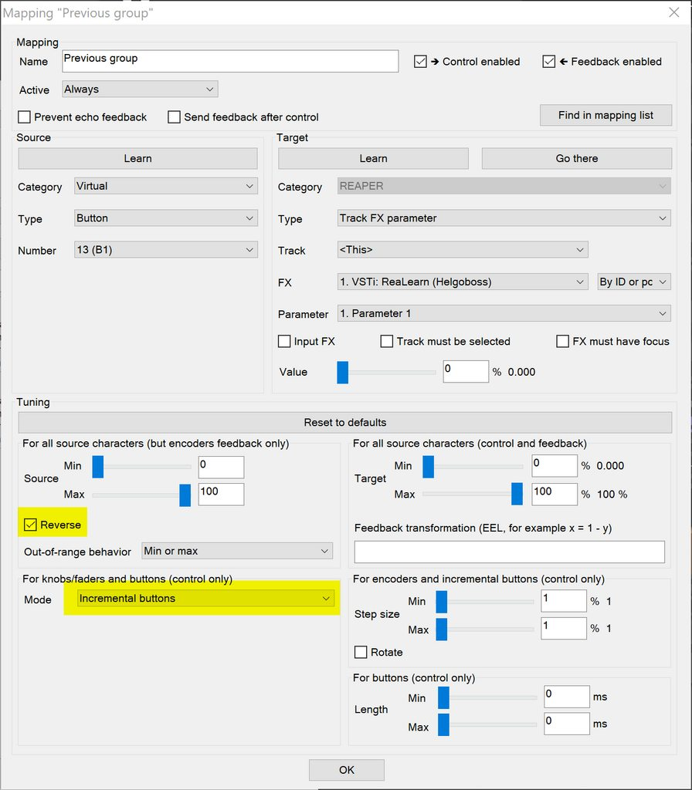

= ReaLearn user guide
:toc:
:toclevels: 5
:sectnums:
:sectnumlevels: 2

|===
|Last update of text: |`2021-10-12 (v2.11.0-pre.10)`
|Last update of relevant screenshots: |`2021-04-27 (v2.8.0)`
|===

== Quick start

Here's a step-by-step guide to help you get started with ReaLearn and a MIDI controller:

. Start REAPER.
. If you haven't already done it, https://github.com/helgoboss/realearn#installation[install ReaLearn via ReaPack].
. Make sure your MIDI controller is enabled in Options → Preferences… → Audio → MIDI Devices
  * For the MIDI input device (control), tick "Enable input from this device" and untick
 "Enable input for control messages".
  * For the MIDI output device (feedback), tick "Enable output to this device".
. Check if there's an existing controller preset for your MIDI controller (this is optional but can make things
 easier).
  * Extensions → ReaPack → Browse packages…
  * Type "realearn controller" in the _Filter_ field.
  * You should see a list of ReaLearn controller presets.
  * If you find your controller in the list, right-click it, choose install and press OK.
. Fire up an instance of ReaLearn
  * If you want your mappings to be specific to a particular project, create a new REAPER project or open an existing one. Right-click the track control panel and choose "Insert virtual instrument on new track…".
  * If you want your mappings to be automatically available in each of your projects, open REAPER's global monitoring FX chain (View → Monitoring FX) instead.
  * Then choose "VSTi: ReaLearn (Helgoboss)"
. Configure the ReaLearn instance
  * Select your controller's MIDI device as _Control input_ and _Feedback output_ (if you have a controller
 that supports MIDI feedback).
  * If you have downloaded a controller preset:
    - Switch to "Controller compartment" and select the desired preset right next to it.
    - This should fill the list below with so-called _controller mappings_.
    - When you are done, switch back to the "Main compartment".
. Add and learn your first mapping
  * Add a first mapping by pressing the _Add one_ button.
    - A mapping appears that's still inactive (indicated by the grey text color).
  * Press _Learn source_ and move a control element on your MIDI controller.
  * Press _Learn target_ and move e.g. the volume fader of a track.
  * Now your control element should control the track volume.

If you want to get the most out of your controller and learn about all of ReaLearn's cool features, please read on.

== Introduction

=== What is ReaLearn?

Probably you know already that ReaLearn is a sort of improvement over REAPER's built-in MIDI/OSC learn. But what is it
exactly? Let me put it this way:

____

ReaLearn is an instrument. It allows you to take whatever MIDI/OSC controller you have, be it a
keyboard or some fader box, plug it in and play … but instead of playing notes, you "play"
REAPER itself!

And because ReaLearn supports MIDI/OSC feedback, you can also do the reverse: Let REAPER "play" your
controller.

____

While this is still pretty vague, I think it captures the essence of ReaLearn. From a technical
viewpoint it's a VSTi plug-in, so it is an instrument, quite literally. That's one thing that sets
it immediately apart from the more conventional control surface feature in REAPER and 3rd-party
efforts such as https://forum.cockos.com/showthread.php?t=183143[CSI] or
http://www.mossgrabers.de/Software/Reaper/Reaper.html[DrivenByMoss]. The goal of the
latter-mentioned is to equip REAPER with out-of-the-box support for specific controllers, typically
dedicated DAW controllers such as
https://upload.wikimedia.org/wikipedia/commons/thumb/e/e5/Mackie_Control_Universal.jpg/1600px-Mackie_Control_Universal.jpg[Mackie MCU]
that are tailored to control a DAW just like a hardware mixer. And I suppose they do a pretty good
job at that.

ReaLearn's approach is quite different: It gives you total control on which control element operates which REAPER
parameter and provides you with a _learn_ function which allows you build your own control mappings quickly
and intuitively without writing configuration files. All of that on a _per-instance_ basis. That's right, by default, the mappings
are saved as part of the ReaLearn instance and therefore as part of your REAPER project. No need to pollute your global
control mappings just for the needs of one project!

Nevertheless, since version 2, ReaLearn is also a great choice for setting up global mappings for usage across
multiple projects. It provides a simple yet powerful preset system to make a set of mappings reusable in all of your
projects. Just add ReaLearn to the monitoring FX chain of REAPER (View → Monitoring FX) and ReaLearn will be instantly
available in all of your REAPER sessions without having to add it to a project first.

ReaLearn is designed to get the most out of general-purpose MIDI controllers, which - compared to the big
and bulky DAW consoles - usually have the advantage of being small, USB-powered, more versatile and easier on the
budget. ReaLearn doesn't impose many requirements on your controller. Thanks to features like conditional
activation and projection, it can turn even the cheapest MIDI controller into a powerhouse for controlling
your DAW. 

The usual ReaLearn workflow for a single mapping goes like this:

. Add a mapping
. Hit "Learn source" and touch some knob on your controller.
. Hit "Learn target" and touch some target parameter.
. Done.

If you want to learn multiple mappings in one go, this gets even easier via the "Learn many" button which will save you
_a lot of_ clicks.

The result are mappings that you can customize as you desire, for example by setting a target value
range. All of that with MIDI/OSC feedback support, which was previously only available in the less
dynamic, more global control surface world.

*Summary:* _ReaLearn is a sort of instrument for controlling REAPER._

=== Videos

If you want to get a first impression of ReaLearn, a video is surely a good way.

Here's a list of official ReaLearn videos:

* https://youtu.be/dUPyqYaIkYA[Introduction to ReaLearn 2]: An in-depth introduction to ReaLearn 2, the sophisticated
 MIDI-learn plug-in for REAPER.

Here's a short, non-complete list of user-made videos. Please note that at the moment all of them relate to older
ReaLearn versions and therefore might be partially outdated:

* https://www.youtube.com/watch?v=WKF2LmIueY8[How To: ReaLearn and MIDI Controller for Track Sends in REAPER - Tutorial]
* https://www.youtube.com/watch?v=UrYrAxnB19I[using ReaLearn to assign MIDI controllers to (VST) plugin parameters in Cockos Reaper]
* https://www.youtube.com/watch?v=p0LBdXXcg7g[MIDI Controller Feedback in REAPER with ReaLearn and LBX SmartKnobs - Tutorial]
** With ReaLearn 2, it should be easier to use ReaLearn's "preset auto-load" feature instead of adding LBX SmartKnobs
 to the mix.

=== Usage scenarios

Ultimately, ReaLearn gains whatever purpose you can come up with. Because it is a VSTi plug-in and
provides many MIDI routing options, it's very flexible in how it can be used. You can "inject" it
wherever you want or need it (limitation: using it in a take FX chain is not possible yet):

* *Input FX chain for live-only use:* Put it on a track's input FX chain in order to use it only
 for incoming "live" MIDI and let it control a parameter of an effect that's on the normal FX
 chain, right below a synthesizer. It will be active only if the track is armed for recording.
 All MIDI messages that are used for parameter control will _automatically_ be filtered by default
 and won't reach the controlled instrument, which is usually exactly what you need.
* *Grid controller for song switching:* Use some grid controller like the
 https://thumbs.static-thomann.de/thumb/thumb250x220/pics/prod/339386.jpg[AKAI APC Key 25] to
 arm/disarm various tracks (effectively enabling/disabling certain sound setups) by pressing the
 grid buttons - with the LEDs of the buttons indicating which setup is currently active.
* *Combination with other MIDI FX for interesting effects:* Slap it on a track FX chain, right
 between a MIDI arpeggiator and a synthesizer to arpeggiate the cutoff parameter of that
 synthesizer.
* *Monitoring FX for project-spanning setups:* Put it on the monitoring FX chain to have some
 control mappings available globally in all projects (similar to conventional control surface
 stuff).
* *Unusual settings for experimental stuff:* Create a track volume mapping with only feedback
 turned on. Choose "&lt;FX output&gt;" as MIDI feedback output and play the synthesizer one
 position below in the FX chain by moving the track volume slider (whatever that might be good for
 …).
* *Rotary encoders for avoiding parameter jumps:* How about a refreshingly "normal" use case? Let
 your rotary endless encoder control a track send volume without parameter jumps and restrict the
 value range to volumes below 0dB.
* *VST presets for easy reuse:* Save a bunch of commonly used mappings globally as FX presets.
* *Switching controller and main presets separately:* Maintain controller and main presets and switch
 between them as you like. Easily switch your controller without adjusting your FX presets.
* *Combination of multiple instances:* Use one ReaLearn instance to arm or disarm tracks that
 contain other ReaLearn instances to enable/disable different mapping groups. Group mappings and
 activate/deactivate them group-wise simply by instantiating multiple ReaLearn instances and
 enabling/disabling them as desired in the FX chain window.

… the possibilities are endless. It's all up to you! Use your creativity.

All of that makes ReaLearn especially well-suited for performers, people who use REAPER as a
platform for live playing. It might be less interesting to people who use REAPER for arranging,
mixing and mastering only and are satisfied with a control surface off the shelf. But even so,
as long as you have some general-purpose MIDI controller and you want a fine-tuned mapping to DAW parameters
of all sorts, give ReaLearn a try. It might be just what you need. More so if the controller supports feedback
(e.g. motorized faders or LEDs).

*Summary:* _ReaLearn is tailored to usage scenarios typically desired by performers._

== Basics

=== Control

After installing ReaLearn, you can fire it up just like any other VST instrument in REAPER: By
adding it to an FX chain.

. Right click in the track header area and choose "Insert virtual instrument on new track…"
. Choose "VSTi: ReaLearn (Helgoboss)"

After that you should see ReaLearn's main panel (unlike this screenshot, it wouldn't contain any
mappings yet):

image:images/screenshot-main-panel-annotated.svg[Main panel]

On the very top you see the _header panel_ for changing settings or doing things that affect
this complete instance of ReaLearn. Below that there's the _mapping rows panel_ which displays all
main mappings in this instance of ReaLearn. There can be very many of them. I've heard from users who use
hundreds. On the very bottom you see some information about the version of ReaLearn that you are
running. It's important to include this information in bug reports.

It can be useful to route all keyboard input to ReaLearn, so you can enter spaces in the "Search" field:

. Right click ReaLearn FX in the FX chain.
. Enable "Send all keyboard input to plug-in".

[discrete]
==== Adding a mapping

*Let's see how to add and use our first MIDI mapping:*

. Press the "Add one" button.
* A new mapping called "1" should appear in the mapping rows panel.
* For now it's greyed out because it's not complete yet. The default target is a
 <<fx-set-parameter-value,FX: Set parameter value>> target which doesn't yet refer to any specific FX.
. Press the "Learn source" button of that new mapping.
* Its label will change to "Stop".
. Touch some control element on your MIDI controller (knob, encoder, fader, button, key, pitch
 bend, mod wheel, …). For this example it's best to use something continuous, not a button or
 key.
* If your MIDI is set up correctly, the button label should jump back to "Learn source" and the
 touched control element should appear in the _source label_. See below if this doesn't happen.
. Press the "Learn target" button.
* Its label will change to "Stop".
. Touch the volume fader of your newly created REAPER track.
* The button label should jump back to "Learn target" and "Track: Set volume" should appear in the
 _target label_.
* At this point the mapping should not be greyed out anymore because it's complete and enabled.
. Now you should be able to control the touched target with your control element.

[discrete]
[#troubleshooting]
==== Troubleshooting

If REAPER crashes when scanning for plug-ins and the crash message shows something like `reaper_host64`
or `reaper_host32`, you either have a 32/64-bit version mismatch or you have
"Preferences → Plug-ins → Compatibility → VST bridging/firewalling" set to "In separate plug-in process" or
"In dedicated process per plug-in". Please see the https://github.com/helgoboss/realearn#installation[installation instructions on the
project website] for hints how to fix this.
In future, ReaLearn hopefully will handle this situation more gracefully. 

If the label remains at "Stop" at step 3, you need to have a look at your MIDI setup.

* Make sure *Enable input from this device* is checked for your controller MIDI input device in
 the REAPER preferences.
* Please note: _Enable input for control messages_ is totally irrelevant for ReaLearn. This is
only used for REAPER's built-in MIDI learn, which uses the so-called _control MIDI path_.
ReaLearn on the other hand uses the track MIDI path - which is one reason why it is so flexible.
* Make sure your audio hardware is not stuck (playback in REAPER should work).
* Make sure the track is armed for recording and has the appropriate MIDI device input.
* Sometimes it's necessary to make your controller enter a specific MIDI mode.
* Some controllers, especially DAW controllers, are able to work with several protocols (MCU, HUI, MIDI, …).
* Although MCU and HUI is also just MIDI under the hood, they are more limited (because specialized) in comparison
 to MIDI - so sometimes not all control elements work in the MCU/HUI mode of operation.
* Therefore you need to consult your controller's manual and take the necessary steps to put it into something like
 a "general-purpose MIDI" mode.

When you read this the first time, you might get the impression that this is a lot of work for
setting up one simple control mapping. It's not. Learning mappings is a matter of a few secs after
you got the hang of it. ReaLearn also provides the "Learn many" button and a bunch of REAPER actions
for one-click learning straight from a REAPER toolbar or triggered by a button on your controller.
More about that later.

At this point: Congratulations! You have successfully made your first baby steps with ReaLearn.

[discrete]
==== Some words about MIDI routing

If you think that what we saw until now is not more than what REAPER's built-in MIDI learn already
offers, I can't blame you. First, don't worry, there's more to come, this was just the beginning.
Second, there _is_ a difference. For some folks, this is an insignificant difference, for others
it's a game changer, it depends on the usage scenario. The key to understand this difference is to
understand the MIDI _routing_: In above example, _Control input_ was set to `&lt;FX input&gt;`. That means
we used normal track MIDI messages to control a parameter in REAPER - let's call it _track MIDI path_.
This is different from REAPER's built-in MIDI learn, which uses the totally separate _control MIDI path_.

Using the track MIDI path means it's completely up to you to decide what MIDI messages flow into
ReaLearn. You decide that by using REAPER's powerful routing capabilities. For example, you can
simply "disable" the mapping by disarming your track, a feature that is very desirable if you use
REAPER as live instrument. Or you can preprocess incoming MIDI (although that should rarely be
necessary given ReaLearn's mapping customization possibilities).

Instead of using `&lt;FX input&gt;`, you can also pick the MIDI device of your choice directly, in which case ReaLearn will
ignore track MIDI messages and capture MIDI messages directly from the already open MIDI device.

Another thing worth to point out which is different from built-in MIDI learn is that we didn't use
the action "Track: Set volume for track 01". Benefit: ReaLearn will let you control the volume of
the track even if you move that track to another position. The track's position is irrelevant!

=== Feedback

In ReaLearn, every mapping has 2 directions: _control_ (controller to REAPER) and _feedback_ (REAPER
to controller). So far we have talked about the _control_ direction only: When you move a knob on
your controller, something will happen in REAPER. But if your controller supports it, the other
direction is possible, too!

Imagine you would use a MIDI-controllable motorized fader as control element to change the track
volume. ReaLearn is capable of making that fader move whenever your track volume in REAPER changes -
no matter if that change happens through automation or through dragging the fader with your mouse.
Motorized faders are quite fancy. Another form of feedback visualisation are rotary encoders with
LEDs that indicate the current parameter value.

How to set this up? Often it's just a matter of choosing the correct feedback device:

. Make sure *Enable output to this device* is checked for your controller MIDI output device in
 the REAPER preferences.
. In ReaLearn's header panel, select your controller as _MIDI feedback output_.

That should be it!

If it doesn't work and you have ruled out MIDI connection issues, here are some possible causes:

. *Your controller is not capable of feedback via MIDI messages.*
* Some controllers _do_ support feedback, but not via MIDI.
* If they support feedback via OSC, you are lucky because ReaLearn supports that, too. This is discussed
 in another section.
* If it's another protocol, you are out of luck. Reverse engineering proprietary protocols is out of
 ReaLearn's scope.
* Recommendation: Maybe you are able to find some bridge driver for your controller that is
 capable of translating generic MIDI messages to the proprietary protocol. Then it could work.
* Examples: Akai Advance keyboards, Native Instruments Kontrol keyboards
. *Your controller doesn't support feedback via generic MIDI messages but via MIDI SysEx.*
* In this case, MIDI feedback is probably still achievable because since version 2.6.0 ReaLearn also supports
 feedback via MIDI system-exclusive messages. However, it's not going to be straightforward.
 Unless you find an existing controller preset for your controller, you'll have to read the MIDI specification
 of your controller (hopefully there is one) … or you need to experiment a lot.
* Examples: Arturia MiniLab mkII (but we have a controller preset for this one!)
. *Your controller has multiple modes and currently is in the wrong one.*
* Some controllers, especially DAW controllers, are able to work with several protocols.
* Recommendation: Consult your controller's manual and take the necessary steps to put it into
 something like a "generic MIDI" mode.
* Example: Presonus Faderport
. *Your controller expects feedback via messages that are different from the control MIDI messages.*
* Usually, controllers with feedback support are kind of symmetric. Here's an example what I mean
 by that: Let's assume your motorized fader _emits_ CC 18 MIDI messages when you move it. That
 same motorized fader starts to move when it _receives_ CC 18 MIDI messages (messages of exactly
 the same type). That's what I call symmetric. E.g. it's not symmetric if it emits CC 18 but
 reacts when receiving CC 19.
* ReaLearn assumes that your controller is symmetric. If it's not, you will observe non-working
 or mixed-up feedback.
* Recommendation: Consult your controller's manual and try to find out which MIDI messages need
 to be sent to the controller to deliver feedback to the control element in question. Then,
 split your mapping into two, making the first one a control-only and the second one a
 feedback-only mapping. Adjust the source of the feedback-only mapping accordingly. In the next
 section you'll learn how to do that.
* Example: Presonus Faderport

Personally, I've made good feedback experiences with the following controllers (but I haven't tried
very many, so this is for sure a very incomplete list):

* DJ TechTools Midi Fighter Twister
* Akai APC Key 25
* Presonus Faderport

Also have a look into the section <<tested-controllers,Tested controllers>>. Maybe your controller is listed there
along with some tips.

All hardware examples are provided to the best of my knowledge. If anything is incorrect or has
changed in the meanwhile, please let me know!

=== Editing a mapping

When you press the _Edit_ button of a mapping row, a so-called _mapping panel_ appears, which lets
you look at the corresponding mapping in detail and modify it:

image:images/screenshot-mapping-panel.png[Mapping panel]

This panel has 4 sections:

* *Mapping:* Allows to change the name and other general settings related to this mapping.
* *Source:* Allows to edit the _source_ of the mapping. In most cases, a source represents a
 particular control element on your controller (e.g. a fader).
* *Target:* Allows to edit the _target_ of the mapping and optionally some target-related
 activation conditions. A target essentially is the parameter in REAPER that should be controlled.
* *Tuning:* Allows to change in detail how your source and target will be glued together. This
 defines _how_ incoming control values from the source should be
 applied to the target (and vice versa, if feedback is used). This is where it gets interesting.
 Whereas REAPER's built-in MIDI learn provides just some basic modes like Absolute or Toggle, ReaLearn
 allows you to customize many more aspects of a mapping.

By design, source, tuning and target are independent concepts in ReaLearn. They can be combined
freely - although there are some combinations that don't make too much sense.

Changes in the mapping panel are applied immediately. Pressing the _OK_ button just closes the
panel.

*Tip:* It is possible to have up to 4 mapping panels open at the same time.

=== Controller setup

In order to get the most out of your controller in combination with ReaLearn, you should consider
the general hints given in the section <<tested-controllers,Tested controllers>>.

=== Automation and rendering

Similarly to control surfaces, ReaLearn is meant to be used for controlling targets "live". If you
want to _persist_ the resulting target value changes, you can do so by writing automation. Just as
with any other automation, it will be included when you render your project.

It _is_ possible to feed ReaLearn with track MIDI items instead of live MIDI data. This also results
in a kind of automation. *But be aware: This kind of "automation" will only be rendered in REAPER's
"Online Render" mode. It will be ignored when using one of the offline modes!*

== Reference

So far we've covered the basics. Now let's look into everything in detail.

=== Main panel

[#header-panel]
==== Header panel

The header panel provides the following user interface elements, no matter if the _main_ or
_controller_ compartment is shown:

* *Control input:* By default, ReaLearn captures MIDI events from _&lt;FX input&gt;_, which
 consists of all MIDI messages that flow into this ReaLearn VSTi FX instance (= track MIDI path).
 Alternatively, ReaLearn can capture events directly from a MIDI hardware or OSC input. This dropdown lets
 you choose the corresponding MIDI or OSC input device. Be aware that MIDI will only work if _Enable input
 from this device_ is checked for the selected MIDI input device in REAPER's MIDI preferences.
* *Feedback output:* Here you can choose if and where ReaLearn should send MIDI/OSC feedback. By
 default it's set to _&lt;None&amp;gt_; for no feedback. If you want to enable feedback, pick a MIDI or OSC
 output device here. Keep in mind that for MIDI, _Enable output to this device_ must be checked in REAPER's
 MIDI preferences. As an alternative, you can send feedback to _&lt;FX output&gt;_, which makes
 feedback MIDI events stream down to the next FX in the chain or to the track's hardware MIDI output.
 Tip: Latter option is great for checking which MIDI messages ReaLearn would send to your device. Just add
 a "ReaControlMIDI" FX right below ReaLearn and press "Show Log". Please note that sending MIDI feedback
 to the FX output has some drawbacks. First, it doesn't participate in ReaLearn's multi-instance feedback
 orchestration. That means you might experience LEDs/faders misbehaving when using multiple instances. Second, it
 doesn't work if ReaLearn FX is suspended, e.g. in the following cases:
** ReaLearn FX is disabled.
** Project is paused and ReaLearn track is not armed.
** ReaLearn FX is on input FX chain and track is not armed.
* *Export to clipboard:* Pressing the export button allows you to copy ReaLearn's settings to the clipboard so you can import them in another instance or edit them in a text editor.
** *Export session as JSON:* Copies a _complete_ dump of ReaLearn's current settings (including all mappings, even controller mappings) to the clipboard. The dump's data format is
 https://www.json.org/json-en.html[JSON], a wide-spread data exchange format. It's a text format,
 so if you are familiar with the search & replace feature of your favorite text editor, this is one way to do batch editing. However, recent versions of ReaLearn provide a much better way of doing that: _ReaLearn Script_. Read about the other export options for learning more about it.
+
[TIP]
====
You can also use the export for some very basic A/B testing:

1. Choose _Export session as JSON_
2. Change some settings and test them
3. Restore the old settings by pressing _Import from clipboard_).
====
+
[TIP]
====
For the programmers and script junkies out there: It's perfectly possible to program ReaLearn from outside by passing it a snippet of JSON via https://www.reaper.fm/sdk/vst/vst_ext.php[REAPER's named parameter mechanism] (search for `named_parameter_name`). Parameter name is `set-state`.
====
** *Export main/controller compartment as JSON:* Copies a dump of the currently visible compartment to the clipboard. It contains about the same data that a compartment preset would contain.
** *Export main/controller compartment as Lua:* Copies a dump of the currently visible compartment to the clipboard as Lua code (ReaLearn Script). This form of Lua export skips properties that correspond to ReaLearn's default values, resulting in a minimal result. Perfect for pasting in a forum or programming ReaLearn with focus on only those properties that matter to you.
** *Export main/controller compartment as Lua (include default values):*  This Lua export includes even those properties that correspond to ReaLearn's default values, resulting in more text. This gives you the perfect starting point if you want to extensively modify the current compartment (using the Lua programming language) or build a compartment from scratch, using even properties that you haven't touched yet in the user interface!
* *Import from clipboard:* Pressing the import button does the opposite: It restores whatever ReaLearn dump is currently in the clipboard.
* *Projection:* This is a quite unique feature that allows you to project a schematic representation
 of your currently active controller to a mobile device (e.g. a tablet computer). You can put this device close
 to your controller in order to see immediately which control element is mapped to which parameter.
 This is an attempt to solve an inherent problem with generic controllers: That it's easy to forget which control
 element is mapped to which target parameter. If you want to use this feature, just click this button
 and you will see detailed instructions on how to set this up. In order to use this feature, you need the
 _ReaLearn Companion_ app, which has a <<companion-app,dedicated section>> in this user guide.
* *Let through:* ReaLearn by default "eats" incoming MIDI events for
which there's at least one active mapping with that source. In other words, it doesn't forward MIDI events which are used to control a target parameter. However, unmatched MIDI events are forwarded! You can change this using these checkboxes. E.g. you can tick "Matched events" if you want to forward even matched events. The exact behavior differs depending on what you choose as _control input_:
** _Control input_ = `&lt;FX input&gt;`
*** Here, MIDI events arrive from ReaLearn's FX input. If they get forwarded, they get forwarded to the FX output, usually to the plug-in which is located right below ReaLearn FX. The default setting often makes much sense here, especially if you put ReaLearn right above another instrument plug-in.
** _Control input_ = _some real MIDI hardware device_
*** Here, MIDI events arrive directly from the MIDI hardware device. If they get forwarded, they get forwarded to REAPER's tracks as they would usually do without ReaLearn. If they don't get forwarded, it means they get filtered and will never make it to the tracks. ReaLearn completely eats them, globally! That means, ReaLearn can act as global MIDI filter.
*** Please note, with control input set to a real MIDI device, MIDI events coming from _FX input_ are _always_ forwarded to the FX output.
*** Also, MIDI events captured from a real MIDI device input are *never* forwarded to ReaLearn's FX output.
+
TIP: This global MIDI filter feature is only available in REAPER v6.36+.
** _Control input_ = _some OSC device_
*** You won't see the checkboxes because they don't make sense for OSC.
* *Show:* This lets you choose which mapping compartment is displayed. A compartment is basically a list of mappings
 that can be saved as independent preset. Initially, ReaLearn shows the so-called "Main compartment" which contains
 the so-called "Main mappings" - the bread and butter of ReaLearn. However, there's another interesting compartment,
 the "Controller compartment". In a nutshell, this compartment lets you define which hardware controllers you have at
 your disposal and which control elements they have. Learn more about that feature in section
 <<controller-compartment,Controller compartment>>.
* *Controller preset / Main preset:* This is the list of available presets for that compartment. By default, it's set
 to "&lt;None&gt;", which means that no particular preset is active. If you select a preset in this list, its
 corresponding mappings will be loaded and immediately get active. In the _controller_ compartment, this list
 will essentially represent the list of available hardware controller presets. A few are shipped with ReaLearn itself
 (separately downloadable via ReaPack) but you can also define your own ones and add them to this list!
* *Save:* If you made changes to a preset, you can save them by pressing this button. This works for built-in presets
 as well but I would strongly recommend against changing them directly. Better use _Save as…_ and choose a custom
 name.
* *Save as…* This allows you to save all currently visible mappings as a new preset. Please choose a descriptive
 name.
** Saving your mappings as a preset is optional. All controller mappings are saved together
 with your current ReaLearn instance anyway, no worries. But as soon as you want to reuse these
 mappings in other ReaLearn instances, it makes of course sense to save them as a preset!
** All of your presets end up in the REAPER resource directory
 (REAPER → Actions → Show action list… → Show REAPER resource path in explorer/finder) at
 `Data/helgoboss/realearn/presets`. They are JSON files and very similar to what you get when you press
 _Export to clipboard_.
** JSON files that represent controller mappings can also contain custom data sections. For example, the ReaLearn
 Companion app adds a custom data section in order to memorize the positions and shapes of all control elements.
** When pressing this button, ReaLearn might detect that your current mappings are referring to specific tracks and
 FX instances _within the current project_. This would somehow defeat the purpose of presets because what good
 are presets that are usable only within one project? That's why ReaLearn also offers you to automatically
 convert such mappings to project-independent mappings by applying the following transformations:
*** FX targets are changed to refer to _currently focused FX_* instead of a particular one. Their track is set to
 *&lt;This&gt;* because it doesn't matter anyway.
*** Track targets are changed to refer to a track via its position instead of its ID.
** If this is not what you want, you can choose to say no and make modifications yourself.
* *Delete:* This permanently deletes the currently chosen preset. You can also delete built-in presets.
 However, if you use ReaPack for installation, it should restore them on next sync.
* *Add one:* Adds a new mapping at the end of the current mapping list.
* *Learn many:* Allows you to add and learn many new mappings in a convenient batch mode. Click this button and follow
 the on-screen instructions. Click _Stop_ when you are finished with your bulk learning strike.
[#search]
* *Search:* Enter some text here in order to display just mappings whose name matches the text. The search expression
 also supports wildcards `*` and `?` for doing more blurry searches.
* *Filter source:* If you work with many mappings and you have problems memorizing them, you
 will love this feature. When you press this button, ReaLearn will start listening to incoming MIDI/OSC
 events and temporarily disable all target control. You can play around freely on your controller
 without having to worry about messing up target parameters. Whenever ReaLearn detects a valid
 source, it will filter the mapping list by showing only mappings which have that source. This is a
 great way to find out what a specific knob/fader/button etc. is mapped to. Please note that the
 list can end up empty (if no mapping has that source). As soon as you press _Stop_, the current
 filter setting will get locked. This in turn is useful for temporarily focusing on mappings with a
 particular source. When you are done and you want to see all mappings again, press the *X*
 button to the right. _Tip:_ Before you freak out thinking that ReaLearn doesn't work anymore
 because it won't let you control targets, have a quick look at this button. ReaLearn might still
 be in "filter source" mode. Then just calm down and press _Stop_. It's easy to forget.
* *Filter target:* If you want to find out what mappings exist for a particular target,
 press this button and touch something in REAPER. As soon as you have touched a valid target, the
 list will show all mappings with that target. Unlike _Filter source_, ReaLearn will
 automatically stop learning as soon as a target was touched. Press the *X* button to remove the
 filter and show all mappings again.

Additionally, the header panel provides a context menu (accessible via right-click on Windows and Linux, control-click
on macOS) with the following entries:

* *Copy listed mappings*: Copies all mappings that are visible in the current mapping list to the clipboard
 (respecting group, search field and filters). You can insert them by opening the context menu in the row panel.
* *Paste mappings (replace all in group):* Replaces all mappings in the current group with the mappings in the
 clipboard.
* *Auto-name listed mappings:* Clears the names of all listed mappings so ReaLearn's auto-naming mechanism can kick
 in.
* *Move listed mappings to group:* Lets you move all currently listed mappings to the specified group. Perfect in combination with the textual search!
* *Options*
** *Auto-correct settings:* By default, whenever you change something in ReaLearn, it tries to
 figure out if your combination of settings makes sense. If not, it makes an adjustment.
 This auto-correction is usually helpful. If for some reason you want to disable auto-correction, this
 is your checkbox.
** *Send feedback only if track armed:* If MIDI control input is set to _&lt;FX input&gt;_,
 ReaLearn by default only sends feedback if the track is armed (unarming will naturally disable
 control, so disabling feedback is just consequent). However, if MIDI control input is set to a
 MIDI or OSC device, _auto-correct settings_ will take care of unchecking this option in order to allow feedback
 even when unarmed (same reasoning). You can override this behavior with this checkbox. At the moment,
 it can only be unchecked if ReaLearn is on the normal FX chain. If it's on the input FX chain, unarming
 naturally disables feedback because REAPER generally excludes input FX from audio/MIDI processing while a
 track is unarmed (*this is subject to change in future!*).
** *Make instance superior:* If ticked, this instance is allowed to suspend other instances which share the same
 input and/or output device (hardware devices only, not FX input or output!). With this you can easily let your
 controller control the currently focused FX but fall back to your usual controls when it's closed. It's intended
 to be used primarily on instances that use &quot;Auto-load: Depending on focused FX&quot;.
*** By default, ReaLearn instances are not superior, just normal. This is often okay because ReaLearn instances
 are friendly fellows and like sharing controllers with each other.
*** For example, if 2 instances use the same input or output device and they use different control elements, they
 can peacefully coexist. And even if they share a control element for the _control direction_, they are still
 fine with it. The same control element will control 2 mappings, why not!
*** Things start to get hairy as soon as 2 instances want to send _feedback_ to the same control elements at the
 same time. You should avoid this. You should not even do this within one ReaLearn instance. This can't work.
*** Sometimes you want one instance to suspend/cover/cancel/mute another one! You can do this by making this
 instance _superior_. Then, whenever this instance has at least one active mapping, all non-superior instances
 with the same control and/or feedback device will be disabled for control and/or feedback.
*** You can have multiple superior instances. Make sure they get along with each other :)
* *Server*
** *Enabled:* This enables/disables the built-in server for allowing the ReaLearn Companion app to
 connect to ReaLearn.
** *Add firewall rule:* Attempts to add a firewall rule for making the server accessible from other devices or
 displays instructions how to do it.
** *Change session ID…:* This lets you customize the ID used to address this particular ReaLearn
 instance when using the projection feature.
*** By default, the session ID is a random cryptic string
 which ensures that every instance is uniquely addressable. The result is that scanning the QR code
 of this ReaLearn instance will let your mobile device connect for sure with this unique
 instance, not with another one - remember, you can use many instances of ReaLearn in parallel. This
 is usually what you want.
*** But a side effect is that with every new ReaLearn instance that you create,
 you first have to point your mobile device to it in order to see its
 projection (by scanning the QR code). Let's assume you have in many of your projects exactly one ReaLearn instance
 that lets your favorite MIDI controller control track volumes. By customizing the session ID, you basically can tell
 your mobile device that it should always show the projection of this very ReaLearn instance -
 no matter in which REAPER project you are and even if they control the volumes of totally
 different tracks.
*** You can achieve this by setting the session ID of each volume-controlling ReaLearn instance
 to exactly the same value, in each project. Ideally it's a descriptive name without spaces, such as "track-volumes".
 You have to do the pairing only once et voilà, you have a dedicated device for monitoring your volume control
 ReaLearn instances in each project.
*** *Make sure to not have more than one ReaLearn instance with the same session
 ID active at the same time because then it's not clear to which your mobile device will connect!*
*** *At the moment, the session ID is part of the ReaLearn preset!* That means, opening a preset, copying/cutting
 a ReaLearn FX, importing from clipboard - all of that will overwrite the session ID. This might change in
 future in favor of a more nuanced approach!
* *Help:* As the name says.
* *Reload all presets from disk:* If you made direct changes to preset files or have downloaded presets via ReaPack,
 you should press this to reflect these changes in all open ReaLearn instanes (reloads all preset files).
* *OSC devices:* Allows one to display and modify the list of (globally) configured OSC devices.
** *&lt;New&gt;:* Opens a window for adding a new OSC devices.
*** *Name:* A descriptive name of the device, e.g. "TouchOSC on my Android phone".
*** *Local port:* Required for control. The UDP port on which ReaLearn should listen for OSC control messages.
**** *Important:* This port must be reserved exclusively for ReaLearn. If you already use this port
 in another application (e.g. in REAPER's own OSC control surface) it won't work and ReaLearn will bless
 you with an "unable to connect" message in the "Control input" dropdown.
*** *Device host:* Required for feedback only. The IP address of the OSC device to which ReaLearn
 should send feedback messages. When targeting an OSC software that runs on the same computer as REAPER and
 ReaLearn, enter the special IP address `127.0.0.1` ("localhost").
*** *Device port:* Required for feedback only. The UDP port on which the OSC device listens for OSC feedback
 messages.
*** All OSC device configurations will be saved in the REAPER resource directory
 (REAPER → Actions → Show action list… → Show REAPER resource path in explorer/finder) in the JSON file
 `Helgoboss/ReaLearn/osc.json`.
** *_Some device_*
*** *Edit:* Lets you edit an existing device (see _&lt;New&gt;_).
*** *Remove:* Removes the device. This is a global action. As a consequence, all existing ReaLearn instances
 which use this device will point to a device that doesn't exist anymore.
*** *Enabled for control:* If you disable this, ReaLearn will stop listening to this device. This can save
 resources, so you should do this with each device that is not in use (as an alternative for removing it
 forever).
*** *Enabled for feedback:* If you disable this, ReaLearn won't connect to this device.
*** *Can deal with bundles:* By default, ReaLearn aggregates multiple OSC messages into so-called OSC bundles.
 Some devices (e.g. from Behringer) can't deal with OSC bundles. Untick the checkbox in this case and ReaLearn
 will send single OSC messages.
* *Compartment parameters:* This shows all parameters of the current compartment (you know, the ones that can be used
 for conditional activation and `&lt;Dynamic&gt;` selector expressions) and makes it possible to customize their names.
 This is practical because it's completely up to you how to put these parameters to use. Perfect for preset authors:
 The parameter names are saved together with the compartment preset. Parameter values will be reset whenever you load
 a preset (just the ones in that compartment).
* *Advanced:* Provides access to expert features.
** *Copy listed mappings as Lua:* Like _Copy listed mappings_ but generates Lua code instead.
** *Copy listed mappings as Lua (include default values):* Generates Lua code that contains even those properties that correspond to ReaLearn's defaults.
** *Paste from Lua (replace all in group):* Like _Paste mappings (replace all in group)_ but treats the clipboard content as Lua code.
* *Send feedback now:* Usually ReaLearn sends feedback whenever something changed to keep the LEDs
 or motorized faders of your controller in sync with REAPER at all times. There might be situations
 where it doesn't work though. In this case you can send feedback manually using this button.
* *Log debug info:* Logs some information about ReaLearn's internal state. Can be interesting for
 investigating bugs or understanding how this plug-in works.
[#log-incoming-messages]
* *Log incoming messages:* When enabled, all incoming MIDI or OSC messages will be logged to the console. Each log
 entry contains the following information:
** Timestamp in seconds
** ReaLearn instance ID (a randomly assigned ID that uniquely identifies a particular instance, will change after
 restart)
** Message purpose
*** *Control input:* A message used for controlling targets.
*** *Learn input:* A message used for learning a source.
** Actual message (MIDI messages will be shown as hexadecimal byte sequence, short MIDI messages also as
 decimal byte sequence and decoded)
** Match result
*** *unmatched:* The message didn't match any mappings.
*** *matched:* The message matched at least one of the mappings.
*** *consumed:* Only for short MIDI messages. This short message is part of a (N)RPN or 14-bit CC message and
 there's at least one active mapping that has a (N)RPN or 14-bit CC source. That means it will not be
 processed. The complete (N)RPN or 14-bit CC message will be.
[#log-outgoing-messages]
* *Log outgoing messages:* When enabled, all outgoing MIDI or OSC messages will be logged to the console. The log
 entries look similar to the ones described above, with the following notable differences.
** Message purpose
*** *Feedback output:* A message sent to your controller as response to target value changes.
*** *Lifecycle output:* A message sent to your controller as response to mapping activation/deactivation
 (see <<mapping-lifecycle-actions,Mapping lifecycle actions>>).
*** *Target output:* A message sent because of either the <<midi-send-message,MIDI: Send message>> or
 <<osc-send-message,OSC: Send message>> target.

[#bottom-panel]
==== Bottom panel

At the bottom you can see the current scroll position, version information and tags assigned to this ReaLearn instance.

* *Edit tags...:* Press this button to assign tags to this instance (a comma-separated list). They are important if you want to dynamically enable or disable instances using the <<realearn-enable-disable-instances>> target.

==== Common compartment settings

The header panel shows the following user interface elements, no matter if you are in the controller or main
compartment: 

* *Mapping group:* Mapping groups are part of the currently shown compartment and enable you to divide the list of
mappings into multiple groups.
** Groups can be useful …
*** To apply an activation condition to multiple mappings at once.
*** To enable/disable control/feedback for multiple mappings at once.
*** To keep track of mappings if there are many of them.
** This dropdown contains the following options:
*** *&lt;All&gt;:* Displays all mappings in the compartment, no matter to which group they belong. In this view,
 you will see the name of the group on the right side of a mapping row.
*** *&lt;Default&gt;:* Displays mappings that belong to the _default_ group. This is where mappings
 end up if you don't care about grouping. This is a special group that can't be removed.
*** *_Custom group_:* Displays all mappings in your custom group.
** You can move existing mappings between groups by opening the context menu (accessible via right-click on Windows
 and Linux, control-click on macOS) of the corresponding mapping row and choosing "Move to group".
** Groups are saved as part of the project, VST plug-in preset and compartment preset.
* *Add:* Allows you to add a group and give it a specific name.
* *Remove:* Removes the currently displayed group. It will ask you if you want to remove all the mappings in that
 group as well. Alternatively they will automatically be moved to the default group.
* *Edit:* Opens the group panel. This allows you to change the group name and change things that affect all mappings in this groups: Assigning tags, enabling/disabling control and/or feedback, setting an activation condition. The activation condition that you provide here is combined with the one that you provide in the mapping. Only if both, the group activation conditions and
 the mapping activation condition are satisfied, the corresponding mapping will be active. Read more about
 <<conditional-activation,conditional activation>> below in the section about the <<mapping-panel,Mapping panel>>.

image:images/screenshot-group-panel.png[Group panel]

Since ReaLearn 2.10.0, mappings are processed from top to button, exactly in the order in which they are defined
within the corresponding compartment. This matters if you want to map multiple targets to one button and
the order of execution matters.

*Important:* There's an exception. ReaLearn's processing of its own VST parameters is always deferred.

- That means changing a ReaLearn parameter in one mapping and relying on it in the next
 one (in terms of conditional activation or in a `&lt;Dynamic&gt;` expression), will not work!
- You can work around that by delaying execution of the next mapping via <<for-buttons-control-only,fire mode>> but
 that's a dirty hack. ReaLearn's parameters are not supposed to be used that way!
- Imagine a railway: ReaLearn's targets can be considered as trains. Triggering a target means moving the train forward.
 ReaLearn's parameters can be considered as railway switches. Changing a parameter means setting a course.
 The course needs to be set in advance, at least one step before! Not at the same time as moving the train over the
 switch.

[#controller-compartment]
==== Controller compartment

By default, ReaLearn shows the list of main mappings. If you switch to the _controller_ compartment, you will see the
list of controller mappings instead. Each controller mapping represents a control
element on your hardware controller, e.g. a button or fader. This view lets you describe your controller by - well -
by adding mappings. Almost everything in ReaLearn is a mapping :)

Defining your own controllers can have a bunch of benefits:

* You can use the awesome https://www.youtube.com/watch?v=omuYBznEShk&feature=youtu.be[controller projection feature]
 to project your controller mapping to your smartphone or tablet.
* You can use controller presets made by other users and thereby save precious setup time. Or you can contribute them
 yourself!
* You can make your main mappings independent of the actual controller that you use. This is done using so-called
 _virtual_ sources and targets.
* It allows you to give your knobs, buttons etc. descriptive and friendly names instead of just e.g. "CC 15".
* You don't need to learn your control elements again and again. Although the process of learning an element is easy
 in ReaLearn, it can take some time in case the source character is not guessed correctly
 (e.g. absolute range element or relative encoder). Just do it once and be done with it!

If you want to make ReaLearn "learn" about your nice controller device, all you need to do is to create a suitable
controller mapping for each of its control elements.

Let's first look at the "slow" way to do this - adding and editing each controller mapping one by one:

. Press the "Add one" button.
. Learn the source by pressing the "Learn source" button and touching the control element.
. Press the "Edit" button.
. Enter a descriptive name for the control element.
** _Hint:_ This name will appear in many places so you want it to be short, clear and unique!
. Assign a unique virtual target.
** At this point we don't want to assign a _concrete_ target yet. The point of controller presets is
 to make them as reusable as possible, that's why we choose a so-called _virtual_ target.
** In the _Category_ dropdown, choose _Virtual_.
** As _Type_, choose _Button_ if your control element is a sort of button (something which you can press)
 and _Multi_ in all other cases.
** Use for each control element a unique combination of _Type_ and _ID_, starting with number _1_ and counting.
*** Example: It's okay and desired to have one control element mapped to "Multi 1" and one to "Button 1".
** Just imagine the "8 generic knobs + 8 generic buttons" layout which is typical for lots of popular controllers.
 You can easily model that by assigning 8 multis and 8 buttons.
** Maybe you have realized that the _Tuning_ section is available for controller mappings as well! That opens up all
 kinds of possibilities. You could for example restrict the target range for a certain control element. Or make
 an encoder generally slower or faster. Or you could simulate a rotary encoder by making two buttons on your
 controller act as -/+ buttons emitting relative values. This is possible by mapping them to the same "Multi" in
 "Incremental button" mode.

Before you go ahead and do that for each control element, you might want to check out what this is good for: Navigate
back to the _main_ compartment, learn the source of some main mapping and touch the control element that you
have just mapped: Take note how ReaLearn will assign a _virtual_ source this time, not a MIDI source! It will also
display the name of the control element as source label. Now, let's say at some point you swap your controller device
with another one that has a similar layout, all you need to do is switch the controller preset and you are golden! You
have decoupled your main mappings from the actual controller. Plus, as soon as you have saved your controller mappings
as a preset, you can take full advantage of the _Projection_ feature.

All of this might be a bit of an effort but it's well worth it! Plus, there's a way to do this _a lot_ faster by
using _batch learning_:

. Press the "Learn many" button.
. Choose whether you want to learn all the "Multis" on your controller or all the "Buttons".
. Simply touch all control elements in the desired order.
** ReaLearn will take care of automatically incrementing the virtual control element numbers.
. Press "Stop".
. Done!
** At this point it's recommended to recheck the learned mappings.
** ReaLearn's source character detection for MIDI CCs is naturally just a guess, so it can be wrong. If so,
 just adjust the character in the corresponding mapping panel.

You can share your preset with other users by sending them to link:mailto:&#105;&#110;&#102;&#x6f;&#x40;&#104;&#101;&#108;&#103;&#x6f;&#98;&#111;&#115;&#x73;&#46;&#111;&#x72;&#103;[&#105;&#110;&#102;&#x6f;&#x40;&#104;&#101;&#108;&#103;&#x6f;&#98;&#111;&#115;&#x73;&#46;&#111;&#x72;&#103;]. I will add it to https://github.com/helgoboss/realearn/tree/master/resources/controllers[this
list].

==== Main compartment

The header panel for main mappings consists of a few more user interface elements:

* *Auto-load:* If you switch this to _Depending on focused FX_, ReaLearn will start to observe which
 FX window is currently focused. Whenever the focus changes, it will check if you have linked a compartment preset
 to it and will automatically load it. Whenever a non-linked FX gets focus or the linked FX is closed, the mapping
 list is cleared so that no mapping is active anymore. Of course this makes sense only if you actually have linked some
 presets. Read on!

The header context menu (accessible via right-click on Windows and Linux, control-click on macOS) for the main
compartment contains the missing piece of the puzzle:

* *FX-to-preset links*
** *Add link from last focused FX to preset:* This lets you link whatever FX window was focused before focusing
 ReaLearn, to an arbitrary main compartment preset. Needless to say, this only works if an FX has been focused
 before.
*** All links will be saved _globally_, not just within this project!
*** Location: REAPER resource directory (REAPER → Actions → Show action list… → Show REAPER resource path in
 explorer/finder) at `Data/helgoboss/realearn/auto-load-configs/fx.json`.
** *_Arbitrary FX ID:_* If you have added a link already, you will see them here in a list. What you see, is the
 so-called _FX ID_, which by default simply corresponds to the plug-in's original name (e.g. `VSTi: ReaSynth (Cockos)`).
*** *&lt;Edit FX ID…&gt;:* With this, you can edit the FX ID manually.
**** _All fields_:  All the fields below support wildcards. E.g. instead on relying on the original plug-in name you could match plug-ins with similar file names (e.g. VST2
and VST3 at once): You can use `\*` for matching zero or arbitrary many characters and `?` for matching
exactly one arbitrary character. E.g. `Pianoteq 7 STAGE.*` would match both `Pianoteq 7 STAGE.dll` (VST2)
and `Pianoteq 7 STAGE.vst3` (VST3).
**** *FX name:* Allows you to adjust the (original) plug-in name that triggers the preset change.
**** *FX file name:* Allows you to adjust the plug-in file name that triggers the preset change.
**** *FX preset name:* Maybe the FX name or file name is not enough for you to decide which preset you want to load.
 Good news: You can add a preset name as additional criteria! E.g. if you have use a sampler, you can load
 different ReaLearn presets depending on which sample library is loaded into your sampler. Just add two
 links with the same FX file name (e.g. `Kontakt 5.dll`) but different preset names. You can also use
 wildcards here!
*** *&lt;Remove link&gt;:* (Globally) this FX-to-preset link.
*** *_Arbitrary main preset:_* The checkbox tells you to which main preset the FX ID is linked. You can change
 the linked preset by clicking another one.

*Attention:* This currently doesn't work with FX that's on the monitoring FX chain!

==== Mapping row

The source and target label of a mapping row is greyed out whenever the mapping is _off_. A mapping is considered as
_on_ only if the following is true:

. The mapping is complete, that is, both source and target are completely specified.
. The mapping is enabled as a whole.
. The mapping has control and/or feedback enabled.
. The mapping is active (see _conditional activation_).

If a mapping is _off_, it doesn't have any effect.

* *✓:* This checkbox at the top left of the mapping row enables or disables the mapping as a whole.
* *●:* This indicator at the very left of the mapping row lights on incoming control messages whenever they match the mapping source. Attention: This doesn't necessarily mean that the message will reach the target (although it often does). There are certain settings in the <<tuning>> section which allow you to filter messages even they matched the source (e.g. the _Source Min/Max_).
* *Up / Down:* Use these buttons to move this mapping up or down the list.
* *→ / ←:* Use these checkboxes to enable/disable control and/or feedback for this mapping. Disabling both has the same effect as disabling the mapping as a whole.
* *Edit:* Opens the mapping panel for this mapping.
* *Duplicate:* Creates a new mapping just like this one right below.
* *Remove:* Removes this mapping from the list.
* *Learn source:* Starts or stops learning the source of this mapping.
* *Learn target:* Starts or stops learning the target of this mapping.
** _Tip:_ Learning a target that is currently being automated is not possible at the moment because
 ReaLearn can't know if the value change notification is coming from the automation or your touch
 interaction.

Each mapping row provides a context menu (accessible via right-click on Windows and Linux, control-click on macOS),
which allows you access to the following functionality:

* *Copy:* Copies this mapping to the clipboard.
* *Paste (replace):* Replaces this mapping with the mapping in the clipboard. If the clipboard contains just
 a part of a mapping (source, mode or target), then just this part gets replaced.
* *Paste (insert below):* Creates a new mapping that's like the mapping in the clipboard and places it below
 this mapping.
* *Copy part:* Copies just a part of the mapping (source, mode or target).
* *Move to group:* Lets you move this mapping to another mapping group.
* *Advanced:* Provides access to expert features.
** *Copy as Lua:* Copies this mapping as Lua code. This is an indispensable tool if you want to build your mappings in Lua because it gives you a readily executable code snippet that you can adjust as desired.
** *Copy as Lua (include default values):* Includes even default values.
** *Paste from Lua (replaces):* Like _Paste (replace)_ but treats the clipboard content as Lua code.
** *Paste from Lua (insert below):* Like _Paste (insert below)_ but treats the clipboard content as Lua code.
** *Log debug info:* Logs debug information about this particular mapping.

[#mapping-panel]
=== Mapping panel

At this point it's important to understand some basics about how ReaLearn processes incoming control
events. When there's an incoming control event that matches a particular source, one of the first
things ReaLearn does is to normalize it to a so-called _control value_.

A control value can be either absolute or relative, depending on the source character:

* *Source emits absolute values (e.g. faders)*: The control value will be absolute, which means
 it's a 64-bit decimal number between 0.0 and 1.0. You can also think of it in terms of
 percentages: Something between 0% and 100%. 0% means the minimum possible value of the source has
 been emitted whereas 100% means the maximum.
* *Source emits relative values (e.g. rotary encoders)*: The control value will be relative, which
 means it's a positive or negative integer that reflects the amount of the increment or decrement.
 E.g. -2 means a decrement of 2.

After having translated the incoming event to a control value, ReaLearn feeds it to the mapping's
tuning section. The tuning section is responsible for transforming control values before they reach the _target_.
This transformation can change the type of the control value, e.g. from relative to absolute - it depends
on the mapping's target character. The tuning section can even "eat" control values so that they don't arrive
at the target at all.

Finally, ReaLearn converts the transformed control value into some target instruction (e.g. "set
volume to -6.0 dB") and executes it.

Feedback (from REAPER to controller) works in a similar fashion but is restricted to absolute
control values. Even if the source is relative (e.g. an encoder), ReaLearn will always emit absolute
feedback, because relative feedback doesn't make sense.

[#mapping]
==== General mapping properties

This section provides the following mapping-related settings and functions:

* *Name:* Here you can enter a descriptive name for the mapping. This is especially useful in
 combination with the search function if there are many mappings to keep track of. If you clear
 the name, ReaLearn will name the mapping automatically based on its target.
* *Tags:* Use this to assign arbitrary tags to this mapping (comma-separated). These tags can be used to organize mappings in a way that is much more flexible than groups.
** Mapping tags are also displayed in mapping rows, including the ones inherited by groups.
** In the header panel <<search,search field>>, you can search for mappings that have a certain tag by entering the tag name prefixed with the hash character `#`. For example, you can search for all mappings tagged with the tag `mixing` by entering `#mixing`.
** Tags are not just something for people that love to keep things tidy! They also get meaning in combination with certain ReaLearn targets such as <<realearn-enable-disable-mappings>>.
* *Control enabled / Feedback enabled:* Use these checkboxes to enable/disable control and/or
 feedback for this mapping.
* *Active:* This dropdown controls so-called conditional activation of mappings. See the
 <<conditional-activation,Conditional activation>> section below.
* *Feedback:*
** *Normal:* Makes ReaLearn send feedback whenever the target value changes. This is the recommended
 option in most cases.
** *Prevent echo feedback:* This option mainly exists for motorized faders that don't like
 getting feedback while being moved. If checked, ReaLearn won't send feedback if the target value
 change was caused by incoming source events of this mapping. However, it will still send feedback
 if the target value change was caused by something else, e.g. a mouse action within REAPER itself.
** *Send feedback after control:* This checkbox mainly exists for "fixing" controllers which allow
 their LEDs to be controlled via incoming MIDI/OSC _but at the same time_ insist on controlling these
 LEDs themselves. For example, some Behringer X-Touch Compact buttons exhibit this behavior in MIDI mode.
 This can lead to wrong LED states which don't reflect the actual state in REAPER.
 If this option is not selected (the normal case and recommended for most controllers), ReaLearn
 will send feedback to the controller _only_ if the target value has changed. For example, if you
 use a button to toggle a target value on and off, the target value will change only when pressing
 the button, not when releasing it. As a consequence, feedback will be sent only when pressing the
 button, not when releasing it. However, if this option is selected, ReaLearn will send feedback
 even after releasing the button - although the target value has not been changed by it. Another
 case where this option comes in handy is if you use a target which doesn't support proper feedback
 because REAPER doesn't notify ReaLearn about value changes (e.g. "Track FX all enable") and you have
 "Poll for feedback" disabled. By choosing this option, ReaLearn will send feedback whenever the target value
 change was caused by ReaLearn itself, which improves the situation at least a bit.
* *Show in projection:* When unticked, this mapping will not show up in the <<companion-app,Projection>>.
 Useful e.g. for feedback-only mappings or buttons with multiple assignments.
* *Advanced settings:* This button is for experts. There are some advanced mapping-related settings in
 ReaLearn that are not adjustable via its graphical user interface but only by writing text-based configuration.
 Pressing this button should open a small window in which you can write the configuration for this mapping.
 If the button label ends with a number, that number denotes the
 number of top-level configuration properties set for that mapping. That way you can immediately see if a mapping
 has advanced settings or not. You can learn more about the available properties in the section
 <<advanced-settings,Advanced settings>>.
** *Open in text editor:* Opens the settings in the system text editor or whatever program is associated with
 YAML files. It depends on your system setup if this works or not. If it does and if your text editor is good,
 this can make editing larger YAML snippets more convenient (e.g. by providing syntax highlighting). As soon
 as you save the file and close the editor, the text will automatically appear in the "Advanced settings"
 text area.
** *Help:* Will open an online version of the user guide section that describes the available configuration
 properties.
* *Find in mapping list:* Scrolls the mapping rows panel so that the corresponding mapping row for
 this mapping gets visible.
* *Enabled:* Enables or disables the mapping as a whole.

[#conditional-activation]
==== Conditional activation

Conditional activation allows you to dynamically enable or disable this mapping based on the state of
ReaLearn's own plug-in parameters. This is a powerful feature. It is especially practical if your
controller has a limited amount of control elements and you want to give control elements several
responsibilities. It let's you easily implement use cases such as:

* "This knob should control the track pan, but only when my sustain pedal is pressed, otherwise it
 should control track volume!" (modifier use cases)
* "I want to have two buttons for switching between different banks where each bank represents
 a group of mappings." (bank use cases)

TIP: Since ReaLearn 2.11.0, <<realearn-enable-disable-mappings>> provides a slightly less powerful but more straightforward way to achieve such use cases.

There are 4 different activation modes:

* *Always:* Mapping is always active (the default)
* *When modifiers on/off:* Mapping becomes active only if something is pressed / not pressed
* *When bank selected:* Allows you to step through different groups of mappings (sometimes also called "pages")
* *When EEL result &gt; 0:* Let a formula decide (total freedom)

For details, see below.

At this occasion some words about ReaLearn's own freely assignable FX parameters. ReaLearn itself isn't just able to
control parameters of other FX, it also offers FX parameters itself. At the moment it offers 200 FX parameters,
100 for the main compartment and 100 for the controller compartment. You can control them just like parameters in other
FX: Via automation envelopes, via track controls, via REAPER's own MIDI/OSC learn … and of course via ReaLearn itself.
Initially, they don't do anything at all. First, you need to give meaning to them by referring to them
in activation conditions or `&lt;Dynamic&gt;` selector expressions.

[discrete]
===== When modifiers on/off

This mode is comparable to modifier keys on a computer keyboard. For example, when you press `Ctrl+V`
for pasting text, `Ctrl` is a modifier because it modifies the meaning of the `V` key. When this
modifier is "on" (= pressed), it activates the "paste text" and deactivates the "write the letter V"
functionality of the `V` key.

In ReaLearn, the modifier is one of the FX parameters. It's considered to be "on" if the parameter
has a value greater than 0 and "off" if the value is 0.

You can choose up to 2 modifier parameters, "Modifier A" and "Modifier B". If you select "&lt;None&gt;",
the modifier gets disabled (it won't have any effect on activation). The checkbox to the right of
the dropdown lets you decide if the modifier must be "on" for the mapping to become active or "off".

Example: The following setting means that this mapping becomes active _only_ if both "Parameter 1"
and "Parameter 2" are "on".

* *Modifier A:* "Parameter 1"
* *Checkbox A:* Checked
* *Modifier B:* "Parameter 2"
* *Checkbox B:* Checked

Now you just have to map 2 controller buttons to "Parameter 1" and "Parameter 2" via ReaLearn (by
creating 2 additional mappings - in the same ReaLearn instance or another one, up to you) et voilà,
it works. The beauty of this solution lies in how you can compose different ReaLearn features to
obtain exactly the result you want. For example, the _absolute mode_ of the mapping that controls the modifier
parameter decides if the modifier button is momentary (has to be pressed all the time)
or toggled (switches between on and off everytime you press it). You can also be more adventurous
and let the modifier on/off state change over time, using REAPER's automation envelopes.

[discrete]
===== When bank selected

_Hint:_ This is the correct activation mode if you want control surface "bank-style" mapping. An in-depth tutorial how
to implement this can be found in the <<tutorials,Tutorials>> section, tutorial number 1.

TIP: For this kind of use cases you should consider the new <<realearn-enable-disable-mappings>> target, which is available since ReaLearn 2.11.0 as an alternative. It's slightly less powerful than conditional activation but probably easier to use, partly because you can dictate which mappings should be active "from outside", not from the perspective of the mapping itself.

You can tell ReaLearn to only activate your mapping if a certain parameter has a particular value.
The particular value is called "Bank". Why? Let's
assume you mapped 2 buttons "Previous" and "Next" to increase/decrease the value of the parameter
(by using "Incremental button" mode, you will learn how to do that further below). And you have multiple
mappings where each one uses "When bank selected" with the same parameter but a different "Bank".
Then the result is that you can press "Previous" and "Next" and it will switch between different
mappings within that parameter. If you assign the same "Bank" to multiple mappings, it's like putting
those mappings into one group which can be activated/deactivated as a whole.

Switching between different programs via "Previous" and "Next" buttons is just one possibility.
Here are some other ones:

* *Navigate between banks using a rotary encoder:* Just map the rotary encoder
 to the "Bank" parameter and restrict the target range as desired.
* *Activate each bank with a separate button:* Map each button to the "Bank"
 parameter (with absolute mode "Normal") and set "Target Min/Max" to a distinct value. E.g. set button
 1 min/max both to 0% and button 2 min/max both to 1%. Then pressing button 1
 will activate bank 0 and pressing button 2 will activate bank 1.

In previous versions of ReaLearn you could use other methods to achieve a similar behavior, but it always
involved using multiple ReaLearn instances:

* *By enabling/disabling other ReaLearn instances:* You can use one main ReaLearn instance containing
 a bunch of mappings with <<fx-enabledisable,FX: Enable/disable>> target in order to enable/disable other ReaLearn FX
 instances. Then each of the other ReaLearn instances acts as one mapping bank/group.
* *By switching between presets of another ReaLearn instance:* You can use one main ReaLearn instance containing a
 mapping with <<fx-navigate-between-presets,FX: Navigate between presets>> target in order to navigate between presets of
 another ReaLearn FX instance. Then each preset in the other ReaLearn instance acts as one mapping bank/group. However,
 that method is pretty limited and hard to maintain because presets are something global
 (not saved together with your REAPER project).

With _Conditional activation_ you can do the same (and more) within just one ReaLearn instance. A fixed
assumption here is that each bank (parameter) consists of 100 banks. If this is too limiting for you,
please use the EEL activation mode instead.

[discrete]
===== When EEL result &gt; 0

This is for experts. It allows you to write a formula in https://www.cockos.com/EEL2/[EEL2] language
that determines if the mapping becomes active or not, based on potentially all parameter values.
This is the most flexible of all activation modes. The other modes can be easily simulated. The example
modifier condition scenario mentioned above written as formula would be:

----
y = p1 > 0 && p2 > 0

----

`y` represents the result. If `y` is greater than zero, the mapping will become active, otherwise
it will become inactive. `p1` to `p100` contain the current parameter values. Each of them has a
value between 0.0 (= 0%) and 1.0 (= 100%).

This activation mode accounts for ReaLearn's philosophy to allow for great flexibility instead of just implementing
one particular use case. If you feel limited by the other activation modes, just use EEL.

[discrete]
===== Custom parameter names

Because ReaLearn's parameters are freely assignable, they have very generic names by default. However, as soon as you
give them meaning by using them in a specific way, it can be helpful to give them a meaningful name. You can do that:

. Switch to the compartment whose parameter names you want to change.
. Open the header panel context menu (accessible via right-click on Windows and Linux, control-click on macOS)
 and open the _Compartment parameters_ submenu.
. Here you will find each of the 100 compartment parameters with their current names. Simply click the name to change
 it.

Parameter names are not global, they are always saved together with the REAPER project / FX preset / track template etc.
They will also be saved/restored as part of the compartment preset.

[discrete]
===== Use case: Control A when a button is not pressed, control B when it is

Here's how you would implement a typical use case. You want your rotary encoder to control target A when the button is
not pressed and control target B when it's pressed.

. Create a mapping for the button
** As "Target", you need to choose ReaLearn itself (Type: "FX: set parameter value", Track: `&lt;This&gt;`, FX: "… VSTi: ReaLearn (Helgoboss)"). As "Parameter", choose an arbitrary ReaLearn parameter, e.g. "Parameter 1".
** As "Mode", choose either "Absolute" (if you want to switch the encoder function just momentarily) or "Toggle" (if you want the button to toggle between the two encoder functions).
. Create a mapping with target A
** Set "Active" to "When modifiers on/off", "Modifier A" to "Parameter 1" and disable the checkbox beside it. Set "Modifier B" to `&lt;None&gt;`.
** This basically means "Hey, ReaLearn! Please activate this mapping only if ReaLearn Parameter 1 is *off*!" (remember, we control ReaLearn Parameter 1 using the button).
** At this point, turning your encoder should control target A, but only if you don't press the button!
. Create a mapping with target B
** Just as in step 2, set "Active" to "When modifiers on/off" and "Modifier A" to "Parameter 1". *But*: Now *enable* the checkbox beside it. Set "Modifier B" to `&lt;None&gt;`.
** This basically means "Hey, ReaLearn! Please activate this mapping only if ReaLearn Parameter 1 is *on*!"
** At this point, turning your encoder should control target A if you don't press the button and control target B if you press the button.

==== Source

As mentioned before, a source usually represents a single control element on your controller.
Sources share the following common settings and functions:

* *Learn:* Starts or stops learning the source of this mapping.
* *Category:* Lets you choose the source category.
** *None:* A special kind of source that will never emit any events. It's intended to be used on mappings which are
 not supposed to be controlled directly but only via <<group-interaction>>.
** *MIDI:* Incoming MIDI events.
** *OSC:* Incoming OSC events.
** *REAPER:* Events that can occur within REAPER.
** *Virtual:* Invocations of virtual control elements (coming from virtual controller mappings). This source
 category is available for main mappings only.
* *Type:* Let's you choose the source type. Available types depend on the selected category.

All other UI elements in this section depend on the chosen category. 

===== Category "MIDI"

All types in the MIDI category have the following UI elements in common:

* *Channel:* Optionally restricts this source to messages from a certain MIDI channel. Only
 available for sources that emit MIDI channel messages.

The remaining UI elements in this section depend on the chosen source type.

[#cc-value-source]
====== CC value

This source reacts to incoming MIDI control-change messages.

* *CC:* Optionally restricts this source to messages with a certain MIDI control-change controller
 number.
* *Character:* MIDI control-change messages serve a very wide spectrum of MIDI
 control use cases. Even though some control-change controller numbers have a special purpose
 according to the MIDI specification (e.g. CC 7 = channel volume), nothing prevents one from using
 them for totally different purposes. In practice that happens quite often, especially when using
 general-purpose controllers. Also, there's no strict standard whatsoever that specifies how
 relative values (increments/decrements) shall be emitted and which controller numbers emit them.
 Therefore you explicitly need to tell ReaLearn about it by setting the _source character_. The
 good news is: If you use "Learn source", ReaLearn will try to guess the source character for you
 by looking at the emitted values. Naturally, the result is not always correct. The best guessing
 result can be achieved by turning the knob or encoder quickly and "passionately" into clockwise
 direction. Please note that guessing doesn't support encoder type 3. The possible values are:
* *Range element (knob, fader, etc.):* A control element that emits continuous absolute values. Examples: Fader,
knob, modulation wheel, pitch bend, ribbon controller. Would also include a endless rotary encoder
which is (maybe unknowingly) configured to transmit absolute values.
* *Button (momentary):* A control element that can be pressed and emits absolute values. It emits a &gt; 0%
value when pressing it and optionally a 0% value when releasing it. Examples: Damper pedal.
* *Encoder (relative type _x_):* A control element that emits relative values, usually an endless rotary
encoder. The _x_ specifies _how_ the relative values are sent. This 1:1 corresponds to the
relative modes in REAPER's built-in MIDI learn:
** *Type 1*:
** 127 = decrement; 0 = none; 1 = increment
** 127 &gt; value &gt; 63 results in higher decrements (64 possible decrement amounts)
** 1 &lt; value &lt;= 63 results in higher increments (63 possible increment amounts)
** *Type 2*:
** 63 = decrement; 64 = none; 65 = increment
** 63 &gt; value &gt;= 0 results in higher decrements (64 possible decrement amounts)
** 65 &lt; value &lt;= 127 results in higher increments (63 possible increment amounts)
** *Type 3*:
** 65 = decrement; 0 = none; 1 = increment
** 65 &lt; value &lt;= 127 results in higher decrements (63 possible decrement amounts)
** 1 &lt; value &lt;= 64 results in higher increments (64 possible increment amounts)
* *Toggle-only button (avoid!):* A control element that can be pressed and emits absolute values. It emits a &gt; 0%
value when pressing it, no value when releasing it and a 0% value when pressing it again.
** Hint: This is a workaround for controllers that don't have momentary buttons! You should only use this character
if there's absolutely no way to configure this control element as a momentary button.
** Background: ReaLearn can make a momentary hardware button work like a full-blown toggle button (ReaLearn's
toggle mode is inherently more powerful than your controller's built-in toggle mode!). However, the opposite is
not true. It can't make a toggle hardware button act like a momentary button.
** The way this character works: ReaLearn will simply emit 100%, no matter what the hardware sends.
** *Attention:* If you use the toggle-only source character in combination with mode "Incremental button", you
must leave source max at the (default) theoretical maximum value for that source (e.g. 127 for MIDI CC). Even if
your controller device only sends 0 and 1 and in all other mappings you would enter the controller's concrete
(instead of theoretically possible) maximum value. Otherwise, for this special case, a fixed
out-of-range-behavior will set in that will just ignore all button presses.
* *14-bit values:* If unchecked, this source reacts to MIDI control-change messages with 7-bit
 resolution (usually the case). If checked, it reacts to MIDI control-change messages with 14-bit
 resolution. This is not so common but sometimes used by controllers with high-precision faders.

====== Note velocity

This source reacts to incoming MIDI note-on and note-off messages. The higher the velocity of the
incoming note-on message, the higher the absolute control value. Note-off messages are always
translated to 0%, even if there's a note-off velocity.

* *Note:* Optionally restricts this source to messages with a certain note number (note numbers
 represent keys on the MIDI keyboard, e.g. 60 corresponds to C4).

====== Note number

This source reacts to incoming MIDI note-on messages. The higher the note number (= key on a MIDI
keyboard), the higher the absolute control value.

This essentially turns your MIDI keyboard into a "huge fader" with the advantage that you can jump
to any value at any time.

====== Pitch wheel

This source reacts to incoming MIDI pitch-bend change messages. The higher the pitch-wheel position,
the higher the absolute control value. The center position corresponds to an absolute control value
of 50%.

====== Channel after touch

This source reacts to incoming MIDI channel-pressure messages. The higher the pressure, the higher
the absolute control value.

====== Program change

This source reacts to incoming MIDI program-change messages. The higher the program number, the
higher the absolute control value.

====== (N)RPN value

This source reacts to incoming non-registered (NRPN) or registered (RPN) MIDI parameter-number
messages. The higher the emitted value, the higher the absolute control value.

(N)RPN messages are not widely used. If they are, then mostly to take advantage of their ability to
transmit 14-bit values (up to 16384 different values instead of only 128), resulting in a higher
resolution.

* *Number:* The number of the registered or unregistered parameter-number message. This is a value
 between 0 and 16383.
* *RPN:* If unchecked, this source reacts to unregistered parameter-number messages (NRPN). If
 checked, it reacts to registered ones (RPN).
* *14-bit values:* If unchecked, this source reacts to (N)RPN messages with 7-bit resolution, including increment/decrement messages. If
 checked, it reacts to those with 14-bit resolution. In practice, this if often checked.
* *Character:* See <<cc-value-source,CC value source>>.

====== Polyphonic after touch

This source reacts to incoming MIDI polyphonic-key-pressure messages. The higher the pressure, the
higher the absolute control value.

* *Note:* Optionally restricts this source to messages with a certain note number.

====== MIDI clock tempo

This source reacts to incoming MIDI clock (MTC) tempo messages. These are metronome-beat-like
messages which can be regularly transmitted by some DAWs and MIDI devices. The frequency with which
this message is sent dictates the tempo.

The higher the calculated tempo, the higher the absolute control value. A tempo of 1 bpm will be
translated to a control value of 0%, a tempo of 960 bpm to 100% (this corresponds to REAPER's
supported tempo range).

This source can be used in combination with the <<project-set-tempo,Project: Set tempo>> target to obtain a "poor man's" tempo
synchronization. Be aware: MIDI clock naturally suffers from certain inaccuracies and latencies -
that's an issue inherent to the nature of the MIDI clock protocol itself. E.g. it's not really
suitable if you need super accurate and instant tempo synchronization. Additionally, ReaLearn's
algorithm for calculating the tempo could probably be improved (that's why this source is marked as
experimental).

====== MIDI clock transport

This source reacts to incoming MIDI clock (MTC) transport messages. These are simple start, continue
and stop messages which can be sent by some DAWs and MIDI devices.

* *Message:* The specific transport message to which this source should react.

[#raw-midi-source]
====== Raw MIDI / SysEx

This source primarily deals with system-exclusive MIDI messages. Since ReaLearn v2.11.0, it supports both control and feedback direction!

* *Pattern:* Pattern describing the raw MIDI message.

*Pattern basics*

In its most basic form, the pattern is a sequence of bytes notated as hexadecimal numbers. This is typical notation,
especially for system-exclusive MIDI messages.

Example:

----
F0 00 20 6B 7F 42 02 00 10 77 00 F7
----

If you enter this and ReaLearn receives this system-exclusive message from the control input, it will fire a 100% value. If feedback is set up correctly, this message will be sent to the device whenever the target value changes.

Remarks:

- You can check if the correct feedback messages are sent to the device by <<log-outgoing-messages,logging outgoing messages>>.
- Each byte is written using 2 hexadecimal digits.
- Spaces between the bytes can be omitted.
- You can express all types of MIDI messages using this raw notation (e.g. pitch wheel), not just system-exclusive ones. If you do this, it will work as expected for the _feedback_ direction. Please note that it will not work for the _control_ direction at the moment (I don't think this is needed).
- If you want a system-exclusive MIDI message, you _must_ include its start (`F0`) and end status byte (`F7`)!

*Binary notation*

ReaLearn also supports binary notation of a byte. You need to enclose the binary digits of one byte in brackets.

Example:

----
F0 00 20 [0110 1011] 7F 42 02 00 10 77 00 F7
----

This is equivalent to the first example (`6B` in hexadecimal notation is the same as `0110 1011` in binary
notation).

Remarks:

- Between the brackets, each digit represents one bit. The left bit is the most significant one.
- Spaces between the two nibbles (4 bits) can be omitted.

*Extracing and encoding a value*

For the _feedback_ direction, the examples I've shown you so far aren't real-world examples, because there's no point in sending the same MIDI message to the device over and over again! If you really would want to send a constant MIDI message to the device, you would be
much better off using a <<mapping-lifecycle-actions,Mapping lifecycle action>>, which allow you to send raw MIDI
messages once when a mapping is initialized, not on every target value change.

But even for the _control_ direction, you might want to react to a whole _range_ of system-exclusive messages, not just a fixed one. One part of your message might represent a variable value. You might want to extract it and control the target with it.

Fortunately, ReaLearn offers a uniform way to extract a variable value from the raw MIDI message (control) or encode the current target value as part of it (feedback). Bytes which contain a variable value (or a part of it) _must_ be expressed using binary notation.

Example:

----
F0 00 20 6B 7F 42 02 00 10 77 [0000 dcba] F7
----

The second nibble of the second last byte contains the lowercase letters `dcba`. This is the portion of the byte that
denotes the variable value.

Each letter represents one bit of the variable value:

* `a` - Bit 1 (least significant bit of the variable value)
* `b` - Bit 2
* `c` - Bit 3
* `d` - Bit 4
* …
* `m` - Bit 13
* `n` - Bit 14
* `o` - Bit 15
* `p` - Bit 16 (most significant bit of the variable value)

The resolution of the variable value always corresponds to the letter in the whole pattern which represents the
highest bit number. In the example above, the resolution is 4 bit because there's no letter greater than `d`
in the pattern.

In the following example, the resolution is 7 bit because `n` is the greatest letter in the whole pattern. 

----
F0 00 20 6B 7F 42 02 00 10 [00nm lkji] [hgfe dcba] F7
----

Remarks:

- The highest resolution currently supported is 16 bit (= 65536 different values).
- You can put these letter bits anywhere in the pattern (but only within bytes that use binary notation).

*Byte order*

This form of notation is slightly unconventional but I think it's very flexible because it gives you much control over
the resulting MIDI message. This amount of control seems appropriate considering the many different ways
hardware manufacturers used and still use to encode their MIDI data. When a number is expressed within more than
one byte, manufacturers sometimes put the most significant byte first and sometimes the least significant one,
there's no rule. This notation supports both because you decide where the bits end up:

Example for "most significant byte first":

----
F0 00 20 6B 7F 42 02 00 10 [ponm lkji] [hgfe dcba] F7
----

Example for "least significant byte first":

----
F0 00 20 6B 7F 42 02 00 10 [hgfe dcba] [ponm lkji] F7
----

*More examples*

"Romeo and Juliet" bits (separated by 2 bytes):

----
F0 [1111 000b] [a101 0100] F7
----

Simple on/off value (1 bit only):

----
F0 A0 [1111 010a] F7
----

This behaves like pitch wheel (because the pattern describes exactly the way how pitch wheel messages are encoded):

----
E0 [0gfe dcba] [0nml kjih]
----

[#script-source]
====== MIDI Script

This source is feedback-only and exists for enabling more complex feedback use cases such as controlling LCDs that are not yet supported by the <<display-source>> source. It lets you write an EEL script that will be executed whenever ReaLearn "feels" like it needs to send some feedback to the MIDI device.

* *Script:* The EEL script. Is disabled if the script contains more than one line.
* *…:* Opens the script in a separate window (for multi-line scripts).

*Script input*

The input of the script is the current normalized feedback value. You can access it via EEL variable `y`, a floating
point number between 0.0 and 1.0. This is essentially the current normalized target value after being processed by the
"Tuning" section of the mapping.

*Script output*

The script's task is to provide a list of bytes to be sent to the MIDI device. In order to do this, you must assign
the bytes to subsequent slots of the EEL script's virtual local address space (by indexing via brackets) *and*
setting the variable `msg_size` to the number of bytes to be sent. If you forget the latter step, nothing will be sent
because that variable defaults to zero!

*Example*

The following example creates a 3-byte MIDI message. 

[source,eel]
----
msg_size = 3;
0[] = 0xb0; 
1[] = 0x4b; 
2[] = y * 64; 
----

TIP: Prefer the <<display-source>> source over this one whenever possible. Unlike the display source, the MIDI script source is not capable of processing textual target properties. Plus, it can't handle feedback relay correctly.

[#display-source]
====== Display

This is a feedback-only source used to display text on MIDI-controllable hardware displays (LCDs, OLED displays, 7-segment displays, etc.).

* *Protocol:* Lets you choose the display protocol, which tells ReaLearn how it should communicate with the hardware display and which options it supports.
** *Mackie LCD:* Use this for MCU-compatible LCDs. Depending on your particular control surface, there can be up to 8 LCDs, each of which has up to 2 lines.
** *Mackie 7-segment display:* Use this for MCU-compatible 7-segment displays (you know, the ones which only show digits). There's usually one small assignment display and a larger one for showing the time code.
** *SiniCon E24:* Use this with the https://www.sinicon.io/[SiniCon E24 controller].
* *Display:* Choose the particular display or display portion to which you want to send text.
* *Line:* Choose the line number.
* *Launchpad Pro - Scrolling text:* Displays looped scrolling text on a Novation Launchpad Pro. Only seems to work if you set _Feedback output_ to `MIDIOUT2 (Launchpad Pro)`.

CAUTION: For controllers with multiple displays and lines, ReaLearn allows you to spread your text over all available displays and lines. This is great if you need to display a lot of text but one display doesn't provide enough space. But be aware: Replacing feedback with other feedback ("feedback relay") doesn't work so nicely anymore if you make use of this feature.

If you want to know how to define which text shall be sent to the displays, please see <<textual-feedback,textual feedback>> in the *Tuning* section.

[#category-osc]
===== Category "OSC"

OSC sources allow configuration of the following aspects:

* *Address:* This needs to correspond exactly to the address of the corresponding control element on your OSC device.
 Example: `/1/fader1`. You don't need to figure that out yourself, just use the _Learn_ function.
* *Argument:* Each OSC message consists of an arbitrary number of arguments. In most cases, e.g. with faders, knobs or
 buttons it's just one argument. X/Y controls often send 2 arguments, one for each axis. There are rare cases
 in which messages have even more arguments. This field allows you to enter the number of the argument that ReaLearn
 should look at and process. `1` denotes the first argument, `2` the second one, and so on.
* *Type:* Denotes the argument type which ReaLearn should use to construct the proper feedback message. This is
 usually the same type that's used for control direction. However, for control direction, this is irrelevant because
 ReaLearn deals with whatever type arrives in the appropriate way. If you use _Learn_, the type is automatically
 filled. ReaLearn will always try to learn the type of the argument number entered in the _Argument_ text field.
* *Is relative:* Some messages transmitted by OSC devices are meant to be interpreted as relative
 increments/decrements instead of absolute values, e.g. jog wheels. When you enable this checkbox, ReaLearn will
 treat each received _1_ value as an increment and _0_ value a decrement.

===== Category "REAPER"

====== MIDI device changes

This source emits a value of 100% whenever any MIDI device is connected and 0% whenever any MIDI device is
disconnected. You can map this to the REAPER action "Reset all MIDI devices" to achieve true plug and play
of MIDI devices (provided the corresponding device has been enabled at least once in REAPER's MIDI device
preferences).

====== ReaLearn instance start

This source fires (emits a value of 100%) when ReaLearn starts. It can be used to execute an actions or restore certain states on REAPER startup or project load.

===== Category "Virtual"

As pointed out before, _virtual_ sources exist in order to decouple your mappings from the actual
MIDI/OSC source.

If you want to define a virtual source, you first need to choose among two types of virtual control elements:
"Multi" (control elements that support more than 2 values) and "Button" (simple on/off controls). It's sort of the
lowest common denominator among all possible control element types. This distinction is used by ReaLearn
to optimize its user interface. In future, it might be used for additional improvements. 

Both types are explained in detail below. They support the following settings:

* *ID:* A number or name for uniquely identifying the control element.
** Numbers are especially suited for the 8-knobs/8-buttons layouts. In a row of 8 knobs one would typically assign
 number 1 to the leftmost and number 8 to the rightmost one. It's your choice.
** For more advanced virtual control scenarios it can be useful to think in names instead of numbers. That's why
 the IDs of virtual control elements are not limited to numbers only. You can use up to 16 alphanumeric and
 punctuation characters (no exotic characters, e.g. no umlauts).
* *Pick:* Lets you conveniently pick out of predefined numbers and names. If you want your main preset to be
 compatible with as many controller presets as possible, try to use predefined names instead of inventing your own
 naming scheme.
** *DAW control:* The names you see here are heavily inspired by the wording used with Mackie Control devices.
** *Numbered:* Simply lets you pick among any number between 1 and 100. Wow, you can save up to 3 key presses!!!

====== Multi

Represents a control element that you can "move", that is, something that allows you to choose between more than 2
values. Usually everything which is _not_ a simple on/off button :) Here's a list of typical _multis_: 

* Fader
* Knob
* Pitch wheel
* Mod wheel
* Endless encoder
* XY pad (1 axis)
* Touch strip
* (Endless) rotary encoder
* Velocity-sensitive pads or keys

====== Button

Represents a control element that distinguishes between two possible states only (e.g. on/off), or even just one
("trigger"). Usually it has the form factor of a button that you can "press". Here's a list of typical _buttons_:

* Play button
* Switch
* Sustain pedal

Please note that velocity-sensitive keys should be exposed as "Multi", not as "Button" - unless you know for sure that
you are not interested in the velocity sensitivity.

[#target]
==== Target

A target is a thing that is supposed to be controlled. The following settings and functions are shared among all targets:

* *Learn:* Starts or stops learning the target of this mapping.
* *Go there:* If applicable, pressing this button makes the target of this mapping visible in
 REAPER. E.g. if the target is a track FX parameter, the corresponding track FX window will be
 displayed.
* *Type:*
** *Left dropdown:* Lets you choose the target category.
*** *Real:* Targets that are about actually changing something "real", e.g. in REAPER or ReaLearn itself.
*** *Virtual:* Targets that invoke virtual control elements. This source
 category is available for controller mappings only.
** *Right dropdown:* Lets you choose a target type within that category.

===== Category "Real"

All real targets additionally have this:

* *Value:* Reflects the current value of this mapping target and lets you change it (either via slider and text field or via buttons, depending on the target character).
** If the target can't be resolved at the moment, it will show "Target currently inactive!".
* *Unit button:* On the right side of the current value you will see a button with a label such as `1. dB (%)`.
 This button displays the currently selected unit which is used for displaying and entering target values. The
 number in the parentheses denotes the unit which is used for displaying and entering target step sizes. Clicking
 the button switches between the units. Currently there are two options:
** *1. Use native target units*: Uses the target-specific unit, e.g. dB for volume targets. If the target
 doesn't have any specific units, it will displayed as `1. - (-)`.
** *2. Use percentages*: Uses percentages for everything, which can be nice to get a uniform way of
 displaying/entering values instead of having to deal with the sometimes clunky target-specific units.

Targets that need a track, FX, FX parameter or send/receive have dropdowns that let you choose how you want to address
these objects. Let's call them _object selectors_. Here's an explanation of commonly available
object selectors. We use the example of tracks but the same applies to all other objects that support it.

* *By ID:* Lets you pick a specific track and refer to it by its unique ID. This is the default and
 in most cases what you want. Choose this if you want ReaLearn to always control that very particular track even
 in case you move it somewhere else or rename it. Please note that it's
 _not possible_ with this setting to create a ReaLearn preset that is reusable among different projects. Because a
 track ID is globally unique, even across projects. That also means it doesn't make sense to use this setting in a
 ReaLearn monitoring FX instance.
** *Track dropdown:* Simply pick the desired track in the dropdown that appears next to this option.
* *By position:* This is the most straightforward selector. It lets you refer to a track by its
 position in the track list. This is great if you want to build a preset that you are going to reuse
 among multiple projects. However, this selector has the disadvantage that things fall apart if you reorder, insert
 or delete tracks. This is why it's not the default.
** *Position field:* Next to the dropdown you will find a text field. Here you should enter the position as
 number, starting with number `1`.
* *By name:* Allows you to choose a track depending on its name. In case there are multiple tracks with the same
 name, it will always prefer the first one. This will allow you to use one ReaLearn preset across multiple projects
 that have similar naming schemes, e.g. as monitoring FX.
** *Name field:* Here you can enter a name. If you don't want exact matching, you can use wildcards:
 `*` for matching zero or arbitrary many characters and `?` for matching exactly one arbitrary character.
 E.g. `Violin *` would match for example `Violin 1` or `Violin 12` but not `12th Violin`.
[#dynamic-selector]
* *&lt;Dynamic&gt;*: This selector allows you to make the object (e.g. the track) depend on the values of ReaLearn's
internal parameters.
** *Expression field:* When you choose this option, a text field will appear next to it. This lets you enter a
 mathematical expression whose result should be a _track index_ (the first track in the project has index 0).
 You can access the values of ReaLearn's internal parameters by using the variables `p1` to `p100`. All of them
 are normalized floating point values, that means they are decimal numbers between `0.0` and `1.0`. In dynamic
 _track_ selectors, there's also `this_track_index` (which resolves to the zero-rooted index of the track
 on which this ReaLearn instance is located) and `selected_track_index` (which resolves to the zero-rooted index
 of the first currently selected track within the containing project). Please note
 that the expression language is _not EEL_ - this is a notable difference to ReaLearn's control/feedback
 transformation and EEL activation condition text fields! The expression language used here just
 provides very basic mathematical operations like addition (`+/-`), multiplication (`*`) etc. and it also
 doesn't allow or need any assignment to an output variable. Here are some examples:
*** `p1 * 99`: Will point to track with index 0 (first track) if "Parameter 1" is set to the minimum and to
 track with index 99 (= track position 100) if it's set to the maximum. If you use a formula like that,
 you should make sure that "Parameter 1" is controlled with a step size that allows for exactly 100 different
 values. This conforms to ReaLearn's default step size 0.01 = 1%. In future, it will probably be possible
 to configure each of ReaLearn's internal parameter with a discrete number that represents the number of
 discrete values that it is supposed to represent. When that feature is there, you should configure
 "Parameter 1" to represent 100 values and then ReaLearn will take care of using the correct step size
 automatically when setting up a mapping for controlling that parameter.
*** `p1 * 3 * 100 + p2 * 99`: This will treat "Parameter 1" as a kind of bank selector that allows you
 to choose between exactly 4 banks (0, 1, 2, 3) of 100 tracks each. "Parameter 2" will select the track
 number within the bank. You see, this is very flexible.
*** *You should not to use any other constructs than the ones in these examples!* It's not
 impossible that the expression engine gets replaced with another one in future … and I
 can't guarantee that it will support some of the more exotic features of the current expression engine.
** *Result label:* For your convenience, you will find a small text label next to the expression text field that
 always shows the current result of your formula.

Only available for targets that are associated with a particular REAPER track:

* *Track:* The track associated with this target. In addition to above mentioned selectors, the following options are
possible:
* *&lt;This&gt;*: Track which hosts this ReaLearn instance. If ReaLearn is on the monitoring FX
chain, this resolves to the master track of the current project.
* *&lt;Selected&gt;*: Currently selected track. If multiple tracks are selected, refers only to the first one.
* *&lt;All selected&gt;*: All currently selected tracks. This makes track targets (not FX target and not send
targets) do their job on _all_ selected tracks.
 - _Attention:_ If you select many tracks, things can become quite slow!
 - The feedback value always corresponds to the highest value among all selected tracks.
* *&lt;Master&gt;*: Master track of the project which hosts this ReaLearn instance.
** If ReaLearn is on the monitoring FX chain, this resolves to the master track of the current project.
** If you don't have ReaLearn on the monitoring FX chain but you want to control an FX on the monitoring FX
chain, this option is the right choice as well. Make sure to enable the "Monitoring FX" checkbox.
* *All by name:* Allows you to use wildcards (see _By name_ selector) to make track targets do their thing on
all matching tracks instead of only the first one.
* *By ID or name:* This lets you refer to a track by its unique ID and name as fallback. This was the default
behavior for ReaLearn versions up to 1.11.0 and is just kept for compatibility reasons. You shouldn't use it
anymore.
* *Track must be selected:* If checked, this mapping will be active only if the track set in
 _Track_ is currently selected. Of course, this doesn't have any effect if latter is
 _&lt;Selected&gt;_.

Targets which control an on/off-style property of tracks (e.g. <<track-solounsolo,Track: Solo/unsolo>>) additionally provide this:

* *Exclusive:* By default, this option is set to "No".
** *No:* Makes the track target affect just this track.
** *Within project:* Switches the property on (off) for this track and off (on) for all other tracks in the project.
** *Within folder:* Switches the property on (off) for this track and off (on) for all other tracks in the same folder and same level.
** *Within project (on only):* Variation of _Within project_ that applies exclusivity only when switching the property on for this track. In other words, it never switches the property on for other tracks.
** *Within folder (on only):* Variation of _Within folder_ that applies exclusivity only when switching the property on for this track. In other words, it never switches the property on for other tracks.

Only available for targets that work on a send/receive:

* *Kind:* The kind of send/receive that you want to control.
** *Send:* Send from the track above to another track of your choice. If you choose the _By ID_ selector,
 ReaLearn will memorize the ID of the destination track. That way you will still control the correct send even
 if you delete another send in that track.
** *Receive:* Receive from another track of your choice to the track above (opposite direction of send). If you
 choose the _By ID_ selector, ReaLearn will memorize the ID of the source track.
** *Output:* Send from the track above to a hardware output. Please note that with hardware outputs, _By ID_ is the
 same as _By position_ because hardware outputs don't have unique IDs.
* *Send/Receive/Output:* This lets you choose the actual send/receive/output.

Options available for targets associated with a particular FX instance:

* *FX:* The FX instance associated with this target. ReaLearn will search for the FX in the output or input FX chain
 of the above selected track. In addition to the common selectors, the following ones are available:
** *&lt;This&gt;*: Always points to the own ReaLearn instance. Perfect for changing own parameters, e.g. for
 usage of the conditional activation or `&lt;Dynamic&gt;` features (especially important if you want to create reusable
 presets that make use of these features).
** *&lt;Focused&gt;*: Currently or last focused FX. _Track_ and _Input FX_ settings are ignored.
** *By ID:* Lets you pick a specific FX in the FX chain. Renaming the FX or moving it within the FX chain is fine - ReaLearn will still keep controlling exactly this FX. Please note that this only makes sense if you address the containing track _By ID_ as well.
** *By name:* Lets you address the FX by its name in the FX chain. Just as with tracks, you can use wildcards to have a blurry search.
** *All by name:* Allows you to use wildcards (see _By name_ selector) to make FX targets do their thing on all matching FX instances instead of only the first one.
** *By ID or position:* This refers to the FX by its unique ID with its position as fallback. This was the default
 behavior for ReaLearn versions up to 1.11.0 and is just kept for compatibility reasons.
* *Input FX:* If unchecked, the _FX_ dropdown will show FX instances in the track's normal FX
 chain. If checked, it will show FX instances in the track's input FX chain.
* *Monitoring FX:* This appears instead of the input FX checkbox if you select track `&lt;Master&gt;`. If you check this,
 you can target FX instances on REAPER's global monitoring FX chain.
** *Attention:* Because of a limitation in the REAPER API, learning and feedback for monitoring FX doesn't work
 at the moment!
* *FX must have focus:* If checked, this mapping will be active only if the FX instance set in
 _FX_ is currently focused. If the FX instance is displayed in a floating window, _focused_ means
 that the floating window is active. If it's displayed within the FX chain window, _focused_ means
 that the FX chain window is currently open and the FX instance is the currently selected FX in
 that FX chain. Of course, this flag doesn't have any effect if you chose _&lt;Focused&gt;_ FX.

Only available for the few targets that need polling (= regular value querying) in order to support automatic feedback
in all cases:

* *Poll for feedback:* This makes ReaLearn query the current target value every few milliseconds in order to send
 up-to-date feedback to your controller at all times. This is not necessary for most targets because usually ReaLearn
 takes advantage of REAPER's internal notification system to get notified about target value changes (which is great
 for performance). For the few targets for which it is, this option is enabled by default in order to give
 you the best feedback experience out-of-the-box. In the probably rare case that the polling causes performance issues,
 you can untick this checkbox.
** For most targets, if you untick this checkbox, automatic feedback for that target will simply stop working. This
 means you will not receive up-to-date feedback anymore whenever you change the target value within REAPER itself
 (not using ReaLearn).
** The "FX: Set parameter value" target is an exception. Automatic feedback will still work, even without _Poll for
 feedback_ enabled. But in the following corner cases it might not:
*** If the FX is on the monitoring FX chain.
*** If you change a preset from within the FX GUI.

All other UI elements in this section depend on the chosen target type.

[#global-last-touched]
====== Global: Last touched

This will control whatever target has been last touched in REAPER. It's similar to the built-in REAPER action
"Adjust last touched FX parameter" but provides the following benefits:

. It's applicable to all ReaLearn targets that are learnable (except actions and transport), not just FX parameters.
. It offers feedback.

====== Global: Set automation mode override

Sets the global automation mode override to the desired value if the incoming control value is greater than 0%,
otherwise removes the override.

* *Behavior:* Lets you decide between not overriding anything, bypassing all envelopes or overriding with a specific
 automation mode.
* *Mode:* Here you can pick the desired automation mode if _Behavior_ is _Override_.

[#project-invoke-reaper-action]
====== Project: Invoke REAPER action

Triggers or sets the value of a particular REAPER action in the main section.

* *Invoke:* Specifies _how_ the picked action is going to be controlled.
** *Trigger:* Invokes the action with the incoming absolute control value, but only if it's
greater than 0%. Most suitable for simple trigger-like actions that neither have an on/off state
nor are annotated with "(MIDI CC/OSC only)" or similar.
** *Absolute:* Invokes the action with the incoming absolute control value, even if it's 0%. Most
suitable for actions which either have an on/off state or are annotated with "(MIDI CC/OSC
only)" or similar.
** *Relative:* Invokes the action with the incoming relative control value (absolute ones are
ignored). Only works for actions that are annotated with ("MIDI CC relative only") or similar.
* *Pick:* Opens REAPER's action dialog so you can select the desired action.
* *With track*: Allows you to choose a track which ReaLearn will select before executing the action. This makes it possible to combine ReaLearn's flexible track selection capabilities with the plethora of REAPER actions that work on the currently selected track.

The particular action decides if toggling/feedback works completely, has limitations or is not possible at all. There
are multiple types of actions so it's not possible to settle with one invocation type and be done with it. The types
of actions can roughly be divided into:

. Actions that take care of toggling themselves _and_ report on/off state.
** Example: "25. Track: Toggle record arm for track 01"
** If you want toggle behavior, you have 2 options:
*** a) Set Invoke to "Absolute" and Mode to "Toggle button" (preferred).
*** b) Set Invoke to "Trigger" and Mode to "Normal".
** Feedback is completely supported.
. Actions that take care of toggling themselves but _don't_ report on/off state.
** Example: "40175. Item properties: Toggle mute"
** Toggle behavior is achieved as described in (1) but support for toggling and feedback has limitations (explained
 in (4)).
. Actions that don't take care of toggling themselves ("trigger only").
** Example: "1007. Transport: Play"
** There's no way to make such an action toggle because the action is not designed to do so.
** If the action reports an on/off state, feedback is completely supported though, otherwise not at all!
. Actions that have a complete range of values as state.
** Example: "994. View: Adjust vertical zoom (MIDI CC/OSC only)"
** Since ReaLearn 2 and REAPER 6.20, there's special support for this type of actions. Starting from the first
 time this action is triggered, ReaLearn will track its current value.
** That's why toggling is supported. Because ReaLearn itself takes care of toggling, you need to set _Invoke_ to
 "Absolute" and Mode to "Toggle button".
** Feedback is also supported.
** Toggling/feedback for this type of actions comes with some inherent limitations that are related to the fact that
 a) REAPER itself doesn't necessarily use actions to invoke its own functions and b) MIDI CC/OSC actions don't
 have the concept of a "current value" (unlike e.g. toggle actions or FX parameters).
** The bottom line of these limitations is that toggling/feedback will only work if the action itself is used to
 trigger the change and if the action is an absolute action (not relative).
** Limitations in detail:
... In most cases, feedback will not work when changing the value in REAPER directly (e.g. when adjusting
 vertical zoom directly via the REAPER user interface).
... It will only work for actions that support some kind of absolute value range (usually the case for all
 non-relative MIDI CC/OSC actions).
... When the action is invoked via ReaLearn, the feedback will only work if "Invoke" is "Trigger" or "Absolute".
 It won't work with "Relative".
... When the action is invoked from ReaScript or other extensions, it will only work if the invocation was done
 via `KBD_OnMainActionEx()` and an absolute value change.
... When the action is invoked via a native REAPER action mapping, it will only work if the invocation is done
 using absolute MIDI CC/OSC (not relative).

====== Project: Invoke transport action

Invokes a transport-related action.

* *Action:* Specifies which transport action should be invoked.
** *Play/stop:* Starts playing the containing project if the incoming absolute control value is greater than 0%,
 otherwise invokes stop.
** *Play/pause:* Starts playing the containing project if the incoming absolute control value is greater than 0%,
 otherwise invokes pause.
** *Stop:* Stops the containing project if the incoming absolute control value is greater than 0%. Useful for
 distinguishing feedback between _paused_ and _stopped_ state.
** *Pause:* Pauses the containing project if the incoming absolute control value is greater than 0%. Useful for
 distinguishing feedback between _paused_ and _stopped_ state.
** *Record:* Starts/enables recording for the current project if the incoming absolute control value is greater than
 0%, otherwise disables recording.
** *Repeat:* Enables repeat for the containing project if the incoming absolute control value is greater than 0%,
 otherwise disables it.

[#navigate_between_tracks_target]
====== Project: Navigate between tracks

Steps through tracks. To be used with endless rotary encoders or previous/next-style "Incremental buttons".

* *Scroll TCP* and *Scroll mixer*: See <<track-selectunselect,Track: Select/unselect>> target.

====== Project: Seek

Allows you to use faders, knobs, encoders or incremental buttons to seek within portions of your project …
with feedback that indicates the current position!

* *Feedback:* Determines how frequently ReaLearn captures feedback and sends it to your feedback output.
** *Beat:* Every beat.
** *Fast:* As fast as possible, thereby giving the satisfying feeling of continuity. This obviously uses some more
 resources. No idea how far you can go with that. Try yourself.
* *Seek play:* Doesn't just change the edit cursor but also changes the play position when the project is currently
 being played.
* *Move view:* Allow to scroll / change viewport when seeking.

The following options determine which time ranges will be taken into consideration as reference for seeking (control)
and feedback.

. *Use time selection:* Can use the currently set time selection as reference.
. *Use loop points:* Can use the currently set loop points as reference.
. *Use regions:* Can use the current region as reference.
. *Use project:* Can use the complete project as reference, from start to end.

If you don't tick any "Use" checkbox, ReaLearn will seek within the currently visible viewport.

If you tick multiple options, this is the order of fallbacks:

* If there's no time selection, the loop points will be used.
* If there are no loop points, the current region is used.
* If there's no current region, the project will be used.
* If the project is empty, the viewport will be used.

This target supports the following additional placeholders in textual feedback expressions:

[cols="m,1"]
|===
|target.position.project_default | Position in the current ruler time unit
|target.position.time | _minute:second.milli_
|target.position.measures_beats_time | _measure.beat.milli_
|target.position.measures_beats | _measure.beat.milli_
|target.position.seconds | _second.milli_
|target.position.samples | _sample_
|target.position.hmsf | _hour:minute:second:milli_
|===

====== Project: Set playrate

Sets REAPER's master playrate.

*Attention:* This target doesn't currently work if the project containing ReaLearn is not the active project tab.

[#project-set-tempo]
====== Project: Set tempo

Sets REAPER's master tempo.

This target is not learnable anymore via the "Learn target" button and also not eligible for
the <<global-last-touched,Last touched>> target because it caused too many "false positives".

====== Marker/region: Go to

Navigates to a specific marker or region. Here's the behavior in detail:

* Regions
** If the project is stopped, the editor cursor immediately jumps to the start position of the given region.
** If the project is playing, playback will continue with the given region as soon as the currently playing region
 (or measure if not within a region) has finished playing. This is called "smooth seek".
** *Attention:* This currently doesn't work if the project containing ReaLearn is not the active project tab.
* Markers
** If the project is stopped, the editor cursor immediately jumps to the given marker.
** If the project is playing, playback will immediately be continued at the given marker.

The cool thing about this target compared to REAPER's built-in actions is that it allows to target arbitrarily many
markers/regions (either by position or by ID) … and that it supports visual feedback! If you assign this target to a
button which has an LED, you will see which marker/region is currently playing just by looking at
your controller.

Please note that this doesn't work when recording!

User interface elements specific to this target:

* *Marker/region:*
** *Left dropdown:* This dropdown lets you choose if you want to refer to a marker/region by its
 user-assigned ID or by its position on the timeline.
** *Right dropdown:* This dropdown displays the markers or regions (depending on the _Regions_ checkbox state).
* *Now!:* This sets the target to the currently playing (or currently focused, if stopped) marker/region.
* *Regions:* Switches between markers and regions.
* *Set loop points:* For regions, this will additionally set the loop points to the region start and end position.
* *Set time selection:* For regions, this will additionally set the time selection to the region start and end
 position.

====== Track: Arm/disarm

Arms the track for recording if the incoming absolute control value is greater than 0%, otherwise
disarms the track. This disables "Automatic record-arm when track selected". If you don't want that,
use the _Track: Select/unselect_ target instead.

====== Track: Enable/disable all FX

Enables all the track's FX instances if the incoming absolute control value is greater than
0%, otherwise disables them.

====== Track: Mute/unmute

Mutes the track if the incoming absolute control value is greater than 0%, otherwise unmutes the
track.

====== Track: Peak

This is a feedback-only target! It turns your feedback-capable controller into a VU meter by constantly reporting the
current volume of the configured track to it.

In addition to connecting it with a LED ring or motor fader source (which should be obvious), it can also be used with
a single LED to build a clipping indicator:

. Set _Target Min_ to the minimum dB value that should make your clipping LED turn on. Leave _Target Max_ at 12.00 dB.
. Make sure the _Out-of-range_ behavior is set to "Min or max".
. If you have an LED that supports multiple colors, you will probably see a rainbow of colors flashing up which can be
 quite confusing. Use the feedback transformation formula `x = ceil(y)` to restrict the feedback to just two values:
 Min (0%) or Max (100%). You can then use _Source Min_ and _Max_ to adjust the off/on LED colors.

At the moment this target only reports peak volume, not RMS.

====== Track: Phase invert/normal

Inverts the track phase if the incoming absolute control value is greater than 0%, otherwise switches the track phase back to normal.

[#track-selectunselect]
====== Track: Select/unselect

Selects the track if the incoming absolute control value is greater than 0%, otherwise unselects the
track.

This target stops being learnable if you activate the REAPER preference
"Mouse click on volume/pan faders and track buttons changes track selection" (because this preference would generate
too many false positives). If you change the preference, ReaLearn will take it into consideration the next time
you restart REAPER.

* *Scroll TCP:* Also scrolls the track control panel to the desired track.
* *Scroll mixer:* Also scrolls the mixer control panel to the desired track.

====== Track: Set automation mode

Sets the track to a specific automation mode if the incoming control value is greater than 0%, otherwise
sets it back to REAPER's default track automation mode "Trim/Read".

* *Mode:* Here you can pick the desired automation mode.

====== Track: Set automation touch state

When you use REAPER's "Touch" automation mode, REAPER needs a way to know if you are currently touching the control
element which is bound to the automation envelope or not. As long as you keep touching it, it will overwrite
existing automation. As soon as you release it, REAPER will leave the envelope untouched.

Classical control surfaces implement this very intuitively by providing touch-sensitive faders. With this target, you
can easily reproduce exactly this behavior via ReaLearn. You do this by mapping the touch event (which is usually
nothing else than a MIDI note on/off message) to this target. The touch state is scoped to a particular track and
parameter type which you can choose in the **Type* dropdown.

However, ReaLearn wouldn't be ReaLearn if it wouldn't allow you to let totally different sources take control of the
touch state. For example, if you have a push encoder, you could map the "push" event to the touch state, allowing you
to write automation only while you are touching the encoder. Or if you don't have a push encoder, you could just use
some spare button.

====== Track: Set pan

Sets the track's pan value.

====== Track: Set stereo pan width

Sets the track's width value (applicable if the track is in stereo pan mode).

====== Track: Set volume

Sets the track's volume.

====== Track: Show/hide

Shows the track if the incoming absolute control value is greater than 0%, otherwise hides it.

* *Area:* Lets you decide if you want it to show/hide in the track control panel or the mixer.

[#track-solounsolo]
====== Track: Solo/unsolo

Soloes the track if the incoming absolute control value is greater than 0%, otherwise unsoloes the
track.

Provides the following additional settings:

* *Behavior:* See the REAPER user guide for details.
** *Solo in place:* Soloes the track while respecting REAPER's routing. This is REAPER's default and since
 ReaLearn v2.4.0 also ReaLearn's default.
** *Solo (ignore routing):* Soloes the track muting everything else, no matter the routing.
** *Use REAPER preference:* Follows whatever is set in the REAPER preferences.

Learning this target by pressing the "Solo" button of the _master_ track is currently not possible but
of course you can just select it manually in the dropdown menu.

====== FX chain: Navigate between FXs

Steps through the FX instances in the FX chain by always having exactly one FX instance visible.
To be used with endless rotary encoders or previous/next-style "Incremental buttons".

* *Display:* Here you can decide if you want to display the FX as part of the FX chain or in a dedicated floating
 window.

[#fx-enabledisable]
====== FX: Enable/disable

Enables the FX instance if the incoming absolute control value is greater than 0%, otherwise
disables it.

[#fx-load-snapshot]
====== FX: Load snapshot

Restores a certain state of a particular FX. Before using this target, you need to take a snapshot of the desired FX
state using the _Take!_ button. This snapshot will be saved as part of ReaLearn's state itself and as a direct
consequence as a part of your project. This makes your project nicely self-contained. It's perfect for activating
particular FX presets because it will always restore the desired state, even if the preset list has changed.

This target supports feedback, but only if the snapshot is loaded via ReaLearn itself.

Please note that some plug-ins have _very large_ states. Therefore you should keep an eye on the snapshot size, which
will be displayed once you take the snapshot. ReaLearn's own state will grow with every new snapshot mapping, so this
can quickly add up and make REAPER/ReaLearn slow!

[#fx-navigate-between-presets]
====== FX: Navigate between presets

Steps through FX presets.

This target is suited for use with knobs, encoders and incremental buttons (previous/next) because it allows
you to step through the complete preset list. The minimum value always represents _No preset_ whereas the
maximum value always represents the last available preset.

It's _not_ suited for activating a particular preset (e.g. by setting _Target Min_ and _Max_ to the same value),
because the preset list of an FX is usually not constant. As soon as you modify the preset list, this value will might
suddenly point to a completely different preset. Even worse, the actual preset might have been deleted.

If you want to activate a particular preset, please use the <<fx-load-snapshot,FX: Load snapshot>> target
instead.

====== FX: Open/close

Makes the FX instance visible if the incoming control value is greater than 0%, otherwise hides it.

* *Display:* Here you can decide if you want to display the FX as part of the FX chain or in a dedicated floating
 window.

[#fx-set-parameter-value]
====== FX: Set parameter value

Sets the value of a particular track FX parameter.

* *Parameter:* The parameter to be controlled. Please note that both the _By ID_ selector and the _By Position_ selector address the FX by its position in the FX chain. The difference between the two is that _By ID_ shows a dropdown containing the available parameters and _By Position_ lets you enter the position as a number in a text field. Latter is useful if at the time of choosing the position, the FX is not available.

This target supports the following additional placeholders in textual feedback expressions:

[cols="m,1"]
|===
|
target.fx_parameter.index
|
Zero-based index of the resolved FX parameter.

|
target.fx_parameter.name
|
Name of the resolved FX parameter.
|===

====== Send: Automation mode

Sets the track send to a specific automation mode if the incoming control value is greater than 0%, otherwise sets it back to REAPER's default automation mode "Trim/Read".

====== Send: Mono/stereo

Sets the track send to mono or back to stereo.

====== Send: Mute/unmute

Mutes/unmutes the track send.

====== Send: Phase invert/normal

Inverts the track send phase or switches it back to normal.

====== Send: Set pan

Sets the track send's pan value.

====== Send: Set volume

Sets the track send's volume.

====== Clip: Invoke transport action

*Clips are a highly experimental feature of ReaLearn and still subject to many changes! Better don't rely on it at
the moment!*

Each ReaLearn provides 8 slots which you can fill with MIDI or audio clips. You can use this target to play/pause/stop
them and invoke other clip-related transport actions.

* *Track:* Defines on which track the clip will be auditioned.
** Changing the track during playing will not have an effect at the moment. You have to stop the clip first and play
 it again.
* *Slot:* The dropdown allows you to select the slot that you want to control. Next to it you will see the file name
 of the clip with which this slot is currently filled. The *…* button will offer you further slot-related actions.
 They affect the selected slot, not just this mapping!
** *Show slot info:* Opens a small window which tells you about the precise file name, type and length of the
 current clip in that slot.
** *Fill with selected item source:* Fills this slot with a new clip based on the source of the currently selected
 REAPER item.
*** Please note that item-related settings will not be taken into account! Just the item source. So you
 might want to glue the item first before importing it into the slot.
*** The resulting clip is completely independent from the original item.
*** In-project MIDI sources will automatically be converted to files in the same project directory.
* *Action:* Specifies which transport action should be invoked.
** *Play/stop:* Starts playing the contained clip if the incoming absolute control value is greater than 0%,
 otherwise stops it.
** *Play/pause:* Starts playing the contained clip if the incoming absolute control value is greater than 0%,
 otherwise pauses it.
** *Stop:* Stops the contained clip if the incoming absolute control value is greater than 0%. Useful for
 distinguishing feedback between _paused_ and _stopped_ state.
** *Pause:* Pauses the contained project if the incoming absolute control value is greater than 0%. Useful for
 distinguishing feedback between _paused_ and _stopped_ state.
** *Record:* Currently has no effect!
** *Repeat:* Enables repeat for the contained clip if the incoming absolute control value is greater than 0%,
 otherwise disables it.
* *Next bar:* Makes the clip start synchronized with REAPER's main timeline. On the next bar to be precise. Of course
 this only works if the REAPER project is playing.
** When you stop the clip, it will not stop immediately but wait until the clip has finished playing.
** Nice: If you stop playback in REAPER while a clip is still playing and then start playback in REAPER again, the
 clip will automatically start playing as well. Same with _pause_ but currently this results in behavior that
 doesn't make too much sense from a musical perspective.
* *Buffered:* This should have an effect on audio clips only, not MIDI. It makes REAPER attempt to buffer the clip
 _right before playing it_ in order to prevent crackling and audio dropouts. This sometimes introduces a notable
 delay - which is often okay for "Next bar" but not for immediate playing. In future this will very likely be improved
 by pre-buffering the complete clip on load.

*Some notes on feedback*

This target emits the following feedback values:

* Clip stopped: 0%
* Clip scheduled to play but not yet playing: 75%
* Clip paused: 50%
* Clip scheduled to stop but still playing: 25%
* Clip playing: 100%

You can use a feedback formula and/or <<script-source,MIDI script source>> to map this to button LED colors.

*Slots vs. mappings:*

As pointed out above, slots are independent from mappings. They are part of the ReaLearn instance and
therefore become part of …

* the current project,
* the VST instrument preset (if you create one)
* ReaLearn's clipboard export.

They will *not* be saved within ReaLearn's compartment presets.

The following properties belong to the slot, not the mapping:

* Slot content (path to the media file, saved as path relative to the current REAPER project path whenever possible)
* Slot repeat on/off
* Slot volume

… and therefore also will be saved as part of the ReaLearn instance.

====== Clip: Seek

Allows you to use faders, knobs, encoders or incremental buttons to seek within this clip while playing or paused.
Plus, it provides feedback about the clip's current position! Map the current position to a motor fader and fun is
guaranteed :) But of course it's not only about fun, it can also be very useful from a performance perspective.

* *Feedback:* Determines how frequently ReaLearn sends feedback to your feedback output.
** *Beat:* Every beat. Only works if REAPER's main timeline is playing.
** *Fast:* As fast as possible.

[#midi-send-message]
====== MIDI: Send message

Sends arbitrary MIDI messages (also sys-ex!) in response to incoming messages. This target turns ReaLearn into
a capable and convenient MIDI → MIDI and OSC → MIDI converter.

* *Output:* Where to send the MIDI message.
** *FX output:* Sends the MIDI message to the output of this ReaLearn instance - which usually means it flows
 into the FX below ReaLearn, e.g. a VST instrument.
+
NOTE: This only works if _control input_ is set to `&lt;FX input&gt;`!
** *Feedback output:* Sends the MIDI message to the device which is set as _feedback output_.
+
NOTE: This only works if _feedback output_ is set to a MIDI device. If _feedback output_ is set to `<FX output>`, this only works if _control input_ is set to `<FX input>`.
* *Pattern:* Defines the MIDI message to be sent as a sequence of bytes in hexadecimal notation. It also allows you
 to encode the incoming _absolute_ control value as part of the message (after it has been processed by the tuning
 section). The syntax for doing this takes some getting used to but it's very flexible. It's exactly the same syntax as
 used in the <<raw-midi-source,Raw MIDI source>>.
 Please read about it there!
* *Pick!:* Provides many predefined patterns. Just pick one here, set the destination to "Feedback output" and
 add a "ReaControlMIDI" FX below to see which messages ReaLearn sends.

[NOTE]
====
This target is a bit special in that it carries out its processing logic exclusively in the audio thread if it's controlled by a MIDI source. This has the big advantage that receiving and producing MIDI messages happens in one go (without inter-thread-communication latency), which is often important when using MIDI message conversion.

However, this also means that the following things won't work when controlling this target using MIDI:

* It can't take the lead in <<group-interaction>>.
* If _output_ is set to `<FX output>`, additional limitations apply:
** It can't act as a follower in <<group-interaction>>, either.
** It can't participate in <<realearn-load-mapping-snapshot>>.
====

====== Clip: Volume

Lets you set the slot's volume.

[#osc-send-message]
====== OSC: Send message

Sends OSC messages with up to one argument in response to incoming messages. This target turns ReaLearn into
a capable and convenient MIDI → OSC and OSC → OSC converter. If an argument number is entered (e.g. `1`),
it will encode the incoming absolute control value as that argument (after it has been processed by the tuning section).

* *Output:* Where to send the OSC message.
** *&lt;Feedback output&gt;:* Sends the OSC message to the device which is set as _Feedback output_. Of course this only
 works if it's an OSC device.
** *_Specific device:_* Sends the OSC message to a specific device.
* *Address* and *Argument*: This corresponds to the identically named settings of <<category-osc,OSC sources>>.
 Check that section for details.

[#realearn-enable-disable-instances]
====== Realearn: Enable/disable instances

This target allows you to flexibly enable or disable other ReaLearn instances based on their tags:

* *Exclusivity*
** *Non-exclusive:* If the incoming control value is greater than 0%, all matching ReaLearn instances will be enabled (on top of the already enabled instances). If the value is 0%, all matching ReaLearn instances will be disabled.
** *Exclusive:* If the incoming control value is greater than 0%, all matching ReaLearn instances will be enabled and all non-matching ones will be disabled. If the value is 0%, it's exactly the opposite (react to button <<press-only,press only>> if you don't want this to happen).
** *Exclusive (on only):* Variation of _Exclusive_ that applies exclusivity only if the incoming control value is greater than 0%.
* *Tags:* A ReaLearn instance matches when it is tagged with any of the tags entered in this field (comma-separated).

TIP: Use the main panel to assign tags to a ReaLearn instance.

Please note:

* This really affects other ReaLearn instances only, not _this_ instance.
* ReaLearn instances without tags won't be affected at all.
* Only affects instances in the same project. If _this_ ReaLearn instance is on the monitoring FX chain, it only affects other instances in the monitoring FX chain.

TIP: This target is great for switching between completely different controller setups!

[#realearn-enable-disable-mappings]
====== Realearn: Enable/disable mappings

This target allows you to flexibly enable or disable other mappings in this instance based on their tags:

* *Exclusivity*
** *Non-exclusive:* If the incoming control value is greater than 0%, all matching mappings will be enabled (on top of the already enabled mappings). If the value is 0%, all matching mappings will be disabled.
** *Exclusive:* If the incoming control value is greater than 0%, all matching mappings will be enabled and all non-matching ones will be disabled. If the value is 0%, it's exactly the opposite (react to button <<press-only,press only>> if you don't want this to happen).
** *Exclusive (on only):* Variation of _Exclusive_ that applies exclusivity only if the incoming control value is greater than 0%.
* *Tags:* A mapping matches when it is tagged with any of the tags entered in this field (comma-separated).

TIP: Use the text field on the top of the mapping panel to assign tags to a mapping.

Please note:

* This really affects other mappings only, not _this_ mapping.
* Mappings without tags won't be affected at all.

TIP: This target is a straightforward alternative to <<conditional-activation>>, especially when it comes to bank switching!

[#realearn-load-mapping-snapshot]
====== Realearn: Load mapping snapshot

Restores target values for all or certain mappings in this ReaLearn instances.

* *Snapshot:* At the moment, this target is capable of restoring the initial target values for mappings in this ReaLearn instances. In the future, it will also be able to load user-defined mapping snapshots.
* *Tags:* Allows you to restrict the set of mappings whose target values will be restored.
** If this field is empty, snapshots of all mappings will be restored.
** If this field contains tags (comma-separated), snapshots will be restored only for mappings that are tagged with any of these.
* *Active mappings only:* By default, even inactive (but control-enabled) mappings participate! If you don't like that, tick this checkbox.

Please note:

* Mappings for which control is not enabled never participate in snapshotting.
* Some targets don't report values (e.g. the <<realearn-load-mapping-snapshot>> target itself) and therefore don't participate in snapshotting.

[#realearn-navigate-within-group]
====== Realearn: Navigate within group

This target lets you choose an arbitrary mapping group in this compartment and cycle through it with an encoder/fader/knob or incremental (previous/next) buttons.

"Cycling through" means that you move from one mapping in the group to the next one by hitting the next mapping's target with the _Target Max_ value in its tuning section (by default 100%).

* *Group:* The group that you want to cycle through.
* *Exclusivity*
** *Non-exclusive:* Really just hits the target of the mapping which is next in the line and doesn't do anything with the other mappings. In many cases this is enough, e.g. if the targets of the mappings in the cycled group are the same and just "Target Max" is different. Or if the target itself already takes care of exclusivity.
** *Exclusive:* Doesn't just hit the target of the mapping which is next in the line but also hits the targets of all other mappings in the cycled group with their respective _Target Min_ value (by default 0%). Be careful with this, you often won't need it.

Please note:

- Inactive mappings are skipped.

[TIP]
====
Mapping lend themselves perfectly for defining things that should happen _in sequence_. This target allows you to take advantage of that!

- Combine it with <<realearn-enable-disable-mappings>> to cycle through different banks.
- Combine it with <<realearn-enable-disable-instances>> to cycle through completely different controller setups (or banks).
- Combine it with targets that don't provide a "Navigate within ..." variant themselves.
- Use it as an alternative to <<target-value-sequence,target value sequences>> that allows you to have completely different targets within one sequence.
====

===== Category "Virtual"

This is exactly the counterpart of the possible virtual sources. Choosing a virtual target here is like
placing cables between a control element and all corresponding main mappings that use this
virtual control element as source.

[#tuning]
==== Tuning

As mentioned before, the tuning section defines the glue between a source and a target. It's divided into
several sub sections some of which make sense for all kinds of sources and others only for some.

*At first something important to understand:* Since ReaLearn 2, a mapping can deal with both _absolute_
and _relative_ values, no matter what's set as _Mode_! ReaLearn checks the type of each emitted source value
and interprets it correctly. The _Mode_ dropdown has been sort of "degraded" because now it only applies to
incoming _absolute_ values and determines how to handle them (see further below). This change has been made
to support virtual sources - because virtual sources can be either absolute or relative depending on the current
controller mappings. ReaLearn allows you to prepare your mapping for both cases by showing all possible settings.

_Relative_ means that the current target value is relevant and the change of the target value is calculated in
terms of increments or decrements. Control elements that can emit relative values are rotary encoders and
virtual multis.

Having so many settings available at the same time can be a bit daunting. ReaLearn helps you by hiding settings
that don't make sense in the current context. It shows or hides them based on the following criteria:

* Is control and/or feedback enabled for the mapping?
* What are the characteristics of the source and target?
* What's the current setting of _Absolute mode_ and _Make absolute_?

No matter which kind of source, the following UI elements are always relevant:

* *Reset to defaults:* Resets the settings to some sensible defaults.

[discrete]
===== For all source characters

The following elements are relevant for all kinds of sources, both in _control_ and _feedback_ direction.

* *Reverse:* If checked, this inverses the direction of the change. E.g. the target value will
 decrease when moving the fader upward and increase when moving it downward.
* *Target Min/Max:* The controlled range of absolute target values. This enables you to "squeeze"
 target values into a specific value range. E.g. if you set this to "-6 dB to 0 dB" for a _Track
 volume_ target, the volume will always stay within that dB range if controlled via this mapping.
 This wouldn't prevent the volume from exceeding that range if changed e.g. in REAPER itself. This
 setting applies to targets which are controlled via absolute control values (= all targets with
 the exception of the <<project-invoke-reaper-action,Project: Invoke REAPER action>> if invocation type is _Relative_).

These are relevant for the control direction only:

[#target-value-sequence]
* *Value sequence:* Allows you to define a specific sequence of target values. This is a very powerful feature because
 you not only can enter single values but also ranges with customizable step sizes! Plus, it has support for true
 relative control. All values are entered comma-separated and using the unit chosen in the <<target,target section>>.
 Just click the unit button to switch between the native target unit and percentages. Examples:
** `-20, -14, -12, -6, -3.5, 0`: Enter this sequence for a volume target with target unit switched to dB. When you
 move your knob or rotary encoder or press a button using _Incremental button_ mode, ReaLearn will step through
 the entered dB values for you.
** `10 - 30, 50 - 70 (5), 80 - 90 (2)`: Enter this sequence for a target with a continuous value range and target
 unit switched to %. It will first step in 1% steps from 10% to 30%, then in 2% steps from 50% to 70% and finally
 from 80% to 90% in 2% steps. At the moment it's important that the numbers and the range dash are separated by
 spaces!
** `20, 10, 10, -5, 8`: When using absolute control, even duplicate values and direction changes are respected, as
 seen in this value sequence. However, true relative control naturally supports continuous sequences only. So if
 you have a rotary encoder that sends relative messages (hopefully!) or use incremental buttons, the sequence will
 be stepped through in a continuous manner (-5, 8, 10, 20). The benefit as always: No parameter jumps! If you want
 to use non-continuous sequences with encoders or incremental buttons, you can always use _Make absolute_!
* [[group-interaction,group interaction]] *Group interaction:* Lets you control not just _this_ mapping but also _all other mappings in the same mapping
 group_. Very powerful feature! Hint: If you just want to control _other_ mappings and not _this_ mapping, just pick
 a target that doesn't have any effect, for example an unused internal ReaLearn compartment parameter
 (target type "FX: Set parameter value" with FX set to `&lt;This&gt;`).
** *None:* Switches group interaction off. This is the default. Incoming control events will just affect _this_
 mapping, not others.
** *Same control:* This will broadcast any incoming control value to all other mappings in the same group. The
 tuning section of this mapping will be ignored when controlling the other mappings. The tuning sections of the
 other mappings will be respected, including the source min/max setting.
** *Same target value:* This will set the target value of each other mapping in the same group to the target value
 of this mapping. Nice: It will respect the target min/max setting of both this mapping and the other mappings.
 All other settings of the tuning section will not be processed. Needless to say, this kind of control is always
 absolute, which means it can lead to parameter jumps. Therefore, it's most suited for on/off targets. If you don't
 like this, choose _Same control_ instead.
** *Inverse control:* This is like _Same control_ but broadcasts the _inverse_ of the incoming control value.
** *Inverse target value:* This is like _Same target value_ but sets the target values of the other mappings to the
 _inverse_ value. This is very useful in practice with buttons because it essentially gives you exclusivity within
 one group. It's a great alternative to the _Exclusive_ setting which is available for some targets. Unlike the
 latter, _Inverse target value_ allows for exclusivity between completely different target types and completely
 custom groupings - independent of e.g. organization of tracks into folders.
** *Inverse target value (on only):* Variation of _Inverse target value_ that applies the inverse only when the target value is > 0%.
* *Feedback type:* Determines whether to send numeric or textual feedback to the source.
** *Numeric feedback: Transformation (EEL):* Sends numeric feedback to the source. This is the default. The text field below allows you to specify an optional feedback transformation formula, which is much like _Control transformation (EEL)_ (see further below) but used for translating a target value back to a source value for feedback purposes. Be aware: Here `x` is the desired source value (= output value) and `y` is the current target value (= input value), so you must assign the desired source value to `x`. Example: `x = y * 2`. ReaLearn's feedback processing order is like this since version 2:
.. Apply target interval.
.. Apply reverse.
.. Apply transformation.
.. Apply source interval.
[#textual-feedback]
** *Textual feedback: Text expression:* With this option, ReaLearn will send textual feedback values to the source. This only works with sources that are capable of displaying text: That is any <<category-osc,OSC source>> with argument type _String_ and the <<display-source, MIDI Display source>>. The field below contains the _textual feedback expression_. Here you define which text is going to be sent to the source _whenever the target value changes_ and also - for your convenience - immediately at the moment of entering the text.
*** Whatever text you enter here, will be sent verbatim to the source.
*** Of course, entering a fixed text here is not very exciting. Most likely you want to display dynamic text such as the name of the currently selected track or the current target value, nicely formatted!
*** You can do that by using placeholders, delimited by double braces. Example: `{{target.text_value}}`.
*** Which placeholders are available, depends very much on the type of the mapping target. However, there are some which are available for (almost) any target:
+
[cols="m,1"]
|===
|
mapping.name
|
Name of the mapping. Contains the explicitly assigned mapping name, never an automatically generated one.

|
target.text_value
|
Short text representing the current target value, including a possible unit.

If the target value can be represented using some kind of name, this name is preferred over a possibly alternative numeric representation. Example: Let's assume the 4th track in our project is called "Guitar" and the mapping target is <<navigate_between_tracks_target>>. Then `target.text_value` contains the text _Guitar_, not the text _4_.

This is the default value shown if textual feedback is enabled and the textual feedback
expression is empty.

|
target.numeric_value
|
The current target value as a "human-friendly" number without its unit.

The purpose of this placeholder is to allow for more freedom in formatting numerical target values than
when using `target.text_value`. Future versions of ReaLearn might extend textual feedback
expressions in a way so the user can define how exactly the numerical value is formatted
(e.g. the number of digits after the decimal point).

|
target.numeric_value.unit
|
Contains the unit of `target.numeric_value` (e.g. _dB_).

|
target.normalized_value
|
The current target value as normalized number, that is, a value between 0.0 and 1.0 (the so-called unit interval). You can think of this number as a percentage, and indeed, it's currently always formatted as percentage.

This value is available for most targets and good if you need a totally uniform and predictable representation of the target value that doesn't differ between target types.

By default, this number is formatted as percentage _without_ the percent sign. Future versions of ReaLearn might offer user-defined
formatting. This will also be the preferred form to format on/off states in a
custom way (where 0% represents _off_).

|
target.type.name
|
Short name representing the type of the mapping target.

|
target.type.long_name
|
Long name representing the type of the mapping target.

|
target.track.index
|
Zero-based index of the first resolved target track (if supported).

|
target.track.name
|
Name of the first resolved target track (if supported).

|
target.fx.index
|
Zero-based index of the first resolved target FX (if supported).

|
target.fx.name
|
Name of the first resolved target FX (if supported).

|
target.route.index
|
Zero-based index of the first resolved target send/receive/output (if supported).

|
target.route.name
|
Name of the first resolved target send/receive/output (if supported).
|===
+
For target-specific placeholders, please look up the corresponding <<target>> section.
* *`...`:* Provides options to change the _feedback style_. At the moment, it's all about setting colors. Expect more style properties to follow in future versions of ReaLearn.
** *Text color / Background color:* With this you can define the color and background color of the displayed text. Of course this will only work if the display source supports it!
*** *<Default color>:* Chooses the default color, that is the one which is preferred for the corresponding controller and display type.
*** *<Pick color...>:* Opens a color picker so you can choose the color of your choice.
*** *_Property name_:* Maybe you don't want a fixed color but a dynamic one that changes whenever your target changes. Choose one of the following properties to make that happen:
+
[cols="m,1"]
|===
|
target.track.color
|
Custom color of the first resolved target track (if supported).

|
target.bookmark.color
|
Custom color of the resolved marker or region.

Only works with the <<_markerregion_go_to>> target.
|===

The following elements are relevant for all kinds of sources. For rotary encoders they are relevant only in
_feedback_ direction, not in _control_ direction.

* *Source Min/Max:* The observed range of absolute source control values. By restricting that
 range, you basically tell ReaLearn to react only to a sub range of a control element, e.g. only
 the upper half of a fader or only the lower velocity layer of a key press. In relative mode, this
 only has an effect on absolute source control values, not on relative ones. This range also
 determines the minimum and maximum feedback value.
* *Out-of-range behavior:* This determines ReaLearn's behavior if the source value is not within
 "Source Min/Max" or the target value not within "Target Min/Max". There are these variants:

|===
| | *Control direction (absolute mode only)* | *Feedback direction*
| *Min or max* | If the source value is < _Source Min_, ReaLearn will behave as if _Source Min_ was received (or 0% if _Source Min_ = _Source Max_).

If the source value is > _Source Max_, ReaLearn will behave as if _Source Max_ was received (or 100% if _Source Min_ = _Source Max_). | If the target value is < _Target Min_, ReaLearn will behave as if _Target Min_ was detected (or 0% if _Target Min = _Target Max_).

If the target value is > _Target Max_, ReaLearn will behave as if _Target Max_ was detected (or 100% if _Target Min_ = _Target Max_).

 | *Min* | ReaLearn will behave as if _Source Min_ was received (or 0% if _Source Min_ = _Source Max_). | ReaLearn will behave as if _Target Min_ was detected (or 0% if _Target Min_ = _Target Max_). Useful for getting radio-button-like feedback.

 | *Ignore* | Target value won't be touched. | No feedback will be sent.
|===

[discrete]
===== For knobs/faders and buttons (control only)

These are elements which are relevant only for sources that emit absolute values - knobs, faders, buttons etc.
They don't apply to rotary encoders for example. They don't affect _feedback_. 

* *Mode:* Let's you choose an _absolute mode_, that is, the way incoming absolute source values are handled.
* *Normal:* Takes and optionally transforms absolute source control values _the normal way_. _Normal_ means that
the current target value is irrelevant and the target will just be set to whatever absolute control value is
coming in (potentially transformed).
* *Incremental button:* With this you can "go relative" without having encoders, provided your control elements
are buttons. Let's assume you use the _MIDI Note velocity_ and select _Incremental button_ mode.
Then it works like this: Each time you press the key, the target value will increase, according to the mode's
settings. You can even make the amount of change velocity-sensitive! If you want the target value to decrease,
just check the _Reverse_ checkbox.
* *Toggle button:* Toggle button mode is used to toggle a target between on and off states. It only makes sense for momentary buttons (which fire a value > 0 on each press).
** Here's how it works in detail:
*** If the current target value is within the first half of the target min/max range, it's considered as _off_ and will therefore be switched _on_ (set to _target max_). If it's within the second half, it's considered as _on_ and will therefore be switched _off_ (set to _target min_).
*** It works a bit differently if _target min_ and _target max_ have the same value (which is a common technique to set the target to a specific value on the press of a button). Instead of toggling between _target min_ and _target max_, this mode now toggles between this specific value (= _target min_ = _target max_) and 0%. This is useful whenever you have a set of buttons each of which sets the same target to a different value, and you want them to toggle between the specified value and an initial value (0%).
** This mode is not supported for controller mappings that have a virtual target.
+
[TIP]
====
Sometimes the controller itself provides a toggle mode for buttons. *Don't use it!*

Always set up your controller buttons to work in momentary mode! It's impossible for the controller
to know which state (on/off) a target currently has. Therefore, if you use the controller's built-in
toggle function, it's quite likely that it gets out of sync with the actual target state at some point.

ReaLearn's own toggle mode has a clear advantage here.
====
* *Jump Min/Max:* If you are not using motorized faders, absolute mode is inherently prone to
 parameter jumps. A parameter jump occurs if you touch a control element (e.g. fader) whose
 position in no way reflects the current target value. This can result in audible jumps because the
 value is changed abruptly instead of continuously. _Jump Min/Max_ settings can be used to control
 jump behavior.
* You can imagine the _Jump Max_ setting as the maximum allowed parameter jump (distance between
two target values). By default, jumps of up to 100% are allowed, which means things can get very
jumpy. You can set this to a very low value, e.g. 5%. Then, when you move the fader, ReaLearn
will do absolutely nothing _until_ the fader comes very close to the current target value. This
is called _pick up mode_ in some DAWs (what an appropriate name!). Make sure to not set _Jump
Max_ too low, otherwise your target value might get stuck.
* The _Jump Min_ setting is more unconventional. If you raise _Jump Min_, this effectively
enforces parameter jumps. It's like adjusting target values to a relative grid.
* *Takeover mode:* ReaLearn provides multiple modes that decide how to proceed in situations when a target parameter
jump is not allowed. _Important:_ These modes only have an effect if you set _Jump Max_ to a small value
(= forbid jumps).
** *Pick up:* Default mode as described above. This is the same as "Soft takeover" in REAPER's
 built-in MIDI learn.
** *Long time no see:* This is similar to "Pick up" with the difference that the current target value
 will gradually "come your way". This results in seamless and fast reunification of control and target
 value but it can feel weird because the target value can temporarily move in the opposite
 direction of the fader movement. In older ReaLearn versions this was called "Slowly approach if jump too big".
** *Parallel:* With this mode, the target will simply follow your fader moves, in exactly the same tempo -
 without any scaling. Reunification only happens when both control and target value meet at the "borders".
** *Catch up:* This mode is sometimes called "Proportional" or "Value scaling" mode. It's like "Parallel" mode
 but the target value is allowed to move slower than the control value - hence the control can catch up (converge)
 faster.
* *Control transformation (EEL):* This feature definitely belongs in the "expert" category. It
 allows you to write a formula that transforms incoming control values before they are passed on to
 the target. While very powerful because it allows for arbitrary transformations (velocity curves,
 random values - you name it), it's not everybody's cup of tea to write something like that. The
 formula must be written in the language https://www.cockos.com/EEL2/[EEL2]. Some REAPER power
 users might be familiar with it because REAPER's JSFX uses the same language. The most simple
 formula is `y = x`, which means there will be no transformation at all. `y = x / 2` means that
 incoming control values will be halved. You get the idea: `y` represents the desired target
 control value (= output value) and `x` the incoming source control value (= input value). Both are
 64-bit floating point numbers between 0.0 (0%) and 1.0 (100%). The script can be much more
 complicated than the mentioned examples and make use of all built-in EEL2 language features. The
 important thing is to assign the desired value to `y` at some point. Please note that the initial
 value of `y` is the current target value, so you can even "go relative" in absolute mode. ReaLearn's
 control processing order is like this:
. Apply source interval
. Apply transformation
. Apply reverse
. Apply target interval
. Apply rounding

[discrete]
===== For encoders and incremental buttons (control only)

These are elements which are relevant only for sources that emit relative values or whose values
can be converted to relative values - rotary encoders and buttons. They don't affect _feedback_.

* *Step size Min/Max:* When you deal with relative adjustments of target values in terms of
 increments/decrements, then you have great flexibility because you can influence the _amount_ of
 those increments/decrements. This is done via the _Step size_ setting, which is available for all
 _continuous_ targets.
* _Step size Min_ specifies how much to increase/decrease the target value when an
increment/decrement is received.
* _Step size Max_ is used to limit the effect of acceleration (for rotary encoders
which support acceleration and virtual control elements that are mapped as &quot;Incremental button" and have
a &quot;Speed&quot; &gt; 1x) and changes in velocity (for velocity-sensitive buttons/keys that are used
as "Incremental button"). If
you set this to the same value as _Step size Min_, encoder acceleration or changes in velocity
will have absolutely no effect on the incrementation/decrementation amount. If you set it to
100%, the effect is maximized.
* *Speed Min/Max:* When you choose a discrete target, the _Step size_ label will change into
 _Speed_. _Discrete_ means there's a concrete number of possible values - it's the opposite of
 _continuous_. If a target is discrete, it cannot have arbitrarily small step sizes. It rather has
 one predefined atomic step size which never should be deceeded. Allowing arbitrary step size
 adjustment wouldn't make sense. That's why _Speed_ allows you to _multiply_ (positive
 numbers) or _"divide"_ (negative numbers) value increments with a factor instead. Negative numbers are
 most useful for rotary encoders because they will essentially lower their sensitivity. Virtual targets
 are always discrete. Example:
** Let's assume you selected the discrete target <<fx-navigate-between-presets,FX: Navigate between presets>>, which is
 considered discrete because an FX with for example 5 presets has 6 well-defined possible values (including the
 &lt;no preset&gt; option), there's nothing inbetween. And let's also assume that you have a controller like Midi
 Fighter Twister whose rotary encoders don't support built-in acceleration. Now you slightly move an encoder
 clock-wise and your controller sends an increment +1. If the _Speed Min_ slider was at 1 (default), this will just
 navigate to the next preset (+1). If the _Speed Min_ slider was at 2, this will jump to the 2nd-next preset (+2).
 And so on.
** There are FX plug-ins out there which report their parameter as discrete with an insanely small step size (e.g.
 some Native Instrument plug-ins). This kind of defeats the purpose of discrete parameters and one can argue that
 those parameters should actually be continuous. In such a case, moving your rotary encoder might need _a lot_ of
 turning even if you set _Speed_ to the apparent maximum of 100! In this case you will be happy to know that the
 text field next to the slider allows you to enter values higher than 100.
** You can set the "Speed" slider to a negative value, e.g. -2. This is the opposite. It means you need to make your
 encoder send 2 increments in order to move to the next preset. Or -5: You need to make your encoder send 5
 increments to move to the next preset. This is like slowing down the encoder movement.
* *Encoder filter (dropdown)*: Allows you to react to clockwise or counter-clockwise encoder movements only, e.g. if
 you want to invoke one action on clockwise movement and another one on counter-clockwise movement. Or if you want
 to use different step sizes for different movements.
** *Increment &amp; decrement:* ReaLearn will process both increments and decrements.
** *Increment only:* ReaLearn will ignore decrements.
** *Decrement only:* ReaLearn will ignore increments.
* *Rotate:* If unchecked, the target value will not change anymore if there's an incoming
 decrement but the target already reached its minimum value. If checked, the target value will jump
 to its maximum value instead. It works analogously if there's an incoming increment and the target
 already reached its maximum value.
** If this flag is enabled for controller mappings which have a virtual target, every main mapping controlled by
 that virtual control element will _rotate_ - even if the main mapping itself doesn't have _rotate_ enabled.
* *Make absolute:* Check this box if you want to emulate an absolute control element with a relative encoder
 or with -/+ (incremental) buttons.
 This is useful if you have configured your controller to be relative all the way (which is good!) but you want
 to use a control transformation EEL formula - which is not possible if you change the target with relative
 increments. It works by keeping an internal absolute value, incrementing or decrementing it accordingly and
 then processing it just like normal absolute control values. By checking this box:
** You lose the possibility to be perfectly free of parameter jumps (but you can try to mitigate that loss by
 using the jump settings).
** You gain support for control-direction EEL transformation, non-continuous target value sequences and source range.
** You can still use some of the relative-only features: Step size and rotate!

[discrete]
[#for-buttons-control-only]
===== For buttons (control only)

The following UI elements make sense for button-like control elements only (keys, pads, buttons,
…), not for knobs or faders. Also, they only affect _control_ direction. However of course, in an indirect way they
affect _feedback_ as well (because they might change some target values).

* *Fire mode (left dropdown):* Normally, when a button gets pressed, it controls the target immediately. However, by using this dropdown
and by changing the values below it, you can change this behavior. This dropdown provides different fire modes that
decide how exactly ReaLearn should cope with button presses.
** *Fire on press (or release if &gt; 0 ms):* This mode is essential in order to be able to distinguish between
 different press durations.
*** *Min* and *Max* decide how long a button needs to be pressed to have an effect.
*** By default, both min and max will be at 0 ms, which means that the duration doesn't matter and
 both press (&gt; 0%) and release (0%) will be instantly forwarded. If you change _Min_ to
 e.g. 1000 ms and _Max_ to 5000 ms, it will behave as follows:
*** If you press the control element and instantly release it, nothing will happen.
*** If you press the control element, wait for a maximum of 5 seconds and then release it, the
 control value of the press (&gt; 0%) will be forwarded.
*** It will never forward the control value of a release (0%), so this is probably only useful for
 targets with trigger character.
*** The main use case of this setting is to assign multiple functions to one control element,
 depending on how long it has been pressed. For this, use settings like the following:
*** Short press: 0 ms - 250 ms
*** Long press: 250 ms - 5000 ms
** *Fire after timeout:* This mode is more "satisfying" because it will let ReaLearn "fire" immediately once a certain
 time has passed since the press of the button. However, obviously it doesn't have the concept of a "Maximum"
 press duration, so it can't be used to execute different things depending on different press durations (or only as
 the last part in the press duration chain, so to say).
*** *Timeout:* Sets the timeout in milliseconds. If this is zero, everything will behave as usual.
** *Fire after timeout, keep firing (turbo):* Welcome to turbo mode. It will keep hitting your target (always with
 with the initial button press velocity) at a specific rate. Optionally with an initial delay. Epic!
*** *Timeout:* This is the initial delay before anything happens. Can be zero, then turbo stage is entered
 instantly on press.
*** *Rate:* This is how frequently the target will be hit once the timeout has passed. In practice it won't
 happen more frequently than about 30 ms (REAPER's main thread loop frequency).
** *Fire on double press:* This reacts to double presses of a button (analog to double clicks with the mouse).
** *Fire after single press (if hold &lt; Max ms):* If you want to do something in response to a double press, chances are that
 you want to do something _else_ in response to just a single press. The _Normal_ fire mode will fire no matter
 what! That's why there's an additional _Single press_ mode that will not respond to double clicks. Needless to
 say, the response happens _slightly_ delayed - because ReaLearn needs to wait a bit to see if it's going to be a
 double press or not.
*** *Max:* It's even possible to distinguish between single, double _and_ long press. In order to do that, you
 must set the _Max_ value of the _Single press_ mapping to a value that is lower than the _Timeout_ value of
 your _After timeout_ mapping. That way you can use one button for 3 different actions! Example:
**** Mapping 1 "Single press" with Max = 499ms
**** Mapping 2 "Double press"
**** Mapping 3 "After timeout" with Timeout = 500ms
* *Button filter (right dropdown)*: This allows you to easily ignore button presses or releases.
** *Press &amp; release:* ReaLearn will process both button presses (control value = 0%) and button releases (control
 value &gt; 0%). This is the default.
[#press-only]
** *Press only:* Makes ReaLearn ignore the release of the button. The same thing can be achieved by setting
 _Source Min_ to 1. However, doing so would also affect the feedback direction, which is often undesirable
 because it will mess with the button LED color or on/off state.
** *Release only:* Makes ReaLearn ignore the press of the button (just processing its release). Rare, but possible.

==== Help

This section provides context-sensitive help for the tuning section. Whenever you touch a setting in
the tuning section, some text will appear which explains what this element does, both for the _control_ and for the
_feedback_ direction (if applicable).

* *If source is a:* It often depends on the kind of source what effect a setting has. Therefore this dropdown
 always contains a list of sources. It only displays relevant kinds of sources. If a source kind is impossible
 according to the current source settings or if it's not supported by the setting, it won't appear in the list.

=== Provided REAPER actions

ReaLearn provides some REAPER actions which become available as soon as at least one instance of ReaLearn
is loaded. It can be useful to put a ReaLearn instance on REAPER's monitoring FX chain in order to have access
to those actions at all times.

In order to find these actions, open REAPER's _Actions_ menu, choose _Show action list…_ and simply search for
`realearn`. The most important actions:

* *ReaLearn: Find first mapping by source:* This action will ask you to touch some control element. As soon as you
 touch a control element which is mapped, it will open the mapping panel for the corresponding mapping. It will search
 within all ReaLearn instances loaded in your current project as well as the ones on the monitoring FX chain.
* *ReaLearn: Find first mapping by target:* This action is similar to _Find first mapping by source_. It asks you
 to touch some (learnable) REAPER parameter. As soon as you touch one that is mapped, it will open its mapping panel.
* *ReaLearn: Learn single mapping (reassigning source):* Asks you to touch a control element and target and adds a new
 mapping in the first ReaLearn instance that it encounters. It prefers instances in the current project over
 monitoring FX. It automatically chooses the instance with the correct MIDI/OSC input. If there's an instance which
 already has that source assigned, it will be reassigned to the new target that you touched.
* *ReaLearn: Learn single mapping (reassigning source) and open it:* Like _Learn single mapping_ but additionally
 opens the mapping panel after having learned the mapping. This is great for subsequent fine tuning.
* *ReaLearn: Learn source for last touched target (reassigning target):* This behaves similar to REAPER's built-in
 MIDI learn in that it always relates to the target that has been touched last.
* *ReaLearn: Send feedback for all instances:* Makes each ReaLearn instance in all project tabs send feedback for all
 mappings. That shouldn't be necessary most of the time because ReaLearn usually sends feedback automatically, but
 there are situations when it might come in handy.

[#advanced-settings]
=== Advanced settings

This section describes the _Advanced settings_ feature of the mapping panel (see section <<mapping,Mapping>>) in more
detail.

==== The YAML language

This feature allows you enter text that
conforms to the so-called https://en.wikipedia.org/wiki/YAML[YAML] format. This is not a programming language, so you
can't write loops, conditions or anything like that. Instead, think of it as a language for writing configuration. Do
you know INI files? REAPER uses INI files to save configuration. YAML is a bit like that, just much more expressive
because it allows you to not only express flat key-value pairs (e.g. `edit_fontsize=29`) but also deeply nested
configuration data and lists.

*Important thing 1:* YAML is indentation-sensitive, so indentation matters! The bright side of this is that it always
looks clean and nice. The dark side is that ReaLearn will refuse to save your settings if you messed up the indentation.
Therefore: Be consistent with your indentation (e.g. use always an indentation of 2 spaces for nesting) and have an utmost
attention to detail when doing copy and paste from the examples in this section!

*Important thing 2:* When you close the text editor and ReaLearn saves your advanced settings as part of the mapping,
it will not save the text that you have entered _verbatim_. It will save a structural representation of what you
entered (and it will strip comments!). That means if you open the advanced settings again, your could text could look a
bit different, in particular it can have a different formatting. But don't worry, it _means_ exactly the same to
ReaLearn.

[discrete]
===== Why the hell did you come up with something like that?

Deciding for textual configuration and YAML in particular was a conscious decision with the goal to provide a
developer-friendly framework for rapidly extending ReaLearn with advanced features that don't urgently need a graphical
user interface.

* *Why ask the user to enter text instead of providing a convenient graphical user interface?*
** That's mostly a tradeoff due to the fact that my time available for developing ReaLearn is limited.
** It's much work to develop a graphical user interface for every feature. In fact, programming the user interface
 often takes most of the time whereas implementing the actual logic is not that much effort.
** It's true that some sorts of functionality really benefit from having a fancy graphical user interface. But
 there's also functionality for which having it is not too important, e.g. functionality that is of configurational
 nature and not used that often.
** Also, one of ReaLearn's goals is to give power users and programmers extra powers. Textual configuration can be
 more powerful in many situations once the user knows how to go about it.
* *Why YAML?*
** YAML has the advantage of being popular among programmers, widely supported, highly structured and relatively
 well readable/writable by both humans and machines.
** Many text editors offer built-in support for editing YAML.
** Makes it easy to provide data for even very complex features.
* *Why not a scripting language?*
** Using a scripting language would spoil any future possibility to add a graphical user interface on top of some of
 the functionality.
** It wouldn't allow ReaLearn to apply future optimizations and improvements. ReaLearn is rather declarative
 in nature and a scripting language would destroy this quality.
** It's hard to come up with a stable and good API.
** It's harder to use than a configuration language.
* *Why don't you save the text, just the structure?*
** Mostly because saving just the structure makes the entered data become a natural part of ReaLearn's main preset
 format (JSON).
** However, this is something that might change in future, depending on how it proves itself in practice.
** Once we would start saving the actual text, it would be hard to go back.

==== Supported configuration properties

In this section you will find examples that cover all currently supported configuration properties. You can copy and
paste the stuff you need to the text editor, remove the parts that you don't need and adjust the rest. Comments (lines
starting with `#`) will be removed automatically.

[#mapping-lifecycle-actions]
===== Mapping lifecycle actions

ReaLearn allows you to define MIDI messages to be sent to the feedback output whenever a mapping turns active or
inactive.

Example use cases:

* Accessing very device-specific features via system-exclusive MIDI messages.
* Choosing a different LED color/style depending on the active mapping.
* Initializing a sys-ex-controllable display with some mapping-specific text (more difficult).

A mapping can change its active/inactive state based on the following factors:

* *Preset loading/unloading:* A mapping can turn active when a ReaLearn instance or preset is loaded and turn
 inactive when it's changed or unloaded.
* *<<conditional-activation,Conditional activation>>:* A mapping can turn inactive when an activation condition
 is not satisfied anymore and can change back to active as soon as it's satisfied again.
* *Target condition:* Targets can also have conditions (e.g. "Track must be selected"). They affect activation
 state changes in the same way.
* *Target validity:* A mapping can turn inactive when the target is not valid anymore, e.g. when it's a target that's
 based on the currently selected track but no track is currently selected. Analogously, it can turn active again once
 a valid target can be resolved.
* *Feedback enabled checkbox:* A mapping can turn inactive as soon as this checkbox is unticked and turn active
 again when ticking it. This is also the best way to test your configuration.

(Controller) mappings with virtual targets are always considered active as long as the feedback checkbox is ticked.
That's why they are perfectly suited for holding a bunch of controller initialization messages! This feature is
for example used in the "PreSonus FaderPort Classic" controller preset, which needs to be put in a specific mode
before being usable. ReaLearn does this automatically simply by sending some mapping on-activate MIDI messages.

These are the available configuration properties:

[source,yaml]
----
# Contains stuff to be done whenever this mapping becomes active.
on_activate:
  # A list of MIDI messages to be sent to the feedback output when this mapping becomes active.
  #
  # At the moment, only messages of type "raw" are supported. Although this covers all possible types
  # of MIDI messages, it's a bit hard to express e.g. simple NOTE ON or CC messages with this notation.
  # In particular, you would need to know how MIDI messages are presented as byte sequences. Future ReaLearn
  # versions will provide more convenient ways to describe simple MIDI messages.
  send_midi_feedback:
    # This is an example of a system-exclusive message ("SysEx"). It's usually expressed in hexadecimal string
    # notation. Make sure to include the leading F0 and trailing F7, which is the begin and end marker of all
    # system-exclusive messages!
    - raw: F0 00 20 6B 7F 42 02 00 10 77 01 F7
    # Instead of above hexadecimal string notation, you could also use an array of decimal numbers to describe a raw
    # message. The following is a NOTE ON of note 74 on channel 1 with velocity 100.   
    - raw:
        # NOTE ON on channel 1
        - 144
        # Note number 74
        - 74
        # Note velocity 100
        - 100

# Contains stuff to be done whenever this mapping becomes inactive.
on_deactivate:
  # A list of MIDI messages to be sent to the feedback output when this mapping becomes inactive.
  send_midi_feedback:
    # Supports exactly the same kinds of messages as described above in "on_activate".
    - raw: F0 00 20 6B 7F 42 02 00 10 77 14 F7
----

Please remember that YAML comments (e.g. `# The following line does this and that`) _will not be saved_! In case you
want to explain something, you need to write it as YAML property, such as in the following example:

[source,yaml]
----
comment: "The following configuration makes the rightmost pad of the MiniLab mkII light up in red color."
on_activate:
  send_midi_feedback:
    - raw: F0 00 20 6B 7F 42 02 00 10 77 01 F7
----

ReaLearn will ignore any unknown properties.

[#companion-app]
== Companion app

This section is about the _ReaLearn Companion_ app, which is a separate software that powers ReaLearn's
_projection_ feature. 

At the moment it comes as https://play.google.com/store/apps/details?id=org.helgoboss.realearn_companion[Android app]
and https://realearn.helgoboss.org/[web app]. The iOS app has not been published yet.
The source code is available https://github.com/helgoboss/realearn-companion[here at GitHub].

=== Connecting to ReaLearn

The start screen lets you connect to a specific ReaLearn instance by scanning the QR code that pops up when
pressing ReaLearn's <<header-panel,Projection button>>. It's also possible to enter the connection data manually, in
case your device doesn't have a camera or in case you are using the web app (in which QR code scanning often doesn't
work so well). If you are experiencing issues, follow the instructions given by the app and the setup guide which is
displayed when pressing the _Projection_ button!

Please note, if all you want is to open the web app on the computer that also runs REAPER/ReaLearn, you don't need to
bother with QR codes or connection data at all. Just follow the link that is displayed in the setup guide.

ReaLearn allows many Companion apps to connect to it simultaneously, there's no artificial limit.

=== Viewing the controller projection

As soon as you have connected, you should be able to see the controller projection, which consists of both the
controller layout and the current mapping of its control elements. If not, the app will give you a hint what's missing.
The control element labels will reflect the labels of your main mappings. 

You can tap the screen to make the app bar disappear or reappear. There's a menu on the right side of the app bar
which let's you change various aspects of the appearance. Just give it a try! Dark mode combined with high-contrast is
especially nice on devices with OLED displays! All of these settings will be saved on your device, not in ReaLearn's
controller preset. 

Another thing you can do here is applying two-finger gestures in order to zoom/pinch. 

=== Editing the controller layout

Pressing the pencil button in the app bar let's you enter edit mode. As soon as you do that, the control element labels
will reflect the labels of your controller mappings and a palette will appear on the side of the screen.

==== Editing basics

You can drag the controls freely from the palette onto the scene and back. Pressing a control element opens a panel
which lets you change its appearance. The two labels mentioned there are used in the following way:

. If the control element is a composite control element (see below, e.g. push encoder), the first label represents the
 mapping of the first inner control element (e.g. the encoder) and the second label represents the mapping of the
 second inner control element (e.g. the button). See the <<dj-techtools-midi-fighter-twister,Midi Fighter Twister>>
 controller preset for a real-world usage of this feature.
. If the control element is just a normal control element, the second label is usually empty. Except this control
 element has more than one main mapping assigned: In that case the second label shows the second main mapping.

Whenever you press the save button (floppy disk) in the app bar, the layout is saved - not on your specific device
but as part of ReaLearn's controller preset! So this same layout will automatically be available to all other
connected Companion apps.

You can leave the edit mode by pressing the pencil button again. This gives you a preview of your current changes.

*Attention:* If you leave the controller projection view (e.g. by pressing the upper left arrow) or if you change your
controller preset from within ReaLearn, all non-saved controller layout changes will be lost! So it's a good idea to
save often. Once saved, there's no undo though. You can back up temporary states by copying the corresponding controller
preset files (on the computer running ReaLearn) to a temporary backup location (see _Save as…_ button documentation
in the <<header-panel,Header panel>> section).

==== Composite control elements

If you want one visual control element to contain 2 logical control elements (e.g. a push encoder = encoder + button),
just move one control element onto another one - and they will merge into a composite control element. If you want to
undo this merging, move the merged control element back on the palette - they will split up and you can drag them onto
the scene again.

==== Batch-editing control elements

Sometimes it's a bit tedious to edit each control element separately. As soon as you long-press one control element,
the Companion app will enter multi-edit mode and you can start adding/removing other control elements to/from the
selection by just tapping them. When you move one element of the selection, all others will also be moved. You can open
the control element appearance panel by long-pressing an element. All changes made in the panel will immediately be
applied to all selected elements.

You can leave multi-edit mode either by unselecting all elements or by (temporarily) leaving the edit mode. 

_Known issue:_ In the web app, multi-edit mode currently doesn't work, there's a graphical glitch.

==== Dealing with the grid

You can hide the grid using the app bar menu. The grid will still have an effect though.

One way to get more fine-grained positioning is by decreasing the grid size. However, it doesn't go below a certain
minimum and changing the grid size after already having positioned lots of elements might not be the best idea.
Usually, the better way is to just expand the scene. Don't worry, your layout will always fit on the screen, no matter
how large the scene actually is in terms of grid squares!

You can enlarge the scene by slightly moving a control element out of the scene. Do so in small steps and you will
automatically have more space at your disposal. The scene will always be as big as the imaginary rectangle from the
top-left control element to the bottom-right control element!

[#tutorials]
== Tutorials

The screenshots in this section are slightly out of date. If you feel like contributing to the project, this is an
area where you could help.

=== Using conditional activation to implement banks/pages

Users often ask if it's possible to do control surface bank-style mapping in order to switch to a completely
different set of mappings with the press of a button. Yes, it is! It's done using the _conditional activation_ feature
with the activation mode "When bank selected".

TIP: ReaLearn >= 2.11.0 provides an alternative and probably more straightforward way to implement banks: The <<realearn-enable-disable-mappings>> target.

I'll show you a minimal example but in great detail. Once you understand this example, you should be able to progress to
bigger things. So let's assume you have 2 knobs and 2 buttons on your controller and you want to map some controls
to parameters of the https://vital.audio/[Vital synth]. Here's our goal:

* *Knob K1:* Controls decay of ENV X
* *Knob K2:* Controls frequency of LFO X
* *Button B1:* Sets X to 1
* *Button B2:* Sets X to 2

[discrete]
==== Step 1: Add all desired mappings

First, it's important to understand that conditional activation does one thing only: It switches mappings on or off.
It doesn't magically change the target of a mapping or anything like that. Just on or off! Thus, the first thing you
should do is adding all the knob mappings (for example by using "Learn many"). Here's the result:

Note: As you can see, I gave the mappings friendly names, which is nice in general but really pays off once you use the
projection feature. Also note that I used my Midi Fighter Twister preset and renamed the relevant encoders to K1 and K2.

At this point, all those mappings are always active, so moving K1 will affect both ENV 1 and ENV 2 decay whereas moving
K2 will affect both LFO 1 and LFO 2 frequency! We need activation conditions to make sure that not all mappings are
active at the same time.

[discrete]
==== Step 2: Assign mappings to groups

Now we could shoot ahead and directly set the activation condition of each mapping individually. *But* usually it's
much better to activate/deactivate complete _groups_ of mappings. When you press button B1, you want to have the
"ENV 1 Decay" and "LFO 1 Freq" mappings active (= "Group 1"). When you press button B2, you want "ENV 2 Decay" and
"LFO 2 Freq" to be active instead (= "Group 2"). And this is just a minimal example. You will probably have many more
mappings in one group in the end.

Turns out, ReaLearn has something made exactly for that: Mapping groups. Using them will make your life way easier.
We will create those 2 groups and distribute our knob mappings into both groups.

. Right to "Mapping group", press "Add" and enter the name "Group 1". Repeat the same for "Group 2".
. Select mapping group `&lt;Default&gt;` again.
. Now move every mapping to its corresponding group by right-clicking the mapping row and choosing the desired group.

Here's how "Group 1" looks like after this:

Please note that until now, this is purely cosmetic. It hasn't changed in any way how the mappings work.

[discrete]
==== Step 3: Set group activation conditions

Now let's set the activation conditions. First for "Group 1":

. Select mapping group "Group 1".
. Press "Edit".
. In the "Active" dropdown, choose "When bank selected". Make sure that "Parameter" is set to "1. Parameter 1" and
 "Bank" to 0.

Repeat the same for "Group 2", but set "Bank" to 1. Should look like this:

Did you see how the mappings in "Group 2" turned grey? That means they became inactive! At this point, moving the knobs
should affect ENV 1 and LFO 1 only.

[discrete]
==== Step 4: Understand "Parameter" and "Bank"

In the previous step, we have set "Parameter" to "Parameter 1". It's important to understand that we are talking about
ReaLearn's own VST parameters. Each ReaLearn instance has 100 free parameters, which don't do anything by default.
One easy way to make them visible is by pressing the "UI" button at the top right of the FX window to switch to the
parameter view:

See "Parameter 1" at the top? That's the one we used in our activation condition! Hence, once we change the value of
this parameter, mappings will get activated or deactivated. You can try it! Move the parameter slider a bit to the right
and you will observe that "Group 1" turned inactive. "Group 1" will be active when the slider is on the very left.
"Group 2" will be active when the slider is pushed _slightly_ more to the right. If you push it even more to the right,
none of the mappings will be active. Enough! Press "UI" again to go back to the ReaLearn user interface.

Now that we know that the value of ReaLearn's internal "Parameter 1" is the key to activate/deactivate our mappings,
the next step should be obvious: We need to map our buttons to it!

[discrete]
==== Step 5: Map buttons to bank parameter

We are going to map the buttons to "Parameter 1". Button B1 will set its value to 0 and button B2 will set its value
to 1. Remember how we defined these two numbers in the activation conditions … they are the "Bank" numbers!

. Select mapping group `&lt;Default&gt;`.
. Map the two buttons. The easiest way is to use "Learn many", switch to the parameter view once again and move the
 "Parameter 1" slider whenever ReaLearn asks you to touch the target.
** Before you continue, make sure your screen looks similar to this (take note how I've given the mappings friendly
 names again): 
. Edit the mapping for button B1 and set both Target Min/Max to 0 (this causes the button to always set the fixed
 value 0).
** If you have a controller that is capable of feedback (button has LED), also set "Out-of-range behavior" to "Min".
 This makes sure that the LED lights up whenever this bank is selected but switches off otherwise.
. Edit the mapping for button B2 and set both Target Min/Max to 1.
** Here's how the mapping panel for button B2 looks afterwards: 
** If feedback is desired, set "Out-of-range behavior" as described in the previous step.

That's it, the goal is achieved! Press the buttons and move the knobs to test it.

You might wonder why ReaLearn has been designed to use this particular mechanism for activating/deactivating mappings,
in particular why it uses generic parameters to do the job. The answer is: This mechanism is insanely powerful. If you
take the time and digest this for a while, you will realize that you can do almost anything with a clever combination of
the "Mapping", "Parameter" and "Activation condition" concepts. This scenario is just one of many. Just see the next
tutorial to understand why.

=== The same but with previous/next buttons

Now let's assume you don't want 2 buttons where each button should activate one particular bank but you want
previous/next buttons to switch between the banks. Do everything as in tutorial 1 with the exception of step 5.

TIP: ReaLearn >= 2.11.0 provides an alternative and probably more straightforward way to implement cycling through banks with previous/next buttons: By combining multiple mappings with <<realearn-enable-disable-mappings>> target (for defining the banks) with one <<realearn-navigate-within-group>> targets (for cycling).

[discrete]
==== Step 5: Map buttons to bank parameter

. As in tutorial 1.
. As in tutorial 1.
. Edit the mapping for button B2 ("Next group") and set mode to "Incremental button"
. Edit the mapping for button B1 ("Previous group"), set mode to "Incremental button" _and_ check the "Reverse" box
 (because you want to go in the other direction).

The "Previous group" mapping then looks like this:

=== Using "Auto-load" to control whatever plug-in is currently in focus

This one seems to be a very popular use case: To create a dedicated set of mappings for a specific FX plug-in and load
these mappings whenever focusing that plug-in on the screen. The easiest way to do this is to use the "Auto-load"
feature.

To have a nice example, let's assume you want to build a first set of mappings for the VSTi plug-in
https://vital.audio/[Vital]. The procedure for other plug-ins is the same.

[discrete]
==== Step 1: Activate the correct controller preset

Before you start, I strongly recommend to download a ReaLearn controller preset for your specific controller from
ReaPack and activate it in the _controller compartment_. You will need to right-click the header panel and choose
_Reload all presets from disk_ to make a a newly downloaded controller preset appear in the preset list. If there's no
suitable preset for your controller available on ReaPack, build your own.

This step is completely optional but it gives you many advantages, both in the short and long run. Please see
section <<controller-compartment,Controller compartment>> for details.

[discrete]
==== Step 2: Create mappings for your FX plug-in

In this step you will tell ReaLearn which control element on your controller should control which parameter of your FX
plug-in:

. Add Vital VSTi and a new _empty_ ReaLearn instance, both as track FX (**not as monitoring FX**), preferably
 side-by-side so that you can see both.
** It's also possible to use monitoring FX but for this particular tutorial it's important to use track FX (otherwise
 ReaLearn will not ask you if it should make your mappings project-independent in step 3).
. In ReaLearn, press _Learn many_.
. Move a control element on your controller, change a Vital parameter, move another control element, change another
 Vital parameter … until you are finished!
. Press _Stop_.

[discrete]
==== Step 3: Save mappings as main preset and link it to the FX type

Now let's save your newly created set of mappings as preset and link the preset to the Vital VSTi plug-in:

. Make sure the _main_ compartment is shown.
. Press _Save as…_ (next to _Preset_).
** ReaLearn will ask you if it should make your mappings project-independent. Answer with _Yes_ (important).
. Enter a descriptive preset name, e.g. "Vital".
. Right-click ReaLearn's header panel → `FX-to-preset links` → `&lt;Add link from FX &quot;Vital.dll&quot; to...&gt;` and choose
 the previously created "Vital" preset.
** The name `Vital.dll` can vary, depending on your operating system.
** If it doesn't mention _Vital_ but another VST plug-in, focus your Vital VSTi plug-in instance for a moment and
 then go directly to ReaLearn and right-click the header panel.

[discrete]
==== Step 4: Activate "Auto-load"

Now you just have to set _Auto-load_ to _Depending on focused FX_ and ReaLearn will activate your "Vital" preset
whenever Vital VSTi plug-in has focus. If you want this in all projects without having to add ReaLearn to each
project manually, add a dedicated ReaLearn instance to REAPER's monitoring FX chain (REAPER → View → Monitoring FX).

*Attention:* "Auto-load" currently doesn't work when focusing FX which is located on the monitoring FX chain
itself!

== FAQ

=== How many instances and where to put them?

Since ReaLearn is a VST instrument, you can have many instances of it, not just one. A question that comes up pretty
often is how many is right and where to put them?

There's no definitive answer to that, it all depends on what you want. Here are some basic rules of thumb:

. You need at least one ReaLearn instance per controller.
. For mappings that shall be available in any existing or new project automatically, create a ReaLearn instance on the
 monitoring FX chain
** If you want to use multiple controllers, simply add multiple instances to the monitoring FX chain.
. For in-project mappings which control arbitrary parameters on arbitrary tracks, you are totally free to choose where
 to put ReaLearn, there shouldn't be any differences in behavior.
** Putting it on the master FX chain is a good choice if you want it out of your way and usually not be visible.
** However, in order to be reminded that I use ReaLearn, I usually add some track at the very top and put all
 ReaLearn instances on its FX chain.
. Let's say you have a VST instrument that you want to activate/deactivate for live playing by arming/disarming the
 corresponding track. And now you want to use ReaLearn as a kind of "Insert" effect for controlling parameters of that
 VST instrument (or other track-local parameters such as the track volume), only when it's active. Then put ReaLearn
 exactly on that track, somewhere _above_ your VST instrument and select MIDI control input `&lt;FX input&gt;`.
** That way your VST instrument won't receive MIDI that's already processed by ReaLearn, which is cool.
** If you want ReaLearn to only receive MIDI messages that originate from live playing and ignore MIDI that
 originates from track MIDI items, put it on the input FX chain of that track.

=== Should I use conditional activation or the "Enable/disable mapping" target?

ReaLearn 2.11.0 introduces an alternative to <<conditional-activation>>: The ability to tag mappings and enable/disable them via the <<realearn-enable-disable-mappings>> target. In general, one can say that conditional activation is slightly more powerful but that the enable/disable target is easier to use and enough in most common use cases.

You strictly need to use conditional activation if you ...

* ... want to activate/deactivate mappings using REAPER automation envelopes.
* ... want to sync the active/inactive state of a mapping with a <<dynamic-selector,`<Dynamic>`>> expression.
* ... want to activate/deactivate mappings in another ReaLearn instance.
* ... want to activate/deactivate mappings in another compartment within the same ReaLearn instance.
+
NOTE: This particular limitation of the enable/disable target might disappear in the future.

You might prefer conditional activation if you ...

* ... have a modifier use case (not a bank switching use case).
** It can be quite intuitive to think of modifiers as parameters that you define once and refer to them in the mapping (to be activated or deactivated) itself.
* ... have a modifier use case in which you want to combine multiple modifiers (e.g. activate a mapping only if the _Shift_ and _Control_ button is pressed at the same time)
** This is really much easier to achieve using conditional activation, think about it.
* ... prefer that the mapping itself defines when it should be active or not (instead of dictating it via tags).

In all other circumstances the enable/disable target should be fine.

==== More technical explanation

Conditional activation introduces a level of indirection. It allows you to look at the act of enabling/disable mappings as _two different concerns_ by introducing an intermediate concept called a "modifier" (respectively a "bank").

In particular, it separates the following two concerns:

1. Switching a modifier on/off (respectively activating a bank)
2. Let other mappings follow the on/off state of the modifier (respectively the active bank)

You define these two concerns in different mappings:

1. "Modifier/bank-changing mappings"
2. "Modifier/bank-dependent mappings" (as activation condition)

If you use the alternative to conditional activation, <<realearn-enable-disable-mappings>>, you throw both of these concerns into one mapping!

The advantage of separating these two concerns is that you can change *1* (the modifier/bank-changing mappings, e.g. which button controls the modifier and how) without having to touch *2* (the dependent mappings)! And vice versa. That can make complex setups easier to understand and reason about!

The disadvantage is that it makes simple setups a bit harder to understand than necessary since you need at least two mappings instead of only one.

As always: Choose the right tool for the job and consider starting off with the easiest tool.

[#tested-controllers]
== Tested controllers

ReaLearn strives to support any general-purpose MIDI/OSC controller out there. However, there are some things
you should know:

. Not every controller works out of the box.
** There are controllers which might need some initial preparation in order to work optimally with ReaLearn.
** Don't fear this initial effort, it can pay off very quickly. ReaLearn is designed to get the most out of
 your controller and make it work the way _you_ want it, not some company that wants to impose a certain type
 of workflow on you.
** The versatility of a controller is a weakness but at the same time a strength. Taking some time to
 get to know and prepare your controller can make you end up with a tool that is much better suited for
 what you are trying to do than some bling-bling off-the-shelf solution.
. Some controllers don't work perfectly, especially when it comes to the _feedback_ direction.
** Among those controllers that support MIDI feedback, not all of them handle the feedback messages flawlessly.
** Depending on the nature of the particular problem, it might be possible to fix it in future ReaLearn versions.
 Therefore, if you encounter a problem in this area, feel free to
 https://github.com/helgoboss/realearn/issues[raise an issue].
. Some controllers might have unique features that you can only use if you bring a bit of MIDI know-how and are ready
 to use advanced ReaLearn features.
** Example: A controller might offer a way to change the appearance of an LED ring, but only via system-exclusive
 MIDI messages.
** First, have a look if there's a controller preset already. Maybe it supports those advanced features already.
** If not, ReaLearn offers the following features for such scenarios:
*** <<mapping-lifecycle-actions,Mapping lifecycle actions>> (e.g. for sending MIDI sys-ex data on mapping
 activation)
*** <<raw-midi-source,Raw MIDI source>> (for sending MIDI sys-ex data in response to target value changes)
*** <<script-source,MIDI script source>> (same but for more complex scenarios)

The purpose of this section is to write about experiences with specific controllers that have been tested in
combination with ReaLearn. There's a broad variety of general-purpose MIDI controllers out there and there will be
even more in future. Of course I don't have the resources to test them all, there are way too many. That's why
this section very much depends on user contributions. Feel free to write an email to link:mailto:&#x69;&#x6e;&#x66;&#x6f;&#64;&#x68;&#101;&#108;g&#111;&#x62;&#x6f;s&#x73;&#46;&#111;&#114;&#x67;[&#x69;&#x6e;&#x66;&#x6f;&#64;&#x68;&#101;&#108;g&#111;&#x62;&#x6f;s&#x73;&#46;&#111;&#114;&#x67;],
https://github.com/helgoboss/realearn/issues[raise an issue] at GitHub or open a pull request
if you have tested a controller and would like to add something to this section.

Disclaimer: The information in this section is given to the best of my knowledge. It could be wrong or outdated.

=== General tips regarding controller setup and usage

The following basic setup hints are usually valid, no matter the specific controller:

* Put your controller's buttons into momentary mode, _not_ toggle mode.
* If you are in the lucky situation of owning a controller with endless rotary encoders, by all
 means, configure them to transmit relative values, not absolute ones!
** Otherwise you can't take advantage of ReaLearn's advanced features for sources emitting
 relative values, such as the "Step size" or "Speed" setting.
** Also, preventing parameter jumps can never be as effective in absolute mode as in relative mode.
* If there are issues, consult the <<troubleshooting,Troubleshooting>> section in the first part of this guide.

Consider the following general usage hints:

- If the device supports visual feedback and different LED colors, the LED color often depends on the target value and
 can be manually adjusted using "Source Min/Max" in the "Tuning" section of the mapping.

*Make sure to watch out for dedicated controller presets on the Helgoboss ReaPack repository! Using an existing preset
might save you a lot of mapping work (and possibly also layout work, if you want to use the projection feature).*

=== Akai "APC Key 25"

This controller works with ReaLearn out of the box, including feedback. It doesn't have encoders though, so the full
potential of ReaLearn can't be used.

[discrete]
==== Presets

* *Akai APC Key 25*

=== Arturia KeyLab MkII

Instructions and preset for this device have been contributed by dissofiddle.

[discrete]
==== Preparation

The device itself:

* Change the relative mode to mode 1 (in the midi editor or with on-board preset editor). It corresponds to relative mode 2 of ReaLearn.
* Change all the buttons and pads to gate (which is momentary).
* Change the options "global > pad led" to "on trig" (otherwise it has conflicts with pad light feedback). I don't know how to do this with the software preset editor, but you can do this with the onboard/embedded preset editor in the global settings of the KeyLab.

REAPER and ReaLearn:

* KeyLab has 3 modes of operation : Analog Lab, DAW and User.
** To make it work, you should use 2 ReaLearn instances:
*** One for DAW mode:
**** Control input : KeyLab Mk2
**** Feedback output: MIDIOUT2 (KeyLab Mk2)
**** Controller preset: Mackie Control
*** One for User mode (with user preset set as above):
**** Control input: MIDIIN (KeyLab Mk2)
**** Feedback output: MIDIOUT2 (KeyLab Mk2)
**** Controller preset: KeyLab Mk2

The reason is that transport buttons only works with MCU and that you can't use both the Reaper native MCU  with MIDIOUT2 port and set the feedback in ReaLearn to MIDIOUT2 (KeyLab Mk2) port at the same time ... but you can with ReaLearn MCU.

About the name of the preset:

- DAW buttons are the 10 buttons above transport buttons.
- Fader buttons are the buttons below the faders.
- Bank A/B defines the bank when switching with part1/next; part2/previous and live/bank button in User mode.

[discrete]
==== Presets

* *Arturia KeyLab MkII*

=== Arturia MiniLab mkII

This keyboard works, including its relative encoders and since ReaLearn v2.6.0 also feedback via
pad LEDs with different colors.

[discrete]
==== Preparation

By default, all encoders except the leftmost ones are configured to transmit absolute values (Option "Absolute").
I strongly recommend changing this to transmit relative values (Option = "Relative #1"). Use
Arturia's https://www.arturia.com/support/downloads&manuals[MIDI Control Center] to apply this change to each encoder:

image:images/minilab-mkii-setup.png[MiniLab mkII Setup]

Furthermore I recommend to set the colors of all the pads to "None". This way ReaLearn has best control over them.
One more thing that can help is to switch off "Pad off backlight" to "Off" (you might need to update the firmware to
get this option):

image:images/minilab-mkii-setup-2.png[MiniLab mkII Setup 2]

[discrete]
==== Presets

All MiniLab mkII controller presets assume relative values.

* *Arturia MiniLab mkII*

[discrete]
==== Hints

* Visual feedback for the pad LEDs works thanks to ReaLearn's <<raw-midi-source,Raw MIDI source>> which uses
system-exclusive MIDI messages to control the LEDs.
* LED color depends on the target value and is adjustable via "Source Min/Max".
* This is one of the devices which needs the "Send feedback after control" workaround for the "Toggle button" mode,
so the pad LEDs might flicker a bit when using it.

=== Behringer X32

I haven't tried this device myself but users reported that its OSC implementation can't deal with OSC bundles, only with
OSC messages. Therefore, you need to untick "Can deal with bundles" in the OSC device configuration.

=== Behringer XR18

See Behringer X32.

=== Behringer X-Touch Compact

Everything works, including feedback for motorized faders and LEDs.

ReaLearn can use this device in two modes, each of which has different (dis)advantages:

* _Standard mode_
** All controls work, including feedback.
** Button LED feedback looks a bit confusing in toggle mode (but works correctly if you switch on
"Send feedback after control" in the mappings).
** Needs some preparation via X-TOUCH Editor.
* _MC mode:_
** No preparation necessary.
** Button LED feedback works nicely.
** Some controls can't be used:
*** Push 15 and 16
*** Encoders 9 - 14
** LEDs for encoders 9 - 16 can't be used.

I recommend the "Standard mode" because all controls are supported.

No matter the mode of operation, the effective fader resolution is 7-bit only. This seems to be an inherent restriction
of this device.

==== Standard mode

[discrete]
===== Preparation

By default, the encoders are configured to transmit absolute values (MIN VALUE = "0"). It's important to make them
transmit relative values (MIN VALUE = "Relative 1"), not just because relative control is superior but also because
this device tries to be clever in combination with encoder feedback but doesn't really get it right. Absolute control
will lead to some kind of flickering when controlling parameters and using feedback. Use the
https://www.behringer.com/downloads[X-TOUCH Editor] to apply this change to each encoder (EN 1-8 and EN 9-16) in each
layer:

image:images/x-touch-compact-setup.png[Behringer X-Touch Compact Setup]

[discrete]
===== Presets

The following controller presets assume relative values.

* *Behringer X-Touch Compact:* Layer A.
* *Behringer X-Touch Compact - Layer B:* Layer B.

[discrete]
===== Hints

In standard mode, this device tries to be clever with the button LED feedback but doesn't get it right. It can lead to
wrong LED states when using "Toggle button" mode. This can be fixed by enabling "Send feedback after control" for the
corresponding mappings, which is already taken care of in the controller presets available on ReaPack.

==== MC mode

Works out of the box with above mentioned restrictions.

[discrete]
===== Presets

* *Mackie Control*: This is a generic preset, so it doesn't contain a controller layout. It also misses some of the
X-Touch's extra buttons. However, nothing prevents you from mapping those directly.

=== Behringer X-Touch Mini

From what I've heard, configuration is similar to the X-Touch Compact.

=== Behringer X-Touch One

Works!

This one provides many modes. The most important ones are:

* _MC Std:_ This is the default mode, covers all buttons and works great with the "Mackie
Control" preset. A potential downside is that the device itself controls the "Master" button so you can't use that
button in ReaLearn to customize its logic.
* _MidiRel:_ This has the advantage of having a freely assignable "Master" button. The downside is that the fader
resolution is only 7 bit! Moreover, I've not yet created a controller preset for the MIDI mode.

[discrete]
==== Presets

* *Mackie Control*: This works great.

[#dj-techtools-midi-fighter-twister]
=== DJ TechTools "Midi Fighter Twister"

This controller works very well with ReaLearn, including feedback and LED color selection. Special feedback features
such as the indicator type are currently not configurable from the ReaLearn user interface.

[discrete]
==== Preparation

By default, the Twister's encoders are configured to transmit absolute values (Encoder MIDI Type = "CC").
I strongly recommend changing this to transmit relative values (Encoder MIDI Type = "ENC 3FH/41H") in order to unlock
the full potential of this awesome device. Use the https://djtechtools.com/midi-fighter-setup/[Midi Fighter Utility]
to apply this change to each encoder:

image:images/midi-fighter-twister-setup.png[Midi Fighter Twister Setup]

You can also do this using the "MULTIPLE" button:

. Press the "MULTIPLE" button.
. Select all controls via mouse clicks.
. Change the Encoder MIDI Type.
. Press "CANCEL"

If you want to make use of the Twister's built-in encoder acceleration, you should set the _encoder_ sensitivity to
"Velocity sensitive". In order to make use of it, make sure that ReaLearn's _Step size Max_ or _Speed Max_ is set high
enough, both in the controller mappings (already done in the latest Twister controller presets) and your
specific main mapping.

[discrete]
==== Presets

All Midi Fighter Twister controller presets available on the Helgoboss ReaPack repository assume relative values.

* *DJ TechTools Midi Fighter Twister:* First virtual bank.
* *DJ TechTools Midi Fighter Twister - Bank 2:* Second virtual bank.

[discrete]
==== Hints

* Even though the Twister has its own bank/paging feature, I would recommend to use ReaLearn's built-in conditional
 activation feature instead. This provides advantages, for example when using the Controller Projection feature.
* LED color depends on the target value and is adjustable via "Source Min/Max".
* If you want to set the LEDs of the Twister to a fixed color layout instead of letting the LED color change dynamically
 in response to target parameter values changes, I can recommend Stereokai's Midi Fighter Twister Color Designer, a
 small web app running in your browser. It lets you configure the LED colors in a playful way and export them to
 ReaLearn.
.. Quit REAPER (to give the web app exclusive access to the Twister MIDI device).
.. https://www.stereokai.com/midi-fighter-twister-color-designer/[Open the web app].
.. Configure the LED colors by turning the encoders.
.. Press "Copy colors to clipboard".
.. Close the Browser tab.
.. Start REAPER.
.. Add a main mapping with only feedback enabled.
.. Open the "Advanced settings"

=== Evolution UC-33

[discrete]
==== Presets

* *Evolution UC-33* (contributed by Roger Green)
** Made for device preset 1 and channel 16.

=== Hexler TouchOSC

This is the main OSC app which I use to test ReaLearn's OSC capabilities. It works both for control and feedback.

Feedback for control elements that transmit messages with multiple arguments might not work as desired at the moment.
E.g. TouchOSC expects values for both axes in case of X/Y controls instead of being satisfied with just one value
and leaving the other axis untouched. Currently, ReaLearn can only send feedback messages that contain one real value
and sets the other unchanged values to `Nil`.

[discrete]
==== Setup

* *Local port:* This needs to be the same as configured for "Port (outgoing)" on the device.
* *Device host:* This needs to be the same as configured for "Local IP Address" on the device.
* *Device port:* This needs to be the same as configured for "Port (incoming)" on the device.

[discrete]
==== Presets

There are no ReaLearn controller presets for TouchOSC layouts yet. Although technically possible in exactly the same way
as with controller presets for MIDI devices, OSC layouts are very custom, so I'm not sure if it would make much sense to
create presets. Time will show.

=== iCON Platform M+

Works very nicely, including 10-bit fader resolution and feedback for motorized faders and LEDs.

Tested with firmware v2.12.

[discrete]
==== Preparation

Please start the device in "Mackie" control mode (channel 1 since firmware version 2).

*Important:* "Mackie" mode is preferred over "User defined" mode, even if "User defined" by default transmits
the same messages and therefore also just works. The significant difference is that "Mackie" mode supports the complete
10-bit fader resolution (1024 different values) whereas "User defined" mode uses only 7 bits (128 different values).
It's a complete mystery to me why they don't use the full resolution in "User defined" mode. But that's no problem,
just make sure you use "Mackie" mode. It provides the best settings out of the box. Leave the customization to ReaLearn!

[discrete]
==== Presets

* *iCON Platform M+*: Preferred because also provides a controller layout.
* *Mackie Control*: Also works but doesn't offer a controller layout.

=== Korg padKONTROL

[discrete]
==== Presets

* *Korg padKONTROL* (contributed by Roger Green)
** Made for scene 1 and channel 15.

=== Novation Launchpad Pro

This controller works well with ReaLearn, including feedback and LED color selection. There's a multitude of very
Launchpad-specific features that's not directly supported though.

[discrete]
==== Preparation

I always press "Setup" + the upper left pad to put this device into "Live" mode.

[discrete]
==== Presets

All presets assume "Live" mode.

* *Novation Launchpad Pro*

=== Nord Stage 3

[discrete]
==== Presets

* *Nord Stage 3* (contributed by Roger Green)

=== OSC/PILOT

Works both for control and feedback.

[discrete]
==== Setup

* *Local port:* Set this to the same value as "Send to port" in OSC/PILOT (by default 8001).
* *Device host:* Set this to `127.0.0.1` if OSC/PILOT runs on the same computer as REAPER, otherwise to the IP address
of the machine on which OSC/PILOT runs.
* *Device port:* Set this to the same value as "Listen on port" in OSC/PILOT (by default 8000).

=== PreSonus FaderPort Classic

This works well, including 10-bit fader resolution, feedback for the motorized fader and turning LEDs on/off.

[discrete]
==== Preparation

This device needs to be initialized with some custom MIDI messages to enter a particular mode. However, ReaLearn does
this for you automatically if you use the *FaderPort Classic* controller preset.

[discrete]
==== Presets

* *PreSonus FaderPort Classic*

=== PreSonus FaderPort 8

Works well, including 10-bit fader resolution and feedback for motorized faders and turning LEDs on/off.

There's no specific support for the built-in displays yet. However, the owner's manual nicely describes what
system-exclusive MIDI messages need to be sent to the device in order to change what's displayed. ReaLearn v2.5.0+
supports sending system-exclusive MIDI messages whenever mappings get activated or deactivated, so in theory the
displays could be operated. Future ReaLearn versions might make that easier. Same story with setting LED colors.

[discrete]
==== Preparation

Please start the device in "Studio One" operation mode. This mode should be the default. If not, press the first two
Select buttons while powering the device on and then press the first Select button.

MCU mode also works, but just partially and it doesn't offer complete customization of each control element.

[discrete]
==== Presets

* *PreSonus FaderPort 8*

== Additional controller presets

The philosophy of most _controller_ presets contained in this repository is to model the controller as faithfully as
possible by providing a 1:1 mapping of real control elements to virtual control elements. Depending on the type of
controller, the virtual control elements are sometimes numeric, sometimes named and sometimes both. Some controller
presets offer a controller layout (and thus can be instantly used with the _Projection_ feature), others not (yet).

The majority of controller presets is discussed in the section <<tested-controllers,Tested controllers>>. Here we only
discuss those that don't directly model a real-world controller.

=== Mackie Control

*Covered domains:* DAW

Although the term "Mackie Control" refers to a real controller device, it's nowadays most famous as a protocol standard
for DAW controllers. This particular ReaLearn controller preset supports large parts of this standard. You can think
of this standard as …

. an agreement which buttons/faders/encoders/LCDs/etc. a proper DAW controller should have,
. which MIDI messages they send and receive
. and which _effect_ the control elements should have on the DAW.

It's not magic, it's mostly just an agreement on which MIDI messages to use - which is very useful because this agreement
is what makes it possible that different DAW controllers of all kinds of manufacturers can instantly work with any DAW
that supports the Mackie Control protocol.

If you have a (DAW) controller device which supports the _Mackie Control_ standard, you don't necessarily need to
find a specific preset for your controller or craft your own one, you can just use the "Mackie Control" preset. 

*Important:* Because this is a _controller preset_, this preset is about virtual control element naming (1) and
mapping of MIDI messages to those virtual control elements (2) only! It's not about the effect, e.g. letting the fader
control your track volume (3)! In order to get an effect, you need to choose a suitable main preset or build some main
custom mappings yourself (it's very easy because that's what ReaLearn is all about!).

In addition to getting descriptive control element naming (e.g. `play` or `stop`), using this preset should give you instant
compatibility with some main presets available on the Helgoboss ReaPack repository.

When you create _main_ mappings using this controller preset, you can - as always - use the "Learn" function. However,
Mackie-compatible controllers often have LCDs, which you can of course not learn because they are not control
elements. They can only display things, so they only support the _feedback_ direction. Here's how you use them:

* *Assignment 7-segment display*: At the moment, this is the only LCD supported by this controller preset.
 It allows you to display the numbers between `00` and `99`. Use a virtual source with type _Multi_ and ID
 `lcd/assignment`. Use an arbitrary feedback-enabled target to make it display the value as percentage. As with
 all kind of feedback (also motorized faders and LEDs), you can use e.g. the mapping's _Source/Target Min/Max_ settings
 to adjust the displayed value range.

== Main presets

The number of _main_ presets in this repository is relatively small because ReaLearn is all about enabling you
to quickly come up with your own customized mappings. The few main presets available primarily exist to give you
some inspiration and to provide you with a good starting point for your own presets. If you like one preset and need it
to be stable, it's best if you make your own copy of it and use this one (because I might update it at a later point,
potentially introducing changes that you don't want).

Another purpose of the main presets in this repository is to demonstrate one big advantage of separating controller
presets from main presets: You can freely combine them on a mix-and-match basis. This enables you to get out-of-the-box
access to all kinds of interesting control scenarios with potentially very different controllers.

Speaking of _freely_. Of course, this only works as long as controller and main presets share the same philosophy
and virtual control element naming/numbering. _A controller preset is not automagically compatible with a main preset!_
As you can imagine, there are far too many types of controllers and control scenarios out there to make this
work in all cases. However, ReaLearn provides many means to get close to this ideal.

In order to make it easier for users to know which main presets are compatible with which controller presets, ReaLearn
is in the process of introducing so-called domains. For now, the following domains are considered:

* *DAW:* For typical Mackie-style DAW control elements.
* *Grid:* For grid-control elements such as the ones on the Launchpad.
* *Numbered:* For control elements that are best represented as increasing numbers, e.g. a simple generic row of knobs.

The general idea is:

* Controller presets _cover_ domains.
** E.g. the Akai APC Key 25 has control elements of all the mentioned domains.
* A controller should not double-expose one single control element under different virtual control element names.
* Main presets _support_ domains.
** E.g. they could assign a track volume change to both the numbered multi control element 5 ("Numbered" domain) and
 to the named multi control element `ch5/fader` ("DAW" domain) by using 2 mappings with the same target.
 Then we say this preset supports both domains.

=== DAW control

*Supported domains:* DAW

* A preset that emulates the typical "Mackie Control"-style DAW control. Not completely, but a large part.
* Is compatible with any controller preset that covers the DAW domain.
* Tested with controllers X-Touch One and iCON Platform M+ so far.
* Is a work in progress and will be improved over time.